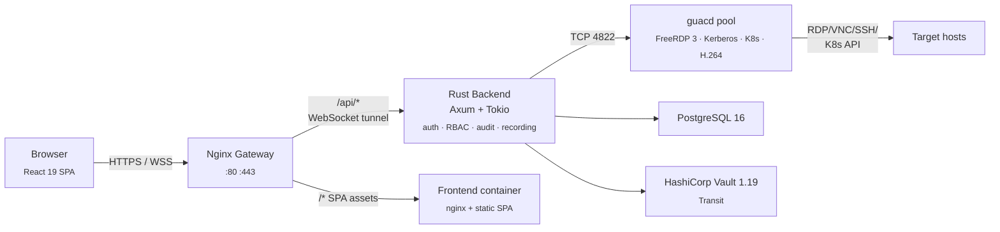

# Architecture (1-page summary)

This file is the **fast read** for evaluators and new contributors. For the
full deep dive — every container, every patch, every data flow, every trust
boundary — see [docs/architecture.md](docs/architecture.md).

## At a glance

Strata Client replaces the legacy Java/Tomcat + AngularJS Apache Guacamole
stack with a Rust proxy and a React 19 SPA. It runs as a small set of Docker
containers behind a single Nginx gateway (hardened with NJS):

## Containers

| Container       | Tech                              | Role                                                                                                |
| --------------- | --------------------------------- | --------------------------------------------------------------------------------------------------- |
| `frontend`      | Nginx + static React SPA          | TLS termination, `/api/*` reverse proxy, SPA delivery.                                              |
| `backend`       | Rust (Axum + Tokio + sqlx)        | REST API, WebSocket tunnel, OIDC, RBAC, audit, recording, web kiosk + VDI orchestration.            |
| `guacd` (pool)  | Custom Alpine image, FreeRDP 3    | Apache Guacamole protocol daemon. Round-robin pool for horizontal scale.                            |
| `postgres-local`| PostgreSQL 16                     | Optional bundled DB; can be swapped for an external Postgres at any time.                           |
| `vault`         | HashiCorp Vault 1.19              | Optional bundled Vault, auto-initialised, auto-unsealed; Transit engine for envelope encryption.    |
| `clamav`        | ClamAV `clamd` (opt-in)           | Opt-in via the `av` Docker compose profile; scans every Quick Share upload over `clamav:3310` INSTREAM. Internal-only network exposure. See [docs/av-scanning.md](docs/av-scanning.md). |

## Trust boundaries (top-down)

1. **Browser ↔ Nginx** — TLS terminated at Nginx; everything beyond is on a private Docker network (`guac-internal`).
2. **Nginx ↔ Backend** — `/api/*` over plaintext on the internal bridge; auth enforced by every handler.
3. **Backend ↔ guacd** — TCP 4822, internal-only; backend builds the parameter map and validates it through `is_allowed_guacd_param()` before forwarding.
4. **Backend ↔ Vault** — Transit-engine API; the backend never sees raw KEKs, only wraps/unwraps DEKs.
5. **Backend ↔ Postgres** — `sqlx` parameterised queries only; no string-built SQL.
6. **guacd ↔ target hosts** — RDP/VNC/SSH/Telnet/K8s-API; outbound from the `guacd` container to whatever the connection points at.

## Key data flows

- **Authentication** — OIDC (Authorization Code + PKCE) or local username/password. Access token (20 min) + refresh cookie (8 h, `HttpOnly`). Tokens signed with a persistent `JWT_SECRET` for stability across restarts. Tokens validated by JWT middleware on every privileged route. See [docs/security.md](docs/security.md).
- **Connection tunnel** — Browser opens a WebSocket to `/api/tunnel/...`; backend authenticates the JWT, materialises a `connections` row + per-user credential profile, builds the guacd handshake (`select` → `connect` arguments), forwards bytes both ways, mirrors the stream into the recording writer, and runs the auth watchdog (revocation polling + `MAX_TUNNEL_DURATION = 8h`). See [docs/architecture.md](docs/architecture.md#connection-tunnel) and [docs/security.md](docs/security.md#websocket-tunnel-auth-watchdog-v132-revised-v141).

- **DMZ link liveness (split‑topology)** — When deployed in DMZ mode the backend dials an outbound HTTP/2-over-mTLS link to the `strata-dmz` relay. To avoid long-lived half-open sockets the link supervisor applies two complementary probes: a kernel-level TCP keepalive (30 s idle → 10 s probe interval) on the `TcpStream` and an application-level HTTP/2 PING watchdog that PINGs the peer every 30 s with a 10 s deadline. On probe failure the connection is gracefully shut down and the supervisor immediate reconnects, restoring public request service within ~60 s. See [CHANGELOG.md](CHANGELOG.md#1108--2026-06-03) for full rationale and operator guidance.

- **Credential-profile resolution & Safeguard JIT** — Credential profiles of kind `safeguard` resolve their password from OneIdentity Safeguard at tunnel-open time (Just-In-Time checkout). Tunnel tickets that carry a `credential_profile_id` (one-off profiles) are now consumed early and canonicalised so they route through the same Safeguard JIT + password-cache path as mapped profiles; the backend also skips local Vault `unseal` attempts on empty local placeholders when a Safeguard password is present. This avoids transient `missing ciphertext` decryption errors and produces consistent credential resolution behaviour whether the profile was pre-mapped or supplied via a ticket at connect time. See [CHANGELOG.md](CHANGELOG.md#1109--2026-06-08) and [docs/security.md](docs/security.md#privileged-account-password-management).
- **Credential checkout (PAM)** — Request → approver decision → LDAP `unicodePwd` reset → Vault-sealed return → user reveal → check-in or expiry → automatic rotation. See [docs/security.md](docs/security.md) § Privileged Account Password Management.
- **In-session approval popup (v1.11.1+)** — A `PendingApprovalWatcher` component is mounted once in the SPA shell and polls the two approval queues the active user is gated for (`/api/user/pending-approvals` for credential checkouts and `/api/admin/outbound-shares/pending` for outbound shares, the latter only when the user has `can_manage_system` or `is_outbound_approver`). Each new pending item surfaces as a top-left popup card with Approve / Deny (with inline reason composer) / View all actions wired to the existing decide endpoints, so approvers can action work without leaving a live session, the dashboard, or wherever they happen to be in the SPA. Cards auto-dismiss after 30 s, cross-tab de-duplicated via `localStorage`, with a 45 s poll cadence plus extra polls on tab focus / visibilitychange. Both `POST /api/user/checkouts/:id/decide` and `POST /api/admin/outbound-shares/{id}/decide` accept an optional `reason` field that is persisted to the row and threaded into the rejection email; the credential side gained this in v1.11.1 via migration 077 to match the outbound side which already persisted a `decision_reason` in v1.11.0.
- **Audit log** — Every privileged action writes one row to the append-only, SHA-256 hash-chained `audit_logs` table. The previous row's hash feeds into the next row's hash so a tampering attempt is detectable on read.
- **Recording** — Tunnel bytes mirrored to a per-session `.guac` recording on disk; optional Azure Blob Storage offload on session end; in-browser playback with seek/speed.

## Where to read next

- **[docs/architecture.md](docs/architecture.md)** — full container, network, and data-flow detail; per-patch breakdown of the custom guacd image; the H.264 GFX passthrough pipeline; the web-kiosk and VDI runtimes.
- **[docs/security.md](docs/security.md)** — threat model, encryption details, RBAC matrix, auth watchdog, audit chain, PAM workflow.
- **[docs/api-reference.md](docs/api-reference.md)** — REST + WebSocket surface, request/response shapes, audit-event enum.
- **[docs/deployment.md](docs/deployment.md)** — production deployment, version-by-version upgrade notes, HA notes.
- **[docs/adr/](docs/adr/)** — Architecture Decision Records: *why* a given design was chosen and what alternatives were rejected.
- **[docs/runbooks/](docs/runbooks/)** — operational runbooks for cert rotation, DB ops, disaster recovery, security incidents, SMTP, Vault.
