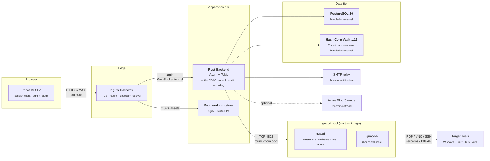

<p align="center">
  <picture>
    <source media="(prefers-color-scheme: dark)" srcset="frontend/public/logo-dark.png">
    <source media="(prefers-color-scheme: light)" srcset="frontend/public/logo-light.png">
    
  </picture>
</p>

<p align="center">
  <strong>A high-performance, modernized client and proxy architecture for <a href="https://guacamole.apache.org/">Apache Guacamole</a>.</strong><br>
  <sub>Rust backend · React SPA · Vault envelope encryption · OIDC SSO · FreeRDP 3 · Kerberos NLA · H.264 streaming</sub>
</p>

<p align="center">
  <a href="https://github.com/Bails309/strata-client/actions/workflows/ci.yml"></a>
  <a href="https://github.com/Bails309/strata-client/actions/workflows/codeql.yml"></a>
  <a href="https://github.com/Bails309/strata-client/actions/workflows/trivy.yml"></a>
  <a href="https://api.securityscorecards.dev/projects/github.com/Bails309/strata-client"></a>
  <a href="https://github.com/Bails309/strata-client/releases/latest"></a>
  <a href="LICENSE"></a>
</p>

<p align="center">
  <a href="https://github.com/Bails309/strata-client/commits/main"></a>
  <a href="https://github.com/Bails309/strata-client/issues"></a>
  <a href="https://github.com/Bails309/strata-client/pulls"></a>
  <a href="https://github.com/Bails309/strata-client/graphs/contributors"></a>
  <a href="SECURITY.md"></a>
</p>

<p align="center">
  
  
  
  
  
  
</p>

<p align="center">
  <a href="CHANGELOG.md">Changelog</a> ·
  <a href="docs/architecture.md">Architecture</a> ·
  <a href="docs/api-reference.md">API Reference</a> ·
  <a href="docs/deployment.md">Deployment</a> ·
  <a href="docs/security.md">Security</a> ·
  <a href="docs/faq.md">FAQ</a> ·
  <a href="https://github.com/Bails309/strata-client/discussions">Discussions</a>
</p>

---

# Strata Client

Strata Client is a modernized control plane and proxy for [Apache Guacamole](https://guacamole.apache.org/). It pairs a custom `guacd` build (FreeRDP 3, Kerberos NLA, end-to-end H.264 GFX passthrough) with a Rust backend (Axum + Tokio) and a React 19 SPA, and adds the operations surface a Guacamole deployment usually has to bolt on: OIDC SSO, granular RBAC, Vault-sealed credential storage, hash-chained audit logging, session recording with NVR-style live observation, privileged-account checkout / rotation, and first-class web-kiosk, VDI, and Kubernetes-pod connection types.

If you have used Guacamole's reference web app and wished it had real auth, real audit, real key management, and a UI built this decade — that is the gap Strata fills.

## ✨ Capabilities

### Protocols & display

- **RDP, VNC, SSH, Telnet, Kubernetes pod console, Web kiosk, VDI desktop containers** — every protocol speaks the same WebSocket tunnel, recording, and audit pipeline.
- **End-to-end H.264 GFX passthrough** — FreeRDP 3 → guacd → WebSocket → browser WebCodecs decoder, with no server-side transcode. Order-of-magnitude bandwidth wins on AVC444-enabled Windows hosts.
- **Kerberos / NLA** — dynamic per-realm `krb5.conf` pushed to `guacd` at runtime; multi-realm with per-realm KDCs and lifetimes.
- **Browser-based multi-monitor RDP** — Window Management API spans a session across physical monitors with per-window cursor/keyboard sync.
- **Tiled multi-session view** — open multiple connections side-by-side with per-tile focus and keyboard broadcast.
- **Sidecar guacd scaling** — round-robin pool across multiple `guacd` instances for horizontal scaling.

### Authentication & authorization

- **OIDC / SSO** — full OpenID Connect with dynamic JWKS validation (Keycloak, Entra ID, Okta, etc.).
- **Local username/password** — built-in auth for environments without an OIDC provider, with 12-character minimum password policy.
- **Access + refresh tokens** — short-lived 20-minute access tokens, 8-hour `HttpOnly` refresh cookies, proactive activity-based silent refresh that captures both DOM input and Guacamole-hijacked in-session input via the `sessionActivity` bus, pre-expiry warning toast — aligned with OWASP session-timeout guidance. Cookies use a 60-second buffer relative to token expiry to ensure SPA metadata access.
- **Global Cache-Control** — all API responses enforce `no-store, no-cache, must-revalidate` to prevent sensitive data caching in browsers and proxies.
- **Granular RBAC** — ten-permission role model (manage system / users / connections, audit, view sessions, create users / roles / connections / sharing profiles, Quick Share); enforced at every admin endpoint.
- **Active Directory LDAP sync** — scheduled computer-account import (LDAPS, multiple search bases, gMSA exclusion, simple-bind or Kerberos-keytab auth, custom CA cert).
- **Per-user session tracking** — JTI, IP, UA, expiry recorded for every active login.

### Credential & key management

- **Bundled HashiCorp Vault** — auto-initialized, auto-unsealed Vault 1.19 with the Transit engine; zero-config on first boot, swappable for an external Vault at any time through the UI.
- **Envelope encryption** — user credentials sealed with AES-256-GCM; Data Encryption Keys wrapped via Vault Transit.
- **Credential profiles** — per-user saved profiles with optional TTL (1–12 h by default, or 1–90 d per profile when **extended expiry** is opted in for service / break-glass accounts; v1.7.0+) and in-line renewal at connect time when expired.
- **Privileged Account Password Management** — full checkout / approval / rotation workflow for AD service accounts. Vault-sealed storage, LDAP `unicodePwd` reset, scoped approver mappings, configurable generation policy, voluntary early check-in, automatic rotation on expiry or check-in, dedicated Approvals UI.
- **Reusable Trusted CA bundles for Web Sessions** — admins upload PEM bundles once; kiosks attach them via per-session NSS DB so Chromium trusts internal roots without `--ignore-certificate-errors`.

### Recording, audit & observability

- **Session recording** — Guacamole-native capture per connection, configurable retention.
- **Live session NVR** — TiVo-style admin observation with a 5-minute rewind buffer; jump into any active session and scrub backwards.
- **Live session sharing** — temporary view-only or control share links, NVR-broadcast-channel based, 24-hour expiry, instant revoke.
- **Immutable audit log** — append-only, SHA-256 hash-chained `audit_logs` table covering every privileged action, tunnel lifecycle event, share-token use, checkout decision, and command-palette invocation.
- **Connection health checks** — background TCP probe of every connection (2-min cadence, 5-s timeout) with green/red/gray dashboard dots.
- **Azure Blob Storage sync** — completed recordings pushed to Blob Storage for durable, memory-efficient streaming playback.
- **Modern transactional emails** — MJML-rendered, Outlook-dark-mode-hardened checkout notifications with admin-configurable SMTP relay, retry worker, opt-outs, and last-50-deliveries audit view.

### Operator UX

- **Setup wizard + admin dashboard** — first-boot configuration of database, Vault mode, OIDC, SMTP, tags, folders, and connections — all from the SPA.
- **Scriptable Command Palette** — in-session palette (default `Ctrl+K`, rebindable per user) with built-in commands (`:reload`, `:disconnect`, `:fullscreen`, `:explorer`, `:commands`, `:close`) and up to 50 personal `:command` mappings (`open-connection`, `open-folder`, `open-tag`, `open-page`, `paste-text`, `open-path`).
- **Quick Share file CDN** — drag-and-drop upload from the Session Bar, random per-session URLs (auto-deleted on disconnect), protocol-aware copy snippets (`curl`, `wget`, `Invoke-WebRequest`, plain URL).
- **Antivirus scanning on every file upload (optional)** — both inbound Quick Share and outbound approval-gated Quick Share stream each upload through a pluggable scanner before the file lands on disk / before it is sealed via Vault Transit. Three backends ship: `off` (default, no-op), `clamav` (full `clamd` INSTREAM TCP wire protocol with the bundled sidecar behind the `av` compose profile), and `command` (exec-driven for Defender / Sophos / ESET / any scanner with the `0=clean, 1=infected` exit-code contract). Fail-closed by default; infected verdicts are always rejected and a structured `file.av_blocked` audit event records the signature, file metadata, and which engine produced the verdict. New `outbound_shares.av_*` columns persist the verdict on every row. See [docs/av-scanning.md](docs/av-scanning.md).
- **Outbound Quick-Share (approval-gated)** — files leaving a remote session are intercepted, sealed at rest with Vault envelope encryption, scanned by a built-in DLP heuristic, and either auto-approved (low score + per-user opt-in) or queued for an approver. Two ingest paths: transparent guacd `client.onfile` drive-channel interception, and a tokenised HTTPS upload-command (`curl` / `curl.exe` / PowerShell 7 `-Form` one-liner) for sites where GPO blocks RDP / SFTP drive redirection. Approved shares become a time-limited single-use download; denied / expired shares are purged and their sealed DEK zeroised by a periodic worker. New role permission `can_use_quick_share_outbound`, per-user approval-required toggle, and an approver-delegation list keep the perm separable from super-admin.
- **Unified Session Bar** — Sharing, File Browser, Fullscreen, Pop-out, OSK in one zero-footprint right-side dock.
- **Windows Key Proxy** — Right Ctrl acts as the host key, VMware/VirtualBox style, in every session mode.
- **Large clipboard support** — protocol-level chunking handles 64 MB+ buffers between local and remote.
- **In-app documentation** — `/docs` page renders Architecture, Security, API Reference, and the release-history carousel inline.
- **Live toast notifications** — themed, reusable toast surface (`ToastProvider` / `useToast()`) with info / success / warning / error variants, replace-by-key semantics, sticky errors and ARIA live regions. Drives the new credential-profile expiry watcher (1 d / 1 h / 10 m for standard profiles; 7 d / 1 d / 1 h for extended-expiry profiles, plus a sticky **Renew now** toast at expiry) so operators are warned before a stale credential silently breaks a session.

### Operations & deployment

- **Zero-config first boot** — bundled PostgreSQL 16 and Vault 1.19 containers; promote to external services any time through the UI.
- **DMZ deployment mode** — split-topology option where a separate, minimal `strata-dmz` edge binary terminates public TLS while the internal node stays inside the corporate network and dials **out** over an HTTP/2-over-mTLS reverse tunnel. Zero-secret-overlap (no JWT key, no Vault, no DB credentials on the DMZ); every existing feature works through the DMZ on day one. See [docs/deployment.md](docs/deployment.md#dmz-deployment-mode).
- **DNS configuration in admin UI** — admin-managed DNS servers and search domains pushed to `guacd` containers without editing `docker-compose.yml`.
- **Recording disclaimer / Terms of Service** — mandatory first-login acceptance modal, timestamped in the database, declining logs the user out.
- **Production-grade nginx gateway** — embedded-DNS resolver with per-request upstream resolution; nginx survives a backend outage and recovers automatically.
- **CI/CD** — GitHub Actions workflow for automated weekly upstream `guacd` rebuilds, Trivy image scans (v1.8.2 fix), and CodeQL.
- **Apache 2.0 licensed** — see [LICENSE](LICENSE) and [NOTICE](NOTICE).

For the full per-version history of how these capabilities were built and the bug fixes shipped along the way, see [CHANGELOG.md](CHANGELOG.md) and the in-app **What's New** carousel ([WHATSNEW.md](WHATSNEW.md)).

## 🆕 What's new

| Version | Date       | Description                                                                                                                                                                                                                                                                                                                                                                                                                                                                                                                                                                                                                                                                                                                                                                                                                                                                                                                                                                                                                                                                                                                                                                                                                                                                                                                                                                                                                                                                                                                                                                                                                                                                                                                                                                                                                                                                                                                                                                                                                                                                                                                                                                                                                                                                                                                                                                                                                                                                                                                                                                                                                                                                                                                                                                                                                                                                                                                                                                                                                                                                                                                                                                                                                                                                                                      |
| :------ | :--------- | :--------------------------------------------------------------------------------------------------------------------------------------------------------------------------------------------------------------------------------------------------------------------------------------------------------------------------------------------------------------------------------------------------------------------------------------------------------------------------------------------------------------------------------------------------------------------------------------------------------------------------------------------------------------------------------------------------------------------------------------------------------------------------------------------------------------------------------------------------------------------------------------------------------------------------------------------------------------------------------------------------------------------------------------------------------------------------------------------------------------------------------------------------------------------------------------------------------------------------------------------------------------------------------------------------------------------------------------------------------------------------------------------------------------------------------------------------------------------------------------------------------------------------------------------------------------------------------------------------------------------------------------------------------------------------------------------------------------------------------------------------------------------------------------------------------------------------------------------------------------------------------------------------------------------------------------------------------------------------------------------------------------------------------------------------------------------------------------------------------------------------------------------------------------------------------------------------------------------------------------------------------------------------------------------------------------------------------------------------------------------------------------------------------------------------------------------------------------------------------------------------------------------------------------------------------------------------------------------------------------------------------------------------------------------------------------------------------------------------------------------------------------------------------------------------------------------------------------------------------------------------------------------------------------------------------------------------------------------------------------------------------------------------------------------------------------------------------------------------------------------------------------------------------------------------------------------------------------------------------------------------------------------------------------------------------------- |
| 1.12.8  | 2026-06-29 | **Patch release - UI hotfix: delegated users now see the connection name on session tiles.** v1.12.7's tightening of `GET /api/admin/connections` (now requires `can_manage_connections`) surfaced an unrelated and previously-silent bug in `frontend/src/pages/SessionClient.tsx` - the page was using the admin endpoint to translate the URL-supplied `connectionId` into a human-readable name for the session tile in the sidebar. Pre-v1.12.7 the admin endpoint happened to be reachable by anyone with any admin flag, so the bug went unnoticed; post-v1.12.7 a delegated user without `can_manage_connections` started getting `403 Forbidden` on the lookup, the `.catch(() => undefined)` swallowed the error, and the tile rendered the protocol (`RDP`) instead of the actual connection name (e.g. `cicsazt1mgt-t`). The bug was entirely cosmetic - sessions still connected, audit logs still recorded the correct connection ID, file transfer still worked - only the visual label on the tile was wrong, and only for users in custom delegated roles. The visual regression mattered most for operators who keep several sessions open at once and rely on the tile label to tell tiles apart at a glance: a sidebar of three tiles all labelled `RDP` defeats the purpose of the multi-session bar. **Fix:** [`frontend/src/pages/SessionClient.tsx`](frontend/src/pages/SessionClient.tsx) swaps the import and call from `getConnections()` (`GET /api/admin/connections`) to `getMyConnections()` (`GET /api/user/connections`). The user-scoped endpoint returns the same `Connection[]` shape, is filtered server-side to exactly the connections the user is allowed to launch, and requires no admin permission flag. Admins continue to see the right tile label because their `/api/user/connections` response already includes every connection in the system. The other call site of `getConnections()` - `frontend/src/pages/AdminSettings.tsx` - is correct to use the admin endpoint (the page is admin-only) and is unchanged. The three downstream `createSession({...})` calls continue to use `name: connectionName \|\| protocol.toUpperCase()` as the defensive fallback for the genuinely-degenerate case where neither endpoint returned a name (e.g. a connection was deleted between the URL being shared and the page mounting); that fallback now only fires in genuine error paths instead of for an entire user class. **No backend changes, no migrations, no new env vars, no new Cargo or npm dependencies** - two lines in one frontend file plus an explanatory comment. ([details](CHANGELOG.md#1128--2026-06-29))                                                                                                                                                                                                                                                                                                                                                                                                                                                                                                                                                                                                                                      |
| 1.12.7  | 2026-06-26 | **Patch release - Security: per-handler RBAC on `/api/admin/*`.** A penetration test against v1.12.6 found that the router-level `require_admin` middleware guarding `/api/admin/*` is intentionally a coarse gate - it accepts any user holding _any_ of the nine admin permission flags. The granular access decision is supposed to live in each handler via a `check_*_permission(&user)` call from `services::middleware`. **Seventeen handlers were missing that per-handler check**, so a delegated user holding only `can_view_audit_logs=true` (a SOC-analyst-style role scoped to the audit log) could call `GET /api/admin/settings` and read every system setting (SMTP, AD bind DN, Vault address, DNS zones, auth-method toggles), `GET /api/admin/recordings` + `GET /api/admin/recordings/{id}/stream` to list and play back any user's recorded session, `GET /api/admin/health` to fingerprint internal DB/guacd/Vault reachability, `GET /api/admin/connections` + `GET /api/admin/connection-folders` + `GET /api/admin/tags` + `GET /api/admin/connection-tags` to enumerate every connection target the deployment manages, `GET /api/admin/roles` + `GET /api/admin/roles/{id}/mappings` to dump the full RBAC matrix, `GET /api/admin/certs` to read the TLS/mTLS certificate inventory with fingerprints and expiry windows, `POST /api/admin/dmz-links/reconnect` to bounce production DMZ links, `PUT /api/admin/safeguard/config` to rotate the Safeguard JIT integration API key, `POST /api/admin/safeguard/test` to probe arbitrary Safeguard appliances with a body-supplied secret, `GET /api/admin/metrics` to read host CPU/memory/capacity estimates, `PUT /api/admin/connection-folders/{id}` to rename folders, and `DELETE /api/admin/tags/{id}` to delete tags. CSRF and JWT authentication were intact in every case - this was strictly an authorization gap, not an authentication or CSRF bypass. **Fix:** v1.12.7 adds the appropriate `crate::services::middleware::check_*_permission(&user)?;` call as the first statement of every affected handler, matching the pattern already used by the ~53 other admin handlers in the same files. Endpoints requiring `can_manage_system`: `settings` (GET), `settings/sso/test`, `roles` (GET), `roles/{id}/mappings`, `metrics`, `safeguard/config` (PUT), `safeguard/test`, `health`, `certs`, `dmz-links/reconnect`. Endpoints requiring `can_manage_connections`: `connections` (GET list), `connection-folders` (GET + PUT), `tags` (GET + DELETE), `connection-tags` (GET). Endpoints requiring `can_view_sessions`: `recordings` (GET + stream). The `require_admin` middleware itself is unchanged because it correctly models the coarse `is this an admin surface?` question; tightening it would break legitimate delegated roles that should still see the subset of pages their single flag covers. Users with the super-admin `can_manage_system` flag (the default `admin` role) see no behaviour change. Custom delegated roles that previously reached an endpoint via the coarse gate now see `403 Forbidden` and must be granted the additional flag via **Settings -> Roles**. **No DB migrations, no new env vars, no new Cargo or npm dependencies.** ([details](CHANGELOG.md#1127--2026-06-26)) |
| 1.12.6  | 2026-06-26 | **Patch release — Security: OIDC RP-Initiated Logout.** A penetration test against v1.12.5 found that clicking **Log out** in the Strata SPA cleared Strata's own session cookies and revoked its local JWT, but **never contacted the IdP**. The browser kept the upstream Keycloak SSO cookie, so the very next click of **Sign in** silently re-authenticated against the surviving Keycloak session without prompting for a password or MFA challenge — the workstation-walk-away threat model collapsed to two clicks for the next person at the keyboard. **Fix:** v1.12.6 wires up the standard [OpenID Connect RP-Initiated Logout 1.0](https://openid.net/specs/openid-connect-rpinitiated-1_0.html) flow. `GET /api/auth/sso/callback` now persists the raw `id_token` in a `HttpOnly; Secure; SameSite=Strict; Path=/api` cookie (TTL matches the refresh token so the hint survives access-token rotation). `POST /api/auth/logout` reads the cookie, decodes the unverified `iss` claim to look up the matching `sso_providers` row, fetches the IdP's OIDC discovery document (cached in `services::auth`), and — if the IdP advertises `end_session_endpoint` — returns the fully-formed RP-initiated logout URL in a new `post_logout_url` field on the JSON response: `{end_session_endpoint}?id_token_hint=<jwt>&post_logout_redirect_uri=<base_url>/login&client_id=<client_id>`. The SPA navigates the browser to that URL after tearing down local state; Keycloak terminates its own session and bounces the browser back to `/login` via the registered `post_logout_redirect_uri`. Local-account logouts and IdPs that omit `end_session_endpoint` fall back transparently to the pre-fix behaviour. The new `id_token` cookie is tombstoned (`Max-Age=0`) on every logout — including local-account logouts — so a stale value never leaks across sessions on a shared workstation. **One IdP-side configuration step is required:** in Keycloak open the Strata client → **Settings** → add `https://<your-strata-fqdn>/login` to **Valid Post Logout Redirect URIs** (Keycloak ≥ 25.0 validates this field separately from **Valid Redirect URIs**); Auth0 / Okta / Entra ID have equivalent fields under different names. Twelve new test cases pin the fix (three in `backend/src/services/auth.rs` for the extended `OidcDiscovery` struct, seven in `backend/src/routes/auth.rs` covering the cookie tombstone, the JSON response shape, defensive `iss` parsing, and the helper's short-circuit branches, plus two in `frontend/src/__tests__/api.test.ts` for the new `LogoutResponse` shape and back-compat with v1.12.5 backends). **No migrations, no new env vars, no new Cargo or npm dependencies** — entirely scoped to one backend route file, one backend service file, two frontend files, and their tests. ([details](CHANGELOG.md#1126--2026-06-26))                                                                                                                                                                                                                                                                                                                                                                                                                |
| 1.12.5  | 2026-06-25 | **Patch release — Security: `GET /api/admin/settings` masks Vault-sealed values.** A penetration test against v1.12.4 found that the sealed Azure Storage access key used for session-recording upload was being returned in full from the admin settings API as its Vault Transit envelope (`vault:{"ct":...,"dek":"vault:v1:..."}`). The encrypted ciphertext is not directly exploitable — decrypting it requires the Vault server's Transit master key — but the value should never have been on the wire at all. **Root cause:** the `SENSITIVE_SETTINGS` substring-match list in [`backend/src/routes/admin.rs`](backend/src/routes/admin.rs) used the literal `azure_storage_access_key`, which does **not** appear in the actual key `recordings_azure_access_key` (the words are in a different order), so the filter silently let the envelope through; the `smtp_encrypted_password` key (added in the v0.25.0 notifications work) was never added to the list at all. **Fix:** the list now contains `recordings_azure_access_key`, `smtp_encrypted_password`, and the unprefixed substring `azure_access_key`, **plus** a new defence-in-depth rule: any setting value beginning with the literal prefix `vault:` is masked regardless of its key name, so future sealed settings added in any release are protected the moment they are written. `PUT /api/admin/recordings` now recognises the redaction mask sentinels (`********` / `••••••••`) on the `azure_access_key` field and treats them as "no change", matching the round-trip pattern already in place for SSO and AD bind passwords — without this, the Recordings tab's pre-filled mask input would have re-sealed the literal `********` and destroyed the live access key on the next Save. Three new unit tests pin the regression (`redact_settings_masks_recordings_azure_access_key`, `redact_settings_masks_smtp_encrypted_password`, `redact_settings_masks_any_vault_envelope_value`); all six pre-existing redaction tests continue to pass unchanged. **No migrations, no new env vars, no new Cargo or npm dependencies** — entirely scoped to one backend route file plus its tests. ([details](CHANGELOG.md#1125--2026-06-25))                                                                                                                                                                                                                                                                                                                                                                                                                                                                                                                                                                                                                                                                                                                                                                                                                                                                                                                                                                                                                                                                                        |
| 1.12.4  | 2026-06-22 | **Patch release — `Ctrl+K` Command Palette open-session prioritisation.** A single-issue UX patch for operators who keep multiple sessions open and use the palette as their day-to-day session switcher. The connection list previously rendered in raw API order with no preferential placement for sessions that were already open, so the fastest possible "jump to the other open session" interaction (`Ctrl+K → Enter`) was impossible without scrolling, arrow-keying, or typing a disambiguating substring. **Fix:** the `filtered` array in [`frontend/src/components/CommandPalette.tsx`](frontend/src/components/CommandPalette.tsx) is now sorted into three stable rank buckets after the existing query filter runs — `0` open session you are **not** currently looking at, `1` open session you **are** currently looking at, `2` connection that is not open — using a newly-introduced `activeConnectionId` helper that resolves the connection id of the user's currently-focused session by intersecting `sessions` with `activeSessionId` from `useSessionManager()`. ECMAScript 2019+ `Array.prototype.sort` is stable, so the relative order within each bucket is preserved: open sessions don't reshuffle when others open or close, and inactive connections continue to appear in exactly the same order they always did beneath the open sessions. With two open sessions (`prod-db` and `dev-rdp`) and the user focused on `prod-db`, pressing `Ctrl+K → Enter` now jumps straight to `dev-rdp`; a single `↓ Enter` returns to `prod-db`. The colon-prefixed `:command` surface, the existing green **Active** pill, the query filter (matches against `name`/`protocol`/`hostname`/`description`/`folder_name`/tag names), connection folders and tag pills, and the pop-out vanilla-DOM palette (`utils/popoutPalette.ts`) are all unchanged. **No backend changes, no API surface changes, no migrations, no new environment variables, no new Cargo or npm dependencies** — the change is entirely scoped to one component plus one matching test (`__tests__/CommandPalette.test.tsx` adds a `"sorts open sessions to the top, with the currently-displayed one second"` case asserting DOM order `[c3, c1, c2]` and that `Enter` navigates to the rank-0 row; all 15 pre-existing palette tests continue to pass without modification). ([details](CHANGELOG.md#1124--2026-06-22))                                                                                                                                                                                                                                                                                                                                                                                                                                                                                                                                                                                                                                                                                                                                                                                                                                                                                           |
| 1.12.3  | 2026-06-22 | **Patch release — Safeguard JIT post-approval username regression fix.** Single-issue hotfix for users whose Safeguard account requires approver action before `CheckoutPassword` will release the plaintext (common policy on tier-0 / privileged accounts). The SPA flipped the bulk-checkout row to `Released` the moment the approver acted, but every subsequent tunnel attempt against the protected target failed with `Authentication failure (invalid credentials?)` because the cached row carried `username = NULL` and the tunnel was sending an empty NLA username with the correct password. Auto-released (no-approval) accounts were unaffected. **Root cause:** `services::safeguard::release_pending` hard-coded `username: None` on its `Released` arm — Safeguard's `CheckoutPassword` endpoint does not echo `AccountName` back; only the `CreateAccessRequest` response does, and the post-approval path never hits creation again. The `release_safeguard_pending` route handler faithfully forwarded that `None` into `password_cache::store(...)`, persisting the row with `username = NULL`. **Fix:** `client::get_access_request_status(...)` (renamed and extended from `get_access_request_state(...)`) now returns `AccessRequestStatus { state, account_name }`, and the `Released` arm of `release_pending` calls it to refetch `AccountName` from `GET /service/core/v4/AccessRequests/{id}`, plumbing the resolved name into `CheckoutResult.username`. Refetch failure is non-fatal (logged at `warn`) so a transient appliance hiccup does not block the user from connecting — the password is still returned and cached; only the pre-fix behaviour persists for that one cycle. The single existing caller of the old `get_access_request_state` (`check_request_validity`) was updated to read `.state` and treat 404 (`Ok(None)`) as `Inactive` explicitly, preserving prior implicit behaviour. **No migrations, no new env vars, no new Cargo/npm deps.** Cache rows persisted by v1.12.2 against approval-required accounts continue to carry `username = NULL` until they expire (default TTL: the profile's own `ttl_hours`); operators who want to evict them immediately can click **Check in all** in the bulk-checkout card or call `POST /api/user/safeguard/checkin` with `{"profile_ids": []}`. ([details](CHANGELOG.md#1123--2026-06-22))                                                                                                                                                                                                                                                                                                                                                                                                                                                                                                                                                                                                                                                                                                                                                                                                                                                                                                                  |
| 1.12.2  | 2026-06-12 | **Patch release — Outbound Quick Share polish, approver email fan-out, BASE_URL fallback for email links, ClamAV healthcheck IPv6 dodge, recordings-volume write fix, Kali VDI image.** Thirteen merged PRs (#268–#280) roll into one bundle covering six themes: (1) **Outbound Quick Share UX polish** — paste-and-run snippets via a new **File path** input on the snippet builder (with format-aware quoting: POSIX single-quoted, `curl.exe` via full `CommandLineToArgvW` rule closing a CodeQL `js/incomplete-sanitization` alert, PowerShell `''`-doubled), visibility-gated 60s auto-refresh on the admin Outbound Shares tab (suspends on `visibilitychange→hidden`, resumes with an immediate refresh on `→visible`), curl snippets always print a completion summary so a stale token is distinguishable from a transport error, justification textarea stays visible when drive redirection is disabled by GPO (the HTTPS upload-command flow needs it too), and the `ConfirmModal` now renders via a React portal so the backdrop covers the full viewport instead of being clipped by an ancestor `overflow:hidden`; (2) **outbound-share approver email fan-out** — new `OutboundShareEvent::Pending` transactional email + `outbound_share_pending.{mjml,txt.tera}` template, with two follow-up fixes (`roles.can_manage_system` not `users.can_manage_system` in the approver-discovery SQL, and `OutboundShareEvent::Pending.requester_id` for the self-exclusion); (3) **`BASE_URL` fallback for email links** — new `services::settings::tenant_base_url(pool)` helper resolves `system_settings.tenant_base_url` → `BASE_URL` env → `https://strata.local` so links work on every install instead of just admin-configured ones; (4) **ClamAV sidecar healthcheck** pinned to `127.0.0.1` to dodge IPv6 localhost resolution on dual-stack hosts (was reporting `unhealthy` despite serving scans); (5) **recordings-volume write permission** — backend `Dockerfile` + `entrypoint.sh` fix so the session-recording sweeper can prune expired `.guac` files on bind-mounted setups; (6) **Kali Linux VDI image** — new `contrib/vdi-kali/` profile with the `kali-linux-large` metapackage (Nmap, Metasploit, Burp, Wireshark, Aircrack-NG, Hashcat, John, sqlmap, Hydra) for security teams who want a tunnel-routed jump-box for authorised offensive engagements. **No migrations, no new env vars, no new Cargo/npm deps.** ([details](CHANGELOG.md#1122--2026-06-12))                                                                                                                                                                                                                                                                                                                                                                                                                                                                                                                                                                                                                                                                                                                                                                                                              |
| 1.12.1  | 2026-06-09 | **Patch release — operational polish on the v1.12.0 antivirus landing.** Fourteen merged PRs roll into one bundle covering five themes: (1) new **Admin → Health → AV card** showing the active backend, clamd version, signature DB versions for `main`/`daily`/`bytecode` with counts and update dates, last `freshclam` timestamp, and last-30d verdict tally; (2) **friendly user-facing error messages** on AV blocks via a new `Verdict::user_facing_block_message()` classifier (timeout / transport / missing-signatures / generic), returning a deterministic actionable message instead of raw engine spew; (3) **live upload progress everywhere** — browser percentage bar on the upload toast (new typed `xhrUploadJson<T>()` helper threading `XMLHttpRequest.upload.onprogress` through `api.ts`), indeterminate "Awaiting AV scan" bar on every pending row in MY SUBMISSIONS, and terminal-side `curl --progress-bar -H 'Expect:'` + PowerShell `HttpClient` + `Write-Progress` poll loop on the snippet variants (the `Expect:` disable is critical — without it the server rejects a stale token _before_ reading the body and the meter has nothing to render); (4) new **Admin → AV-Blocked Files tab** unifying inbound (`file.av_blocked`) and outbound (`outbound_share.requested` with `av_status IN ('infected','error')`) blocks behind one cursor-paginated audit query, filterable by date / engine / direction / signature; (5) **scanner-side correctness fixes** — `freshclam` cadence bumped to hourly with a forced `clamd RELOAD` after every update (fresh signatures previously sat unused until the next sidecar restart), `STRATA_AV_MAX_SCAN_SIZE` default raised from 100 MiB to **500 MiB** to match the Quick Share upload cap (previously 100–500 MiB uploads landed unscanned), `STRATA_AV_*` env-var wiring corrected (one variable was silently ignored on v1.12.0), Quick Share role-permission check made uniform across the three outbound routes (super-admin without `can_use_quick_share_outbound` correctly rejected with 403 on every path), CVD/CLD version-parser tests now use real on-wire fixtures. **No migrations, no new env vars, no new Cargo/npm deps.** ([details](CHANGELOG.md#1121--2026-06-09))                                                                                                                                                                                                                                                                                                                                                                                                                                                                                                                                                                                                                                                                                                                                                                                                                                                                                                                                                                                                                                            |
| 1.12.0  | 2026-06-09 | **Minor release — pluggable antivirus scanning on every Quick Share upload path.** Both inbound (`POST /api/user/files/upload`) and outbound (`POST /api/user/outbound-shares/submit` plus the token-auth `POST /api/outbound-shares/ingest/{token}` shell-side path) now stream every upload through a configurable scanner _before_ the file lands in the session file store / before it is sealed via Vault Transit. Three backends ship: `off` (default, no-op), `clamav` (full `clamd` INSTREAM TCP wire protocol), and `command` (exec-driven for Defender / Sophos / ESET / any scanner with the `0=clean, 1=infected` exit-code contract). Fail-closed by default (`STRATA_AV_FAIL_MODE=block`); infected verdicts are always rejected regardless of fail-mode. The ClamAV sidecar is opt-in via the new `av` compose profile (`docker compose --profile av up -d`) and lives internal-only on `guac-internal`. Migration 078 adds four nullable `av_*` columns to `outbound_shares` plus a partial index over `(av_scan_status) WHERE status IN ('infected','error')` so the operator dashboard query stays cheap. New audit events `file.av_blocked` (inbound) plus `av_status` / `av_signature` / `av_backend` fields added to every `outbound_share.requested` row. No new Cargo deps; INSTREAM protocol implemented directly against `tokio::net::TcpStream`. ([details](CHANGELOG.md#1120--2026-06-09))                                                                                                                                                                                                                                                                                                                                                                                                                                                                                                                                                                                                                                                                                                                                                                                                                                                                                                                                                                                                                                                                                                                                                                                                                                                                                                                                                                                                                                                                                                                                                                                                                                                                                                                                                                                                                                                                                            |
| 1.11.1  | 2026-06-09 | **Patch release — approver workflow polish: in-session popup, persisted deny reason, mandatory outbound-share justification.** A new `PendingApprovalWatcher` is mounted once in the SPA shell and polls both approval queues the active user is gated for (credential checkouts and outbound shares), surfacing each new pending item as a top-left popup card with Approve / Deny / View all wired to the existing decide endpoints. Cards auto-dismiss after 30 s, cross-tab de-duplicated via `localStorage`. Migration 077 adds nullable `decision_reason TEXT` to `password_checkout_requests` so credential-checkout denials carry a free-form "Reason from approver" through to the rejection email and the row itself (matches the outbound-share queue, which already persisted a `decision_reason` in v1.11.0). Outbound shares from accounts without the `outbound_share_requires_approval = FALSE` bypass now require a **≥ 10-character justification** (whitespace-trimmed, character count not byte count) before the file reaches the DLP / approval pipeline — enforced at both HTTP entry points by a shared `validate_outbound_justification` helper, with matching SPA UX (red asterisk, `aria-required`, helper text, disabled Generate button + tooltip on the panel; warning toast with remediation copy on the drive-channel `onfile` interceptor). `MeResponse.outbound_share_requires_approval` is now returned on both `/me` and `/auth/check` (drift rule). Backwards-compatible request shapes — clients of `POST /api/user/checkouts/:id/decide` that omit `reason` continue to work. ([details](CHANGELOG.md#1111--2026-06-09))                                                                                                                                                                                                                                                                                                                                                                                                                                                                                                                                                                                                                                                                                                                                                                                                                                                                                                                                                                                                                                                                                                                                                                                                                                                                                                                                                                                                                                                                                                                                                                                                                                                  |
| 1.11.0  | 2026-06-08 | **Outbound Quick-Share — approval-gated file export with two ingest paths.** Files leaving a remote session are intercepted, sealed at rest with Vault-Transit envelope encryption (per-share DEK; ciphertext on disk + sealed DEK in DB), run through a built-in DLP heuristic, and either auto-approved (low score + per-user opt-in) or queued for an approver. Two paths feed the same pipeline: (1) transparent guacd `client.onfile` drive-channel interception in `SessionManager`, and (2) a new tokenised HTTPS upload-command path for sites where GPO blocks RDP / SFTP drive redirection — the panel mints a single-use 10-minute token (`POST /api/user/outbound-shares/ingest-token`), renders it into a `curl` / `curl.exe` / PowerShell 7 `-Form` one-liner the user pastes inside the remote session shell, and the file uploads back to `POST /api/outbound-shares/ingest/{token}` (unauthenticated; token IS the auth, atomically consumed, with the minter's `can_use_quick_share_outbound` permission re-checked at consume time). New role permission, per-user approval-required toggle, and an `outbound_share_approvers` delegation list keep the perm separable from super-admin. New Admin → Outbound Shares tab combines pending queue, history, and approver delegation. Migrations 073 + 074. ([details](CHANGELOG.md#1110--2026-06-08))                                                                                                                                                                                                                                                                                                                                                                                                                                                                                                                                                                                                                                                                                                                                                                                                                                                                                                                                                                                                                                                                                                                                                                                                                                                                                                                                                                                                                                                                                                                                                                                                                                                                                                                                                                                                                                                                                                                                           |
| 1.10.9  | 2026-06-08 | **Patch release — Safeguard one‑off profile ticket routing and local-unseal guard.** Fixes 502/500 failures observed when a tunnel ticket selected an ad‑hoc Safeguard credential profile. Tunnel tickets are now consumed early so the one‑off `credential_profile_id` is canonicalised through the same Safeguard JIT + password cache flow as mapped profiles; `vault::unseal` is no longer called on empty local encrypted payloads for `kind = 'safeguard'`. Credentials → Request Checkout also surfaces a clearer "submitted for approval" message and navigates to **My Checkouts** so requesters can track Pending / Scheduled / Approved status. No DB migrations or operator config changes. ([details](CHANGELOG.md#1109--2026-06-08))                                                                                                                                                                                                                                                                                                                                                                                                                                                                                                                                                                                                                                                                                                                                                                                                                                                                                                                                                                                                                                                                                                                                                                                                                                                                                                                                                                                                                                                                                                                                                                                                                                                                                                                                                                                                                                                                                                                                                                                                                                                                                                                                                                                                                                                                                                                                                                                                                                                                                                                                                               |
| 1.10.2  | 2026-05-26 | **Safeguard sign-in auto-post, account picker, and in-place credential-profile kind switching** — per-user browser sign-in now supports auto-post of Safeguard RSTS bearer tokens back to Strata without manual JWT copy/paste. New authed `POST /api/user/safeguard/signin/start` mints a 5-minute, single-use, user-bound enrolment code (8-char Crockford base-32; rate-limited 5/min/user). New unauthed `POST /api/safeguard/enrol` consumes that code atomically and stores the token against the bound `user_id`, preserving Vault envelope encryption and per-user isolation semantics. The credential profile editor gains a **Safeguard account picker** powered by a new authed `GET /api/user/safeguard/accounts` route (server-side proxy for the appliance's `Me/RequestEntitlements?wellKnownType=PasswordAccessRequest` endpoint); the picker filters out entitlements that already back an existing profile owned by the same user so only claimable accounts are shown. `PUT /api/user/credential-profiles/:id` now accepts an optional `kind` field, enabling **in-place conversion** between `local` and `safeguard` profiles without delete-and-recreate (preserving UUID + connection mappings). Credentials UI now renders a code-embedded PowerShell snippet (`Connect-Safeguard` + `Invoke-RestMethod`), a live countdown timer, auto-close polling on successful sign-in, and a manual-paste fallback for break-glass environments. Migration 070 adds `safeguard_enrolment_codes`; daily cleanup now purges long-expired rows. ([details](CHANGELOG.md#1102--2026-05-26))                                                                                                                                                                                                                                                                                                                                                                                                                                                                                                                                                                                                                                                                                                                                                                                                                                                                                                                                                                                                                                                                                                                                                                                                                                                                                                                                                                                                                                                                                                                                                                                                                                                                                                             |
| 1.10.0  | 2026-05-22 | **OneIdentity Safeguard JIT credential checkout** — first-class integration with Safeguard for Privileged Passwords 8.2.2. A new `safeguard` credential-profile kind resolves its password against the appliance at tunnel-open time via a four-step REST dance (preflight stale `Me/ActionableRequests` → POST `AccessRequests` → `CheckoutPassword`), with full hardening against every 8.2.x quirk encountered (singular wrapper bucket names, JSON-encoded string body on Cancel/CheckIn, Code 90001 overlap, Code 90010 rotation-race retry). A new **Request Checkout** tab on the Credentials page pairs a Safeguard sign-in card (`Connect-Safeguard -Browser` token paste) with a **Bulk Checkout** card with mandatory `ReasonComment` and one-click **Check in all (N)**. Optional Vault-sealed `safeguard_cached_passwords` lets a long shift reuse a credential for the duration of each profile's TTL slider without re-signing in every 15 minutes. Migrations 067/068/069. Opt-in everywhere — `enabled` and `password_cache_enabled` both default `false`. ([details](CHANGELOG.md#1100--2026-05-22))                                                                                                                                                                                                                                                                                                                                                                                                                                                                                                                                                                                                                                                                                                                                                                                                                                                                                                                                                                                                                                                                                                                                                                                                                                                                                                                                                                                                                                                                                                                                                                                                                                                                                                                                                                                                                                                                                                                                                                                                                                                                                                                                                                                           |
| 1.9.6   | Unreleased | **Multiplayer / Co-Pilot Mode for shared sessions** — control-mode share links graduate from a strict 1:1 owner-viewer model to a multi-participant room with up to 6 named members, deterministic cursor colouring, live in-room chat (capped at 500 chars × 200 messages, default on), and a server-arbitrated single-holder input token (owner force-grant, peer claim, 2-second idle-grant, voluntary release, owner revoke). New sibling `/api/shared/copilot/{token}` WebSocket carries JSON envelopes; the existing `/api/shared/tunnel/{token}` keeps Guacamole framing untouched but accepts `?pid=<uuid>` for input gating. Migration 066 adds `multiplayer / max_participants / allow_chat / allow_audio` to `connection_shares` plus a new `share_participant_audit` table; new `multiplayer_share_enabled` system setting acts as a kill switch. Audio mesh and owner-side participant view are reserved for a follow-up release (`allow_audio` is already wired through the schema and protocol). ([details](CHANGELOG.md#196--unreleased))                                                                                                                                                                                                                                                                                                                                                                                                                                                                                                                                                                                                                                                                                                                                                                                                                                                                                                                                                                                                                                                                                                                                                                                                                                                                                                                                                                                                                                                                                                                                                                                                                                                                                                                                                                                                                                                                                                                                                                                                                                                                                                                                                                                                                                                        |
| 1.9.5   | 2026-05-22 | **Server-side recordings search & pagination, per-user last-login tracking, and configurable stale-account auto-cleanup** — `GET /api/admin/recordings` and `GET /api/user/recordings` now accept an optional `search` query parameter and the Sessions page paginates server-side (`PAGE_SIZE = 50`, 300 ms debounce, `limit + 1` `hasMore` probe), lifting the prior 200-row client-side cap; migration 064 adds `users.last_login_at` populated by both local-login and SSO-callback paths and surfaced as a **Last Login** column on the admin Users blade; new `user_stale_days` retention setting drives the existing `user_cleanup` worker to soft-delete users idle past the threshold, with `NULL last_login_at` rows explicitly excluded and `0` disabling the sweep — audited as `user.stale_auto_deleted`. ([details](CHANGELOG.md#195--2026-05-22))                                                                                                                                                                                                                                                                                                                                                                                                                                                                                                                                                                                                                                                                                                                                                                                                                                                                                                                                                                                                                                                                                                                                                                                                                                                                                                                                                                                                                                                                                                                                                                                                                                                                                                                                                                                                                                                                                                                                                                                                                                                                                                                                                                                                                                                                                                                                                                                                                                                 |
| 1.9.4   | 2026-05-20 | **NVR observer reconstructs canvas state beyond the 5-minute ring buffer** — adds a per-session persistent-state log alongside `SessionBuffer` so drawing instructions salvaged from frames that age out of the time-windowed buffer are still replayed to newly-joining LIVE / share-link observers; eliminates the long-standing "black canvas after 5 minutes" defect on long-running, mostly-idle sessions. Credential redaction (`7.connect` / `4.args` stripping) is preserved across the new log. ([details](CHANGELOG.md#194--2026-05-20))                                                                                                                                                                                                                                                                                                                                                                                                                                                                                                                                                                                                                                                                                                                                                                                                                                                                                                                                                                                                                                                                                                                                                                                                                                                                                                                                                                                                                                                                                                                                                                                                                                                                                                                                                                                                                                                                                                                                                                                                                                                                                                                                                                                                                                                                                                                                                                                                                                                                                                                                                                                                                                                                                                                                                               |
| 1.9.3   | 2026-05-20 | **Option to disable Break Glass, dynamic empty connection folders pruning & package cleanup** — introduces togglable Break Glass emergency bypass in Approval Roles; dynamic dashboard folder filtering to prune empty directories; unifies style formatting and prunes manifest strings. ([details](CHANGELOG.md#193--2026-05-20))                                                                                                                                                                                                                                                                                                                                                                                                                                                                                                                                                                                                                                                                                                                                                                                                                                                                                                                                                                                                                                                                                                                                                                                                                                                                                                                                                                                                                                                                                                                                                                                                                                                                                                                                                                                                                                                                                                                                                                                                                                                                                                                                                                                                                                                                                                                                                                                                                                                                                                                                                                                                                                                                                                                                                                                                                                                                                                                                                                              |
| 1.9.2   | 2026-05-20 | **Premium RDP Interaction & Dragging Performance** — resolves active RDP click deadzone issues on top-left of the viewport; optimizes sidebar toggle CSS transitions to target only color and background properties, completely eliminating cursor gesture dragging lag; consolidated `.session-bar-toggle` rules under dark theme to guarantee high chevron contrast. ([details](CHANGELOG.md#192--2026-05-20))                                                                                                                                                                                                                                                                                                                                                                                                                                                                                                                                                                                                                                                                                                                                                                                                                                                                                                                                                                                                                                                                                                                                                                                                                                                                                                                                                                                                                                                                                                                                                                                                                                                                                                                                                                                                                                                                                                                                                                                                                                                                                                                                                                                                                                                                                                                                                                                                                                                                                                                                                                                                                                                                                                                                                                                                                                                                                                 |
| 1.9.1   | 2026-05-19 | **Patch Release — SSO Edit Form Update Deserialization & Test Connection ID lookup, plus CodeQL cleanup** — fixes a deserialization bug that prevented the saving of edited SSO configurations when the client secret field was omitted to signify "no change." Resolves multiple technical debt items flagged by CodeQL related to unused variables across the backend codebase. ([details](CHANGELOG.md#191--2026-05-19))                                                                                                                                                                                                                                                                                                                                                                                                                                                                                                                                                                                                                                                                                                                                                                                                                                                                                                                                                                                                                                                                                                                                                                                                                                                                                                                                                                                                                                                                                                                                                                                                                                                                                                                                                                                                                                                                                                                                                                                                                                                                                                                                                                                                                                                                                                                                                                                                                                                                                                                                                                                                                                                                                                                                                                                                                                                                                      |
| 1.9.0   | 2026-05-19 | **Multiple SSO / OIDC Connections & Dynamic Login Branding** — administrative settings tab supporting CRUD and live connection tests for multiple concurrent identity providers (Entra ID, Okta, Keycloak); dynamic branded buttons on the login screen; multi-tenant state resolution via thread-safe `SSO_STATE_STORE` mapping; individually Vault-sealed client secrets; `BASE_URL` override for proxy port integrity. ([details](CHANGELOG.md#190--2026-05-19))                                                                                                                                                                                                                                                                                                                                                                                                                                                                                                                                                                                                                                                                                                                                                                                                                                                                                                                                                                                                                                                                                                                                                                                                                                                                                                                                                                                                                                                                                                                                                                                                                                                                                                                                                                                                                                                                                                                                                                                                                                                                                                                                                                                                                                                                                                                                                                                                                                                                                                                                                                                                                                                                                                                                                                                                                                              |
| 1.8.4   | 2026-05-13 | **Vitest Test Suite Stabilization** — implemented global fetch polyfill for relative URL resolution; synchronized authentication mocks across the entire test suite; resolved React state update warnings in profile tests. ([details](CHANGELOG.md#184--2026-05-13))                                                                                                                                                                                                                                                                                                                                                                                                                                                                                                                                                                                                                                                                                                                                                                                                                                                                                                                                                                                                                                                                                                                                                                                                                                                                                                                                                                                                                                                                                                                                                                                                                                                                                                                                                                                                                                                                                                                                                                                                                                                                                                                                                                                                                                                                                                                                                                                                                                                                                                                                                                                                                                                                                                                                                                                                                                                                                                                                                                                                                                            |
| 1.8.3   | 2026-05-13 | **Security Hardening & Session Stability** — NJS-based Nginx header masking; CSP `frame-ancestors 'none'`; persistent `JWT_SECRET` for cross-restart session stability; silent 401 log noise reduction during unauthenticated states. ([details](CHANGELOG.md#183--2026-05-13))                                                                                                                                                                                                                                                                                                                                                                                                                                                                                                                                                                                                                                                                                                                                                                                                                                                                                                                                                                                                                                                                                                                                                                                                                                                                                                                                                                                                                                                                                                                                                                                                                                                                                                                                                                                                                                                                                                                                                                                                                                                                                                                                                                                                                                                                                                                                                                                                                                                                                                                                                                                                                                                                                                                                                                                                                                                                                                                                                                                                                                  |
| 1.8.2   | 2026-05-13 | **Security Hardening & CI/CD maintenance** — global `Cache-Control: no-store` header policy implemented; session cookie TTLs adjusted with a 60s buffer for improved SPA reliability during token refresh; Trivy image scanning fixed in GitHub Actions. ([details](CHANGELOG.md#182--2026-05-13))                                                                                                                                                                                                                                                                                                                                                                                                                                                                                                                                                                                                                                                                                                                                                                                                                                                                                                                                                                                                                                                                                                                                                                                                                                                                                                                                                                                                                                                                                                                                                                                                                                                                                                                                                                                                                                                                                                                                                                                                                                                                                                                                                                                                                                                                                                                                                                                                                                                                                                                                                                                                                                                                                                                                                                                                                                                                                                                                                                                                               |
| 1.8.1   | 2026-05-12 | **Credential-profile expiry watcher fix** — the v1.8.0 watcher no longer publishes a `1 day` warning toast the moment a fresh 12-hour standard profile is created (the default TTL was already inside the 1-day warning window on first poll). Watcher now filters threshold list against each profile's own TTL so warnings only fire as the deadline genuinely approaches. Frontend-only, drop-in from v1.8.0. ([details](CHANGELOG.md#181--2026-05-12))                                                                                                                                                                                                                                                                                                                                                                                                                                                                                                                                                                                                                                                                                                                                                                                                                                                                                                                                                                                                                                                                                                                                                                                                                                                                                                                                                                                                                                                                                                                                                                                                                                                                                                                                                                                                                                                                                                                                                                                                                                                                                                                                                                                                                                                                                                                                                                                                                                                                                                                                                                                                                                                                                                                                                                                                                                                       |
| 1.8.0   | 2026-05-11 | **Reusable toast notification system + credential-profile expiry warnings + SSH password-paste fix** — new `ToastProvider` / `useToast()` hook with theme-tokenised variants, replace-by-key semantics and sticky errors; `CredentialProfileExpiryWatcher` polls `/api/user/credential-profiles` once a minute and warns at 1 d / 1 h / 10 m (standard) or 7 d / 1 d / 1 h (extended-expiry), with a sticky red **Renew now** toast at expiry; SSH / telnet single-line paste is now byte-transparent so password prompts (`sudo`, `ssh`, `passwd`, network-device CLIs) accept pasted passwords correctly. ([details](CHANGELOG.md#180--2026-05-11))                                                                                                                                                                                                                                                                                                                                                                                                                                                                                                                                                                                                                                                                                                                                                                                                                                                                                                                                                                                                                                                                                                                                                                                                                                                                                                                                                                                                                                                                                                                                                                                                                                                                                                                                                                                                                                                                                                                                                                                                                                                                                                                                                                                                                                                                                                                                                                                                                                                                                                                                                                                                                                                            |
| 1.7.0   | 2026-05-11 | **Extended-expiry credential profiles** — opt-in per-profile checkbox lifts the standard 12-hour TTL ceiling up to 90 days for service / break-glass accounts; themed range slider replaces the native browser control on every TTL input; weekly dependency refresh. Drop-in upgrade with one schema migration. ([details](CHANGELOG.md#170--2026-05-11))                                                                                                                                                                                                                                                                                                                                                                                                                                                                                                                                                                                                                                                                                                                                                                                                                                                                                                                                                                                                                                                                                                                                                                                                                                                                                                                                                                                                                                                                                                                                                                                                                                                                                                                                                                                                                                                                                                                                                                                                                                                                                                                                                                                                                                                                                                                                                                                                                                                                                                                                                                                                                                                                                                                                                                                                                                                                                                                                                       |
| 1.6.1   | 2026-05-08 | **Production hardening** — multi-line paste into SSH/Telnet now uses bracketed-paste + CRLF→CR; Guacamole input no longer silently expires the access token mid-session (new `sessionActivity` bus across main / popout / multi-monitor / fullscreen); SSO callback lifecycle latency fixed by consolidating discovery + JWKS caches in `services::auth`, plus `Cache-Control: no-store` on the SSO redirect and an info-level `strata::auth::sso` timing trace. ([details](CHANGELOG.md#161--2026-05-08))                                                                                                                                                                                                                                                                                                                                                                                                                                                                                                                                                                                                                                                                                                                                                                                                                                                                                                                                                                                                                                                                                                                                                                                                                                                                                                                                                                                                                                                                                                                                                                                                                                                                                                                                                                                                                                                                                                                                                                                                                                                                                                                                                                                                                                                                                                                                                                                                                                                                                                                                                                                                                                                                                                                                                                                                       |
| 1.6.0   | 2026-05-23 | **Enterprise foundations** — stable error `code` field on every API response, skip-to-content link + focus-trapped confirm dialogs, i18n scaffold (English baseline), API-lifecycle and Kubernetes deployment ops docs. ([details](CHANGELOG.md#160--2026-05-23))                                                                                                                                                                                                                                                                                                                                                                                                                                                                                                                                                                                                                                                                                                                                                                                                                                                                                                                                                                                                                                                                                                                                                                                                                                                                                                                                                                                                                                                                                                                                                                                                                                                                                                                                                                                                                                                                                                                                                                                                                                                                                                                                                                                                                                                                                                                                                                                                                                                                                                                                                                                                                                                                                                                                                                                                                                                                                                                                                                                                                                                |
| 1.5.3   | 2026-05-08 | **Admin Settings — grouped sidebar nav** replaces the 17-tab horizontal row that no longer fit on a single line. Permission-aware section collapse, sticky on `lg+`, wraps inline on tablets / phones. Frontend-only roll. ([details](CHANGELOG.md#153--2026-05-08))                                                                                                                                                                                                                                                                                                                                                                                                                                                                                                                                                                                                                                                                                                                                                                                                                                                                                                                                                                                                                                                                                                                                                                                                                                                                                                                                                                                                                                                                                                                                                                                                                                                                                                                                                                                                                                                                                                                                                                                                                                                                                                                                                                                                                                                                                                                                                                                                                                                                                                                                                                                                                                                                                                                                                                                                                                                                                                                                                                                                                                             |
| 1.5.2   | 2026-05-08 | **DMZ link WebSocket forwarding** — RFC 8441 Extended CONNECT on the link, RFC 6455 acknowledgement on the public side, loopback bridge to the existing `tunnel.rs` handler. Sessions launched through a DMZ node now actually connect. ([details](CHANGELOG.md#152--2026-05-08))                                                                                                                                                                                                                                                                                                                                                                                                                                                                                                                                                                                                                                                                                                                                                                                                                                                                                                                                                                                                                                                                                                                                                                                                                                                                                                                                                                                                                                                                                                                                                                                                                                                                                                                                                                                                                                                                                                                                                                                                                                                                                                                                                                                                                                                                                                                                                                                                                                                                                                                                                                                                                                                                                                                                                                                                                                                                                                                                                                                                                                |
| 1.5.1   | 2026-05-07 | Pop-out window correctness fix — F11 / F12, popup-local **Ctrl+K** Command Palette via vanilla-DOM overlay + same-origin `postMessage`, clean teardown when the opener navigates away. ([details](CHANGELOG.md#151--2026-05-07))                                                                                                                                                                                                                                                                                                                                                                                                                                                                                                                                                                                                                                                                                                                                                                                                                                                                                                                                                                                                                                                                                                                                                                                                                                                                                                                                                                                                                                                                                                                                                                                                                                                                                                                                                                                                                                                                                                                                                                                                                                                                                                                                                                                                                                                                                                                                                                                                                                                                                                                                                                                                                                                                                                                                                                                                                                                                                                                                                                                                                                                                                 |
| 1.5.0   | 2026-05-05 | **DMZ deployment mode** — split-topology release with a separate `strata-dmz` edge binary, HTTP/2-over-mTLS reverse tunnel, zero-secret-overlap with the internal node, and a new admin DMZ Links tab. ([details](CHANGELOG.md#150--2026-05-05))                                                                                                                                                                                                                                                                                                                                                                                                                                                                                                                                                                                                                                                                                                                                                                                                                                                                                                                                                                                                                                                                                                                                                                                                                                                                                                                                                                                                                                                                                                                                                                                                                                                                                                                                                                                                                                                                                                                                                                                                                                                                                                                                                                                                                                                                                                                                                                                                                                                                                                                                                                                                                                                                                                                                                                                                                                                                                                                                                                                                                                                                 |
| 1.4.1   | 2026-05-05 | Tunnel watchdog regression fixed — active sessions no longer reaped at the access-token TTL. RustCrypto refresh, ESLint sweep. ([details](CHANGELOG.md#141--2026-05-05))                                                                                                                                                                                                                                                                                                                                                                                                                                                                                                                                                                                                                                                                                                                                                                                                                                                                                                                                                                                                                                                                                                                                                                                                                                                                                                                                                                                                                                                                                                                                                                                                                                                                                                                                                                                                                                                                                                                                                                                                                                                                                                                                                                                                                                                                                                                                                                                                                                                                                                                                                                                                                                                                                                                                                                                                                                                                                                                                                                                                                                                                                                                                         |
| 1.4.0   | 2026-05-01 | Kubernetes pod console as a first-class connection protocol, end-to-end through the existing tunnel/recording/audit pipeline. ([details](CHANGELOG.md#140--2026-05-01))                                                                                                                                                                                                                                                                                                                                                                                                                                                                                                                                                                                                                                                                                                                                                                                                                                                                                                                                                                                                                                                                                                                                                                                                                                                                                                                                                                                                                                                                                                                                                                                                                                                                                                                                                                                                                                                                                                                                                                                                                                                                                                                                                                                                                                                                                                                                                                                                                                                                                                                                                                                                                                                                                                                                                                                                                                                                                                                                                                                                                                                                                                                                          |
| 1.3.2   | 2026-05-01 | guacd FreeRDP 3.25 callback ABI fix, RDP resize ghost-region fix, WebSocket-tunnel auth watchdog, immediate logout teardown. ([details](CHANGELOG.md#132--2026-05-01))                                                                                                                                                                                                                                                                                                                                                                                                                                                                                                                                                                                                                                                                                                                                                                                                                                                                                                                                                                                                                                                                                                                                                                                                                                                                                                                                                                                                                                                                                                                                                                                                                                                                                                                                                                                                                                                                                                                                                                                                                                                                                                                                                                                                                                                                                                                                                                                                                                                                                                                                                                                                                                                                                                                                                                                                                                                                                                                                                                                                                                                                                                                                           |
| 1.3.1   | 2026-04-30 | SSH terminal defaults matching `rustguac`, phantom-selection mouse hygiene, recording-playback URL fix. ([details](CHANGELOG.md#131--2026-04-30))                                                                                                                                                                                                                                                                                                                                                                                                                                                                                                                                                                                                                                                                                                                                                                                                                                                                                                                                                                                                                                                                                                                                                                                                                                                                                                                                                                                                                                                                                                                                                                                                                                                                                                                                                                                                                                                                                                                                                                                                                                                                                                                                                                                                                                                                                                                                                                                                                                                                                                                                                                                                                                                                                                                                                                                                                                                                                                                                                                                                                                                                                                                                                                |
| 1.3.0   | 2026-04-30 | Web-kiosk lifecycle correctness, Trusted-CA NSS DB resolution, suppressed Chromium infobar, protocol-aware Quick Share, nginx upstream resilience. ([details](CHANGELOG.md#130--2026-04-30))                                                                                                                                                                                                                                                                                                                                                                                                                                                                                                                                                                                                                                                                                                                                                                                                                                                                                                                                                                                                                                                                                                                                                                                                                                                                                                                                                                                                                                                                                                                                                                                                                                                                                                                                                                                                                                                                                                                                                                                                                                                                                                                                                                                                                                                                                                                                                                                                                                                                                                                                                                                                                                                                                                                                                                                                                                                                                                                                                                                                                                                                                                                     |

## vs. vanilla Apache Guacamole

Apache Guacamole's reference web app is a fantastic protocol gateway. Strata is what you'd build on top of it for an enterprise privileged-access deployment — without forking guacd.

| Capability                  | Apache Guacamole reference webapp | **Strata Client**                                                                                                                                     |
| --------------------------- | --------------------------------- | ----------------------------------------------------------------------------------------------------------------------------------------------------- |
| Protocols                   | RDP, VNC, SSH, Telnet, Kubernetes | **Same plus Web kiosk + VDI desktop containers**, all through one tunnel/recording/audit pipeline                                                     |
| Authentication              | Built-in users, LDAP, SAML, etc.  | **OIDC / SSO with dynamic JWKS**, local auth, refresh-token rotation aligned with OWASP guidance                                                      |
| Authorisation               | User/group permission model       | **10-permission RBAC** enforced at every admin endpoint, share-token mode, scoped checkout approvers                                                  |
| Credential storage          | XML / JDBC, encrypted-at-rest     | **HashiCorp Vault Transit envelope encryption** (bundled & auto-unsealed, or external)                                                                |
| Privileged-account workflow | Not included                      | **Built-in PAM**: checkout / approval / rotation, LDAP `unicodePwd` reset, dedicated Approvals UI                                                     |
| Audit log                   | Application log                   | **Append-only, SHA-256 hash-chained** `audit_logs` covering every privileged action                                                                   |
| Live session observation    | Not included                      | **NVR-style live observe** with 5-minute rewind buffer, share links (view/control), kill controls                                                     |
| Recording playback          | Server-side render to video       | **In-browser playback** with seek/speed; optional Azure Blob Storage offload                                                                          |
| H.264 GFX                   | Server-side transcode             | **End-to-end passthrough** to the browser's WebCodecs decoder — no proxy-side decode                                                                  |
| Web / VDI sessions          | Not supported                     | **First-class** kiosk Chromium-in-Xvnc and Strata-managed `xrdp` Docker containers                                                                    |
| Multi-monitor               | Limited                           | **Window Management API** spans a session across physical monitors                                                                                    |
| Operator UX                 | JSP web app                       | **React 19 SPA** with setup wizard, scriptable Command Palette, Quick Share file CDN                                                                  |
| Outbound file export        | Implicit (unaudited)              | **Approval-gated Outbound Quick-Share** with DLP heuristic, Vault-sealed staging, drive-channel and tokenised-HTTPS ingest paths, single-use download |
| Deployment                  | Tomcat + guacd + DB               | **`docker compose up -d` zero-config first boot** with bundled Postgres + Vault                                                                       |

## 🏗️ Architecture



See [docs/architecture.md](docs/architecture.md) for a detailed breakdown of every component, data path, and trust boundary.

## 🚀 Quick Start

### Prerequisites

- [Docker](https://docs.docker.com/get-docker/) ≥ 24.0
- [Docker Compose](https://docs.docker.com/compose/) ≥ 2.20

### 1. Clone & configure

```bash
git clone https://github.com/Bails309/strata-client.git
cd strata-client
cp .env.example .env        # review and edit as needed
```

### 2. Run

You have two options. **Pre-built images is the faster path** (~30 s on a cold host); building from source takes ~5 minutes on first boot but is the right choice if you've forked the repo or are running unreleased commits.

#### Option A — Pull pre-built images from GHCR (recommended)

Every tagged release publishes Cosign-signed, SLSA Level-3-provenance, CycloneDX-SBOM-attached container images to GitHub Container Registry. The `docker-compose.ghcr.yml` overlay points the stack at them:

```bash
export STRATA_VERSION=1.10.2                                  # or "latest"
docker compose -f docker-compose.yml -f docker-compose.ghcr.yml pull
docker compose -f docker-compose.yml -f docker-compose.ghcr.yml up -d
```

Images:

| Image                                                   | What it is                                  |
| ------------------------------------------------------- | ------------------------------------------- |
| `ghcr.io/bails309/strata-client/backend:<version>`      | Rust backend (Axum + Tokio)                 |
| `ghcr.io/bails309/strata-client/frontend:<version>`     | Frontend SPA (nginx + static React)         |
| `ghcr.io/bails309/strata-client/custom-guacd:<version>` | Custom guacd (FreeRDP 3 + Kerberos + H.264) |

Verify image signatures + provenance with [Cosign](https://docs.sigstore.dev/cosign/installation/) before deploying to production:

```bash
cosign verify ghcr.io/bails309/strata-client/backend:1.10.2 \
  --certificate-identity-regexp '^https://github.com/Bails309/strata-client/.github/workflows/release.yml@.*' \
  --certificate-oidc-issuer https://token.actions.githubusercontent.com
```

The published SBOM is also attached as an in-toto attestation:

```bash
cosign download attestation ghcr.io/bails309/strata-client/backend:1.10.0 \
  --predicate-type https://cyclonedx.org/bom
```

#### Option B — Build from source

```bash
docker compose up -d --build
```

This builds `backend`, `frontend`, and `custom-guacd` locally from the Dockerfiles in this repo. Use this path when you've modified source, are testing an unreleased commit, or need an air-gapped build.

### ⌨️ Windows Key Proxy

Browsers cannot capture the physical Windows key — the OS intercepts it before it reaches the page. Strata remaps **Right Ctrl** as a Windows key proxy (the same convention used by VMware Workstation and VirtualBox):

| Action                          | What the remote session receives |
| ------------------------------- | -------------------------------- |
| **Hold Right Ctrl + E**         | Win+E (open Explorer)            |
| **Hold Right Ctrl + R**         | Win+R (Run dialog)               |
| **Hold Right Ctrl + Shift + S** | Win+Shift+S (screenshot)         |
| **Tap Right Ctrl alone**        | Win tap (Start menu)             |

This works in all session modes — single session, tiled view, pop-out windows, and shared viewer (control mode). The proxy is active for **RDP and VNC** connections; SSH sessions are unaffected.

> [!NOTE]
> If you are using an **external database**, ensure `DATABASE_URL` is set in your `.env` file first. If you want to use the **bundled local database**, use the `local-db` profile:
>
> ```bash
> docker compose --profile local-db up -d
> ```

This starts all services with Nginx as the main gateway:

| Service          | Port         | Purpose                                       |
| ---------------- | ------------ | --------------------------------------------- |
| `frontend`       | `80`, `443`  | React SPA + SSL Gateway + API Proxy           |
| `backend`        | — (internal) | Rust API / WebSocket proxy                    |
| `guacd`          | — (internal) | Guacamole protocol daemon (FreeRDP 3 + H.264) |
| `postgres-local` | — (internal) | Bundled PostgreSQL 16                         |
| `vault`          | — (internal) | Bundled HashiCorp Vault 1.19                  |

### 2.1 SSL / HTTPS Setup

Strata Client uses Nginx to handle HTTPS. To use your own certificates:

1. Create a `certs/` directory in the project root.
2. Place your certificates inside as `cert.pem` and `key.pem`.
3. Restart the stack: `docker compose up -d`.

Nginx is configured to automatically redirect all port 80 (HTTP) traffic to port 443 (HTTPS) once enabled.

For additional guacd instances:

```bash
GUACD_INSTANCES=guacd-2:4822 docker compose --profile scale up -d
```

For a detailed production-ready setup on an Ubuntu server, follow the [Ubuntu VM Deployment Guide](docs/ubuntu-vm-deployment.md).

### 3. First-boot setup

Open `http://127.0.0.1` (or `https://your-domain` if STRATA_DOMAIN is set). On first launch you will be prompted to configure:

1. **Database** — provide an external PostgreSQL connection string in your `.env` (recommended for production) or use the bundled local DB by starting the stack with the `local-db` profile.
2. **Vault** — select a vault mode:
   - **Bundled (recommended)** — auto-initializes, unseals, and configures Transit encryption with zero setup
   - **External** — connect to your own Vault instance with address, token, and transit key
   - **Skip** — use local encryption only, configure Vault later via Admin Settings

### 4. Configure SSO & connections

After setup, log in and navigate to **Admin → SSO / OIDC** to configure your identity provider, then add remote desktop connections under **Admin → Access**.

### 5. Add optional components

The core stack is fully functional out of the box. Most production deployments enable one or more **optional components** (ClamAV antivirus, additional `guacd` sidecars, the DMZ edge node, web-kiosk / VDI session containers, the Safeguard JIT integration, etc.) — each ships with its own deployment guide. Jump directly to the relevant one from the [Component & deployment guides](#-component--deployment-guides) table below.

## 🛠️ Development

### Backend (Rust)

```bash
cd backend
# Requires Rust 1.95
cargo run
```

Environment variables: `DATABASE_URL`, `GUACD_HOST`, `GUACD_PORT`, `RUST_LOG`, `CONFIG_PATH`.

### Frontend (React / TypeScript)

```bash
cd frontend
npm install
npm run dev          # Vite dev server on :5173, proxies /api → :8080
```

### Custom guacd

The `guacd/Dockerfile` builds the Apache Guacamole server with FreeRDP 3 and Kerberos support. To rebuild manually:

```bash
docker build -t custom-guacd:latest ./guacd
```

See [docs/deployment.md](docs/deployment.md) for production deployment and upgrade procedures.

## 📚 Documentation

### Core docs

| Document                                       | Description                                                                              |
| ---------------------------------------------- | ---------------------------------------------------------------------------------------- |
| [docs/architecture.md](docs/architecture.md)   | System design, container layout, data flow, every trust boundary, full DB schema         |
| [docs/api-reference.md](docs/api-reference.md) | Every REST & WebSocket endpoint, request/response shapes, error codes, lifecycle policy  |
| [docs/deployment.md](docs/deployment.md)       | Production deployment, upgrades, HA, supply-chain verification, all per-component shapes |
| [docs/security.md](docs/security.md)           | Mitigation register, encryption, auth, audit, OWASP mapping                              |
| [docs/threat-model.md](docs/threat-model.md)   | Full STRIDE model — every component, asset, and attacker pathway                         |
| [docs/faq.md](docs/faq.md)                     | Frequently asked questions (security, deployment, day-2 ops)                             |
| [docs/roadmap.md](docs/roadmap.md)             | Shipped milestones + proposed / in-flight follow-ups                                     |
| [CHANGELOG.md](CHANGELOG.md)                   | Per-version history (canonical)                                                          |
| [WHATSNEW.md](WHATSNEW.md)                     | In-app **What's New** carousel cards                                                     |

### 🧩 Component & deployment guides

Each row points at the deep-dive deployment / operator guide for the named component. **Bold = optional component you opt into; plain = always-on subsystem with its own reference doc.**

| Component / deployment shape                                                                       | Guide                                                                                                                                   | What it covers                                                                                    |
| -------------------------------------------------------------------------------------------------- | --------------------------------------------------------------------------------------------------------------------------------------- | ------------------------------------------------------------------------------------------------- |
| **Ubuntu VM production deployment**                                                                | [docs/ubuntu-vm-deployment.md](docs/ubuntu-vm-deployment.md)                                                                            | End-to-end Ubuntu Server install, Docker, TLS, firewall, systemd, log rotation                    |
| **Kubernetes / Helm deployment**                                                                   | [docs/deployment-kubernetes.md](docs/deployment-kubernetes.md)                                                                          | Full K8s manifests, Helm chart, NetworkPolicies, PVC sizing, ClamAV sidecar K8s overlay           |
| **DMZ edge deployment** (`strata-dmz` reverse-tunnel edge node)                                    | [docs/deployment.md#dmz-deployment-mode](docs/deployment.md#dmz-deployment-mode) · [docs/dmz.md](docs/dmz.md)                           | Split-topology, HTTP/2-over-mTLS reverse tunnel, zero-secret-overlap edge, link liveness          |
| DMZ wire protocol & tunnel internals                                                               | [docs/tunnel.md](docs/tunnel.md)                                                                                                        | Frame format, multiplexing, backpressure, body streaming, RFC 8441 Extended CONNECT               |
| **Antivirus scanning** (ClamAV sidecar / external clamd / command-driven Defender / Sophos / ESET) | [docs/av-scanning.md](docs/av-scanning.md) · [docs/deployment.md#antivirus-scanning-v1120](docs/deployment.md#antivirus-scanning-v1120) | Three backends, INSTREAM wire protocol, fail-mode truth table, EICAR smoke test, K8s manifests    |
| **AV operations runbook**                                                                          | [docs/runbooks/av-operations.md](docs/runbooks/av-operations.md)                                                                        | Scanner-down triage, signature-update troubleshooting, false-positive remediation, capacity check |
| **Additional `guacd` sidecars** (round-robin scaling beyond ~10–15 sessions per instance)          | [docs/deployment.md#high-availability](docs/deployment.md#high-availability)                                                            | `GUACD_INSTANCES`, `scale` compose profile, sidecar duplication template                          |
| **H.264 GFX passthrough** (end-to-end AVC444 to the browser's WebCodecs decoder)                   | [docs/h264-passthrough.md](docs/h264-passthrough.md)                                                                                    | Host GPO (`Configure-RdpAvc444.ps1`), client checks, fallback paths, performance tuning           |
| **Web kiosk sessions** (Chromium-in-Xvnc with Trusted CA bundles)                                  | [docs/web-sessions.md](docs/web-sessions.md)                                                                                            | Image build, NSS DB injection, kiosk lifecycle, profile isolation, Chromium policy file           |
| **VDI desktop containers** (Strata-managed `xrdp` Docker containers per user)                      | [docs/vdi.md](docs/vdi.md)                                                                                                              | Container template, per-user home volumes, GPU passthrough, networking, lifecycle                 |
| **Safeguard JIT credential checkout** (OneIdentity Safeguard for Privileged Passwords integration) | [docs/safeguard.md](docs/safeguard.md) · [docs/safeguard-user-guide.md](docs/safeguard-user-guide.md)                                   | Appliance config, RSTS sign-in, password caching, JIT checkout dance, end-user UX                 |
| Grafana / Prometheus dashboards                                                                    | [docs/grafana/](docs/grafana/)                                                                                                          | Pre-built dashboards for tunnel, audit, recording, DMZ link health                                |
| Operational runbooks (all)                                                                         | [docs/runbooks/](docs/runbooks/)                                                                                                        | On-call procedures: DMZ incident, AV operations, future runbooks                                  |

### Reference & governance

| Document                                                           | Description                                                                          |
| ------------------------------------------------------------------ | ------------------------------------------------------------------------------------ |
| [docs/adr/](docs/adr/)                                             | Architecture Decision Records (ADR-0001 … ADR-0011) — every irreversible design call |
| [docs/API-LIFECYCLE.md](docs/API-LIFECYCLE.md)                     | API stability tiers, deprecation policy, version skew rules                          |
| [docs/RELEASE_PROCESS.md](docs/RELEASE_PROCESS.md)                 | Version-bump checklist, tagging, signing, CI release flow                            |
| [docs/DOCUMENTATION_STANDARDS.md](docs/DOCUMENTATION_STANDARDS.md) | Doc style, audience tiers, what belongs where                                        |
| [CONTRIBUTING.md](CONTRIBUTING.md)                                 | Contribution guidelines, PR conventions, local dev setup                             |
| [SECURITY.md](SECURITY.md)                                         | Vulnerability disclosure policy                                                      |
| [CODE_OF_CONDUCT.md](CODE_OF_CONDUCT.md)                           | Community standards                                                                  |
| [SUPPORT.md](SUPPORT.md)                                           | How to get help                                                                      |
| [NOTICE](NOTICE)                                                   | Third-party software notices                                                         |

## 📄 License

This project is licensed under the [Apache License 2.0](LICENSE).

This project incorporates or depends on software from the Apache Guacamole project and other open-source libraries. See the [NOTICE](NOTICE) file for details.
