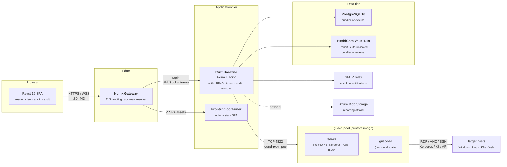

<p align="center">
  <picture>
    <source media="(prefers-color-scheme: dark)" srcset="frontend/public/logo-dark.png">
    <source media="(prefers-color-scheme: light)" srcset="frontend/public/logo-light.png">
    
  </picture>
</p>

<p align="center">
  <strong>A high-performance, modernized client and proxy architecture for <a href="https://guacamole.apache.org/">Apache Guacamole</a>.</strong><br>
  <sub>Rust backend · React SPA · Vault envelope encryption · OIDC SSO · FreeRDP 3 · Kerberos NLA · H.264 streaming</sub>
</p>

<p align="center">
  <a href="https://github.com/Bails309/strata-client/actions/workflows/ci.yml"></a>
  <a href="https://github.com/Bails309/strata-client/actions/workflows/codeql.yml"></a>
  <a href="https://github.com/Bails309/strata-client/actions/workflows/trivy.yml"></a>
  <a href="https://api.securityscorecards.dev/projects/github.com/Bails309/strata-client"></a>
  <a href="https://github.com/Bails309/strata-client/releases/latest"></a>
  <a href="LICENSE"></a>
</p>

<p align="center">
  <a href="https://github.com/Bails309/strata-client/commits/main"></a>
  <a href="https://github.com/Bails309/strata-client/issues"></a>
  <a href="https://github.com/Bails309/strata-client/pulls"></a>
  <a href="https://github.com/Bails309/strata-client/graphs/contributors"></a>
  <a href="SECURITY.md"></a>
</p>

<p align="center">
  
  
  
  
  
  
</p>

<p align="center">
  <a href="CHANGELOG.md">Changelog</a> ·
  <a href="docs/architecture.md">Architecture</a> ·
  <a href="docs/api-reference.md">API Reference</a> ·
  <a href="docs/deployment.md">Deployment</a> ·
  <a href="docs/security.md">Security</a> ·
  <a href="docs/faq.md">FAQ</a> ·
  <a href="https://github.com/Bails309/strata-client/discussions">Discussions</a>
</p>

---

# Strata Client

Strata Client is a modernized control plane and proxy for [Apache Guacamole](https://guacamole.apache.org/). It pairs a custom `guacd` build (FreeRDP 3, Kerberos NLA, end-to-end H.264 GFX passthrough) with a Rust backend (Axum + Tokio) and a React 19 SPA, and adds the operations surface a Guacamole deployment usually has to bolt on: OIDC SSO, granular RBAC, Vault-sealed credential storage, hash-chained audit logging, session recording with NVR-style live observation, privileged-account checkout / rotation, and first-class web-kiosk, VDI, and Kubernetes-pod connection types.

If you have used Guacamole's reference web app and wished it had real auth, real audit, real key management, and a UI built this decade — that is the gap Strata fills.

## ✨ Capabilities

### Protocols & display

- **RDP, VNC, SSH, Telnet, Kubernetes pod console, Web kiosk, VDI desktop containers** — every protocol speaks the same WebSocket tunnel, recording, and audit pipeline.
- **End-to-end H.264 GFX passthrough** — FreeRDP 3 → guacd → WebSocket → browser WebCodecs decoder, with no server-side transcode. Order-of-magnitude bandwidth wins on AVC444-enabled Windows hosts.
- **Kerberos / NLA** — dynamic per-realm `krb5.conf` pushed to `guacd` at runtime; multi-realm with per-realm KDCs and lifetimes.
- **Browser-based multi-monitor RDP** — Window Management API spans a session across physical monitors with per-window cursor/keyboard sync.
- **Tiled multi-session view** — open multiple connections side-by-side with per-tile focus and keyboard broadcast.
- **Sidecar guacd scaling** — round-robin pool across multiple `guacd` instances for horizontal scaling.

### Authentication & authorization

- **OIDC / SSO** — full OpenID Connect with dynamic JWKS validation (Keycloak, Entra ID, Okta, etc.).
- **Local username/password** — built-in auth for environments without an OIDC provider, with 12-character minimum password policy.
- **Access + refresh tokens** — short-lived 20-minute access tokens, 8-hour `HttpOnly` refresh cookies, proactive activity-based silent refresh, pre-expiry warning toast — aligned with OWASP session-timeout guidance.
- **Granular RBAC** — ten-permission role model (manage system / users / connections, audit, view sessions, create users / roles / connections / sharing profiles, Quick Share); enforced at every admin endpoint.
- **Active Directory LDAP sync** — scheduled computer-account import (LDAPS, multiple search bases, gMSA exclusion, simple-bind or Kerberos-keytab auth, custom CA cert).
- **Per-user session tracking** — JTI, IP, UA, expiry recorded for every active login.

### Credential & key management

- **Bundled HashiCorp Vault** — auto-initialized, auto-unsealed Vault 1.19 with the Transit engine; zero-config on first boot, swappable for an external Vault at any time through the UI.
- **Envelope encryption** — user credentials sealed with AES-256-GCM; Data Encryption Keys wrapped via Vault Transit.
- **Credential profiles** — per-user saved profiles with optional TTL, in-line renewal at connect time when expired.
- **Privileged Account Password Management** — full checkout / approval / rotation workflow for AD service accounts. Vault-sealed storage, LDAP `unicodePwd` reset, scoped approver mappings, configurable generation policy, voluntary early check-in, automatic rotation on expiry or check-in, dedicated Approvals UI.
- **Reusable Trusted CA bundles for Web Sessions** — admins upload PEM bundles once; kiosks attach them via per-session NSS DB so Chromium trusts internal roots without `--ignore-certificate-errors`.

### Recording, audit & observability

- **Session recording** — Guacamole-native capture per connection, configurable retention.
- **Live session NVR** — TiVo-style admin observation with a 5-minute rewind buffer; jump into any active session and scrub backwards.
- **Live session sharing** — temporary view-only or control share links, NVR-broadcast-channel based, 24-hour expiry, instant revoke.
- **Immutable audit log** — append-only, SHA-256 hash-chained `audit_logs` table covering every privileged action, tunnel lifecycle event, share-token use, checkout decision, and command-palette invocation.
- **Connection health checks** — background TCP probe of every connection (2-min cadence, 5-s timeout) with green/red/gray dashboard dots.
- **Azure Blob Storage sync** — completed recordings pushed to Blob Storage for durable, memory-efficient streaming playback.
- **Modern transactional emails** — MJML-rendered, Outlook-dark-mode-hardened checkout notifications with admin-configurable SMTP relay, retry worker, opt-outs, and last-50-deliveries audit view.

### Operator UX

- **Setup wizard + admin dashboard** — first-boot configuration of database, Vault mode, OIDC, SMTP, tags, folders, and connections — all from the SPA.
- **Scriptable Command Palette** — in-session palette (default `Ctrl+K`, rebindable per user) with built-in commands (`:reload`, `:disconnect`, `:fullscreen`, `:explorer`, `:commands`, `:close`) and up to 50 personal `:command` mappings (`open-connection`, `open-folder`, `open-tag`, `open-page`, `paste-text`, `open-path`).
- **Quick Share file CDN** — drag-and-drop upload from the Session Bar, random per-session URLs (auto-deleted on disconnect), protocol-aware copy snippets (`curl`, `wget`, `Invoke-WebRequest`, plain URL).
- **Unified Session Bar** — Sharing, File Browser, Fullscreen, Pop-out, OSK in one zero-footprint right-side dock.
- **Windows Key Proxy** — Right Ctrl acts as the host key, VMware/VirtualBox style, in every session mode.
- **Large clipboard support** — protocol-level chunking handles 64 MB+ buffers between local and remote.
- **In-app documentation** — `/docs` page renders Architecture, Security, API Reference, and the release-history carousel inline.

### Operations & deployment

- **Zero-config first boot** — bundled PostgreSQL 16 and Vault 1.19 containers; promote to external services any time through the UI.
- **DNS configuration in admin UI** — admin-managed DNS servers and search domains pushed to `guacd` containers without editing `docker-compose.yml`.
- **Recording disclaimer / Terms of Service** — mandatory first-login acceptance modal, timestamped in the database, declining logs the user out.
- **Production-grade nginx gateway** — embedded-DNS resolver with per-request upstream resolution; nginx survives a backend outage and recovers automatically.
- **CI/CD** — GitHub Actions workflow for automated weekly upstream `guacd` rebuilds, Trivy scans, and CodeQL.
- **Apache 2.0 licensed** — see [LICENSE](LICENSE) and [NOTICE](NOTICE).

For the full per-version history of how these capabilities were built and the bug fixes shipped along the way, see [CHANGELOG.md](CHANGELOG.md) and the in-app **What's New** carousel ([WHATSNEW.md](WHATSNEW.md)).

## 🆕 What's new

| Version | Date       | Highlight                                                                                                                                                |
| ------- | ---------- | -------------------------------------------------------------------------------------------------------------------------------------------------------- |
| 1.4.1   | 2026-05-05 | Tunnel watchdog regression fixed — active sessions no longer reaped at the access-token TTL. RustCrypto refresh, ESLint sweep. ([details](CHANGELOG.md#141--2026-05-05)) |
| 1.4.0   | 2026-05-01 | Kubernetes pod console as a first-class connection protocol, end-to-end through the existing tunnel/recording/audit pipeline. ([details](CHANGELOG.md#140--2026-05-01)) |
| 1.3.2   | 2026-05-01 | guacd FreeRDP 3.25 callback ABI fix, RDP resize ghost-region fix, WebSocket-tunnel auth watchdog, immediate logout teardown. ([details](CHANGELOG.md#132--2026-05-01))  |
| 1.3.1   | 2026-04-30 | SSH terminal defaults matching `rustguac`, phantom-selection mouse hygiene, recording-playback URL fix. ([details](CHANGELOG.md#131--2026-04-30))                       |
| 1.3.0   | 2026-04-30 | Web-kiosk lifecycle correctness, Trusted-CA NSS DB resolution, suppressed Chromium infobar, protocol-aware Quick Share, nginx upstream resilience. ([details](CHANGELOG.md#130--2026-04-30)) |

## vs. vanilla Apache Guacamole

Apache Guacamole's reference web app is a fantastic protocol gateway. Strata is what you'd build on top of it for an enterprise privileged-access deployment — without forking guacd.

| Capability                                | Apache Guacamole reference webapp | **Strata Client**                                                                                  |
| ----------------------------------------- | --------------------------------- | -------------------------------------------------------------------------------------------------- |
| Protocols                                 | RDP, VNC, SSH, Telnet, Kubernetes | **Same plus Web kiosk + VDI desktop containers**, all through one tunnel/recording/audit pipeline  |
| Authentication                            | Built-in users, LDAP, SAML, etc.  | **OIDC / SSO with dynamic JWKS**, local auth, refresh-token rotation aligned with OWASP guidance   |
| Authorisation                             | User/group permission model       | **10-permission RBAC** enforced at every admin endpoint, share-token mode, scoped checkout approvers |
| Credential storage                        | XML / JDBC, encrypted-at-rest     | **HashiCorp Vault Transit envelope encryption** (bundled & auto-unsealed, or external)             |
| Privileged-account workflow               | Not included                      | **Built-in PAM**: checkout / approval / rotation, LDAP `unicodePwd` reset, dedicated Approvals UI  |
| Audit log                                 | Application log                   | **Append-only, SHA-256 hash-chained** `audit_logs` covering every privileged action                |
| Live session observation                  | Not included                      | **NVR-style live observe** with 5-minute rewind buffer, share links (view/control), kill controls  |
| Recording playback                        | Server-side render to video       | **In-browser playback** with seek/speed; optional Azure Blob Storage offload                       |
| H.264 GFX                                 | Server-side transcode             | **End-to-end passthrough** to the browser's WebCodecs decoder — no proxy-side decode               |
| Web / VDI sessions                        | Not supported                     | **First-class** kiosk Chromium-in-Xvnc and Strata-managed `xrdp` Docker containers                 |
| Multi-monitor                             | Limited                           | **Window Management API** spans a session across physical monitors                                 |
| Operator UX                               | JSP web app                       | **React 19 SPA** with setup wizard, scriptable Command Palette, Quick Share file CDN              |
| Deployment                                | Tomcat + guacd + DB               | **`docker compose up -d` zero-config first boot** with bundled Postgres + Vault                    |

## 🏗️ Architecture



See [docs/architecture.md](docs/architecture.md) for a detailed breakdown of every component, data path, and trust boundary.

## 🚀 Quick Start

### Prerequisites

- [Docker](https://docs.docker.com/get-docker/) ≥ 24.0
- [Docker Compose](https://docs.docker.com/compose/) ≥ 2.20

### 1. Clone & configure

```bash
git clone https://github.com/Bails309/strata-client.git
cd strata-client
cp .env.example .env        # review and edit as needed
```

### 2. Run

You have two options. **Pre-built images is the faster path** (~30 s on a cold host); building from source takes ~5 minutes on first boot but is the right choice if you've forked the repo or are running unreleased commits.

#### Option A — Pull pre-built images from GHCR (recommended)

Every tagged release publishes Cosign-signed, SLSA Level-3-provenance, CycloneDX-SBOM-attached container images to GitHub Container Registry. The `docker-compose.ghcr.yml` overlay points the stack at them:

```bash
export STRATA_VERSION=1.4.1                                  # or "latest"
docker compose -f docker-compose.yml -f docker-compose.ghcr.yml pull
docker compose -f docker-compose.yml -f docker-compose.ghcr.yml up -d
```

Images:

| Image                                                              | What it is                            |
| ------------------------------------------------------------------ | ------------------------------------- |
| `ghcr.io/bails309/strata-client/backend:<version>`                 | Rust backend (Axum + Tokio)           |
| `ghcr.io/bails309/strata-client/frontend:<version>`                | Frontend SPA (nginx + static React)   |
| `ghcr.io/bails309/strata-client/custom-guacd:<version>`            | Custom guacd (FreeRDP 3 + Kerberos + H.264) |

Verify image signatures + provenance with [Cosign](https://docs.sigstore.dev/cosign/installation/) before deploying to production:

```bash
cosign verify ghcr.io/bails309/strata-client/backend:1.4.1 \
  --certificate-identity-regexp '^https://github.com/Bails309/strata-client/.github/workflows/release.yml@.*' \
  --certificate-oidc-issuer https://token.actions.githubusercontent.com
```

The published SBOM is also attached as an in-toto attestation:

```bash
cosign download attestation ghcr.io/bails309/strata-client/backend:1.4.1 \
  --predicate-type https://cyclonedx.org/bom
```

#### Option B — Build from source

```bash
docker compose up -d --build
```

This builds `backend`, `frontend`, and `custom-guacd` locally from the Dockerfiles in this repo. Use this path when you've modified source, are testing an unreleased commit, or need an air-gapped build.

### ⌨️ Windows Key Proxy

Browsers cannot capture the physical Windows key — the OS intercepts it before it reaches the page. Strata remaps **Right Ctrl** as a Windows key proxy (the same convention used by VMware Workstation and VirtualBox):

| Action                          | What the remote session receives |
| ------------------------------- | -------------------------------- |
| **Hold Right Ctrl + E**         | Win+E (open Explorer)            |
| **Hold Right Ctrl + R**         | Win+R (Run dialog)               |
| **Hold Right Ctrl + Shift + S** | Win+Shift+S (screenshot)         |
| **Tap Right Ctrl alone**        | Win tap (Start menu)             |

This works in all session modes — single session, tiled view, pop-out windows, and shared viewer (control mode). The proxy is active for **RDP and VNC** connections; SSH sessions are unaffected.

> [!NOTE]
> If you are using an **external database**, ensure `DATABASE_URL` is set in your `.env` file first. If you want to use the **bundled local database**, use the `local-db` profile:
>
> ```bash
> docker compose --profile local-db up -d
> ```

This starts all services with Nginx as the main gateway:

| Service          | Port         | Purpose                                       |
| ---------------- | ------------ | --------------------------------------------- |
| `frontend`       | `80`, `443`  | React SPA + SSL Gateway + API Proxy           |
| `backend`        | — (internal) | Rust API / WebSocket proxy                    |
| `guacd`          | — (internal) | Guacamole protocol daemon (FreeRDP 3 + H.264) |
| `postgres-local` | — (internal) | Bundled PostgreSQL 16                         |
| `vault`          | — (internal) | Bundled HashiCorp Vault 1.19                  |

### 2.1 SSL / HTTPS Setup

Strata Client uses Nginx to handle HTTPS. To use your own certificates:

1. Create a `certs/` directory in the project root.
2. Place your certificates inside as `cert.pem` and `key.pem`.
3. Restart the stack: `docker compose up -d`.

Nginx is configured to automatically redirect all port 80 (HTTP) traffic to port 443 (HTTPS) once enabled.

For additional guacd instances:

```bash
GUACD_INSTANCES=guacd-2:4822 docker compose --profile scale up -d
```

For a detailed production-ready setup on an Ubuntu server, follow the [Ubuntu VM Deployment Guide](docs/ubuntu-vm-deployment.md).

### 3. First-boot setup

Open `http://127.0.0.1` (or `https://your-domain` if STRATA_DOMAIN is set). On first launch you will be prompted to configure:

1. **Database** — provide an external PostgreSQL connection string in your `.env` (recommended for production) or use the bundled local DB by starting the stack with the `local-db` profile.
2. **Vault** — select a vault mode:
   - **Bundled (recommended)** — auto-initializes, unseals, and configures Transit encryption with zero setup
   - **External** — connect to your own Vault instance with address, token, and transit key
   - **Skip** — use local encryption only, configure Vault later via Admin Settings

### 4. Configure SSO & connections

After setup, log in and navigate to **Admin → SSO / OIDC** to configure your identity provider, then add remote desktop connections under **Admin → Access**.

## 🛠️ Development

### Backend (Rust)

```bash
cd backend
# Requires Rust 1.95
cargo run
```

Environment variables: `DATABASE_URL`, `GUACD_HOST`, `GUACD_PORT`, `RUST_LOG`, `CONFIG_PATH`.

### Frontend (React / TypeScript)

```bash
cd frontend
npm install
npm run dev          # Vite dev server on :5173, proxies /api → :8080
```

### Custom guacd

The `guacd/Dockerfile` builds the Apache Guacamole server with FreeRDP 3 and Kerberos support. To rebuild manually:

```bash
docker build -t custom-guacd:latest ./guacd
```

See [docs/deployment.md](docs/deployment.md) for production deployment and upgrade procedures.

## 📚 Documentation

| Document                                       | Description                                |
| ---------------------------------------------- | ------------------------------------------ |
| [docs/architecture.md](docs/architecture.md)   | System design, container layout, data flow |
| [docs/api-reference.md](docs/api-reference.md) | REST & WebSocket API endpoints             |
| [docs/deployment.md](docs/deployment.md)       | Production deployment, upgrades, HA        |
| [docs/security.md](docs/security.md)           | Threat model, encryption, auth details     |
| [docs/faq.md](docs/faq.md)                     | Frequently asked questions                 |
| [CHANGELOG.md](CHANGELOG.md)                   | Version history                            |
| [CONTRIBUTING.md](CONTRIBUTING.md)             | Contribution guidelines                    |
| [NOTICE](NOTICE)                               | Third-party software notices               |

## 📄 License

This project is licensed under the [Apache License 2.0](LICENSE).

This project incorporates or depends on software from the Apache Guacamole project and other open-source libraries. See the [NOTICE](NOTICE) file for details.
