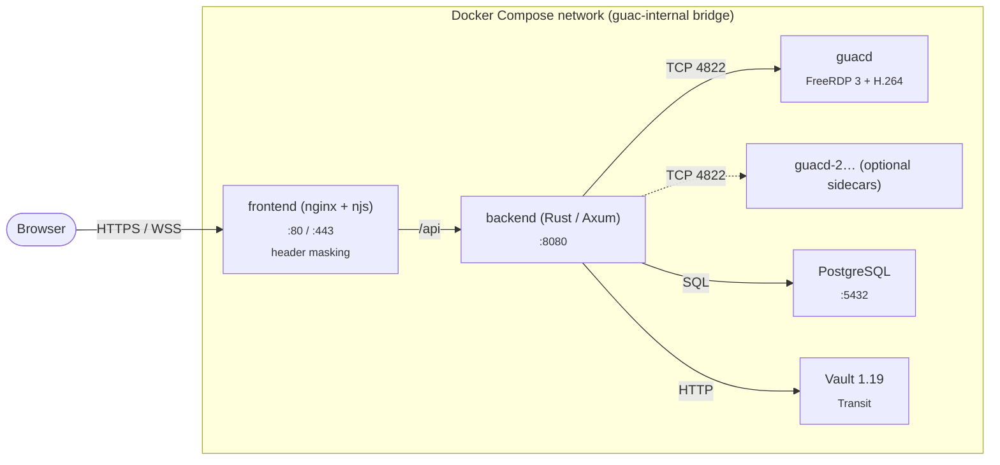
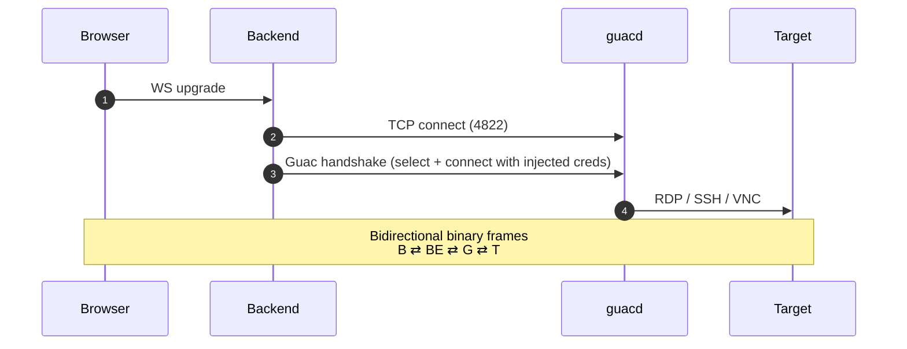
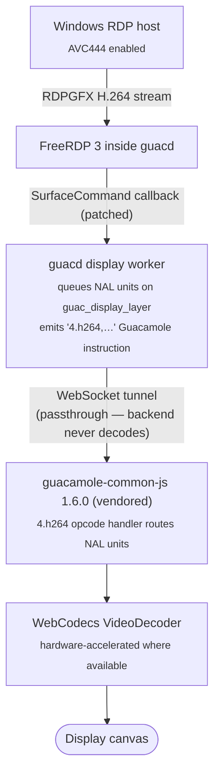
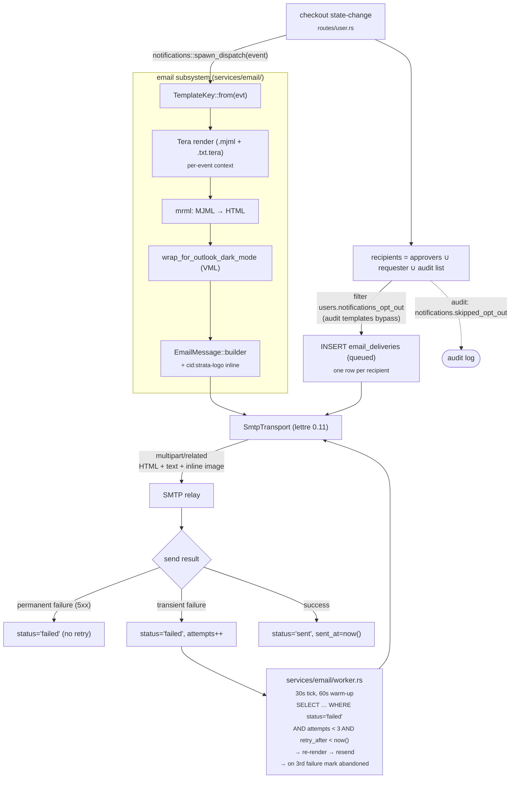
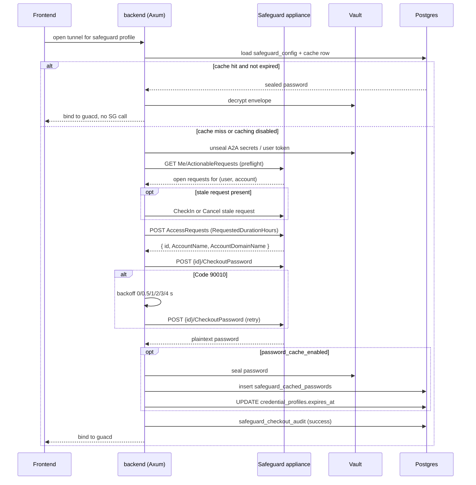
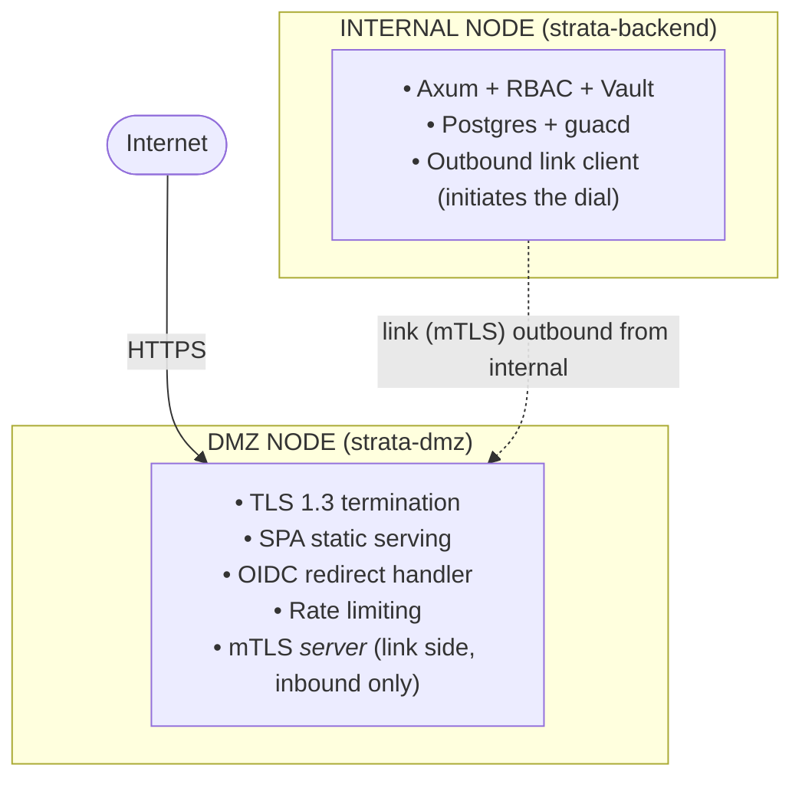
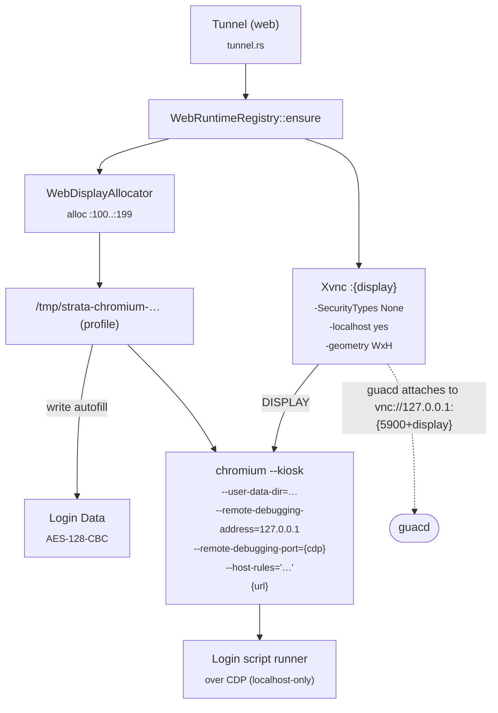
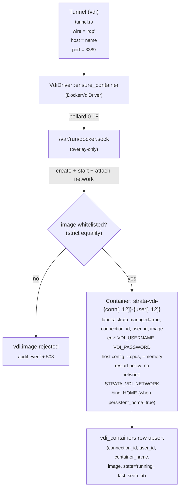

# Architecture

## Overview

Strata Client is a microservices system that replaces the legacy Java/Tomcat + AngularJS Apache Guacamole stack with a Rust proxy and React SPA. The core stack runs four containers (frontend/nginx, backend, guacd, Vault); optional profiles add a bundled PostgreSQL instance and additional guacd sidecar instances for horizontal scaling. The backend image (Debian trixie-slim) additionally ships `Xvnc` and `chromium` baked in to support the `web` protocol out of the box; the `vdi` protocol is gated behind the [`docker-compose.vdi.yml`](../docker-compose.vdi.yml) overlay because it requires mounting `/var/run/docker.sock` (= host root).



## Containers

### 1. Custom guacd

| Item       | Value                           |
| ---------- | ------------------------------- |
| Base image | Alpine 3.19 (multi-stage)       |
| Source     | `guacd/Dockerfile`              |
| Network    | `guac-internal` (internal only) |
| Port       | 4822 (not exposed externally)   |

The official Apache Guacamole server daemon, custom-compiled with:

- **FreeRDP 3** (`ARG FREERDP_VERSION=3`) for modern RDP support. The
  custom guacd builds against whichever FreeRDP 3.x ships with the
  base image (Alpine 3.23 community + edge currently resolves to
  `freerdp-3.25.0-r0`; Debian 13 / Trixie still ships
  `freerdp-3.24.x`). Patch `006-freerdp325-authenticate-ex.patch`
  (added in v1.3.2) `#include`s `<freerdp/version.h>` and uses the
  `FREERDP_VERSION_MAJOR` / `FREERDP_VERSION_MINOR` preprocessor
  macros to switch between the legacy four-argument
  `Authenticate(freerdp*, char**, char**, char**)` callback (FreeRDP
  ≤ 3.24) and the new five-argument
  `AuthenticateEx(freerdp*, char**, char**, char**, rdp_auth_reason)`
  callback (FreeRDP ≥ 3.25), so the same source tree compiles
  cleanly on both Alpine edge and Debian Trixie.
- **Kerberos** (`krb5-dev` at build, `krb5` + `krb5-libs` at runtime) for GSSAPI/NLA authentication
- **H.264 GFX** — `ffmpeg-dev` / `ffmpeg-libs` for FreeRDP 3 GFX pipeline with H.264 encoding, dramatically lowering bandwidth for RDP sessions

The build pipeline applies a numbered series of unified-diff
patches under [`guacd/patches/`](../guacd/patches/) to the
upstream `apache/guacamole-server` tree (pinned to commit
`2980cf0`, release 1.6.1) before `autoreconf -fi && ./configure`.
The patches are applied in lexicographic order via the loop in
[`guacd/Dockerfile`](../guacd/Dockerfile), with `git apply`
preferred and a `patch -p1 -F3` fallback for fuzz tolerance:

| Patch                                  | Purpose                                                                                                                                                                                                                                                  |
| -------------------------------------- | -------------------------------------------------------------------------------------------------------------------------------------------------------------------------------------------------------------------------------------------------------- |
| `001-freerdp3-debian13.patch`          | Build fixes for FreeRDP 3 on Debian 13 / Trixie.                                                                                                                                                                                                         |
| `002-kerberos-nla.patch`               | Routes Kerberos credential prompts through guacd's auth callback so SSO + NLA actually work.                                                                                                                                                             |
| `003-null-guard-and-config-h.patch`    | Hardening: NULL guards on a handful of hot paths and consistent `config.h` inclusion.                                                                                                                                                                    |
| `004-h264-display-worker.patch`        | Hooks FreeRDP's RDPGFX `SurfaceCommand` callback and emits the custom `4.h264` Guacamole instruction (see "[H.264 GFX passthrough]" below).                                                                                                              |
| `005-refresh-rect-on-resize.patch`     | Marks the entire layer dirty after `gdi_resize` and asks the RDP server to re-send pixels for the full new desktop area, eliminating black "ghost regions" along the edge of the canvas after a server-driven RDP resize (v1.3.2).                       |
| `006-freerdp325-authenticate-ex.patch` | Selects between the legacy `Authenticate` callback and the new `AuthenticateEx` callback on `struct rdp_freerdp` based on `FREERDP_VERSION_MAJOR`/`FREERDP_VERSION_MINOR`, restoring the build on FreeRDP 3.25+ while keeping it green on 3.24 (v1.3.2). |

After the loop, the Dockerfile runs two `grep -q` assertions on
the post-patch `src/protocols/rdp/rdp.c` to verify that
`#include <freerdp/version.h>` and
`rdp_inst->AuthenticateEx = rdp_freerdp_authenticate;` are
present — defence-in-depth catch for silent semantic regressions
of patch 006 (the first iteration of which applied successfully
but selected the wrong `#if` branch because the version macros
were undefined). Patch files are pinned to LF line endings via
[`guacd/patches/.gitattributes`](../guacd/patches/.gitattributes)
because byte-sensitive unified-diff hunks fail to apply when CRLF
sneaks in via `core.autocrlf=true` on Windows.

Multiple guacd instances can be deployed using the `--profile scale` Docker Compose profile (e.g. `guacd-2`). The backend distributes connections across instances using a round-robin `GuacdPool`.

Volumes:

- `guac-recordings` → `/var/lib/guacamole/recordings` — session recording storage
- `krb5-config` → `/etc/krb5` — dynamically generated `krb5.conf`
- `backend-config` → `/app/config` (read-only) — custom `resolv.conf` written by the backend for DNS configuration

**Custom DNS resolution:** The guacd container uses a custom `entrypoint.sh` wrapper that checks for `/app/config/resolv.conf` on startup. If present, it copies the file to `/etc/resolv.conf`, enabling the container to resolve internal hostnames (e.g. `.local`, `.dmz.local` domains). The entrypoint then drops privileges to the `guacd` user via `su-exec` before launching the daemon. DNS servers and search domains are configured via the Admin Settings Network tab and written to the shared `backend-config` volume by the backend. Docker's embedded DNS (`127.0.0.11`) is always appended as a fallback nameserver so existing connections that resolve via public DNS continue working.

**Recording write semantics (v1.1.0+):** guacd writes session recordings into the shared `guac-recordings` volume as `guacd:guacd` (uid/gid 100/101 inside the Alpine guacd container) at mode `0640` — group-only-read. The upstream `guacamole-server` `recording.c` `open()` hard-codes mode `0640`, so this is independent of the in-container `umask`. This gid is the integration point with the backend: the backend's `entrypoint.sh` reads the gid off the volume at startup and adds the `strata` user to a matching local group via `usermod -aG`, so historic playback works under standard POSIX group-read without requiring `DAC_OVERRIDE`. The fix is volume-agnostic — Docker named volumes, bind-mounts, NFSv3/v4 with preserved gids, and CIFS with `uid=,gid=` mount options all work transparently.

### 2. Rust Backend

| Item      | Value               |
| --------- | ------------------- |
| Language  | Rust (2021 edition) |
| Framework | Axum 0.8 + Tokio    |
| Source    | `backend/`          |
| Port      | 8080                |

The central orchestrator. Responsibilities:

- **Bootstrap & config** — detects `config.toml` on startup; enters setup mode if missing
- **Database** — connects to local or external PostgreSQL; runs advisory-lock-protected migrations
- **Auth** — multi-method authentication system:
  - **SSO/OIDC (v1.9.0)** — multi-tenant OIDC configurations managed dynamically, allowing multiple custom-labeled sign-in buttons on the login screen. It features dynamic IdP discovery via JWKS, in-memory state tracking to prevent provider mismatches, secure client secret envelope encryption via Vault Transit, and automated session establishment.
  - **Local Auth** — built-in credentials (Argon2id) with global enable/disable toggle, minimum 12-character password policy, and dedicated password change / admin reset endpoints.
  - **Session tokens** — short-lived access tokens (20 min) with `HttpOnly` refresh cookies (8 hr), proactive activity-based silent refresh, per-user session tracking (`active_sessions` table), and a pre-expiry countdown warning toast. Cookies (`csrf_token`, `session_expires`) include a 60s buffer (v1.8.2) for improved SPA refresh reliability. Tokens are signed with a persistent `JWT_SECRET` (v1.8.3) to maintain sessions across container restarts.
  - **Global Security Headers (v1.8.2/1.8.3)** — implements a global `tower-http` middleware that applies `Cache-Control: no-store, no-cache, must-revalidate, proxy-revalidate` to every API response. Public-facing headers (`Server`, `X-Powered-By`, and `Content-Security-Policy: frame-ancestors`) are managed at the Nginx gateway layer via NJS (v1.8.3).
  - **Enforcement** — strict backend policy check on every login attempt ensures disabled methods cannot be accessed.
- **Vault** — envelope encryption for stored credentials via Vault Transit
- **Tunnel** — bidirectional WebSocket ↔ TCP proxy to guacd with protocol handshake injection; supports H.264 GFX pipeline parameters for RDP
- **guacd pool** — round-robin connection distribution across multiple guacd instances (`GuacdPool`)
- **Metrics** — per-session bandwidth tracking (bytes in/out) with aggregate metrics endpoint
- **Config push** — generates `krb5.conf` (multi-realm), toggles recordings, manages SSO settings
- **AD sync** — scheduled LDAP/LDAPS queries against Active Directory to discover and import computer accounts; supports simple bind and Kerberos keytab auth, custom CA certificates, multiple search bases per source, gMSA/MSA exclusion filters, and configurable connection defaults (RDP performance flags, session recording parameters)
- **Password management** — privileged account password checkout and rotation for AD-managed service accounts; configurable password generation policy, LDAP `unicodePwd` reset, Vault-sealed credential storage, approval workflows with explicit account-to-role scoping (each approval role is mapped to specific managed AD accounts), dedicated "Search Base OUs" for user discovery (allowing separate scoping from device discovery), **scheduled future-dated checkouts** (requests between now + 30 s and now + 14 days sit idle with no credential material until the scheduled moment, at which point the existing 60-second expiration worker activates them), **emergency approval bypass (break-glass)** per AD sync config — gated by `pm_allow_emergency_bypass`, requires ≥ 10-character justification, **hard-capped at 30 minutes** server-side, writes a dedicated `checkout.emergency_bypass` audit event, surfaces an ⚡ Emergency badge across Credentials and Approvals views, background workers for checkout expiration and zero-knowledge auto-rotation, requester username resolution for approver visibility, and decided-by tracking with self-approval detection
- **Connection health checks** — background TCP probing of every connection's hostname:port every 2 minutes; results (online/offline/unknown) persisted and exposed via API for dashboard status indicators
- **DNS configuration** — admin-configurable DNS servers and search domains written to a shared Docker volume as `resolv.conf`; guacd containers apply this on startup for internal hostname resolution; Docker's embedded DNS is preserved as fallback
- **Quick Share (file store)** — session-scoped temporary file CDN; files uploaded via multipart POST are stored on disk, each keyed by a random unguessable token. Download endpoint is unauthenticated (the token is the capability). Files are automatically cleaned up when the tunnel disconnects. Limits: 20 files per session, 500 MB each. The frontend Quick Share panel is **protocol-aware (v1.3.0+)**: SSH / Telnet sessions render the copy-snippet as `curl -fLOJ '<url>'` (paste-into-shell friendly); RDP / VNC / web kiosks render the bare HTTPS URL. A "Copy as" `Select` dropdown lets the operator override per-session: `URL`, `curl`, `wget --content-disposition`, or `Invoke-WebRequest -Uri … -OutFile … (Windows)`. **v1.12.0+:** every upload is streamed through a pluggable antivirus scanner before it lands in the session file store. Three backends ship (`off` default, `clamav` over the `clamd` INSTREAM TCP wire protocol against the opt-in bundled sidecar, and `command` for exec-driven engines like Defender / Sophos / ESET). Fail-closed by default; infected verdicts always reject; blocked uploads emit a `file.av_blocked` audit event with the signature name. See [av-scanning.md](av-scanning.md) and [ADR-0011](adr/ADR-0011-av-scanning.md). **v1.12.1+ refinements:** (1) `AppError::AvScanFailed` is now mapped to a friendly, engine-classified user-facing message via `Verdict::user_facing_block_message()` (infected → "Your file was blocked by the antivirus scanner (<signature>)", timeout → "the scanner did not respond in time", transport error → "the scanner is unreachable", missing signatures → "the scanner's signature database isn't loaded yet", everything else → a generic "the scanner returned an error"), so end users never see raw stderr or `clamd` panic strings. (2) The frontend exposes scanner health without `docker exec` via a new `GET /api/admin/health/av` endpoint and an **AV Health** card on the Admin → Health tab (engine, version, signature freshness, last-seen, error-since timestamp). (3) The Admin → **AV-Blocked Files** tab unifies inbound `file.av_blocked` audit rows and outbound `outbound_shares` rows with `av_scan_status IN ('infected','error')` into a single audit grid keyed off `GET /api/admin/files/av-blocked`. (4) The Quick Share outbound copy-snippet flow now renders an indeterminate **Awaiting AV scan** progress bar on each pending row, and the curl / PowerShell snippets explicitly disable `Expect: 100-continue` (`-H 'Expect:'` on curl, `$client.DefaultRequestHeaders.ExpectContinue = $false` on .NET `HttpClient`) so a stale-token 400 from the public ingest router doesn't swallow the byte-stream before the progress meter has anything to draw.
- **Outbound Quick-Share (approval-gated, v1.11.0+)** — separate, audited pipeline for files **leaving** a remote session. Two ingest paths feed the same backend service:
  - **Drive-channel interception** — `SessionManager.client.onfile` buffers any file guacd pushes back over the RDP / SFTP drive channel (`Guacamole.BlobReader` → `Blob` → `File` → `FormData`) and POSTs it to `POST /api/user/outbound-shares` with the active session_id, connection_id, and pending justification. Behaviour is gated on the active role granting `can_use_quick_share_outbound`; otherwise the legacy auto-download path is preserved.
  - **HTTPS upload-command (tokenised)** — for sites where group policy disables RDP / SFTP drive redirection at the target. The SPA mints a single-use, 10-minute upload token via `POST /api/user/outbound-shares/ingest-token` (auth + CSRF), the panel renders the token into a `curl` / `curl.exe` / PowerShell 7 `-Form` one-liner, and the user pastes the snippet inside the remote session shell. The remote-session shell POSTs the file at `POST /api/outbound-shares/ingest/{token}` on the **public router** (no cookie auth, no CSRF — the path-segment token IS the auth). The handler atomically consumes the token (`UPDATE … SET used_at = now() WHERE token = $1 AND used_at IS NULL AND expires_at > now()`), re-verifies the minter's `can_use_quick_share_outbound` permission, then hands off to the same `services::outbound_shares::submit` pipeline as the drive-channel path. Tokens are 32-byte URL-safe base64 (~192 bits of entropy), bound at mint time to the user + session + connection + justification, rate-limited 10 mints/minute/user, and reaped daily by the `user_cleanup` worker.

  Backend pipeline: a fresh 256-bit DEK is generated per submission; the plaintext is AES-256-GCM-encrypted with that DEK; the DEK is sealed by Vault Transit and stored in `outbound_shares.sealed_dek`; the ciphertext is written to the staging directory (`STRATA_OUTBOUND_SHARES_DIR`, default `/tmp/strata-outbound-shares` with platform-temp-dir fallback). A built-in DLP heuristic computes a score and a list of reasons against the plaintext; if `dlp_score ≤ AUTO_APPROVE_THRESHOLD` and the per-user `outbound_share_requires_approval = false`, the share is auto-released with a single-use download token. Otherwise it sits in `status = 'pending'` until a super-admin (`can_manage_system`) or a delegated approver (`outbound_share_approvers`) decides via `POST /api/admin/outbound-shares/{id}/decide`. Denied or expired shares trigger a periodic worker that zeroises the sealed DEK and deletes the ciphertext file so the staging blob cannot be recovered from a forensic disk image.

  Audit events: `outbound_share.submitted`, `.decided`, `.downloaded`, `.purged`, `.approver_added`, `.approver_removed`, `.ingest_token.minted`, `.ingest_token.consumed`.

  **v1.11.1 additions:** (1) The submitter side now enforces a
  shared `validate_outbound_justification(requires_approval,
justification)` helper at **both** outbound entry points
  (`finalize_submit` and `issue_ingest_token`) — when the
  submitter's `users.outbound_share_requires_approval = TRUE`,
  the justification must be at least 10 characters
  (whitespace-trimmed, character count not byte count); bypass
  users continue to submit without one. The check on
  `issue_ingest_token` runs before the token is minted so the
  user discovers the error inside the Outbound Share panel, not
  after pasting the snippet into a remote shell. (2) A new
  `PendingApprovalWatcher` component is mounted once in the SPA
  shell (`App.tsx`) and polls the two approval queues the
  active user is gated for — `GET /api/user/pending-approvals`
  (credential checkouts) and `GET
/api/admin/outbound-shares/pending` (outbound shares, only
  when the user has `can_manage_system` or
  `is_outbound_approver`) — surfacing each new item as a
  top-left popup card with Approve / Deny (with inline reason
  composer) / View all actions wired to the existing decide
  endpoints. 45 s poll cadence plus extra polls on tab focus /
  visibilitychange; 30 s auto-dismiss; cross-tab de-dup via
  `localStorage`. Architecturally mirrors the existing
  `CredentialProfileExpiryWatcher`.

- **Audit** — SHA-256 hash-chained append-only log

### 3. Frontend SPA

| Item      | Value                                     |
| --------- | ----------------------------------------- |
| Language  | TypeScript                                |
| Framework | React 19 + Vite                           |
| Styling   | Tailwind CSS v4                           |
| Runtime   | nginx (production)                        |
| Source    | `frontend/`                               |
| Ports     | 80 (HTTP), 443 (HTTPS when certs mounted) |

The frontend nginx container serves as the primary gateway for all external traffic. It handles:

- **Reverse proxying** — routes `/api/*` to the Rust backend (including WebSocket upgrades for tunnel connections). The shared `common.fragment` declares `resolver 127.0.0.11 valid=10s ipv6=off;` (Docker's embedded DNS) and uses a `set $backend_upstream "backend:8080";` variable as the `proxy_pass` target so the upstream is re-resolved per request rather than cached at process start. **(v1.3.0+)** This avoids the historical `[emerg] host not found in upstream "backend"` boot failure when the backend container was briefly unreachable during `docker compose up -d --build`; nginx now stays up and returns `502 Bad Gateway` for the duration of any backend outage, recovering automatically when the upstream comes back
- **Security headers** — `X-Content-Type-Options`, `Referrer-Policy`, `Content-Security-Policy` (including `frame-ancestors 'none'`), and `Permissions-Policy` on every response. API-specific security headers (notably `Cache-Control: no-store`) are enforced by the Rust backend middleware for all `/api/*` routes.
- **NJS Header Filtering (v1.8.3)** — utilizes Nginx JavaScript (`njs`) to mask the `Server` header as "Strata" and remove the `X-Powered-By` header across all responses, including those generated internally by Nginx. This ensures zero technology fingerprinting even in error scenarios.
- **Compression** — gzip for text, CSS, JS, JSON, and SVG assets
- **SPA fallback** — `try_files` to `index.html` for client-side routing

Pages:

- **Setup Wizard** — first-boot database and Vault configuration with bundled/external/skip vault mode selector
- **Dashboard** — user's connections with connect/credential vault, multi-select for tiled view, last-accessed tracking, favorites filter, group view toggle (flat list or collapsible group headers), and connection health status indicators (green/red/gray dots showing online/offline/unknown from background TCP probes). **(v1.8.3)** Preference and settings providers are mounted inside the authentication boundary to eliminate 401 log noise on the login screen.
- **Session Client** — HTML5 Canvas via `guacamole-common-js` (vendored 1.6.0 bundle with H.264 GFX passthrough; v0.28.0+) with clipboard sync (including pop-out windows), file transfer, a unified **Session Bar** dock consolidating all tools (Sharing, Quick Share, Keyboard, etc.) into a sleek right-side overlay, **Command Palette** (`Ctrl+K`) for instant connection search and launch from any session, **keyboard shortcut proxy** (Right Ctrl → Win key, `Ctrl+Alt+\`` → Win+Tab), **Keyboard Lock API** for capturing OS-level shortcuts in fullscreen over HTTPS, **display tags** (optional per-connection colored badge on session thumbnails, user-assignable via a tag picker dropdown), **dynamic browser tab title** (shows the active session's server name, e.g. "SERVER01 — Strata"), pop-out windows that persist across navigation with automatic screen-change detection and re-scaling, browser-based multi-monitor support via canvas slicing (Chromium Window Management API) with ~30 fps `setInterval`render loop (avoids`requestAnimationFrame`throttling when popups have focus),`MutationObserver`-based cursor sync across all secondary windows, horizontal-only layout (all monitors arranged left-to-right regardless of physical vertical position — best supported configuration is all landscape monitors side by side; monitors above or below appear as slices to the right), aggregate height capped to primary monitor height for taskbar visibility, `moveTo`/`resizeTo`/`requestFullscreen`auto-maximize on secondary popups, live`screenschange`detection for hot-plugged monitors, screen count detection shown in the toolbar tooltip, Chrome popup-blocker bypass via in-gesture`getScreenDetails()`for 3+ monitors, and Brave/privacy-browser compatibility, Quick Share panel (conditional on file transfer enabled) with drag-and-drop upload and one-click copy-to-clipboard download URLs, expired credential renewal at connect time, and automatic redirect to the next active session when one ends. (The legacy`forceDisplayRepaint()` ghost-pixel mitigation and the manual **Refresh display** button from v0.25.1–v0.27.x have been retired — H.264 passthrough eliminates the underlying ghost class.)
- **Tiled View** — multi-connection grid layout with per-tile focus, keyboard broadcast, and inline credential prompts
- **NVR Player** — admin-only read-only session observer with 5-minute rewind buffer plus a per-session persistent-state log (v1.9.4) that salvages drawing instructions as they age out of the ring buffer so newly-joining observers reconstruct the full canvas instead of seeing a black frame; supports replay→live transition and timeline controls
- **Sessions** — unified role-based page with Live Sessions and Recording History tabs; users see their own sessions, admins see all with kill/observe/rewind controls
- **Login** — unified login portal supporting local credentials and OIDC Single Sign-On; dynamically adjusts based on enabled authentication methods
- **Admin Settings** — left-sidebar nav (v1.5.3+) grouped into five sections — **Overview** (Health, Sessions), **Identity & Access** (Access, AD Sync, SSO / OIDC, Kerberos, Password Mgmt), **Connectivity** (Network, DMZ Links, Trusted CAs, VDI), **Workspace** (Display, Tags, Notifications, Recordings), and **Secrets & Security** (Vault, Security). Sections are permission-aware and collapse out of the nav entirely when the current user has no item visible inside them; on screens narrower than the Tailwind `lg` breakpoint the sidebar wraps inline above the content as a horizontal flex row of buttons. The 17 underlying tab panes provide health monitoring, SSO, auth method toggles, Kerberos (multi-realm), vault, recordings, network (DNS configuration), access control, connection group management, AD sync sources (with inline password management configuration: enable toggle, credential source, target filter with preview, password policy, auto-rotation), password management (approval roles with explicit account scoping via searchable dropdown and chip tags, account mappings, checkout requests with decided-by column and self-approval detection), session analytics and metrics, DMZ link health, trusted CAs, and VDI image management.
- **Approvals** — dedicated page for pending password checkout approval decisions, visible only to users assigned to approval roles. Premium card layout with requester avatar, CN-from-DN display, labeled duration and justification sections, and approve/deny action buttons
- **Audit Logs** — paginated, hash-chained log viewer
- **Theme Toggle** — sidebar button cycling System → Light → Dark themes with localStorage persistence
- **PWA** — installable Progressive Web App with offline shell caching via service worker; standalone display mode on mobile and tablet

### 4. PostgreSQL

| Item   | Value                |
| ------ | -------------------- |
| Image  | `postgres:16-alpine` |
| Port   | 5432 (internal only) |
| Volume | `postgres-data`      |

Bundled for zero-configuration first boot. Can be replaced with an external database at any time through the Admin UI.

### 5. HashiCorp Vault

| Item    | Value                                                  |
| ------- | ------------------------------------------------------ |
| Image   | `hashicorp/vault:1.19`                                 |
| Storage | File backend (`/vault/data`)                           |
| Port    | 8200 (internal only)                                   |
| Volume  | `vault-data`                                           |
| Mode    | Bundled (auto-provisioned) or External (user-provided) |

Bundled in Docker Compose for zero-configuration credential encryption. On first boot, the backend automatically:

1. Initializes the Vault (single unseal key, single key share)
2. Unseals the Vault
3. Enables the Transit Secrets Engine
4. Creates the encryption key (`guac-master-key` by default)
5. Stores the root token and unseal key in `config.toml`

On subsequent startups, the backend auto-unseals using the stored unseal key.

Alternatively, users can connect to an **external Vault instance** by selecting "External" mode during setup or in Admin Settings, providing their own address, token, and transit key name.

## Data Flow

### Connection Tunnel



#### Proxy loop: decoupled sink + bounded channel

The tunnel proxy in [`backend/src/tunnel.rs`](../backend/src/tunnel.rs)
does not drive the `axum::WebSocket` directly from the main
`tokio::select!` loop. Doing so would couple output-path backpressure
to the input path: when guacd floods bitmap updates (e.g. the Windows
Win+Arrow window-snap animation, which emits a burst of draw
instructions in ~200 ms), the browser's WebSocket receive buffer
fills, `ws.send().await` inside the `tcp_read` arm blocks, and _while
it is blocked_ the `ws.recv()` arm cannot run. Mouse/keyboard events
from the browser then queue up in the kernel TCP buffer and arrive at
guacd in bursts — users perceive this as rendering freezes, mouse
"acceleration," and keyboard lag.

The actual architecture decouples the sink from the select loop:

```mermaid
flowchart TB
    subgraph Session["proxy_session()"]
        WS["ws (axum::WebSocket)"]
        WS -->|.split()| Sink["ws_sink"]
        WS -->|.split()| Stream["ws_stream"]
        Sink --> Writer["writer_task<br/><sub>tokio::spawn</sub>"]
        Channel(["mpsc::Message(1024)"])
        SelectLoop["tokio::select! loop<br/><sub>tcp_read → text assembly → ws_tx.send<br/>ws_stream.next() → tcp_write<br/>kill_rx → ws_tx.send(err)<br/>shared_input_rx → tcp_write<br/>ping_interval → ws_tx.send(ping)<br/>writer_task join → loop exit</sub>"]
        SelectLoop -->|"ws_tx.send"| Channel
        Channel --> Writer
        Stream --> SelectLoop
    end
```

- **`ws.split()`** separates the WebSocket into `ws_sink` (owned
  permanently by the writer task) and `ws_stream` (polled by the
  select loop's input arm).
- **`tokio::sync::mpsc::channel::<Message>(1024)`** is the handoff
  point. 1024 messages is generous runway for any sustained draw
  rate; only a pathologically slow browser can back it up, and even
  then `ws_tx.send().await` yields (the future-returning send gives
  back control to the executor so the select can continue polling
  `ws_stream`/`shared_input_rx`).
- **Writer task** runs a trivial `while let Some(msg) = ws_rx.recv()`
  → `ws_sink.send(msg).await` loop. All I/O latency on the output
  path lives inside this task; the main select loop never awaits
  `ws_sink` directly.
- **Shutdown path** drops `ws_tx`, which causes `ws_rx.recv()` to
  return `None` and the writer task to flush + close the sink. A
  2 s `tokio::time::timeout` + `writer_task.abort()` fallback covers
  the case where the sink is wedged.

Additional tunnel details:

- **Web-protocol kiosk eviction (v1.3.0+).** When `protocol == "web"`,
  the tunnel route in [`backend/src/routes/tunnel.rs`](../backend/src/routes/tunnel.rs)
  captures an `Arc<WebRuntimeRegistry>` and the requesting `user_id`
  before the WebSocket upgrade. After `tunnel::proxy` returns
  (success or error), the route calls
  `web_runtime.evict(connection_id, user_id)` to drop the registry's
  reference to the kiosk's `Arc<WebSessionHandle>`. If no other tab is
  holding the same handle, refcount-zero `Drop` SIGKILLs the Chromium
  and Xvnc children (`kill_on_drop(true)`), releases the X-display
  slot (`100..=199`) and CDP port (`9222..=9321`), and removes the
  per-session profile tempdir (with its NSS DB inside). A
  `web.session.end` audit row with `reason: "tunnel_disconnect"` is
  written so the lifecycle event is visible. Before v1.3.0 only the
  idle reaper and process-death paths ran in production, so closing a
  browser tab without first hitting _Disconnect_ leaked the kiosk
  until the reaper caught up.

- Guacamole instructions are delimited by `;` and can be split across
  TCP reads. The proxy maintains a `pending: Vec<u8>` that is drained
  up to the last `;` on each read (via `Vec::drain`, which is O(n) on
  the remainder — meaningfully cheaper than the previous `to_vec()`
  reallocation on large bitmap floods).
- The pending buffer is hard-capped at 16 MiB. Exceeding the cap emits
  a Guacamole `error "Protocol error: instruction exceeds pending
buffer" "521"` instruction to the browser and closes the tunnel.
  The old behaviour of silently calling `pending.clear()` is unsafe
  because the stream would resume mid-token.
- The tunnel ingests non-ASCII WS frames via `str::from_utf8` before
  forwarding; invalid bytes are logged and dropped.
- Keepalives: `Ping` every 15 s, disconnect if no `Pong` within 30 s.
- Per-session bandwidth counters (`bytes_from_guacd`, `bytes_to_guacd`)
  are updated atomically on every read/write for the session-metrics
  endpoint.
- **Auth watchdog (v1.3.2; revised v1.4.1).** A 30-second ticker runs
  alongside the proxy loop and forces tunnel teardown on either of
  two conditions: (a) the upgrade-time access token appears in the
  in-memory revocation set
  (`services::token_revocation::is_revoked(token)` — populated by
  `/api/auth/logout`), audit `reason = "revoked"`; or (b) the
  elapsed wall-clock time since the upgrade exceeds
  `MAX_TUNNEL_DURATION = 8h`, audit `reason = "max_duration"`. The
  v1.3.2 implementation also reaped on the access token's `exp`
  claim, but that broke under proactive token rotation — the
  WebSocket cannot learn that the cookie was rotated, so the cached
  `exp` reaped active sessions every 20 minutes; v1.4.1 removes
  that path. Full prose at
  [`docs/security.md` § WebSocket-tunnel auth watchdog](security.md#websocket-tunnel-auth-watchdog-v132-revised-v141).

#### H.264 GFX passthrough (v0.28.0+)

As of v0.28.0, RDP H.264 frames travel **end-to-end without a server-side
transcode step**. The path is:



The four cooperating components:

1. **`guacd/patches/004-h264-display-worker.patch`** — a byte-identical
   port of upstream `sol1/rustguac`'s H.264 display-worker patch
   (SHA `7a13504c2b051ec651d39e1068dc7174dc796f97`). Hooks FreeRDP's
   RDPGFX `SurfaceCommand` callback, queues AVC NAL units on each
   `guac_display_layer`, and emits them as a custom `4.h264` Guacamole
   instruction during the per-frame flush. **Supersedes** the v0.27.0
   `004-refresh-on-noop-size.patch` at the same path.
2. **Vendored `guacamole-common-js` 1.6.0**
   ([`frontend/src/lib/guacamole-vendor.js`](../frontend/src/lib/guacamole-vendor.js)) —
   bundles `H264Decoder` (line ~13408), the `4.h264` opcode handler
   (line ~16755), and a sync-point gate `waitForPending` (line ~17085)
   that prevents the decoder being asked to flush before its pending-
   frame queue has drained. **Stock `guacamole-common-js` does not handle
   the `h264` opcode**; the vendored bundle is required.
3. **Backend RDP defaults** ([`backend/src/tunnel.rs`](../backend/src/tunnel.rs)) —
   `full_param_map()` seeds `color-depth=32`, `disable-gfx=true`,
   `enable-h264=false`, `force-lossless=false`, `cursor=local`, plus
   the explicit `enable-*` / `disable-*` toggles that FreeRDP's
   `settings.c` requires (empty ≠ `"false"` in many guacd code paths).
   These defaults match the upstream
   [sol1/rustguac](https://github.com/sol1/rustguac) baseline that
   Strata's custom guacd is patched against, so a brand-new
   connection with no admin overrides behaves identically to a
   stock rustguac deployment. The per-connection `extras` allowlist
   permits `disable-gfx`, `disable-offscreen-caching`, `disable-auth`,
   `enable-h264`, `force-lossless`, and the related GFX toggles so
   the admin UI can override defaults per connection. The handshake
   driver gates `video/h264` mimetype advertisement on the resolved
   `enable-h264` value, so leaving GFX disabled or H.264 disabled
   will silently fall back to the bitmap path even on AVC444-capable
   hosts.
4. **Connection-form GFX/H.264 interlock (v1.1.0+)** — the RDP
   Codecs panel of `frontend/src/pages/admin/connectionForm.tsx`
   renders the _Enable graphics pipeline (GFX)_ checkbox as ticked
   only when `disable-gfx === "false"` (i.e. it reflects what the
   backend will actually negotiate, not the absence of a value).
   The companion _Enable H.264 (AVC444)_ checkbox is rendered
   disabled whenever GFX is off — the `video/h264` mimetype cannot
   be negotiated without GFX. Ticking H.264 forces
   `disable-gfx="false"` for you, and unticking GFX clears any
   previously-set `enable-h264`, so the form cannot be saved into
   an unreachable state. The `AdSyncTab.tsx` default-parameter
   editor mirrors this interlock so AD-synced connections inherit
   the same UX. See `CHANGELOG.md` 1.1.0 for the full UX
   rationale.
5. **Windows host AVC444 configuration** — the helper script
   [`docs/Configure-RdpAvc444.ps1`](Configure-RdpAvc444.ps1) audits
   the host registry, detects whether a hardware GPU is usable, and
   prompts before applying the recommended values. The full operator
   runbook is [`docs/h264-passthrough.md`](h264-passthrough.md).

The passthrough path **eliminates** the cross-frame ghost class that
v0.27.0's Refresh Rect mitigation (below) targeted: there is no
intermediate transcode step that can lose state across frames. The
v0.27.0 Refresh Display button has been retired from the Session Bar.

### Backend SSH defaults (v1.3.1+)

`full_param_map()` in [`backend/src/tunnel.rs`](../backend/src/tunnel.rs)
also seeds a parallel set of defaults for `protocol == "ssh"`
connections so a brand-new SSH connection behaves identically to
the upstream [sol1/rustguac](https://github.com/sol1/rustguac)
baseline:

| Parameter               | Default          | Why                                                                                                                                                                        |
| ----------------------- | ---------------- | -------------------------------------------------------------------------------------------------------------------------------------------------------------------------- |
| `terminal-type`         | `xterm-256color` | Exported as `TERM` on the remote PTY. Without it OpenSSH defaults to `TERM=linux`, which does not advertise `smcup`/`rmcup` and breaks `nano` / `less` alt-screen restore. |
| `color-scheme`          | `gray-black`     | Rustguac-default SGR palette; without it guacd falls back to `black-white` and inverts most users' expectations.                                                           |
| `scrollback`            | `1000`           | Lifts guacd's in-buffer line count from its built-in default (~256) to 1000.                                                                                               |
| `font-name`             | `monospace`      | Rustguac parity.                                                                                                                                                           |
| `font-size`             | `12`             | Rustguac parity.                                                                                                                                                           |
| `backspace`             | `127`            | DEL — what every modern Linux distro ships as the SSH default; stops `^?` characters appearing on Backspace.                                                               |
| `locale`                | `en_US.UTF-8`    | Required for UTF-8 box-drawing characters in `htop`, `mc`, `tmux` status bars.                                                                                             |
| `server-alive-interval` | `0`              | Disables guacd-side keepalives — Guacamole's own keep-alive instructions already provide liveness.                                                                         |

The corresponding three keys (`color-scheme`, `locale`,
`server-alive-interval`) have been added to
`is_allowed_guacd_param` so admin overrides via the per-connection
`extras` map can set them explicitly. The SFTP wiring lives in
the same `if self.protocol == "ssh"` branch so all SSH-only
parameter logic is in one place.

Verification flows in priority order:

1. **Authoritative** — Windows Event Viewer →
   `Applications and Services Logs > Microsoft > Windows >
RemoteDesktopServices-RdpCoreTS > Operational`:
   - Event ID **162** = AVC444 mode active
   - Event ID **170** = hardware encoding active
2. guacd logs include `H.264 passthrough enabled for RDPGFX channel`
3. WebSocket trace shows `4.h264,…` instructions in DevTools Network
4. `client._h264Decoder?.stats()` shows `framesDecoded > 0`

If the host is not configured for AVC444, `enable-h264=true` is a
no-op: guacd loads the H.264 hook (visible in logs) but no
`SurfaceCommand` callbacks fire and the session falls back silently to
the bitmap path.

**Known limitation — DevTools-induced ghosting**: Chromium-based
browsers throttle GPU-canvas compositing and `requestAnimationFrame`
cadence on tabs whose DevTools panel is open. Cached tile blits fall
behind the live frame stream and the user perceives ghosting that
resembles a codec problem but is not. Closing DevTools (or detaching
to a separate window) restores normal compositor behaviour. This is
not fixable in the Strata client.

#### H.264 GFX reference-frame corruption (recovery path in v0.27.0)

> **Status — superseded by v0.28.0.** Retained for historical context.
> The cross-frame ghost class described below cannot occur with the
> v0.28.0 passthrough decoder, because there is no intermediate
> server-side transcode step to lose state across frames. The Refresh
> Display button has been retired from the Session Bar.

With `enable-gfx-h264=true` (the default for RDP connections), FreeRDP
hands decoded H.264 NAL units to guacamole-common-js's `VideoPlayer`
which renders them to the display canvas. H.264 is a delta-compressed
codec: every P-frame references one or more prior frames. If the
reference chain desynchronises between the server-side encoder and the
in-browser decoder — for example, a packet reordering window during a
rapid series of window minimise/maximise animations that briefly
exceeds the GFX cache ceiling — the browser continues to decode
subsequent deltas against a now-wrong reference. Visually, this appears
as multiple overlapping window states composited on one canvas.

v0.27.0 ships an in-session recovery path: the forked guacd
([`guacd/patches/004-refresh-on-noop-size.patch`](../guacd/patches/004-refresh-on-noop-size.patch))
intercepts a Guacamole `size W H` instruction whose dimensions match
the current remote desktop size (a no-op resize) and sends an RDP
`Refresh Rect` PDU to the RDP server via
`context->update->RefreshRect()`. Refresh Rect asks the server to
retransmit the specified region; on Windows servers this is expected
to be emitted as an H.264 IDR keyframe that resets the decoder's
reference-frame chain. A 1-second per-session cooldown guards against
accidental flooding. The Refresh Display button in `SessionBar` wires
a compositor nudge AND a no-op `client.sendSize(cw, ch)` through
`manualRefresh()` in `SessionClient.tsx` to drive this path.

Server-dependent behaviour: MS-RDPEGFX specifies Refresh Rect as valid
in GFX mode but does not mandate that servers emit an IDR keyframe in
response. On Windows 10/11 and Windows Server 2019/2022 the ghost is
expected to clear within one frame; on non-Microsoft or legacy RDP
targets this may be a no-op. Two fallback workarounds remain:

- **User-driven**: the Reconnect button in `SessionBar` performs a full
  `client.disconnect()` + re-establish, which cleanly re-initialises the
  codec state on both ends.
- **Operator-driven**: the Admin → Connection form's **Disable H.264
  codec** toggle (which writes `enable-gfx-h264=false` into the extras
  map) falls back to the RemoteFX codec, which has no cross-frame
  reference chain and cannot exhibit this class of ghost at the cost of
  2–4× higher bandwidth.

Approach note: the no-op-size-hijack was chosen over defining a new
Guacamole protocol opcode (e.g. a `refresh` instruction) so that stock
`guacamole-common-js` — which Strata does not fork — continues to work
unchanged. Stock guacd silently ignores a no-op resize, so the
frontend change is also safe to run against an un-patched guacd (the
compositor nudge still fires, the sendSize is a harmless no-op). The
extension is invisible at the wire-protocol layer.

### Envelope Encryption (Credential Save)

```
1. Rust generates random 32-byte DEK
2. Rust encrypts password with DEK (AES-256-GCM) → ciphertext + nonce
3. Rust sends plaintext DEK to Vault POST /transit/encrypt/guac-master-key
4. Vault returns wrapped DEK (vault:v1:base64...)
5. Rust stores (ciphertext, wrapped_dek, nonce) in PostgreSQL
6. Rust zeroizes plaintext DEK from memory
```

### Envelope Decryption (Tunnel Handshake)

```
1. Rust fetches (ciphertext, wrapped_dek, nonce) from PostgreSQL
2. Rust sends wrapped DEK to Vault POST /transit/decrypt/guac-master-key
3. Vault returns plaintext DEK
4. Rust decrypts password with DEK (AES-256-GCM)
5. Rust injects plaintext password into guacd handshake
6. Rust zeroizes DEK and password from memory
```

### Transactional-Email Pipeline



**Why MJML?** MJML compiles to table-based HTML that survives every major
client (Gmail, Outlook desktop/web/mobile, Apple Mail, Thunderbird, K-9).
Hand-rolling that markup is fragile; generating it from MJML lets the
templates focus on layout intent rather than client quirks. The renderer
runs server-side via the [`mrml`](https://github.com/jdrouet/mrml) Rust
port — no Node.js round-trip is required at boot or at send time.

**Outlook dark-mode wrapper.** `wrap_for_outlook_dark_mode` adds a VML
namespace on `<html>`, a full-bleed `<v:background fill="t">` rectangle
inside an `<!--[if gte mso 9]>` conditional, and an Outlook-only
stylesheet. VML backgrounds are immune to Outlook desktop's dark-mode
inversion engine, so the result is a clean dark-themed email even on
Outlook for Windows in dark mode. Future templates inherit the fix
automatically.

**Standalone templates only.** mrml's XML parser does not tolerate
Tera's `` mechanism (whitespace from the include directive
breaks parsing at the section/column boundary). Each of the four
templates is therefore self-contained: no `_header.mjml` /
`_footer.mjml` partials, no `<mj-attributes>` block, font-family set
per-element. Context values are escaped through a custom `xml_escape`
helper (only the five XML-significant characters: `& < > " '`) — using
`ammonia::clean_text` over-escapes (it encodes spaces as `&#32;`) and
breaks rendering.

**Vault-sealed SMTP password.** The SMTP password is never stored in
`system_settings`. It is sealed via the existing
`crate::services::vault::seal_setting` helper and unsealed at send time.
The `PUT /api/admin/notifications/smtp` endpoint refuses to save
credentials when Vault is sealed or running in stub mode — a
half-configured install should fail loudly rather than silently leak the
password to disk in plaintext.

**Dispatcher hooks.** Five call sites invoke
`notifications::spawn_dispatch`:

| Call site                                                                 | Event                                                                                                                         |
| ------------------------------------------------------------------------- | ----------------------------------------------------------------------------------------------------------------------------- |
| `routes/user.rs::request_checkout` (Pending branch)                       | `CheckoutEvent::Pending` → all approvers for the target account                                                               |
| `routes/user.rs::request_checkout` (SelfApproved branch)                  | `CheckoutEvent::SelfApproved` → audit recipients (bypasses opt-out)                                                           |
| `routes/user.rs::decide_checkout` (Approved branch)                       | `CheckoutEvent::Approved` → original requester                                                                                |
| `routes/user.rs::decide_checkout` (Rejected branch)                       | `CheckoutEvent::Rejected` → original requester                                                                                |
| `routes/outbound_shares.rs::submit` (non-bypass, queued branch, v1.12.2+) | `OutboundShareEvent::Pending` → approvers (`roles.can_manage_system = true` ∪ `outbound_share_approvers`) minus the requester |

`spawn_dispatch` is fire-and-forget — it returns immediately so the
user-facing checkout request is never blocked by mail delivery. All
errors are logged via `tracing` and visible in `email_deliveries`.

**Tenant base URL resolution (v1.12.2+).** Every template that renders
a link back into the SPA (`approval_url` / `share_url` / etc.) reads
the tenant URL through `services::settings::tenant_base_url(pool)`,
which resolves in three deterministic tiers:

| Tier | Source                            | Picked when                                       |
| ---- | --------------------------------- | ------------------------------------------------- |
| 1    | `system_settings.tenant_base_url` | Admin entered a value (non-empty after trim)      |
| 2    | `BASE_URL` env var                | Tier 1 is empty and `BASE_URL` is set + non-empty |
| 3    | `https://strata.local`            | Tiers 1 and 2 both empty (last-resort)            |

All four email-render entry points
(`notifications::build_context`,
`notifications::build_outbound_share_context`, `email::worker`
rebuild path, `routes/notifications::sample_context` preview) share
the helper, so the resolution order is identical regardless of
whether the email was rendered on the originating dispatch, on a
retry from the worker, or in the admin preview panel. The previous
behaviour (hardcoded `https://strata.local` fallback) is preserved
only as Tier 3 — deployments that export `BASE_URL` in `.env`
automatically get a working email-link target without touching the
admin UI.

## Command Palette (v0.31.0)

The in-session Command Palette (default `Ctrl+K`, user-rebindable per
v0.30.1) exposes both **connection search** (typed text without a
leading colon) and a **scriptable command surface** (typed text with a
leading colon). The command surface is composed of two registries:

1. **Built-in commands** — hard-coded in
   [`frontend/src/components/CommandPalette.tsx`](../frontend/src/components/CommandPalette.tsx).
   Names: `reload`, `disconnect`, `close`, `fullscreen`, `commands`,
   `explorer`. Built-in
   handlers reuse the same primitives as the SessionBar (e.g.
   `requestFullscreenWithLock`) so behaviour is identical regardless of
   how the action is invoked. Built-in names are reserved — user
   mappings cannot collide with them.
2. **User mappings** — sourced from `user_preferences.preferences ->
commandMappings` (JSONB array, max 50 entries per user). Each
   mapping is a discriminated union with `trigger`, `action`, and
   `args`. The six allowed actions are `open-connection`, `open-folder`,
   `open-tag`, `open-page`, `paste-text`, and `open-path`; the
   `open-page` `args.path` is locked to the seven-value enum
   `/dashboard | /profile | /credentials | /settings | /admin | /audit | /recordings`,
   `paste-text` `args.text` is capped at 4096 characters, and
   `open-path` `args.path` is capped at 1024 characters and rejected
   if it contains any control characters. The `paste-text` action
   writes `args.text` to the active session's remote clipboard via
   `Guacamole.Client.createClipboardStream`, then fires a Ctrl+V
   keystroke (keysyms `0xffe3` + `0x76`) so the focused remote
   application actually receives the paste. The `open-path` action
   drives the Windows Run dialog on the remote target: it sends Win+R
   (keysyms `0xffeb` + `0x72`), pastes the path the same way, then
   sends Enter (`0xff0d`) — which makes Explorer (or whichever app is
   registered for that URI scheme) open the path. The audit stream
   logs only `{ text_length }` / `{ path_length }` for these two
   actions so potentially sensitive payloads never leave the
   originating user's preferences blob.

Validation is enforced server-side inside
[`backend/src/services/user_preferences.rs`](../backend/src/services/user_preferences.rs)
(`validate_command_mappings`), so a frontend that bypasses client-side
checks still cannot poison the database.

### Resolver and ghost-text autocomplete

When the input starts with `:`, the palette merges the built-in registry
with the user's mappings into a single sorted candidate list. Two
quantities are derived from that list and the current query:

- `matchingCommands` — every candidate whose name starts with the
  query slug. Drives the inline `:commands` listing and the empty
  state.
- `ghostSuffix` — the longest common prefix shared by every member of
  `matchingCommands` minus the already-typed slug. Rendered in a
  zero-position-offset, `pointer-events-none`, `opacity: 0.35`
  overlay. **Tab** or **Right Arrow** (when the caret is at end-of-
  input) commits the suggestion.

### Audit flow

Every successful command execution writes one immutable, hash-chained
`command.executed` row to the `audit_logs` table via the new
fire-and-forget endpoint:

```
frontend executeCommand()
  ├── await postCommandAudit({ trigger, action, args, target_id })   // best-effort, .catch swallowed
  └── run the action (navigate / disconnect / reload / fullscreen)
```

The audit POST is intentionally invoked _before_ the action runs so
the audit row captures intent even if the action throws. The endpoint
([`POST /api/user/command-audit`](api-reference.md#post-apiusercommand-audit))
hard-codes `action_type = "command.executed"` server-side; client-side
poisoning of the audit-event taxonomy is impossible. The chain-hash
integrity guarantees described in
[security.md → Audit Trail](security.md#audit-trail) apply uniformly to
this stream.

### Open-session prioritisation (v1.12.4)

The connection-search path (typed text **without** a leading colon)
sorts the filtered list into three stable rank buckets after the
existing query filter runs, so the most useful target is always
the default selection:

| Rank | Bucket                                            |
| :--: | :------------------------------------------------ |
|  0   | Open session you are **not** currently looking at |
|  1   | Open session you **are** currently looking at     |
|  2   | Connection that is not open                       |

The ranks are derived from two render-time helpers:

- `activeConnectionIds: Set<string>` — already-present pre-render
  set, computed once per render via
  `new Set(sessions.map((s) => s.connectionId))`. Also drives the
  green **Active** pill on each row.
- `activeConnectionId: string | null` — the connection id of the
  session the user is currently focused on, resolved by
  intersecting `sessions` with the existing `activeSessionId`
  from `useSessionManager()` (`sessions.find((s) => s.id ===
activeSessionId)?.connectionId ?? null`).

ECMAScript 2019+ specifies `Array.prototype.sort` as **stable**,
so the relative order **within** each rank bucket is preserved:
open sessions don't reshuffle when another session opens or
closes (only the bucket boundaries shift), and inactive
connections continue to appear in exactly the same API order they
always did beneath the open sessions. The existing green
**Active** pill on rows visually reinforces the new ordering
without needing a section header.

The result: with two open sessions and the user focused on one of
them, pressing `Ctrl+K → Enter` jumps straight to the **other**
open session (the fastest possible session-switch). The
currently-displayed session sits at rank 1 (one keystroke away),
which keeps it cheap to re-focus or reconnect when the operator
actually wants that. Inactive connections at rank 2 preserve
muscle memory for users who have internalised the existing
presentation order over the past six minor versions.

The colon-prefixed `:command` surface is unaffected — built-in
and user-mapped commands render in their existing fixed-order
registry regardless of session state, and the ghost-text
autocomplete and audit-row emission paths are unchanged. The
pop-out vanilla-DOM palette
([`utils/popoutPalette.ts`](../frontend/src/utils/popoutPalette.ts))
is also unchanged — it serves a single pop-out window's own
session-switcher, where the three-bucket rank is not meaningful.

### Pop-out Command Palette (v1.5.1)

When a session is detached into its own pop-out window the main
React-rooted Command Palette cannot render — the popup has its own
`Window`, no React root, and no router context. Pressing `Ctrl+K`
inside a pop-out instead opens a deliberately small **vanilla-DOM
palette** rendered directly in the popup's `document`
([`frontend/src/utils/popoutPalette.ts`](../frontend/src/utils/popoutPalette.ts)):
dimmed backdrop, search input, filterable connection list. It fetches
the user's connections lazily through the existing
`getMyConnections()` (the popup is `about:blank`, opened by
`window.open()` from the same origin, so it shares the opener's JS
realm and cookies — no second auth round-trip) and posts the chosen
connection back to the opener as a same-origin `postMessage`:

```js
opener.postMessage(
  { type: "strata:open-connection", id },
  opener.location.origin,
);
```

The opener's [`CommandPaletteProvider`](../frontend/src/components/CommandPaletteProvider.tsx)
validates the id (`typeof === "string"`, length 1–255) and navigates
to `/session/${encodeURIComponent(id)}`, reusing the existing
routed-launch flow. The palette intentionally does **not** register
its own document keydown listener — doing so would race against the
`Guacamole.Keyboard` capture-phase listener that the pop-out already
installs on `popup.document`. Instead the popup's existing
`trapKeyDown` (registered _before_ `new Guacamole.Keyboard(popup.document)`)
delegates to `popoutPalette.handleKeyDown(e)`. While the palette is
open the trap returns `true` from `Guacamole.Keyboard.onkeydown` —
the contract is inverted: returning `true` means "do not
`preventDefault`", so the `<input>` element receives typed characters
normally — and `onkeyup` early-returns. Filter matches against
`name`, `hostname`, and `protocol` (case-insensitive substring);
arrow keys cycle with wrap-around; Enter activates; Escape closes;
mousedown on a row activates; mousedown on the dimmed backdrop
closes.

The same registration-order fix (trap before `Guacamole.Keyboard`)
makes `F11` toggle the pop-out's local fullscreen and `F12`
preventDefault locally instead of forwarding to the remote desktop.
A `pagehide` handler on the opener calls `popup.close()` for every
tracked pop-out so an opener crash / hard navigation no longer leaves
orphaned pop-out windows.

## Database Schema

```
system_settings ──── key/value config store (now excluding OIDC settings)
sso_providers ────── multi-tenant OIDC configurations (provider_id, name, issuer, client_id, vault-sealed client_secret)
users ──────────────── OIDC subject, username, role FK
roles ────────────── granular permissions (can_manage_system, can_manage_users, can_manage_connections,
                       can_view_audit_logs, can_view_sessions, can_create_users, can_create_user_groups,
                       can_create_connections [unified with folders], can_create_sharing_profiles,
                       can_use_quick_share — user-facing, excluded from admin-surface checks,
                       can_use_quick_share_outbound — v1.11.0+, user-facing, gates Outbound Quick-Share UI
                       and ingest-token mint; NOT bypassed by can_manage_system)
connections ──────── target host, protocol, port, domain, description, group FK, ad_source FK, health_status, health_checked_at
connection_groups ── folder hierarchy with parent_id self-reference
role_connections ──── many-to-many role ↔ connection
user_credentials ──── encrypted password + DEK + nonce per user/connection
credential_profiles ─ saved credential profiles with optional TTL expiry, optional per-profile extended_expiry flag (raises the cap from 12 h to 2160 h / 90 d, enforced by the `chk_ttl_hours` two-arm CHECK constraint), and optional checkout_id link to password management
user_favorites ────── user ↔ connection favorites (composite PK)
connection_shares ── temporary share links with mode (view/control); viewers observe via NVR broadcast. v1.9.6+ adds `multiplayer BOOLEAN`, `max_participants SMALLINT CHECK (1..6)`, `allow_chat BOOLEAN`, `allow_audio BOOLEAN` for the co-pilot extension
share_participant_audit ─ v1.9.6+ per-participant join/leave audit rows for multiplayer shares: share_id FK, pid (server-issued UUID), display_name, is_owner, joined_at, left_at, client_ip, user_agent
kerberos_realms ──── multi-realm Kerberos config (realm, KDCs, admin server, lifetimes)
ad_sync_configs ──── AD LDAP source configs (URL, auth, search bases, PM search bases, filter, schedule, CA cert, connection_defaults)
ad_sync_runs ─────── per-config sync run history with stats
recordings ─────── session recording metadata with bandwidth metrics
active_sessions ── per-user login session tracking (JTI, IP, user agent, expiry)
approval_roles ──── named approval roles for password management
approval_role_assignments ── many-to-many user ↔ approval role
approval_role_accounts ──── explicit scope: approval role ↔ managed AD account DN
user_account_mappings ───── user ↔ managed AD account (with self-approve flag)
password_checkout_requests ─ checkout lifecycle tracking (Pending/Approved/Active/Expired/Denied/CheckedIn, timestamps, Vault-sealed password)
email_deliveries ──── transactional-email audit trail (template_key, recipient, subject, status, attempts, last_error, related_entity_type/id) — status ∈ {queued,sent,failed,bounced,suppressed}
users.notifications_opt_out ─ boolean column; honoured by every transactional message except the self-approved audit notice
user_preferences ──── per-user UI preferences blob (JSONB, schema owned by the frontend, validated server-side); keys: `commandPaletteBinding` (default `"Ctrl+K"`, added v0.30.1), `commandMappings` (default `[]`, added v0.31.0 — array of typed `:command` palette mappings, max 50 entries, validated by `services::user_preferences::validate_command_mappings`)
users.outbound_share_requires_approval ─ v1.11.0+ boolean, default true; when false and the submission's DLP score is below AUTO_APPROVE_THRESHOLD, an outbound share is released directly without queueing for approver review
outbound_shares ──── v1.11.0+ Outbound Quick-Share submissions: id (uuid), user_id FK, session_id, connection_id, filename, byte_len, mime_type, justification, sealed_dek (Vault-Transit ciphertext), ciphertext_path, dlp_score, dlp_flags (text[]), status (pending|approved|denied|downloaded|purged), decision_user_id FK, decision_reason, decision_at, download_token, download_token_used_at, expires_at, created_at, updated_at. **v1.12.0+:** four nullable AV columns persist the per-row scanner verdict: `av_scan_status` (clean|infected|skipped|error), `av_signature` (engine-reported signature on infected rows), `av_scanned_at` (TIMESTAMPTZ), `av_scanner_backend` (off|clamav|command). A partial index `idx_outbound_shares_av_attention (av_scan_status) WHERE status IN ('infected','error')` keeps the operator dashboard query cheap. **v1.12.1+:** these same columns back the new `GET /api/admin/files/av-blocked` endpoint, which joins them with the inbound `file.av_blocked` audit stream so the Admin → AV-Blocked Files tab can render both pipelines in a single chronological grid without two round-trips.
outbound_share_approvers ─ v1.11.0+ approver-delegation list: user_id FK (PK), added_by FK, added_at. Super-admins (can_manage_system) are implicit approvers; this table grants approval authority to non-admin users (e.g. compliance officers). The /me response sets `is_outbound_approver = true` when the calling user appears in this table.
outbound_share_ingest_tokens ─ v1.11.0+ single-use HTTPS upload tokens backing the snippet path: token (PK, 32-byte URL-safe base64), user_id FK, session_id, connection_id, justification, expires_at (mint + 10 min), used_at (nullable; atomic SET on first consume), created_at. Atomically consumed by `UPDATE … SET used_at = now() WHERE token = $1 AND used_at IS NULL AND expires_at > now()`. Reaped daily by user_cleanup.
```

See `backend/migrations/001_initial_schema.sql` through `062_sso_providers.sql` for the full DDL.

## Multiplayer / Co-Pilot Mode (v1.9.6+)

Strata's share links graduate from a strict 1:1 (owner ↔ single viewer) model to a multi-participant **co-pilot** room when the share is flagged `multiplayer = true`. The feature is opt-in per share, gated on `mode = "control"`, clamped to `1..=6` participants, and globally killable via the `multiplayer_share_enabled` system setting.

### Two-WebSocket architecture

A multiplayer share is served by **two** sibling WebSockets on the existing public surface:

| Path                                            | Wire                | Purpose                                                                                                                                                                         |
| ----------------------------------------------- | ------------------- | ------------------------------------------------------------------------------------------------------------------------------------------------------------------------------- |
| `/api/shared/tunnel/{share_token}?pid=<uuid>`   | Guacamole protocol  | Screen frames out, optional input back. Input is forwarded to the owner only when `room.note_input_activity(pid)` confirms the participant currently holds the **input token**. |
| `/api/shared/copilot/{share_token}?name=<name>` | JSON envelopes only | Bidirectional control plane: roster, cursors, chat, input arbitration, audio (reserved). Frame demux by leading byte: `{` → envelope, otherwise rejected.                       |

The split exists because `Guacamole.WebSocketTunnel` on the client cannot parse JSON frames interleaved with Guacamole instructions. Single-viewer shares are unaffected — they ignore the copilot endpoint entirely and the tunnel endpoint accepts an absent `pid` query parameter without any gating.

### Envelope protocol

Envelopes are tagged unions with `#[serde(tag = "type", rename_all = "snake_case")]`. The authoritative definition lives in `backend/src/services/co_pilot.rs`; a hand-mirrored TypeScript copy lives in `frontend/src/co-pilot/protocol.ts`. The variants:

| Variant                                | Direction       | Notes                                                                                                                      |
| -------------------------------------- | --------------- | -------------------------------------------------------------------------------------------------------------------------- |
| `hello`                                | client → server | Optional opening envelope. Carries `display_name` and `want_audio`. The server also accepts the equivalent `?name=` query. |
| `welcome`                              | server → client | First server reply on a successful join. Carries `pid`, `allow_chat`, `allow_audio`, `max_participants`.                   |
| `roster`                               | server → all    | Snapshot of the room (pid, display_name, color, has_input, is_owner). Re-broadcast on every membership / token change.     |
| `cursor`                               | client ↔ server | Display-space pointer coordinates. Pid is re-stamped server-side; throttled to ~30 Hz on the client.                       |
| `chat`                                 | client ↔ server | Plain-text message ≤ 500 bytes; dropped when `allow_chat = false`. Pid is re-stamped server-side.                          |
| `input_claim`                          | client → server | Request the input token. Runs `try_claim_input` FSM: owner force-grant; otherwise grant if idle ≥ 2 s; otherwise denied.   |
| `input_release`                        | client → server | Voluntary release. Token transfers to the owner if currently held by a peer, else cleared.                                 |
| `input_grant`                          | server → all    | Token-holder change broadcast. Companion to the new `roster`.                                                              |
| `input_revoke`                         | server → all    | Owner-initiated revoke with a short reason string.                                                                         |
| `audio_offer` / `audio_answer` / `ice` | client ↔ server | WebRTC SDP/ICE relay for the future audio mesh. Pid is re-stamped server-side; dropped when `allow_audio = false`.         |
| `leave`                                | server → all    | Participant cleanly disconnected.                                                                                          |
| `join_error`                           | server → client | Sent immediately before close on a failed join. `reason ∈ {"room_full", "empty_name"}`.                                    |

Bound-checks (`MAX_DISPLAY_NAME_LEN = 40`, `MAX_CHAT_LEN = 500`, `MAX_SDP_LEN = 8192`, `MAX_ICE_CANDIDATE_LEN = 1024`, `MAX_REVOKE_REASON_LEN = 120`) run in `CoPilotMsg::validate()` and are enforced before any fanout.

### `CoPilotRoom` — per-session arbitration

One `Arc<CoPilotRoom>` lives on every `ActiveSession` (always instantiated, zero-cost when no multiplayer share is open). Internally it holds a `std::sync::RwLock<RoomState>` (no `.await` is ever held across the lock) plus a `tokio::sync::broadcast::Sender<Arc<String>>` fanout channel sized for 1024 envelopes. The state machine guarantees:

- **Single-holder input token.** Exactly zero or one participant holds the token at any time; the owner implicitly starts holding it on first peer join.
- **Owner force-grant.** Any `input_claim` from the owner is granted unconditionally and transfers the token from whichever peer held it.
- **Idle-grant.** A peer claim is granted automatically when the current holder has been input-idle for ≥ 2 seconds (`INPUT_IDLE_GRANT_AFTER`). This is what `note_input_activity()` on the tunnel WS feeds.
- **Voluntary release.** `input_release` transfers the token to the owner if the owner is in the room, else clears it.
- **Revoke.** The owner can revoke at any time; a `revoke` envelope is broadcast with a reason string.
- **Colour allocation.** An 8-entry deterministic palette (blue, emerald, amber, red, violet, pink, teal, orange) is allocated round-robin in `join_order`.
- **Name disambiguation.** Whitespace-collapsed; empty rejected with `join_error: "empty_name"`; collisions get a `" (n)"` suffix up to 99.

The full table of variants, their validation arms, and the 17-test FSM coverage lives in `backend/src/services/co_pilot/room.rs`.

### Audit and forensics

Every join, leave, and token transition is captured in two places:

1. **`share_participant_audit`** rows — one row per participant per session, with `joined_at` stamped on join and `left_at` filled in on disconnect. Includes `client_ip` and `user_agent` for attribution.
2. **`audit_log`** events — `share.multiplayer.joined` and `share.multiplayer.left` events flow into the same forensic stream as every other security-relevant event.

The dedicated table exists so multiplayer queries don't have to scan the full audit log; the audit-log events exist so the multiplayer activity shows up in the same view as logins, role changes, and password checkouts.

### Operator kill switch

The system setting `multiplayer_share_enabled` (default `"true"` — never seeded, absence means enabled) is consulted by `routes::share::create_share` on every multiplayer-share creation. When the value is exactly `"false"` the route silently downgrades the request to a standard single-viewer control share. Toggle off without redeploying:

```sql
INSERT INTO system_settings (key, value) VALUES ('multiplayer_share_enabled', 'false')
ON CONFLICT (key) DO UPDATE SET value = EXCLUDED.value;
```

### Deferred for a follow-up release

- **Audio mesh client.** `allow_audio`, the envelope variants (`audio_offer` / `audio_answer` / `ice`), and the server-side validation are all wired through, but the 1.9.6 frontend does not implement a WebRTC peer mesh.
- **Owner-side participant view.** The 1.9.6 owner sees the screen and can revoke; they don't see peer cursors or the chat panel in their own session view. A future commit will add a `/api/user/sessions/:id/co-pilot` endpoint and reuse `CoPilotOverlay` from the owner's `SessionManager`.

### v1.10.3 — owner participation, force-grant, and audio

The two carve-outs above are now closed:

- **Owner-side participant view.** A new authenticated WebSocket
  `GET /api/user/shared/copilot/{share_token}` lets the connection
  owner join their own multiplayer room with `is_owner = true`. The
  handler verifies share ownership, picks `display_name` from the
  authenticated user (`full_name` or `username`), and reuses
  `copilot_room_loop` with the owner flag threaded through. The
  frontend `useCoPilotRoom` hook gained an `asOwner` flag and
  `SessionClient` mounts `CoPilotOverlay` whenever the active
  session has an `mpShareToken`. The public
  `/api/shared/copilot/{share_token}` endpoint is unchanged for
  invited viewers.
- **Owner force-grant route.** `POST
/api/user/shared/copilot/{share_token}/grant/{target_pid}` exposes
  the room's existing `force_grant` FSM transition over HTTP. The
  handler verifies share ownership, looks up an owner pid in the
  room for the `InputGrant.by` attribution, broadcasts
  `input_grant` + `roster`, and writes a
  `connection.copilot_force_grant` audit row. The overlay renders a
  "Give" button next to every roster row that doesn't currently
  hold the token (owner only).
- **WebRTC full-mesh audio.** The `audio_offer` / `audio_answer` /
  `ice` envelopes are now backed by `useCoPilotAudio`, a frontend
  hook that owns a full-mesh `RTCPeerConnection` map (implicitly
  capped at 6 peers by the room limit). STUN-only via
  `stun:stun.l.google.com:19302`. Lower-lexicographic pid is the
  offerer to avoid glare. ICE candidates received before
  `setRemoteDescription` are buffered per peer and flushed after
  the SDP exchange. Mic acquisition is strictly opt-in via the
  overlay's **Join audio** / **Leave audio** toggle; toggling off
  tears down every PC + stops the local stream.

## Safeguard JIT credential checkout (v1.10.0+)

v1.10.0 ships a first-class integration with **OneIdentity Safeguard for
Privileged Passwords** that lets a credential profile carry a Safeguard
`AccountID` + asset reference instead of a locally-stored password.
Each tunnel resolves its credentials through a just-in-time (JIT) REST
dance against the appliance at the moment of connection, with an
optional Vault-sealed cache for the duration of a user's shift and a
dedicated bulk-checkout UI for operators who need to pre-fetch every
password for a planned change window.

### Module layout

```text
backend/src/services/safeguard/
├── mod.rs             # jit_checkout / jit_checkin orchestration,
│                      # preflight, checkout_password_with_retry
├── config.rs          # SafeguardConfig load / save / unseal (Vault)
├── client.rs          # REST client: AccessRequests, CheckoutPassword,
│                      # Me/ActionableRequests deserializer
├── enrolment.rs       # v1.10.2 one-shot sign-in code mint/consume/purge
├── user_token.rs      # safeguard_user_tokens seal / store / read
└── password_cache.rs  # safeguard_cached_passwords seal / store /
                       # load (eager-purge on expiry)
```

| Layer               | Responsibility                                                                                                                                                                                                                                                      |
| ------------------- | ------------------------------------------------------------------------------------------------------------------------------------------------------------------------------------------------------------------------------------------------------------------- |
| `config.rs`         | Loads the singleton `safeguard_config` row, unseals A2A secrets via Vault, applies `"********"` mask semantics on PUT.                                                                                                                                              |
| `enrolment.rs`      | v1.10.2 one-shot code bridge for browser sign-in auto-post: mint (5-minute TTL, 5/min/user cap), atomic consume (single-use), and expiry purge hook.                                                                                                                |
| `user_token.rs`     | Per-user RSTS bearer storage in `safeguard_user_tokens`; Vault-sealed (ciphertext + per-row DEK + nonce). Expiry-aware accessor returns `None` after RSTS TTL.                                                                                                      |
| `client.rs`         | Bearer-aware `reqwest::Client` builder (system trust + optional CA + per-config TLS verify + optional A2A client identity), AccessRequests CRUD, and `list_password_entitlements` (v1.10.2 proxy for `Me/RequestEntitlements?wellKnownType=PasswordAccessRequest`). |
| `password_cache.rs` | Per-(user, profile) sealed plaintext cache with eager-purge on stale read.                                                                                                                                                                                          |
| `mod.rs`            | Public surface: `jit_checkout(profile, user, ctx)`, `jit_checkin(profile, user, ctx)`, retry/preflight glue.                                                                                                                                                        |

### Authentication modes

`safeguard_config.auth_mode` selects between three modes:

- **`per_user_browser`** — Each user runs `Connect-Safeguard -Browser
-IdentityProvider <alias>` from the Safeguard PowerShell module.
  Since v1.10.2, Strata mints a one-shot enrolment code and embeds it
  in a copy-paste snippet that auto-POSTs `{ code, token }` to
  `/api/safeguard/enrol`; manual token paste remains as fallback. The
  resulting bearer is sealed in `safeguard_user_tokens` and reused for every
  subsequent checkout until its ~15 minute RSTS TTL expires. Every
  checkout is attributed to the user's IdP identity in the Safeguard
  audit log.
- **`a2a`** — Strata authenticates to the appliance as a single
  application identity using a Vault-sealed client certificate + key
  - API key triple. Every checkout shows the "Strata" application
    identity in the Safeguard audit log; Strata's own
    `safeguard_checkout_audit` still attributes the row to the human
    `user_id`.
- **`hybrid`** (recommended default) — Prefers the per-user token
  when present, falls back to A2A when it isn't. Users who haven't
  signed in yet still get a working checkout against
  shared-automation accounts.

### v1.10.2 sign-in auto-post bridge

The browser flow and backend user-bound token store are bridged via a
short-lived one-shot code:

1. `POST /api/user/safeguard/signin/start` (authed) mints code bound to caller `user_id`.
2. UI renders PowerShell snippet containing code + enrol endpoint.
3. PowerShell obtains `$SGToken` from `Connect-Safeguard` and posts it to `POST /api/safeguard/enrol`.
4. Backend atomically consumes code (`used_at IS NULL AND expires_at > now()`), resolves bound `user_id`, seals token, stores in `safeguard_user_tokens`.

Atomic consume ensures single-winner semantics under concurrency; a
code cannot be successfully used twice.

### v1.10.2 entitlement picker — `GET /api/user/safeguard/accounts`

The credential profile editor (Credentials → New / Edit) renders an
inline **Safeguard account picker** whenever the **Kind** selector is
set to `safeguard`. The picker is backed by a new authed route in
`backend/src/routes/user.rs::list_safeguard_accounts` that calls
`client::list_password_entitlements(...)`, which in turn proxies the
appliance's
`GET /service/core/v4/Me/RequestEntitlements?wellKnownType=PasswordAccessRequest`
endpoint using the caller's own Safeguard identity (per-user RSTS
bearer when `auth_mode = per_user_browser`/`hybrid`, A2A identity when
`auth_mode = a2a`). The deserializer tolerates both the nested
8.x DTO (entitlements grouped by `Account`/`Asset` blocks) and the
flat row shape some appliance versions return, then projects every
row into a uniform `SafeguardEntitledAccount { account_id,
account_name?, account_domain_name?, asset_id, asset_name?,
asset_network_address? }` struct.

Strata never enumerates other users' entitlements: the appliance
itself filters the catalogue server-side based on the bearer Strata
forwards, and the backend route never persists or cross-correlates
the response. The frontend additionally hides any row that already
backs an existing Safeguard profile owned by the same user
(`isRowClaimed` predicate matches on `asset_id` or `asset_name`); when
editing an existing profile, that profile's own row stays visible so
it can be re-selected without abandoning the edit.

### v1.10.2 in-place credential-profile kind switching

`PUT /api/user/credential-profiles/:id` now accepts an optional
`kind` field (`"local"` | `"safeguard"`). When the new kind differs
from the row's current kind, the backend dispatches to
`cp_svc::set_kind_safeguard(...)` or `cp_svc::set_kind_local(...)`
inside a single transaction so a partially-converted row can never
be observed by a concurrent reader. Switching to `safeguard` nulls
the stored password ciphertext + DEK + nonce and populates the
`safeguard_account_id` / `safeguard_asset` pointers; switching to
`local` clears the Safeguard pointers and seals a fresh plaintext
password via Vault envelope encryption. `expires_at` is recomputed
via `resolve_profile_ttl` against the new kind's resolution path, so
the Profiles list reflects the correct expiry semantics immediately.
The profile's UUID and any connection mappings are preserved across
the switch, so a misconfigured profile no longer has to be deleted
and recreated (which would have evicted any per-user connection
mapping referring to the old UUID).

### Data flow — `jit_checkout`



### Preflight & stale-request release

Safeguard rejects a second simultaneous request for the same account
by the same user with **Code 90001**, returning the existing request id
and password — which then fails RDP auth because the appliance
rotates the password every time it accepts a fresh request. The
`list_my_active_requests_for(account_id, asset)` helper in
[`backend/src/services/safeguard/client.rs`](../backend/src/services/safeguard/client.rs)
enumerates the caller's open requests under both the Safeguard 8.x
**singular** bucket keys (`Requester`, `Approver`, `Reviewer`, `Admin`)
and the legacy **plural** keys (`PersonalRequests`,
`RequestorRequests`, `ApproverRequests`, `ReviewerRequests`), with a
final raw-`Vec<Row>` fallback for the wire shape some 7.x appliances
emit.

The release verb is dispatched based on the workflow state in each
candidate row:

| Reported state                            | Verb used                                 | Fallback on 90114 |
| ----------------------------------------- | ----------------------------------------- | ----------------- |
| `RequestAvailable`, `PendingApproval`     | `Cancel`                                  | try `CheckIn`     |
| `PasswordCheckedOut`, `RequestCheckedOut` | `CheckIn`                                 | try `Cancel`      |
| Anything else / unknown                   | `Cancel` then `CheckIn` until one accepts |

The request body is the JSON-encoded string literal `"strata
preflight"` with `Content-Type: application/json` and a non-zero
`Content-Length` — Safeguard rejects `Content-Length: 0` with `411`,
rejects `{}` with `415`, and rejects a raw string with `70000`, all of
which are now caught at the integration boundary rather than
surfacing to the user.

### Code 90010 retry on `CheckoutPassword`

Cancelling a stale `RequestAvailable` triggers an immediate password
rotation on the Safeguard side. The very next `CheckoutPassword`
against the freshly-created replacement request returns **Code 90010**
("You cannot access this account while another request is pending
password reset") for a few seconds until the rotation finishes.
`checkout_password_with_retry` in
[`backend/src/services/safeguard/mod.rs`](../backend/src/services/safeguard/mod.rs)
wraps the bare client call with an exponential-ish backoff loop
(`[0, 500, 1000, 2000, 3000, 4000]` ms — ~10 s total worst case),
retries **only** when the error body contains the `"Code":90010`
marker, and surfaces any other error (auth, validation, not-found)
immediately so a permanently-broken state never blocks behind
transient retries.

### Password cache lifecycle

`safeguard_cached_passwords (user_id, profile_id)` is a composite-PK
table written every time JIT checkout succeeds **and** the
administrator has flipped `safeguard_config.password_cache_enabled =
true`. The lifetime of each row is governed by the per-profile
`ttl_hours` slider — not a global setting — so a user with a long
shift can hold a credential for the duration their profile allows
without re-triggering the 15-minute RSTS sign-in carousel.

The `password_cache::load(...)` accessor performs an eager DELETE on
any row whose `expires_at` has passed before returning a hit, so a
stale entry can never silently succeed. Auto-checkin is suppressed
while caching is active: the `AccessRequest` stays open on the
Safeguard side until the user explicitly checks back in (or until
Safeguard's own policy expires it), giving the cache an actual
lifetime to honour.

`credential_profiles.expires_at` is kept in lock-step with the cache
row's TTL via the new `credential_profiles::set_expires_at` helper —
slammed forward to the TTL on checkout, slammed back to `now()` on
checkin — so the Profiles list never lies about whether a Safeguard
credential is usable.

### Append-only audit trail

Every state transition is written to `safeguard_checkout_audit`:

```text
pending ──▶ success ──▶ checked_in
   │            │
   └─▶ failed   └─▶ expired
```

Columns: `id`, `user_id`, `profile_id`, `sg_account_id`, `sg_asset`,
`sg_request_id`, `session_id`, `opened_at`, `closed_at`, `outcome`,
`error_message`. The table shape mirrors `share_participant_audit` so
existing forensic tooling can be reused without modification.

### Kill switch

`safeguard_config.enabled = FALSE` (the upgrade default) hides the
**Kind** selector's Safeguard option across the UI, hides the
Credentials page's sign-in and bulk-checkout cards, and routes
existing safeguard-backed profiles through the same "expired managed
credential" rejection used elsewhere — so a half-disabled state never
forces a session to recover at an awkward moment. Flipping the
switch back on lights the entire surface up in a single step.

## Directory Structure

```
strata-client/
├── .github/workflows/     CI/CD pipelines
│   └── build-guacd.yml    Automated guacd image build
├── backend/               Rust backend
│   ├── Cargo.toml
│   ├── Dockerfile
│   ├── migrations/        SQL migration scripts
│   └── src/
│       ├── main.rs        Entry point, bootstrap
│       ├── config.rs      config.toml model
│       ├── error.rs       Unified error type
│       ├── tunnel.rs      Guacamole protocol + WS↔TCP proxy
│       ├── db/            Database pool, migrations
│       ├── routes/        HTTP & WebSocket handlers
│       │   ├── admin.rs   Admin CRUD endpoints
│       │   ├── health.rs  Health & status
│       │   ├── setup.rs   First-boot initialisation
│       │   ├── tunnel.rs  WebSocket tunnel upgrade
│       │   ├── share.rs    Connection sharing (view/control modes)
│       │   ├── files.rs   Quick Share temp file CDN (upload/download/list/delete)
│       │   ├── tunnel.rs  WebSocket tunnel upgrade
│       │   └── user.rs    User-facing endpoints
│       └── services/      Business logic
│           ├── app_state.rs   Shared state + boot phase
│           ├── ad_sync.rs     AD LDAP sync engine (multi-base, multi-auth)
│           ├── audit.rs       Hash-chained audit logging
│           ├── auth.rs        OIDC token validation
│           ├── checkouts.rs   Password checkout lifecycle + rotation workers
│           ├── guacd_pool.rs  Round-robin guacd pool
│           ├── health_check.rs  Background TCP health probes for connections
│           ├── kerberos.rs    Multi-realm krb5.conf generation
│           ├── middleware.rs   JWT auth + admin middleware
│           ├── recordings.rs  Recording config + scheduled retention purge (DB rows, Azure blobs, local files)
│           ├── session_cleanup.rs  Periodic active_sessions expiry sweep
│           ├── session_registry.rs  NVR ring buffer + persistent-state log (v1.9.4) + live session tracking
│           ├── settings.rs    system_settings CRUD
│           ├── trusted_ca.rs  Trusted CA bundle CRUD + per-session NSS DB import via `certutil` (v1.2.0)
│           ├── user_cleanup.rs  Daily worker: (1) stale-account sweep — soft-deletes users idle past `user_stale_days` (v1.9.5; `NULL last_login_at` excluded; `0` disables; audited as `user.stale_auto_deleted`), (2) hard-deletes soft-deleted users older than `user_hard_delete_days` (default 90 days), and (3) purges stale `safeguard_enrolment_codes` rows (v1.10.2)
│           ├── file_store.rs  Session-scoped temporary file storage
│           ├── vault.rs       Envelope encryption
│           ├── notifications.rs  Dispatcher: maps CheckoutEvent → recipients → EmailMessage; honours opt-outs; writes email_deliveries rows
│           ├── email/         Transactional email subsystem
│           │   ├── mod.rs         Re-exports + EmailTransport trait
│           │   ├── message.rs     EmailMessage + builder + InlineAttachment
│           │   ├── transport.rs   EmailTransport trait + StubTransport (for tests)
│           │   ├── smtp.rs        SmtpTransport (lettre 0.11, rustls, STARTTLS/implicit/none) + permanent vs transient classifier
│           │   ├── outlook.rs     wrap_for_outlook_dark_mode (VML namespace + <v:background> + Outlook-only stylesheet)
│           │   ├── templates.rs   Tera + mrml renderer; standalone MJML templates; custom xml_escape
│           │   ├── templates/     4 MJML + 4 plaintext templates per checkout event
│           │   └── worker.rs      Background retry worker (30s tick, exp backoff, 3 attempts max)
│           └── vault_provisioning.rs  Bundled Vault lifecycle
├── frontend/              React SPA + nginx gateway
│   ├── Dockerfile
│   ├── common.fragment    Shared nginx config (proxy rules, security headers, compression)
│   ├── http_only.conf     HTTP-only server block
│   ├── https_enabled.conf HTTPS server block (SSL termination + HSTS)
│   ├── connection-upgrade.conf  WebSocket upgrade header mapping
│   ├── ssl-init.sh        Entrypoint: selects HTTP or HTTPS config based on cert presence
│   ├── package.json
│   └── src/
│       ├── api.ts         Typed API client
│       ├── App.tsx        Router + boot detection
│       ├── components/    Shared components (Layout, Select, SessionBar, SessionManager, QuickShare, SessionTimeoutWarning, ThemeProvider, ToastProvider, CredentialProfileExpiryWatcher, WhatsNewModal)
│       └── pages/         Page components (Dashboard, Documentation, SessionClient, AdminSettings, AuditLogs, Approvals, Login, SetupWizard, SharedViewer)
│           ├── admin/     One module per Admin Settings tab (Security, Network, Display, SSO, Kerberos, Recordings, Vault, Tags, Health, Sessions, Passwords, AdSync, Access) plus the shared connection-form helpers
│           └── credentials/  Credentials page child components (RequestCheckoutForm, ProfileEditor)
├── guacd/                 Custom guacd build
│   ├── Dockerfile
│   └── entrypoint.sh     DNS config + privilege drop wrapper
├── certs/                 TLS certificates (mount for HTTPS)
├── docker-compose.yml     Full stack orchestration
├── CHANGELOG.md
├── CONTRIBUTING.md
├── LICENSE                Apache 2.0
├── NOTICE                 Third-party attributions
└── README.md
```

## DMZ split topology (optional)

Strata Client supports an optional split-host deployment where a
public-facing **DMZ node** terminates TLS and serves the SPA, while
all business logic, secrets, and database access remain on a private
**internal node** that the public network cannot reach. This is
intended for deployments where the internal Strata host must not
have any inbound listener exposed to the Internet (regulatory zoning,
defence-in-depth, or hosting-provider policy).



The link is the only channel between the two halves and reverses the
usual client-server polarity: the **internal node dials out** to the
DMZ node and holds a long-lived authenticated tunnel open. The DMZ
node multiplexes inbound HTTP/WebSocket requests onto that tunnel.
This means the firewall between the DMZ network and the internal
network can deny **all** inbound traffic to the internal host — the
internal half only ever makes outbound TCP connections to the DMZ
host's link port.

### Trust posture

- **No business secrets on the DMZ host.** It holds two key
  materials: a public TLS cert (browser-facing) and a per-link PSK
  used to authenticate the internal node when it dials in. It holds
  **no** Vault tokens, no DB credentials, no AD bind passwords, no
  user JWT signing keys. Compromise of the DMZ host yields only the
  ability to drop traffic, not to read or forge it (sessions remain
  bound to the internal node's JWT signing key).
- **Wire protocol** (`strata-link/1.0`): length-prefixed JSON
  handshake (see `crates/strata-protocol/src/handshake.rs`) followed
  by HTTP/2 (h2 0.4) inside the same mTLS connection, ALPN
  `h2,http/1.1`. Custom framing is intentionally minimal — every
  user request is one HTTP/2 stream, WebSockets ride RFC 8441
  Extended CONNECT, and per-stream flow control comes for free.

  **WebSocket-over-HTTP/2 (v1.5.2+)** — both ends negotiate the
  `SETTINGS_ENABLE_CONNECT_PROTOCOL` extension (h2 server side calls
  `enable_connect_protocol()`; the DMZ client side sends per-request
  `h2::ext::Protocol::from_static("websocket")`). The DMZ proxy
  detects RFC 6455 WebSocket upgrades on the public listener,
  captures `hyper::upgrade::on(&mut req)` before the request is
  consumed, opens an Extended CONNECT stream
  (`:method=CONNECT, :protocol=websocket, :path=<original>`) on a
  registered link sender, awaits `:status=200`, then returns
  `101 Switching Protocols` to the public client with a correctly-
  computed `Sec-WebSocket-Accept` (RFC 6455 §1.3 SHA-1 + base64).
  A bidirectional byte-pump copies WebSocket frames between the
  public TCP socket and the h2 stream; masking, ping/pong,
  fragmentation and close frames flow through unmodified. The
  internal-side `LoopbackUpgradeHandler`
  (`backend/src/services/dmz_link/upgrade_handler.rs`) accepts the
  inbound Extended CONNECT and bridges it to a regular HTTP/1.1
  WebSocket upgrade against `127.0.0.1:8080` (overridable via
  `STRATA_DMZ_LOOPBACK_ADDR`), so the existing
  `/api/tunnel/{connection_id}` axum handler runs unchanged. The
  guacd connection therefore originates from the **internal node's**
  IP, not the DMZ node's IP — exactly as a single-node deployment
  behaves. WebSocket streams cannot be sized by the
  `MAX_REQUEST_BODY_BYTES` / `MAX_PROXY_BODY_BYTES` buffers used on
  the REST path because they are long-lived; instead we cap
  individual h2 frame sizes at 8 MiB on the DMZ→public direction
  so a misbehaving internal node cannot make the DMZ buffer
  arbitrary memory before the public socket drains.

- **Edge attribution**: the DMZ node stamps a signed bundle of
  request metadata (`x-strata-edge-*` headers — client IP, TLS
  version/cipher/JA3, user-agent, request ID, link ID, timestamp)
  with an HMAC-SHA-256 over the canonical concatenation, keyed by a
  shared `STRATA_DMZ_EDGE_HMAC_KEY`. The internal node verifies the
  HMAC, rejects skew > 60 s, and **strips any `x-strata-edge-*`
  headers that arrive without a valid MAC** so a compromised DMZ
  cannot forge a different client IP into the audit log.
- **Egress posture**: the DMZ pod has no egress permission to the
  internal network in either the compose overlay or the Helm
  NetworkPolicy. The only outbound it makes is DNS to kube-dns. Even
  a fully RCE'd DMZ node cannot reach the database, Vault, or AD.

### Authoritative references

| Topic                               | Location                                                                   |
| ----------------------------------- | -------------------------------------------------------------------------- |
| Decision + alternatives             | [adr/ADR-0009-dmz-deployment-mode.md](adr/ADR-0009-dmz-deployment-mode.md) |
| Implementation plan (canonical)     | [dmz-implementation-plan.md](dmz-implementation-plan.md)                   |
| Threat model (STRIDE per component) | [threat-model.md](threat-model.md) §6                                      |
| Operator deployment guide           | [deployment.md](deployment.md#dmz-deployment-mode)                         |
| On-call runbook                     | [runbooks/dmz-incident.md](runbooks/dmz-incident.md)                       |
| Grafana dashboard                   | [grafana/strata-dmz-dashboard.json](grafana/strata-dmz-dashboard.json)     |
| Compose overlay                     | [`docker-compose.dmz.yml`](../docker-compose.dmz.yml)                      |
| Helm chart                          | [`deploy/helm/strata-dmz/`](../deploy/helm/strata-dmz/)                    |
| Wire protocol crate                 | [`crates/strata-protocol/`](../crates/strata-protocol/)                    |
| DMZ binary crate                    | [`crates/strata-dmz/`](../crates/strata-dmz/)                              |

### Naming

Throughout this codebase the public-facing node is consistently
referred to as the **DMZ node** (`strata-dmz` crate, binary, image,
and Helm chart). The token "edge" is reserved for the
`x-strata-edge-*` request-attribution header bundle stamped by the
DMZ on every forwarded request — it is not a synonym for the node
itself.

### Internal-node supervisor and operator UI (v1.5.0)

The internal node owns the dialler. One **link supervisor** task is
spawned per endpoint listed in `STRATA_DMZ_ENDPOINTS`
([`backend/src/services/dmz_link/supervisor.rs`](../backend/src/services/dmz_link/supervisor.rs)).
Each supervisor runs an exponential-back-off reconnect loop with
jitter and a per-link state machine:

- `connecting` — TCP + TLS handshake in progress.
- `authenticating` — `AuthHello` + PSK challenge–response in flight.
- `initializing` — mTLS handshake succeeded, HTTP/2 preface still
  pending.
- `up` — h2 connection healthy, ready to serve forwarded requests.
- `backoff` — last attempt failed; sleeping before the next try.
- `stopped` — supervisor cancelled (shutdown or Force reconnect).

Operators see this state machine surfaced in real time in
**Admin → DMZ Links**
([`frontend/src/pages/admin/DmzLinksTab.tsx`](../frontend/src/pages/admin/DmzLinksTab.tsx)),
which hits two endpoints:

- `GET /api/admin/dmz-links` returns
  `{ configured: bool, links: [{ endpoint, state, connects, failures,
since_unix_secs, last_error }, …] }`. Auto-refreshed every 15 s.
- `POST /api/admin/dmz-links/reconnect` drops every link's TCP
  connection and lets the supervisor's back-off loop redial. Used
  during scheduled DMZ restarts and as the first step in the
  incident runbook.

Both endpoints require `can_manage_system` and the standard
`X-CSRF-Token` double-submit cookie. They are documented in
[api-reference.md](api-reference.md#dmz-link-management-v150).

## Architecture Decision Records

Design decisions whose rationale outlives any single commit live as
numbered ADRs under [adr/](adr/):

| ADR                                                    | Topic                                                                                                          |
| ------------------------------------------------------ | -------------------------------------------------------------------------------------------------------------- |
| [ADR-0001](adr/ADR-0001-rate-limit-single-instance.md) | Rate-limit state: single-instance constraint with promotion criteria                                           |
| [ADR-0002](adr/ADR-0002-csrf-samesite-strict.md)       | CSRF strategy: `SameSite=Strict` as the compensating control                                                   |
| [ADR-0003](adr/ADR-0003-feature-flags-deferred.md)     | Feature flags: boolean `settings` keys instead of a dedicated table                                            |
| [ADR-0004](adr/ADR-0004-guacd-connection-model.md)     | guacd connection model, protocol-parameter allow-list, and trust boundaries                                    |
| [ADR-0005](adr/ADR-0005-jwt-refresh-token-sessions.md) | JWT + refresh-token TTLs, single-use rotation, forced-logout lever                                             |
| [ADR-0006](adr/ADR-0006-vault-transit-envelope.md)     | Vault Transit envelope (`vault:<base64>`), rotate + rewrap path                                                |
| [ADR-0007](adr/ADR-0007-emergency-bypass-checkouts.md) | Emergency approval bypass and scheduled-start checkouts                                                        |
| [ADR-0008](adr/ADR-0008-notification-pipeline.md)      | Transactional-email subsystem: MJML/mrml renderer, Vault-sealed SMTP password, opt-out semantics, retry worker |
| [ADR-0009](adr/ADR-0009-dmz-deployment-mode.md)        | DMZ deployment mode: public-facing dumb-proxy, reverse-tunnel link, signed edge headers                        |
| [ADR-0011](adr/ADR-0011-av-scanning.md)                | Antivirus scanning trait: pluggable backends (`off`/`clamav`/`command`), fail-closed default, opt-in sidecar   |

## Operational Runbooks

Step-by-step procedures for on-call engineers live under
[runbooks/](runbooks/):

| Runbook                                                     | When to use                                                                                          |
| ----------------------------------------------------------- | ---------------------------------------------------------------------------------------------------- |
| [disaster-recovery.md](runbooks/disaster-recovery.md)       | Host loss or corrupted volumes (RTO ≤ 4h, RPO ≤ 24h)                                                 |
| [security-incident.md](runbooks/security-incident.md)       | Credential exposure, token replay, unauthorised config change                                        |
| [certificate-rotation.md](runbooks/certificate-rotation.md) | Scheduled rotation or expiry alert (ACME + internal CA)                                              |
| [vault-operations.md](runbooks/vault-operations.md)         | Vault unseal, Transit key rotate + rewrap, Shamir rekey                                              |
| [database-operations.md](runbooks/database-operations.md)   | Replica promotion, migration rollback, panic-boot recovery                                           |
| [smtp-troubleshooting.md](runbooks/smtp-troubleshooting.md) | Notification emails not arriving, SMTP failures, retry-worker stalls, Vault sealing during config    |
| [dmz-incident.md](runbooks/dmz-incident.md)                 | DMZ link flap, links-up:0, edge-HMAC/PSK rotation, suspected DMZ host compromise                     |
| [av-operations.md](runbooks/av-operations.md)               | AV scanner outage, signature update failure, false-positive triage, EICAR smoke test, capacity check |

## Session-activity bus and proactive token refresh (v1.6.1)

The frontend keeps a 20-minute access token alive across user
activity through a small in-process event bus rather than relying
solely on bubbling DOM events. The need for the bus is a direct
consequence of how the vendored `guacamole-common-js` library
captures input.

**Why the DOM event-bubbling path is not enough.** The proactive
refresh logic in
[`SessionTimeoutWarning.tsx`](../frontend/src/components/SessionTimeoutWarning.tsx)
listens for `mousedown` / `keydown` / `touchstart` / `scroll` on
`window`. When the access token has under 10 minutes remaining
(`PROACTIVE_REFRESH_THRESHOLD_SECS = 600`) and the user produces
any of those events, it triggers a silent `POST /api/auth/refresh`
(rate-limited to one attempt per 30 s through `PROACTIVE_COOLDOWN_MS`).
This works perfectly for the SPA chrome — clicking the dashboard,
typing in a search box, scrolling the audit page — but it is
defeated inside an active remote session. `Guacamole.Keyboard` is
constructed against `document` and `Guacamole.Mouse` against the
`<canvas>` display element; both call `event.preventDefault()` and
`event.stopPropagation()` on every input event before it can bubble
to `window`. The result before v1.6.1 was a logged-in user being
silently signed out at the 20-minute mark while actively working
inside an RDP or SSH tab — the warning toast fired, but no input
ever reached it to extend the session, and the next API call
returned 401.

**The bus.** [`sessionActivity.ts`](../frontend/src/components/sessionActivity.ts)
exports a single `notifySessionActivity()` function that, throttled
to one call per second, dispatches a custom
`strata-session-activity` event on the opener `window`.
`SessionTimeoutWarning` subscribes to that event in addition to its
existing DOM listeners, and treats it as the same "user activity"
signal. The throttle is intentional — the Guacamole keyboard
callback fires on every keydown, and a 100-WPM typist would
otherwise dispatch ~10 events per second for the entire session
duration with no observable benefit.

**Notify-call call-sites.** The notify call is wired into every
Guacamole input callback in every window context the product
exposes:

| File                                                                  | Context                             | Hooks                                |
| --------------------------------------------------------------------- | ----------------------------------- | ------------------------------------ |
| [`SessionManager.tsx`](../frontend/src/components/SessionManager.tsx) | Main-window session container       | `mouse.onEach`                       |
| [`SessionClient.tsx`](../frontend/src/pages/SessionClient.tsx)        | Main-window keyboard handler        | `kb.onkeydown`                       |
| [`usePopOut.ts`](../frontend/src/components/usePopOut.ts)             | Pop-out window (single secondary)   | mouse, touch, and keyboard callbacks |
| [`useMultiMonitor.ts`](../frontend/src/components/useMultiMonitor.ts) | Multi-monitor pop-out (per monitor) | mouse and keyboard callbacks         |

Both pop-out hooks execute in the _opener's_ JS context (only the
Guacamole `displayEl` is reparented into the popup's DOM), so
`window.dispatchEvent` reaches the same `window` where
`SessionTimeoutWarning` is mounted. No cross-window plumbing is
required, and any future window-flavour additions (e.g. picture-
in-picture) only need to call `notifySessionActivity()` from their
own input callbacks to inherit the same behaviour.

**Resulting timeout model.**

| Scenario                                  | Token behaviour                                                                                                                                        |
| ----------------------------------------- | ------------------------------------------------------------------------------------------------------------------------------------------------------ |
| Actively using a session (any window)     | Access token silently refreshes whenever it has < 10 min remaining and an input event arrives, for up to **8 hours** (the refresh-token hard ceiling). |
| Idle (no DOM events, no Guacamole input)  | Access token expires **20 min** after the most recent refresh; warning toast appears at the 2-min mark with an explicit extend button.                 |
| Returning from idle before the 20-min cap | A click or keypress with < 10 min left triggers a silent background refresh; with > 10 min left it is a no-op.                                         |

## SSH/Telnet paste payload normalisation (v1.6.1)

[`pastePayload.ts`](../frontend/src/components/pastePayload.ts)
exports a single
`preparePastePayload(text: string, protocol: string): string`
helper that the main-window paste path in `SessionManager.tsx` and
the pop-out paste path in `usePopOut.ts` both call before the
clipboard payload is shipped over the Guacamole tunnel. For `ssh`
and `telnet` protocols the payload is wrapped with the
bracketed-paste start/end sequences (`ESC [ 200 ~` /
`ESC [ 201 ~`) and every `\r\n` and bare `\n` is rewritten to a
single `\r`. For all other protocols (RDP, VNC, Kubernetes-exec,
Quick-Share clipboard) the payload is returned unchanged. The
transformation matches what an `xterm`-class terminal emits when a
real human pastes into it, which is the contract editors and REPLs
on the remote end (`vim`, `nano`, `psql`, `python`) interpret.
Seven unit tests in
[`__tests__/pastePayload.test.ts`](../frontend/src/__tests__/pastePayload.test.ts)
pin the boundary conditions.

## OIDC discovery and JWKS cache consolidation (v1.6.1)

The OIDC SSO callback handler used to perform up to four upstream
HTTP round-trips on a cold cache: discovery (cached only inside
`backend/src/routes/auth.rs`), the token endpoint POST, discovery
**again** inside `backend/src/services/auth.rs::validate_token`
(a separate uncached cache miss because the cache lived in the
wrong module), and the JWKS fetch (never cached). Each upstream
call has a 5-second connect / 10-second overall timeout, which on
a sluggish corporate IdP cumulates to 15–30 seconds of callback
latency. v1.6.1 consolidates the discovery cache into
`services::auth::fetch_oidc_discovery_cached` so both call sites
share a single `tokio::sync::Mutex<Option<(Instant, OidcDiscovery)>>`,
and adds an equivalent `fetch_jwks_cached` for the JWKS document.
Both caches share the constant `OIDC_CACHE_TTL = Duration::from_secs(600)`
(10 minutes). The callback now performs at most one upstream call
on a warm cache (the token POST) and at most two on the very
first sign-in after process start (discovery + token POST).

A diagnostic info-level tracing line on the
`strata::auth::sso` target is emitted at the end of every
successful callback and carries the per-step latency breakdown:
`discovery_ms`, `token_exchange_ms`, `token_validate_ms`,
`total_so_far_ms`. This is the canonical signal for triaging
future "SSO is slow" reports — the values either add up to the
user-perceived latency (in which case the time was spent inside
Strata and the cache hit/miss can be reasoned about) or they are
small while the user still waited minutes (in which case the time
was spent inside Keycloak's broker path or a federated upstream
IdP, and the trail continues outside the Strata logs).

## Extended protocols

In addition to the classic RDP / SSH / VNC connections, Strata
supports three driver-backed connection types where the backend
supervises a workload on the user's behalf:

- **Web Sessions** (`web` protocol) — ephemeral kiosk Chromium inside
  Xvnc, tunnelled as VNC. See [`web-sessions.md`](web-sessions.md).
- **VDI Desktop Containers** (`vdi` protocol) — Strata-managed
  Docker container running xrdp, tunnelled as RDP. See
  [`vdi.md`](vdi.md).
- **Kubernetes Pod Console** (`kubernetes` protocol, v1.4.0) —
  `kubectl attach` / `kubectl exec` into a named pod, rendered as a
  terminal via Guacamole's built-in `kubernetes` client. The custom
  guacd image already builds `libguac-client-kubernetes.so` (gated by a
  Dockerfile guard that fails the build if the .so is missing — see
  `guacd/Dockerfile`). Connection extras carry `pod`, `namespace`,
  `container`, `exec-command`, `use-ssl`, `ca-cert` and `client-cert`;
  the matching `client-key` private bytes live exclusively in a
  Vault-encrypted credential profile and are remapped from the
  profile's password slot into the guacd `client-key` parameter at
  handshake time (see `routes/tunnel.rs`). Operators import their
  `~/.kube/config` via `POST /api/admin/kubernetes/parse-kubeconfig`,
  which extracts the cluster server URL, namespace, CA cert and
  client cert into the form and shows the private key once for the
  operator to paste into a credential profile.

All three extensions land their per-connection configuration in
`connections.extra` (JSONB) and inherit the existing recording, audit,
and credential-mapping pipelines unchanged.

### Web Sessions runtime (shipped v0.30.0)



Allocator state machine: `WebDisplayAllocator` keeps a `BTreeSet<u8>`
of free displays; `acquire()` removes the first; `release(display)`
re-inserts. The cap of 100 simultaneous sessions is the size of the
range `:100..:199`. `CdpPortAllocator` mirrors the structure for
`9222..9421`. Both are `Arc<…>` so the runtime can share them across
spawn workers.

Reuse semantics: `WebRuntimeRegistry::ensure(connection_id, user_id,
session_id, spec)` returns the existing handle for a `(connection_id,
user_id)` pair if one is registered and still alive, so a tab refresh
doesn't pay the spawn cost twice. When the tunnel closes the registry
keeps the handle for a short grace window; an idle reaper destroys it
afterwards.

#### Trusted CA bundles for Web Sessions (v1.2.0)

A new admin-managed table `trusted_ca_bundles` stores PEMs once with
a friendly name; any `web` connection can attach a bundle via
`extra.trusted_ca_id`. The runtime path is:

1. `routes/tunnel.rs` resolves `cfg.trusted_ca_id` to the PEM bytes
   via `services::trusted_ca::get(&pool, id)` _before_ constructing
   the `WebSpawnSpec`.
2. `WebSpawnSpec.trusted_ca_pem` and `trusted_ca_label` flow into the
   spawn worker.
3. The worker calls `services::trusted_ca::import_pem_into_nss_db(
&pem, profile_dir, label)` which executes
   `certutil -N --empty-password -d sql:<profile>/.pki/nssdb` followed
   by `certutil -A -d sql:<profile>/.pki/nssdb -n <label> -t "C,," -i <tmp.pem>`.
4. Chromium reads the NSS DB at startup and trusts the supplied roots
   without any `--ignore-certificate-errors` flag.
5. The NSS DB lives inside the per-session profile directory and is
   destroyed with it on session end.

`certutil` is provided by the `libnss3-tools` apt package, baked into
the backend image since v1.2.0. PEMs are validated at upload time
with `rustls_pki_types::CertificateDer::pem_slice_iter` + `x509_parser::parse_x509_certificate`
and the parsed `subject` / `not_after` / `fingerprint` (SHA-256 hex,
colon-separated) are cached on the row so list views never re-parse.
The PEM column is treated as **public material** (signatures over
public keys) and is _not_ envelope-encrypted via Vault — see the
[Security](security.md) document for the rationale.

### VDI runtime (shipped v0.30.0)



Deterministic naming: `container_name_for(connection_id, user_id)`
takes the first 12 hex chars of each UUID, separated by `-`, with the
prefix `strata-vdi-`. The same `(connection, user)` pair always
resolves to the same name, so `ensure_container` short-circuits to a
reuse path when the container already exists.

Ephemeral credentials: when the credential cascade resolves to no
password, `ephemeral_credentials(strata_username)` returns a
`(sanitised_posix_username, fresh_24char_password)` pair. The
sanitised username is a pure function of the Strata username so the
bind-mounted `$HOME` is consistent across reconnects; the password is
fresh per call so the live xrdp instance always sees a new value.

Wire-protocol translation: `tunnel.rs` rewrites
`wire_protocol = "rdp"` and replaces hostname/port with the
network-attached endpoint. The original `vdi` label is preserved on
`nvr_protocol` so recordings keep the operator-facing icon.

Network resolution: `STRATA_VDI_NETWORK` (env var, threaded through
`main.rs`) defaults to
`${COMPOSE_PROJECT_NAME:-strata-client}_guac-internal` in the overlay
file so containers join the same Compose-prefixed network as the rest
of the stack.

Socket permission handling: `entrypoint.sh` either creates a
`docker-host` group at the socket's GID (Linux distros) or `chgrp` +
`chmod g+rw` the bind-mount in place (Docker Desktop GID 0). See
[`vdi.md`](vdi.md) § _Docker socket permissions_ for the exact
script.

VDI-specific tunnel parameter overrides:

| Param           | Forced for VDI | Reason                                                       |
| --------------- | -------------- | ------------------------------------------------------------ |
| `ignore-cert`   | `true`         | Per-container self-signed cert; both ends Strata-controlled. |
| `security`      | `any`          | xrdp negotiates whatever it can.                             |
| `resize-method` | `""`           | xrdp's display-update channel drops on resize storms.        |
