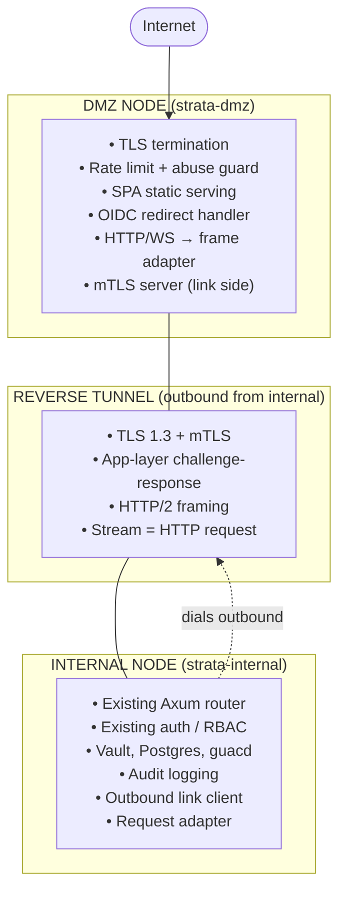

# Strata DMZ — Implementation Plan (v2)

> **Status:** Approved design, scaffold in progress.
> **Supersedes:** `strata-dmz-implementation-plan.md` (v1, single-binary `--mode` flag design).
> **Related ADR:** [`docs/adr/ADR-0009-dmz-deployment-mode.md`](adr/ADR-0009-dmz-deployment-mode.md).

This document is the canonical plan for adding a DMZ deployment mode to
Strata Client. It replaces the single-binary `--mode internal|dmz` design
of v1 with a **Cargo workspace + separate binary** structure, an
**HTTP/2-over-mTLS reverse-tunnel** wire protocol, and **CI-enforceable
zero-secret-overlap** between the two roles.

---

## 1. Goals and non-goals

### Goals

- Allow Strata to be deployed in a split topology where the public-internet
  surface is a **separate, minimal, sandboxable binary** (`strata-dmz`) and
  the full backend (`strata-internal`) stays inside the corporate network.
- The DMZ initiates **no connections to the internal network**; the internal
  node opens a persistent outbound tunnel to the DMZ.
- The DMZ holds **no Strata business secrets**: no JWT signing key, no DB
  credentials, no Vault tokens, no OIDC client secret, no `guac-master-key`,
  no recording-storage credentials.
- **Feature parity is automatic**: every existing Strata feature works
  through the DMZ with no per-feature porting work, because the tunnel
  carries arbitrary HTTP requests rather than custom message types.
- **Zero-impact upgrade** for existing single-node deployments
  (`strata-internal` keeps serving public traffic when no DMZ endpoints
  are configured).

### Non-goals (v1)

- Multi-tenant DMZ shared between unrelated clusters.
- Anycast / GeoDNS-driven multi-region active-active.
- DMZ-side admin UI for Strata business state.
- Buffer-and-replay of arbitrary HTTP request bodies on link drop
  (only WebSocket session resume is in scope).

---

## 2. Architecture



### 2.1 Why HTTP/2-over-mTLS instead of a custom frame protocol

The v1 plan defined custom `CHANNEL_OPEN` / `CHANNEL_DATA` /
`CHANNEL_CLOSE` messages. v2 tunnels **whole HTTP requests** instead:

- Each user request becomes one HTTP/2 stream on the persistent link.
- WebSockets (Guacamole tunnel) are carried as RFC 8441 Extended CONNECT
  streams — the same mechanism browsers use for `WebSocket-over-HTTP/2`.
- Per-stream flow control (`WINDOW_UPDATE`) gives back-pressure for free.
- No custom codec to fuzz; we lean on `h2` and `hyper` which see
  internet-scale traffic.
- The internal node's existing `axum::Router` handles the request
  unmodified — every existing feature works through the DMZ on day one.

### 2.2 Zero-secret-overlap matrix

| Secret | Internal | DMZ |
|---|---|---|
| Strata JWT signing key | ✓ | ✗ |
| Vault root / Transit keys | ✓ | ✗ |
| Database password | ✓ | ✗ |
| OIDC client secret | ✓ | ✗ |
| `guac-master-key` | ✓ | ✗ |
| Recording-storage credentials | ✓ | ✗ |
| Public TLS server key | ✗ | ✓ |
| mTLS server cert (link side) | ✗ | ✓ |
| mTLS client cert (link side) | ✓ | ✗ |
| Link app-layer PSK | ✓ | ✓ (rotated) |
| Edge-header HMAC key | ✓ | ✓ (rotated) |

The OIDC code-for-token exchange happens on **internal** — the DMZ relays
the callback request through the tunnel and never sees the client secret
or the resulting tokens (they're sealed inside the response that goes
back through the tunnel and is set as the Strata session cookie).

### 2.3 Audit and forensic enrichment

Every framed request from DMZ carries trusted-edge headers:

```
x-strata-edge-client-ip:      203.0.113.42
x-strata-edge-tls-version:    1.3
x-strata-edge-tls-cipher:     TLS_AES_128_GCM_SHA256
x-strata-edge-tls-ja3:        769,47-53-5-...
x-strata-edge-user-agent:     <verbatim>
x-strata-edge-request-id:     01J... (ULID)
x-strata-edge-link-id:        <stable id of which DMZ this came from>
x-strata-edge-trusted-mac:    <HMAC-SHA256 of the rest, keyed by edge-HMAC-key>
```

The internal node verifies the MAC; an unsigned (or wrongly-signed) edge
header is stripped before the request reaches the router. Audit middleware
prefers the trusted edge headers over the immediate socket peer when it
sees a valid MAC.

### 2.4 Resilience policy

- **Idle requests (REST)**: idempotent verbs (`GET` / `HEAD` / `OPTIONS`)
  retried once on a fresh stream after a sub-5s reconnect; non-idempotent
  verbs return `502` if the link is down — same shape as nginx-in-front-of
  -axum today.
- **WebSockets (guacd tunnel)**: on link drop the internal node holds the
  guacd connection open for **30 seconds**. If the link reconnects within
  that window, the user's session resumes via an opaque resume token. After
  30s the guacd connection is torn down and the user gets the existing
  "session ended" UX.
- **Heartbeat**: HTTP/2 PING + a 60-second app-layer heartbeat carrying
  channel counts and metrics — the heartbeat is the metrics transport, not
  the liveness check.

### 2.5 HA-from-day-one

`AUTH_HELLO` carries `cluster_id` and `node_id`. The DMZ stores active
links keyed by `(cluster_id, node_id)` and load-balances new requests
across healthy nodes for the same `cluster_id`. The internal node
initiates a link to **every** configured DMZ endpoint
(`STRATA_DMZ_ENDPOINTS=wss://dmz1...,wss://dmz2...`). v1 deploys 1×1 but
the protocol does not preclude N×M.

---

## 3. Build & deployment shape — Cargo workspace, two binaries

The repo becomes a Cargo workspace with three crates:

```
strata-client/
├── Cargo.toml              # workspace root
├── backend/                # ← existing strata-backend crate (migrated to "internal" later)
│   ├── Cargo.toml
│   └── src/...
└── crates/
    ├── strata-protocol/    # tunnel framing, auth handshake, shared types
    │   └── src/lib.rs
    └── strata-dmz/         # public-facing binary
        ├── Cargo.toml
        └── src/main.rs
```

Builds:

```bash
cargo build --release -p strata-backend   # full internal stack
cargo build --release -p strata-dmz       # public-facing binary, no DB/Vault
```

Why workspace + separate binaries instead of single binary with Cargo
features:

1. **Provably minimal dependency closure.** `cargo tree -p strata-dmz`
   structurally cannot show `sqlx`, `vaultrs`, `ldap3`, `kerberos`, or
   guacd-tunnel crates because `strata-dmz/Cargo.toml` does not depend on
   them. No `#[cfg(feature)]` accidents are possible.
2. **CI-enforceable hard constraints** (see `.github/workflows/ci.yml`):
   ```bash
   cargo tree -p strata-dmz | \
     grep -E '^(sqlx|deadpool-postgres|vaultrs|ldap3|kerberos|guac)' \
     && exit 1 || exit 0
   ```
3. **Independent SBOMs.** `osv-scanner` / Trivy / Scorecard each see a
   small dependency graph for the public-facing image. No suppression
   files needed for DB-only CVEs.
4. **Independent Docker images** with different base images (distroless
   for DMZ, Debian slim for internal), different sizes, different signing
   keys if desired.
5. **Visual reviewability.** A reviewer reading `crates/strata-dmz/` sees
   the *entire* public-facing surface in one tree — there is no hidden
   module reachable through some `cfg` permutation.
6. **Standalone mode preserved.** `strata-backend` keeps serving public
   traffic directly when `STRATA_DMZ_ENDPOINTS` is empty — existing
   single-node deployments are unaffected by this change.

---

## 4. Phased work plan

| Phase | Scope | Duration |
|---|---|---|
| **0** | Workspace scaffold; `strata-protocol` skeleton; `strata-dmz` minimal Axum stub; CI dep-verification job; threat-model draft. | 1.5w |
| **1** | Internal: outbound link client, request adapter, edge-header verifier, cert hot-reload, resume-token map, Prometheus metrics. | 2w |
| **2** | DMZ: link server, reverse-proxy adapter, rate limiter, connection caps, body limits, slow-loris timeouts, edge-header signer. | 2w (parallel with Phase 1) |
| **3** | Frontend admin UI: link status, per-endpoint health, force-reconnect. DMZ operator status endpoint with separate operator credential. | 1w |
| **4** | Testing: unit, integration (docker-compose), chaos (toxiproxy), security (port scan, fuzzing, replay, header forgery), load (1k WS, 500 guacd). | 2w |
| **5** | Docs: ADR, threat model (STRIDE), runbook (cert/PSK rotation, link diagnosis, scaling), deployment guide (compose + Helm). | 1w |
| **6** | Hardening: backend mTLS cert hot-reload (W6-1), audit-log edge enrichment (W6-4), per-public-IP body-cap tuning (W6-2), completion ADR. W6-3 (Ed25519 link auth) recorded as Backlog with rationale; W6-5 (WS resume) deferred to Phase 7. See [ADR-0010](adr/ADR-0010-dmz-phase6-hardening.md). | 1w |

Realistic single-developer end-to-end: **9–10 weeks**.
Two-developer (Phase 1 + Phase 2 in parallel): **6–7 weeks**.

---

## 5. CI-enforceable red lines

These are hard fails in `.github/workflows/ci.yml`, not just policy:

1. `cargo tree -p strata-dmz` may not contain any of: `sqlx`, `deadpool-postgres`, `vaultrs`, `ldap3`, `kerberos`, `guac`, any crate matching `^.*(?:vault|kerberos|ldap).*$`.
2. `strings target/release/strata-dmz` may not contain `JWT_SIGNING_KEY`, `OIDC_CLIENT_SECRET`, `VAULT_TOKEN`, `DATABASE_URL`, `guac-master-key`.
3. DMZ Docker image must be distroless (`gcr.io/distroless/cc-debian13` or smaller). No shell, no package manager, no debug tooling. Enforced via `docker history` parse.
4. DMZ deployment Helm/Compose **must** restrict egress to `internal-node:8443` only (deny-all-else); inbound to 443 only. Documented as a CI-checked example.

See `.github/workflows/dmz-deps.yml` (created in Phase 0).

---

## 6. Deployment

The deployment surface for an operator running both nodes:

### 6.1 Docker Compose (reference deployment)

```yaml
# docker-compose.dmz.yml
services:
  strata-dmz:
    image: ghcr.io/bails309/strata-dmz:1.5.0
    ports:
      - "443:8443"
    environment:
      STRATA_DMZ_BIND: "0.0.0.0:8443"
      STRATA_DMZ_PUBLIC_TLS_CERT: /run/secrets/public_tls_cert
      STRATA_DMZ_PUBLIC_TLS_KEY:  /run/secrets/public_tls_key
      STRATA_DMZ_LINK_BIND: "0.0.0.0:8444"
      STRATA_DMZ_LINK_TLS_CERT: /run/secrets/link_tls_cert
      STRATA_DMZ_LINK_TLS_KEY:  /run/secrets/link_tls_key
      STRATA_DMZ_LINK_CA:       /run/secrets/link_ca
      STRATA_DMZ_LINK_ALLOWED_CN: "internal.strata.example.com"
      STRATA_DMZ_LINK_PSK_CURRENT: /run/secrets/link_psk_current
      STRATA_DMZ_LINK_PSK_PREVIOUS: /run/secrets/link_psk_previous
      STRATA_DMZ_EDGE_HMAC_KEY: /run/secrets/edge_hmac_key
      STRATA_DMZ_RATE_LIMIT_RPS: "60"
      STRATA_DMZ_MAX_WS_PER_IP:  "10"
    secrets:
      - public_tls_cert
      - public_tls_key
      - link_tls_cert
      - link_tls_key
      - link_ca
      - link_psk_current
      - link_psk_previous
      - edge_hmac_key
    read_only: true
    cap_drop: ["ALL"]
    security_opt: ["no-new-privileges:true"]
    user: "65532:65532"
    networks: [public]

# (deployed separately, on the internal network)
# docker-compose.internal.yml
services:
  strata-backend:
    image: ghcr.io/bails309/strata-backend:1.5.0
    environment:
      STRATA_DMZ_ENDPOINTS: "wss://dmz1.example.com:8444/link,wss://dmz2.example.com:8444/link"
      STRATA_DMZ_LINK_TLS_CLIENT_CERT: /run/secrets/link_client_cert
      STRATA_DMZ_LINK_TLS_CLIENT_KEY:  /run/secrets/link_client_key
      STRATA_DMZ_LINK_CA:              /run/secrets/link_ca
      STRATA_DMZ_LINK_PSK:             /run/secrets/link_psk
      STRATA_DMZ_EDGE_HMAC_KEY:        /run/secrets/edge_hmac_key
      STRATA_CLUSTER_ID:               "production"
      STRATA_NODE_ID:                  "internal-1"
      # ... existing internal env vars (DATABASE_URL, VAULT_*, etc.)
    secrets:
      - link_client_cert
      - link_client_key
      - link_ca
      - link_psk
      - edge_hmac_key
    networks: [internal]
```

### 6.2 Network policy

| From | To | Port | Reason |
|---|---|---|---|
| Internet | DMZ | 443/tcp | User HTTPS |
| Internal node | DMZ | 8444/tcp (configurable) | Outbound link |
| DMZ | Internal node | — | **MUST be denied** |
| DMZ | IdP (well-known JWKS / authorize endpoint) | 443/tcp | OIDC redirect-only — no token exchange happens here |
| Internal node | IdP (token / userinfo) | 443/tcp | OIDC token exchange |
| Internal node | Vault | 8200/tcp | Existing |
| Internal node | PG | 5432/tcp | Existing |
| Internal node | guacd | 4822/tcp | Existing |

**Hardening rule:** the DMZ host's outbound firewall must permit only
the IdP endpoint, and **must** deny any new connection to the internal
network. The link is **inbound** at the DMZ.

### 6.3 Certificate management

Three certificate chains:

1. **Public TLS** (DMZ ↔ internet) — Let's Encrypt or corporate CA.
   Standard. Renewed via cert-manager / Caddy / certbot.
2. **Link mTLS** (internal ↔ DMZ) — private CA, short-lived
   (24h recommended), rotated automatically. The internal node's existing
   Vault PKI integration can issue these. The DMZ truststore lists the
   private CA cert; the internal client cert is verified per-handshake
   plus an explicit `STRATA_DMZ_LINK_ALLOWED_CN` allow-list.
3. **Edge HMAC key** (32-byte symmetric) — rotated quarterly. Two
   simultaneous keys are accepted on each side; rotation is "push new
   key, restart, deactivate old key 24h later".

### 6.4 PSK rotation

The link app-layer PSK is rotated independently of the mTLS certificates:

```bash
# On the internal node's Vault:
vault kv put secret/strata/dmz-link psk_current=<new> psk_previous=<old>

# On each DMZ host:
echo "$NEW_PSK" > /run/secrets/link_psk_current
echo "$OLD_PSK" > /run/secrets/link_psk_previous
docker compose -f docker-compose.dmz.yml restart strata-dmz

# Verify both hosts converged on the new PSK after 24h, then:
vault kv put secret/strata/dmz-link psk_current=<new>  # remove psk_previous
echo "" > /run/secrets/link_psk_previous
docker compose -f docker-compose.dmz.yml restart strata-dmz
```

### 6.5 Scaling

- **Multiple DMZ nodes**: list each in `STRATA_DMZ_ENDPOINTS` on the
  internal node. The internal node opens an independent link to each.
  User traffic is load-balanced at DNS / anycast / cloud-LB layer
  upstream of the DMZ nodes.
- **Multiple internal nodes**: each opens its own link to each DMZ.
  The DMZ load-balances new requests round-robin (sticky-by-cookie for
  WebSockets) across healthy `(cluster_id, node_id)` pairs.

### 6.6 Observability

Prometheus metrics exposed by both binaries (separate scrape targets):

| Metric | Where | Type |
|---|---|---|
| `strata_dmz_link_state{node_id, state}` | DMZ | gauge |
| `strata_dmz_link_streams_open{node_id}` | DMZ | gauge |
| `strata_dmz_link_bytes_total{node_id, dir}` | DMZ | counter |
| `strata_dmz_rate_limited_total{ip}` | DMZ | counter |
| `strata_dmz_ws_connections{}` | DMZ | gauge |
| `strata_internal_link_state{endpoint, state}` | Internal | gauge |
| `strata_internal_link_reconnects_total{endpoint}` | Internal | counter |
| `strata_internal_link_heartbeat_rtt_ms{endpoint}` | Internal | histogram |
| `strata_internal_active_resumes{}` | Internal | gauge |

A reference Grafana dashboard ships under
`docs/grafana/strata-dmz-dashboard.json` (Phase 5).

---

## 7. Migration to "internal" naming

Today the existing crate is `strata-backend`. After Phase 0 lands and
Phase 1 begins, a separate housekeeping PR renames:

- `backend/`  →  `crates/strata-internal/`
- `strata-backend`  →  `strata-internal` (Cargo crate name, binary name)
- All Dockerfile / CI references updated.

This is a mechanical rename, isolated to one PR, scheduled before
Phase 1 link-client work begins. It is deliberately NOT bundled with
the workspace scaffold to keep the initial scaffold PR additive and
low-risk.

---

## 8. Threat model (summary; full STRIDE in Phase 5)

Adversaries considered:

- **External attacker** at the internet edge: blocked by public TLS,
  rate limits, OIDC. Cannot reach internal services even with a kernel
  RCE on the DMZ host because the DMZ holds no credentials and the
  network policy denies DMZ → internal except on the **inbound** link.
- **DMZ host compromise**: attacker has TLS keys and the link PSK,
  but cannot mint Strata sessions, exchange OIDC codes, or read DB.
  The most they can do is forge edge headers — caught by the
  edge-header HMAC. They can mount a denial-of-service against all
  users by closing the link, but cannot exfiltrate data.
- **Internal node compromise**: same blast radius as today's standalone
  backend. The DMZ does not change this surface.
- **Link MITM**: prevented by mTLS with private CA + CN allow-list +
  app-layer PSK challenge-response.
- **Replay**: AUTH_HELLO uses challenge-response with timestamp skew
  (≤30s) and a 5-minute nonce cache.
- **Edge-header forgery** (a malicious client sending
  `x-strata-edge-client-ip` directly to the internal node): the
  internal node strips any `x-strata-edge-*` headers that don't carry
  a valid HMAC keyed by `STRATA_DMZ_EDGE_HMAC_KEY`. Direct user traffic
  (no DMZ in the loop) cannot have a valid MAC.

---

## 9. Decisions captured

| # | Decision | Rationale |
|---|---|---|
| 1 | Cargo workspace, separate binaries | Provable dep isolation; CI-enforceable |
| 2 | HTTP/2-over-mTLS (h2 crate) | Free flow control, multiplex, WS via Ext-CONNECT; no custom codec to fuzz |
| 3 | OIDC client secret stays internal | DMZ must not be able to impersonate users to IdP |
| 4 | Edge-header HMAC (not just IP allow-list) | Defends audit trail against direct-to-internal forgery |
| 5 | 30s WebSocket resume window | Avoid v1.4.1 watchdog regression UX |
| 6 | N×M from day one in protocol | Retrofitting HA later is expensive |
| 7 | PSK + mTLS, defer Vault-token approach | PSK rotation has a clear runbook today; Vault-token requires renewal flow |
| 8 | Distroless DMZ image | Reduce post-compromise toolchain |

---

## 10. Out of scope (deliberately)

- Cloudflare Tunnel / ngrok / Tailscale Funnel as the transport. They
  work, but each replaces "Strata operator owns the link auth" with
  "trust a third party". Strata is a privileged-access tool; we don't.
- A web-UI tunnel-bring-up flow on the DMZ. Bring-up is operator-driven
  via config files; everything else is observability.
- Per-user network egress restrictions on the internal node. Strata
  doesn't gate that today; out of scope for the DMZ work.
