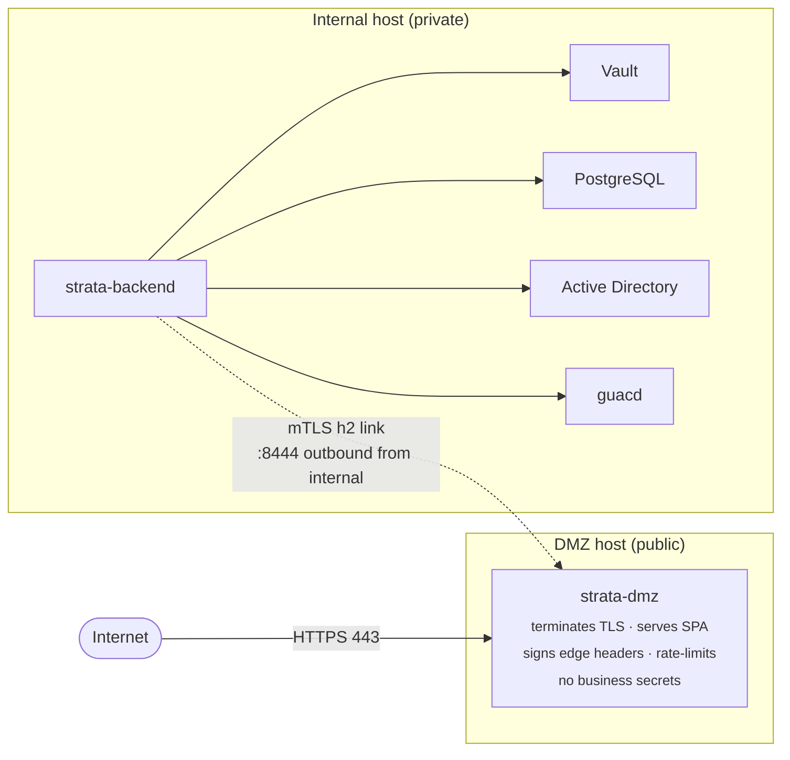

# DMZ Deployment Mode

Strata Client supports an optional **split-host deployment** where a
public-facing **DMZ node** terminates TLS and serves the SPA, while
all business logic, secrets, and database access remain on a private
**internal node** that the public network cannot reach.

This page is the operator's overview. For the full step-by-step
install procedure see the [DMZ section of the deployment guide](deployment.md#dmz-deployment-mode);
for the trust-boundary analysis see the
[DMZ chapter in the security guide](security.md#dmz-deployment-mode-v150);
for the management endpoints see the
[DMZ link management API](api-reference.md#dmz-link-management-v150).

> **Optional.** Single-node deployments are unchanged when
> `STRATA_DMZ_ENDPOINTS` is unset on the internal node. No database
> migrations, no `/api/*` breaking changes, no `config.toml` schema
> changes — DMZ mode is configured exclusively via environment
> variables.

---

## Topology



The polarity is reversed from a normal proxy: **the internal node
dials out** to the DMZ on port 8444 and holds a long-lived
authenticated tunnel open. The DMZ multiplexes inbound HTTP and
WebSocket requests onto that tunnel.

The firewall between the DMZ network and the internal network can
therefore deny **all** inbound traffic to the internal host. The
internal half only ever makes outbound TCP connections to the DMZ
host's link port.

---

## Trust posture

- **No business secrets on the DMZ host.** It holds only a public
  TLS cert (browser-facing) and a per-link PSK used to authenticate
  the internal node when it dials in. It holds **no** Vault tokens,
  **no** DB credentials, **no** AD bind passwords, and **no** user
  JWT signing keys. Compromise of the DMZ host yields the ability to
  drop traffic — not to read or forge it.

- **Edge attribution is signed.** The DMZ stamps a bundle of request
  metadata (`x-strata-edge-*` headers — client IP, TLS
  version/cipher/JA3, user-agent, request ID, link ID, timestamp)
  with HMAC-SHA-256 keyed by the shared `STRATA_DMZ_EDGE_HMAC_KEY`.
  The internal node verifies the HMAC, rejects clock skew > 60 s,
  and **strips any `x-strata-edge-*` headers that arrive without a
  valid MAC** so a compromised DMZ cannot forge a different client
  IP into the audit log.

- **Egress posture.** The DMZ pod has no egress permission to the
  internal network in either the compose overlay or the Helm
  NetworkPolicy. The only outbound it makes is DNS to kube-dns. Even
  a fully RCE'd DMZ node cannot reach the database, Vault, or AD.

- **Zero-secret-overlap, CI-enforced.** The `crates/strata-dmz`
  binary is a deliberately small Axum binary that owns the public
  TLS listener, the link listener, the SPA static path, the
  rate-limit / inflight-cap / slow-loris guards and the edge HMAC
  signer. It does **not** link in any Postgres, Vault, JWT-signing,
  OIDC-client-secret or recording-storage code. A Cargo deny rule
  rejects any DMZ-side dependency on the internal-only secret-handling
  crates.

---

## Wire protocol

`strata-link/1.0` — a length-prefixed JSON handshake (see
`crates/strata-protocol/src/handshake.rs`) followed by **HTTP/2** (h2
0.4) inside the same mTLS connection, ALPN `h2,http/1.1`. Custom
framing is intentionally minimal — every user request is one HTTP/2
stream, WebSockets ride RFC 8441 Extended CONNECT, and per-stream
flow control comes for free.

### WebSocket-over-HTTP/2 (v1.5.2+)

Both ends negotiate the `SETTINGS_ENABLE_CONNECT_PROTOCOL` extension.
The DMZ proxy detects RFC 6455 WebSocket upgrades on the public
listener, captures `hyper::upgrade::on(&mut req)` before the request
is consumed, opens an Extended CONNECT stream
(`:method=CONNECT, :protocol=websocket, :path=<original>`) on a
registered link sender, awaits `:status=200`, then returns
`101 Switching Protocols` to the public client with a correctly
computed `Sec-WebSocket-Accept`.

The internal-side `LoopbackUpgradeHandler` accepts the inbound
Extended CONNECT and bridges it to a regular HTTP/1.1 WebSocket
upgrade against `127.0.0.1:8080` (overridable via
`STRATA_DMZ_LOOPBACK_ADDR`), so the existing
`/api/tunnel/{connection_id}` axum handler runs unchanged. **The
guacd connection always originates from the internal node's IP, not
the DMZ node's IP** — exactly as a single-node deployment behaves.

Individual h2 frames on the DMZ→public direction are capped at 8 MiB
to prevent memory amplification by a misbehaving internal node;
flow-control windows are honoured in both directions so back-pressure
from a slow public client transparently slows the upstream guacd
traffic.

---

## The three shared secrets

The DMZ and internal halves are bound together by three independent
secrets — generate each on a trusted machine, then distribute. The
link PSK and edge HMAC key are decoded as **base64** by both halves;
the operator token is opaque.

```bash
openssl rand -base64 32  # → STRATA_DMZ_OPERATOR_TOKEN     (DMZ only, opaque)
openssl rand -base64 32  # → STRATA_DMZ_LINK_PSKS current  (BOTH halves, base64)
openssl rand -base64 32  # → STRATA_DMZ_EDGE_HMAC_KEY      (BOTH halves, base64)
```

| Secret                          | Purpose                                                                       | Lives on |
| ------------------------------- | ----------------------------------------------------------------------------- | -------- |
| `STRATA_DMZ_OPERATOR_TOKEN`     | Bearer for the management API on `127.0.0.1:9444` (status, link kick)         | DMZ only |
| `STRATA_DMZ_LINK_PSKS`          | `current:BASE64[,previous:BASE64]` — internal proves identity to DMZ          | DMZ      |
| `STRATA_DMZ_LINK_PSK_CURRENT`   | Same base64 as DMZ's `current:` value (one env var per id)                    | Internal |
| `STRATA_DMZ_EDGE_HMAC_KEY`      | DMZ signs `x-strata-edge-*` request-attribution headers                       | DMZ      |
| `STRATA_DMZ_EDGE_HMAC_KEYS`     | Internal verifies them; comma-separated multi-key list during rotation        | Internal |
| `STRATA_DMZ_ENDPOINTS`          | Comma-separated `host:port` list of DMZ peers the internal node should dial   | Internal |
| `STRATA_DMZ_LOOPBACK_ADDR`      | Optional. Defaults to `127.0.0.1:8080`. Override only for non-default routers | Internal |

> Generate each independently — never derive one from another, and
> never store all three in the same file.

---

## Choosing a topology

Strata ships **four** docker-compose overlays that cover every
supported DMZ deployment shape. Pick one before you start; mixing
overlays on the same host is unsupported. See the
[deployment guide](deployment.md#dmz-deployment-mode) for full
walkthroughs.

| Walkthrough | Hosts | Public ports                | What's exposed publicly                              | Best for                                              |
| ----------- | ----- | --------------------------- | ---------------------------------------------------- | ----------------------------------------------------- |
| **A**       | 1     | 8443, 8444 on the same host | Relay only — no SPA                                  | Local eval / smoke-testing the link                   |
| **A.5**     | 2     | 8443, 8444 on DMZ host      | Relay only — clients must already speak Strata's API | SPA on a CDN / mobile app / API-only consumers        |
| **A.6** ⭐  | 2     | 80/443 on DMZ host          | **Full Strata SPA** + API + WS                       | Standard production — most operators want this        |
| **A.7**     | 2     | 80/443 on **both** hosts    | Full SPA on both — corp LAN to internal, public to DMZ | Zero-DMZ-hop latency for staff with public publishing |

> **Picking the right overlay matters.** If you choose A.5 when you
> meant A.6, end-users won't get a UI when they navigate to your
> public hostname; they'll see a JSON `401`. If you choose A when you
> meant A.5/A.6, the backend's database, Vault, and AD sit on the
> public host alongside the relay — the whole point of the split
> topology is lost.

---

## Managing the link at runtime

Two admin endpoints surface link health and let operators kick the
supervisor. They are mounted under `/api/admin/dmz-links` and require
`view_admin_settings` to read / `manage_admin_settings` to write.

| Endpoint                                   | Purpose                                                                                                  |
| ------------------------------------------ | -------------------------------------------------------------------------------------------------------- |
| `GET  /api/admin/dmz-links`                | Snapshot of the supervisor pool. Used by the **Admin → DMZ Links** tab; auto-refreshed every 15 seconds. |
| `POST /api/admin/dmz-links/reconnect`      | Force-close every link and trigger immediate redial — first step in the DMZ incident runbook.            |

A `503 Service Unavailable` response from `GET` means DMZ mode is
configured (`STRATA_DMZ_ENDPOINTS` is set) but the supervisor pool
failed to start; check backend logs for the `dmz_link.bootstrap`
event.

See [api-reference.md → DMZ link management](api-reference.md#dmz-link-management-v150)
for the full request/response schemas.

---

## Authoritative references

| Topic                           | Location                                                          |
| ------------------------------- | ----------------------------------------------------------------- |
| Decision + alternatives         | `docs/adr/ADR-0009-dmz-deployment-mode.md`                        |
| Implementation plan (canonical) | `docs/dmz-implementation-plan.md`                                 |
| Threat model (STRIDE)           | `docs/threat-model.md` §6                                         |
| Operator deployment walkthroughs | [deployment.md](deployment.md#dmz-deployment-mode)               |
| Trust-boundary analysis         | [security.md](security.md#dmz-deployment-mode-v150)               |
| Management API                  | [api-reference.md](api-reference.md#dmz-link-management-v150)     |
| On-call runbook                 | `docs/runbooks/dmz-incident.md`                                   |
| Grafana dashboard               | `grafana/strata-dmz-dashboard.json`                               |
| Compose overlays                | `docker-compose.dmz.yml`, `docker-compose.dmz-only.yml`, `docker-compose.dmz-edge.yml`, `docker-compose.internal.yml` |
| Helm chart                      | `deploy/helm/strata-dmz/`                                         |
| Wire protocol crate             | `crates/strata-protocol/`                                         |
| DMZ binary crate                | `crates/strata-dmz/`                                              |
