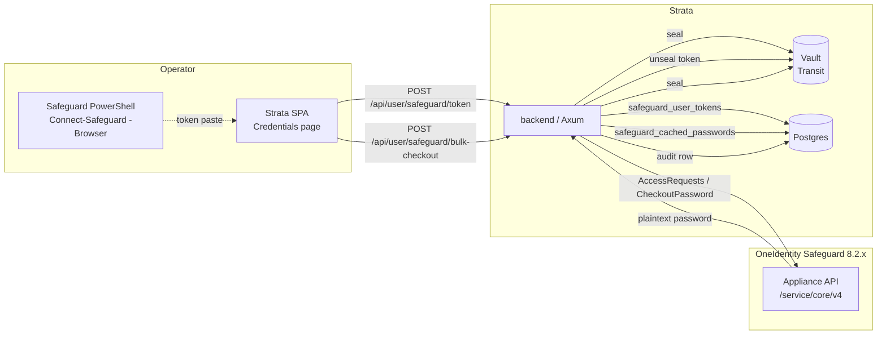
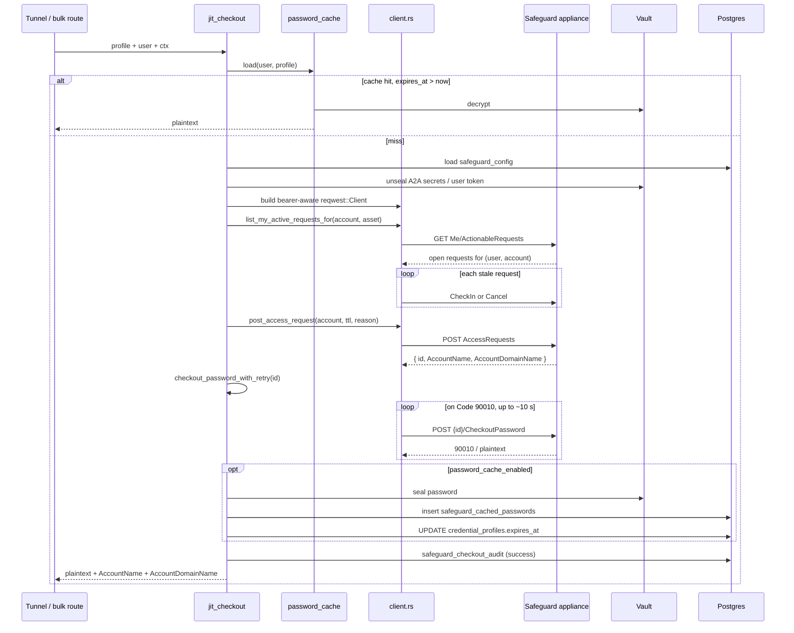

# Safeguard JIT Credential Checkout — Implementation Guide

> Operator / integrator reference for the OneIdentity Safeguard for
> Privileged Passwords integration shipped in **Strata 1.10.0**. For
> the user-facing walkthrough of configuring a Safeguard credential
> profile and performing a bulk checkout, see
> [safeguard-user-guide.md](./safeguard-user-guide.md).
>
> Verified against **Safeguard for Privileged Passwords 8.2.2** with
> both A2A and per-user-browser (RSTS / federation) authentication.

---

## Contents

1. [Why JIT and why now](#why-jit-and-why-now)
2. [High-level architecture](#high-level-architecture)
3. [Database schema (migrations 067 / 068 / 069)](#database-schema-migrations-067--068--069)
4. [Module layout](#module-layout)
5. [Authentication modes](#authentication-modes)
6. [JIT checkout sequence](#jit-checkout-sequence)
7. [Preflight and stale-request release](#preflight-and-stale-request-release)
8. [Code 90010 retry on `CheckoutPassword`](#code-90010-retry-on-checkoutpassword)
9. [Password cache lifecycle](#password-cache-lifecycle)
10. [Audit trail](#audit-trail)
11. [Kill switch](#kill-switch)
12. [Safeguard 8.2.x REST quirks we hardened against](#safeguard-82x-rest-quirks-we-hardened-against)
13. [Operator runbook](#operator-runbook)
14. [Troubleshooting](#troubleshooting)

---

## Why JIT and why now

Strata's pre-1.10 credential model required every privileged-account
password to be stored — Vault-sealed but still stored — inside Strata's
own `credential_profiles` table. That model has three drawbacks for
deployments that already operate Safeguard:

1. **Two sources of truth.** Every rotation in Safeguard had to be
   mirrored into Strata or sessions broke.
2. **No automatic check-in.** A long-lived stored password meant the
   appliance's own automatic rotation policy was effectively suspended
   for any account Strata used.
3. **Reduced audit fidelity.** Safeguard's audit log saw "the Strata
   service account" rather than the human operator performing each
   checkout.

The 1.10.0 integration leaves the password where it belongs — on the
Safeguard appliance — and resolves it just-in-time at the moment of
tunnel open, with an optional Vault-sealed cache to bridge the gap
between Safeguard's relatively short RSTS token lifetime (~15 minutes)
and a real operator shift (often 8–12 hours).

---

## High-level architecture



---

## Database schema (migrations 067 / 068 / 069)

### `067_safeguard.sql`

- `safeguard_config` — singleton row (`PK = 1`, CHECK enforced).
  Every appliance tunable lives here.
- `credential_profiles.kind` — new column constrained to `'local'`
  / `'safeguard'`. Defaults to `'local'` so existing rows upgrade
  without behavioural change.
- `credential_profiles.safeguard_account_id` — Safeguard's
  numeric account id (target of the AccessRequest).
- `credential_profiles.safeguard_asset` — asset display name (used
  for human-readable preflight matching and the UI).
- Partial index `idx_credential_profiles_kind` on `kind` where
  `kind <> 'local'` — keeps the index narrow.
- `safeguard_checkout_audit` — append-only audit table. See
  [Audit trail](#audit-trail).

### `068_safeguard_user_tokens.sql`

- Renames legacy enum value `auth_mode = 'per_user_oidc'` to
  `'per_user_browser'`, back-fills existing rows, and reinstalls the
  CHECK constraint atomically.
- Creates `safeguard_user_tokens (user_id PK FK→users ON DELETE
  CASCADE, ciphertext, encrypted_dek, nonce, expires_at, created_at,
  updated_at)` with an index on `expires_at` for the sweep.

### `069_safeguard_password_cache.sql`

- Adds `safeguard_config.password_cache_enabled BOOLEAN DEFAULT
  FALSE`.
- Creates `safeguard_cached_passwords (user_id, profile_id)`
  composite PK, both FKs `ON DELETE CASCADE` so a deleted user or
  profile evicts the cache row atomically. Index on `expires_at`.

All three migrations are idempotent (`IF NOT EXISTS` / `ON CONFLICT
DO NOTHING`) and apply automatically at backend startup via the
existing `sqlx::migrate!` invocation.

---

## Module layout

```text
backend/src/services/safeguard/
├── mod.rs             # jit_checkout / jit_checkin orchestration,
│                      # checkout_password_with_retry
├── config.rs          # SafeguardConfig load / save / unseal,
│                      # mask-on-read for sealed columns
├── client.rs          # REST client: AccessRequests, CheckoutPassword,
│                      # Me/ActionableRequests deserializer with all
│                      # wire-shape variants Safeguard 7.x/8.x emit
├── user_token.rs      # safeguard_user_tokens seal / store / read,
│                      # expiry-aware accessor
└── password_cache.rs  # safeguard_cached_passwords seal / store /
                       # load (eager DELETE on stale read)

backend/src/routes/
├── admin/safeguard.rs # GET/PUT /api/admin/safeguard/config,
│                      # POST /api/admin/safeguard/test
└── user.rs            # /api/user/safeguard/* endpoints
                       # (enabled, status, token, bulk-checkout,
                       # cached, checkin)

backend/src/services/credential_profiles.rs
                       # new helper: set_expires_at(pool, id, expires_at)

frontend/src/pages/admin/SafeguardTab.tsx
frontend/src/pages/credentials/SafeguardSigninCard.tsx
frontend/src/pages/credentials/SafeguardBulkCheckoutCard.tsx
frontend/src/pages/credentials/RequestCheckoutForm.tsx
frontend/src/pages/credentials/ProfileEditor.tsx   (kind selector)
```

---

## Authentication modes

`safeguard_config.auth_mode` is one of:

### `per_user_browser`

Each user runs the Safeguard PowerShell module from their own
desktop session:

```powershell
Connect-Safeguard `
    -Appliance spp.example.com `
    -Browser `
    -IdentityProvider extf161
```

The browser session is exchanged with the appliance's RSTS endpoint
for a ~15 minute bearer. The token is copied into Strata via the
**Safeguard sign-in** card on the Credentials page; the SPA `POST`s
it to `/api/user/safeguard/token`, where the backend seals it with
Vault and stores it in `safeguard_user_tokens` keyed on `user_id`.
Every subsequent checkout for that user reuses the stored bearer
until its `expires_at` passes.

**Audit attribution.** Every checkout shows the user's IdP identity
in the Safeguard audit log — exactly what compliance teams expect.

### `a2a`

Strata authenticates to the appliance as a single application
identity using:

- `a2a_api_key` — Safeguard A2A API key (sealed).
- `a2a_client_cert_pem` — client identity certificate (sealed).
- `a2a_client_key_pem` — matching private key (sealed).

Every checkout shows "Strata" as the requester in the Safeguard
audit log. Strata's own `safeguard_checkout_audit` still records
the human `user_id`.

### `hybrid` (recommended default)

Prefers the per-user token when present; falls back to A2A when it
isn't. Users who haven't signed in yet still get working checkouts
against shared-automation accounts.

---

## JIT checkout sequence

`safeguard::jit_checkout(profile, user, ctx)` is the single entry
point shared by the tunnel and the bulk-checkout route. Its flow:



The username delivered back to the tunnel is `AccountName` +
`AccountDomainName` (Safeguard's own values), not the numeric
account id — so RDP / SSH receives the correct logon name.

---

## Approval-required workflow (`release_pending`)

Some Safeguard accounts — typically tier-0 / privileged or
break-glass accounts — are bound to policies that require an
**Approver** or **Reviewer** to act on every access request
before the password is released. Strata surfaces this through
the bulk-checkout UI:

1. The operator clicks **Credentials → Bulk Checkout → New**
   for one or more profiles and supplies a justification
   comment.
2. The backend's
   [`bulk_safeguard_checkout`](../backend/src/routes/user.rs)
   route iterates one profile at a time and calls
   [`jit_checkout`](../backend/src/services/safeguard/mod.rs)
   serially (so the appliance never sees an overlapping
   request for the same `(user, account)` pair).
3. For each approval-required profile, the appliance returns
   the request id immediately but answers the subsequent
   `CheckoutPassword` call with `Code 90117` "the access
   request … is awaiting approval and the request cannot be
   used at this time". The orchestrator surfaces this as
   `JitOutcome::PendingApproval { request_id, username,
appliance_state }` and the route returns a `pending` row to
   the SPA carrying the `request_id` (so the UI can poll for
   release without re-creating the request).
4. The SPA polls
   `POST /api/user/safeguard/release { profile_id }` on a
   30-second cadence while the row stays in the pending state.
   The handler is
   [`release_safeguard_pending`](../backend/src/routes/user.rs)
   and it calls
   [`services::safeguard::release_pending`](../backend/src/services/safeguard/mod.rs)
   with the previously-returned request id.
5. `release_pending` retries `CheckoutPassword` against the
   existing request. Three terminal outcomes:

   | Appliance response                         | Mapping                                                                                            |
   | ------------------------------------------ | -------------------------------------------------------------------------------------------------- |
   | `200 OK` with the plaintext password       | `JitOutcome::Released(CheckoutResult { request_id, password, username })`                          |
   | `400 Bad Request` Code `90117` (still queued) | `JitOutcome::PendingApproval { request_id, username: None, appliance_state }`                   |
   | Any other non-2xx (denied, cancelled, etc.) | `Err(AppError::*)` and a `failed` row in `safeguard_checkout_audit`                                |

### AccountName refetch on `Released` (v1.12.3)

`POST /AccessRequests/{id}/CheckoutPassword` returns **only** a
JSON-encoded plaintext string — no `AccountName`, no
`AccountDomainName`, no enrichment. The auto-released path
(`jit_checkout → Released` in one tick) captures `AccountName`
from the **creation** response, so its
`CheckoutResult.username` is always populated.

The post-approval `release_pending` path does **not** have a
creation response to draw on — only the existing `request_id`.
Until v1.12.3, this manifested as `username: None` in
`CheckoutResult`, which `release_safeguard_pending` then
faithfully forwarded into `password_cache::store(...)`,
persisting the cache row with `safeguard_cached_passwords.username
IS NULL`. The credential-profile table has no fallback
`username` column for `kind = 'safeguard'` rows (the username
is sourced from Safeguard's `AccountName` because Safeguard can
rotate it under policy at any time). When the tunnel later
opened against the protected target,
[`routes/tunnel.rs`](../backend/src/routes/tunnel.rs) sent an
empty NLA username with the (correct) password and the target
rejected the handshake as "Authentication failure (invalid
credentials?)".

The v1.12.3 fix refetches the request status from the
appliance after a successful release and threads the recovered
`AccountName` into `CheckoutResult.username`:

```rust
// services/safeguard/mod.rs::release_pending — Released arm
client::CheckoutOutcome::Released(password) => {
    insert_audit(...).await;
    let username = match client::get_access_request_status(
        &http, &base, &bearer, request_id,
    ).await {
        Ok(Some(status)) => status.account_name,
        Ok(None)         => None,   // 404 — request purged
        Err(_)           => None,   // logged at warn, non-fatal
    };
    Ok(JitOutcome::Released(CheckoutResult {
        request_id: request_id.to_string(),
        password,
        username,
    }))
}
```

`get_access_request_status` is the v1.12.3 rename of
`get_access_request_state` and now returns a small struct:

```rust
pub struct AccessRequestStatus {
    pub state:        Option<String>,
    pub account_name: Option<String>,
}
```

The `state` field is read by the existing
`password_cache::check_request_validity(...)` validator (which
also picked up the rename); the `account_name` field is the
new datum the post-approval path needs. The 404 case
(`Ok(None)`) maps to `CacheValidity::Inactive` explicitly so
the cache row gets evicted when the appliance has purged the
request — same effective behaviour as v1.12.2 (where `None`
also returned `Inactive` because it failed to match
`Some("PasswordCheckedOut")`), but the intent is now stated
in code rather than relying on the absence of a match.

Refetch failure is non-fatal because the password itself is
already in hand and the audit `success` row has already been
written. A transient appliance hiccup during the refetch is
logged at `warn` and the username falls back to `None` for
this one release cycle — which reproduces the pre-fix
behaviour for the duration of that single cache row. Operators
who want to evict a cache row that landed with
`username = NULL` can click **Check in all** in the
bulk-checkout card or call
`POST /api/user/safeguard/checkin { "profile_ids": [] }`; a
subsequent approve-and-release cycle will write a complete
row.

The audit trail is unaffected by refetch outcome: the
`safeguard_checkout_audit` row records `success` against the
`CheckoutPassword` call, not against the `GET /AccessRequests/{id}`
refetch.

---

## Preflight and stale-request release

Safeguard rejects a second simultaneous request for the same account
by the same user with **Code 90001**, returning the **existing**
request id and password — which then fails RDP auth because the
appliance rotates the password every time it accepts a fresh
request. The `list_my_active_requests_for(account_id, asset)` helper
in
[`backend/src/services/safeguard/client.rs`](../backend/src/services/safeguard/client.rs)
enumerates the caller's open requests under every wire shape we've
seen the `Me/ActionableRequests` endpoint emit:

- **Safeguard 8.x singular keys** — `Requester`, `Approver`,
  `Reviewer`, `Admin`.
- **Pre-8.x plural keys** — `PersonalRequests`, `RequestorRequests`,
  `ApproverRequests`, `ReviewerRequests`.
- **Raw `Vec<Row>` fallback** — some 7.x appliances return the
  array verbatim.

The release verb dispatches based on each row's reported workflow
state:

| Reported state                            | Verb used  | Fallback on Code 90114 |
| ----------------------------------------- | ---------- | ---------------------- |
| `RequestAvailable`, `PendingApproval`     | `Cancel`   | try `CheckIn`          |
| `PasswordCheckedOut`, `RequestCheckedOut` | `CheckIn`  | try `Cancel`           |
| Anything else / unknown                   | `Cancel` then `CheckIn` until one accepts |

The release body is the JSON-encoded string literal `"strata
preflight"` with `Content-Type: application/json` and a non-zero
`Content-Length`. The appliance rejects:

- `Content-Length: 0` with `411 Length Required`.
- The empty object `{}` with `415 Unsupported Media Type`.
- A bare unquoted string with Code `70000`.

All three are now caught at the integration boundary rather than
surfacing to the user.

---

## Code 90010 retry on `CheckoutPassword`

Cancelling a stale `RequestAvailable` triggers an immediate password
rotation on the Safeguard side. The very next `CheckoutPassword`
against the freshly-created replacement request returns **Code 90010**
("You cannot access this account while another request is pending
password reset") for a few seconds until the rotation finishes.

`checkout_password_with_retry` in
[`backend/src/services/safeguard/mod.rs`](../backend/src/services/safeguard/mod.rs)
wraps the bare client call with an exponential-ish backoff loop:

```text
delays_ms = [0, 500, 1000, 2000, 3000, 4000]   // ~10 s total worst case
```

The loop retries **only** when the error body contains the
`"Code":90010` (or bare `90010`) marker. Any other error
(authentication, validation, account-not-found, kill-switch) is
surfaced immediately and recorded as `failed` in
`safeguard_checkout_audit`. Each retry logs:

```text
checkout_password: 90010 on attempt N for request {rid}, retrying
```

and the eventual success logs:

```text
checkout_password: succeeded on retry N for request {rid}
```

---

## Password cache lifecycle

`safeguard_cached_passwords (user_id, profile_id)` is a composite-PK
table written every time JIT checkout succeeds **and** the
administrator has flipped `safeguard_config.password_cache_enabled =
true`. The row's `expires_at` is set from the profile's own
`ttl_hours` slider — not a global setting — so a long shift is
honoured for the duration each profile allows.

- **Eager purge on read.** `password_cache::load(...)` deletes any
  row whose `expires_at` has passed before returning a hit, so a
  stale entry can never silently succeed.
- **Auto-checkin suppression.** While caching is active for a
  profile, the AccessRequest stays open on the appliance until the
  user explicitly checks back in (or until Safeguard's own policy
  expires it). This gives the cache an actual lifetime to honour.
- **Cascade eviction.** Both foreign keys are `ON DELETE CASCADE`
  — a soft- or hard-deleted user, or a deleted profile, atomically
  evicts the row.
- **Profile expiry sync.** Every cache insert calls
  `credential_profiles::set_expires_at` to slam
  `credential_profiles.expires_at` forward to match the cache row.
  Every cache delete (via the check-in route) slams it back to
  `now()` so the Profiles list immediately renders the credential
  as expired.

---

## Audit trail

`safeguard_checkout_audit` is append-only and mirrors the
`share_participant_audit` table shape so existing forensic tooling
can be reused. State machine:

```text
pending ──▶ success ──▶ checked_in
   │            │
   └─▶ failed   └─▶ expired
```

Columns:

| Column           | Purpose                                                                 |
| ---------------- | ----------------------------------------------------------------------- |
| `id`             | UUIDv4 primary key.                                                     |
| `user_id`        | The human performing the checkout. **Always set**, regardless of auth mode. |
| `profile_id`     | The credential profile that triggered the checkout.                     |
| `sg_account_id`  | Safeguard account id (denormalised from the profile for forensic search). |
| `sg_asset`       | Safeguard asset display name.                                            |
| `sg_request_id`  | Safeguard's own request id returned by AccessRequests POST.              |
| `session_id`     | Strata session id, when called from the tunnel path. `NULL` for bulk checkout. |
| `opened_at`      | When the row entered `pending`.                                          |
| `closed_at`      | When the row left `success` for `checked_in` / `expired`.                |
| `outcome`        | `pending` / `success` / `failed` / `checked_in` / `expired`.             |
| `error_message`  | The full Safeguard error body, when `outcome = failed`.                  |

Rows are never updated to rewrite history — the state machine is
implemented as additive updates within a row's lifetime, not as a
multi-row event log.

---

## Kill switch

`safeguard_config.enabled = FALSE` (the upgrade default):

- Hides the **Kind** selector's Safeguard option in `ProfileEditor`.
- Hides the **Safeguard sign-in** and **Bulk Checkout** cards on
  the Credentials page.
- Returns `{ "enabled": false }` from `GET
  /api/user/safeguard/enabled`, so the Safeguard tab itself is
  hidden client-side.
- Routes existing safeguard-backed profiles through the same
  "expired managed credential" rejection used elsewhere — so a
  half-disabled state never forces a session to recover at an
  awkward moment.

The check happens on every request at the route layer. There is no
cached "enabled" flag that could lag the toggle.

---

## Safeguard 8.2.x REST quirks we hardened against

| Symptom                                                                                              | Quirk                                                                                          | Mitigation                                                                                                                       |
| ---------------------------------------------------------------------------------------------------- | ---------------------------------------------------------------------------------------------- | -------------------------------------------------------------------------------------------------------------------------------- |
| `Me/ActionableRequests` deserialisation fails with "missing field `PersonalRequests`"                | 8.x renamed the wrapper bucket keys from `PersonalRequests` / `RequestorRequests` / `ApproverRequests` / `ReviewerRequests` to singular **`Requester` / `Approver` / `Reviewer` / `Admin`** | Custom serde deserializer accepts all three shapes (legacy plural, 8.x singular, raw `Vec<Row>` fallback) without losing any rows |
| `Cancel` / `CheckIn` returns `411 Length Required`                                                   | Appliance rejects `Content-Length: 0` even though the endpoint takes no body                   | Send the JSON-encoded string literal `"strata preflight"` with `Content-Type: application/json`                                  |
| `Cancel` / `CheckIn` returns `415 Unsupported Media Type`                                            | Appliance rejects an empty object `{}` body                                                    | Same — use the JSON-encoded string body                                                                                          |
| `Cancel` / `CheckIn` returns Code `70000`                                                            | Appliance rejects a bare unquoted string                                                       | Same — the body must be a valid JSON string (with quotes)                                                                        |
| `Cancel` returns Code `90114` "Cannot Cancel in current state"                                       | Workflow state is past Cancel (e.g. password already CheckedOut)                               | Fall back to `CheckIn` automatically                                                                                             |
| `CheckIn` returns Code `90114` "Cannot CheckIn before CheckOut"                                      | Workflow state is pre-CheckOut (e.g. RequestAvailable)                                         | Fall back to `Cancel` automatically                                                                                              |
| Second AccessRequests POST for the same `(user, account)` returns Code `90001`                       | Appliance rejects overlap and silently returns the **existing** request id + password          | Preflight loop releases the stale request before posting a new one — never reuse a returned id we didn't just create             |
| `CheckoutPassword` returns Code `90010` "pending password reset" immediately after a stale Cancel    | Cancel triggers password rotation; next CheckoutPassword races the rotation                    | `checkout_password_with_retry` exponential backoff for ~10 s on the 90010 marker only                                            |

---

## Operator runbook

### Initial setup

1. **Apply migrations.** Migrations 067 / 068 / 069 apply
   automatically at backend startup. Confirm with `psql -c "\d
   safeguard_config"` after the next container restart.
2. **Open admin tab.** Navigate to **Admin → Secrets & Security →
   Safeguard JIT**.
3. **Fill the appliance section.** FQDN, port (default 443),
   `verify_tls` (default `true`), optional pinned CA PEM, IdP alias.
4. **Choose an auth mode.**
   - For an audit-first deployment, pick `per_user_browser`.
   - For shared-automation accounts, pick `a2a` and paste the
     client cert / key / API key.
   - The recommended default is `hybrid`.
5. **(Optional) Enable password caching.** Off by default.
6. **Save.** The PUT seals any plaintext A2A secrets and stamps the
   config.
7. **Test.** Click **Test connectivity** — the live probe runs TCP →
   TLS → `GET /Me` against the form values without persisting them.
   Resolve any failure here before flipping `enabled = true`.
8. **Flip `enabled = true`.** The Safeguard option in the credential
   profile **Kind** selector lights up across the UI.

### Promoting a deployment from local to JIT

1. Have each operator who needs JIT run `Connect-Safeguard -Browser`
   once and paste their token into the **Safeguard sign-in** card.
2. Create a new credential profile of kind `safeguard` for each
   privileged account; fill in the Safeguard `AccountID` and asset
   name; pick a TTL appropriate to the account's rotation policy.
3. Re-bind any existing connection that used the local profile to
   the new safeguard profile. (Tunnel-open behaviour is otherwise
   identical from the user's point of view.)

### Disabling the integration safely

Set `safeguard_config.enabled = false` from the admin tab. In-flight
tunnels are not interrupted; new tunnel opens for safeguard-backed
profiles return the standard "expired managed credential" rejection
until either the profile is re-bound to a local credential or the
toggle is flipped back on.

---

## Troubleshooting

### "Code 90001 — duplicate access request"

The preflight loop didn't catch a stale request — usually because
the appliance reports the workflow state under a key the
deserializer didn't recognise. Capture a verbatim
`GET /service/core/v4/Me/ActionableRequests` response with
`safeguard.client` log level set to `debug` and file an issue with
the JSON body redacted of identifying fields.

### "Code 90010 — pending password reset" after the retry loop

The rotation took longer than ~10 s. Re-run the checkout — the
second attempt will land after the rotation finishes. If this
recurs systematically, your appliance's rotation worker is
overloaded; check Safeguard's own job queue health.

### "Code 90114" on every checkout

The workflow policy for the target account doesn't allow the
current user's role to CheckOut. Check **Safeguard → Access
Policies** for the asset.

### "Code 70000" on Cancel / CheckIn

You're on a Safeguard version that pre-dates the JSON-encoded
string body convention. File an issue — the integration was
hardened against 8.2.2 and may need an adapter for 7.x.

### "TLS handshake failed" from the admin connectivity probe

Either the appliance certificate isn't trusted by the system roots
**and** `verify_tls = true` **and** no `ca_cert_pem` is configured,
or the configured CA PEM doesn't match the chain. Disable
`verify_tls` temporarily to confirm reachability, then paste the
appliance's CA chain into `ca_cert_pem` and re-enable.

### Bulk checkout succeeds in Strata but the password fails RDP auth

You hit the 90001 race — the appliance returned the existing request
id and password but rotated immediately afterwards. The preflight
should have prevented this; see "Code 90001" above. As an immediate
workaround, click **Check in all** in the bulk-checkout card and
retry — the next post will see a clean state.

### "Token expired" 30 seconds after sign-in

The RSTS token from `Connect-Safeguard -Browser` has a TTL governed
by the appliance's RSTS policy (commonly ~15 minutes). For
long-shift operators, enable `password_cache_enabled` so the cache
survives the token expiring — the checkout itself only needs the
token at the moment it runs.
