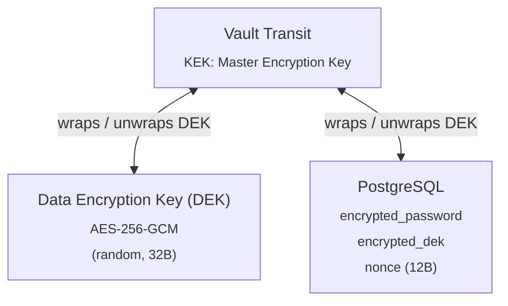

# Security

This document describes the security model, encryption architecture, and authentication flows in Strata Client.

---

## Authentication

### OIDC / OpenID Connect (Multi-SSO support since v1.9.0)

Strata Client supports configuring **multiple standard OpenID Connect (OIDC) identity providers (IdPs)** simultaneously. The active providers are rendered dynamically as custom-labeled, branded buttons on the login screen. Client secrets for all providers are encrypted at rest with HashiCorp Vault's Transit Secrets Engine under the dedicated transit key path `transit/encrypt/strata-sso` before being written to the PostgreSQL database.

An in-memory cache/state tracking system is introduced to hold discovery clients and handle connection tests safely.

**Flow:**

1. Frontend queries `/api/auth/sso/providers` to fetch the active list of providers and renders custom sign-in buttons.
2. When the user clicks a button, a request is sent to `/api/auth/sso/login?provider=<id>` which generates a unique authorization URL for that specific provider.
3. The user is redirected to the target IdP's authorization endpoint.
4. User authenticates with the IdP (e.g., Keycloak, Entra ID).
5. IdP redirects back to the backend callback (`GET /api/auth/sso/callback`) with an authorization code and a state UUID.
6. The backend retrieves the matching provider UUID from its state cache, decrypts the provider's `client_secret` via Vault, and exchanges the authorization code for an ID/access token.
7. Backend validates the token:
   - Fetches the IdP's `/.well-known/openid-configuration`
   - Downloads the JWKS (JSON Web Key Set)
   - Verifies the token signature (RS256) using the matching `kid`
   - Validates `iss` (issuer), `aud` (audience/client_id), and `exp` (expiry)
   - Extracts the `sub` (subject) claim to resolve or provision the local user profile.

### Local Authentication

For environments without an OIDC provider, Strata Client supports built-in username/password authentication. Passwords are hashed using Argon2id before storage. Local authentication can be globally disabled via the Admin Settings; when disabled, the backend strictly rejects all local login attempts with a 401.

**Password Policy:**

- Minimum 12 characters enforced on user creation and password change
- Maximum 1024 characters to prevent abuse
- Argon2id hashing with cryptographically random salts
- Users can change their own password via `PUT /api/auth/password` (requires current password verification)
- Admins can force-reset any user's password via `POST /api/admin/users/:id/reset-password`

### Session Management

Authentication uses a **dual-token architecture** aligned with OWASP session timeout recommendations:

| Token         | TTL          | Storage                                        | Purpose                     |
| ------------- | ------------ | ---------------------------------------------- | --------------------------- |
| Access token  | 20 minutes   | `HttpOnly`, `Secure`, `SameSite=Strict` cookie | API authentication          |
| Refresh token | 8 hours      | `HttpOnly`, `Secure`, `SameSite=Strict` cookie | Silent access token renewal |
| `csrf_token`  | Access + 60s | `Secure`, `SameSite=Strict` cookie             | CSRF for refresh & logout   |
| `session_exp` | Access + 60s | `Secure`, `SameSite=Strict` cookie             | Expiry display for SPA      |

**Persistent JWT Signing (v1.8.3)**: Both the access and refresh tokens are signed using a persistent `JWT_SECRET` configured in the `.env` file. This ensures that user sessions remain valid across backend container restarts, providing a seamless experience during maintenance windows. If `JWT_SECRET` is not provided, the backend generates a random one on every startup, which invalidates all existing sessions (legacy behavior).

The 60-second buffer on `csrf_token` and `session_expires` (implemented in v1.8.2) ensures the SPA can access these values to perform a refresh even at the exact deadline of the access token, preventing "locked out" states where the CSRF token would otherwise expire before the final refresh request could be sent.

**Flow:**

1. On login, the backend issues an **access token**, a **refresh token**, a **CSRF token**, and a **session expiry** timestamp, all as cookies.
2. The access and refresh tokens use the `HttpOnly` attribute, meaning they cannot be read or modified by client-side JavaScript, significantly mitigating the risk of token theft via XSS.
3. The frontend uses the browser's native `credentials: "include"` fetch behavior to send these cookies automatically on every `/api/*` request.
4. When the access token expires (401 response), the frontend silently calls `POST /api/auth/refresh` (which sends the refresh cookie).
5. If refresh succeeds, a new access token cookie is issued and the original request is retried transparently.
6. If refresh fails (cookie expired or revoked), the user is redirected to the login page.
7. A **session timeout warning** toast appears 2 minutes before access token expiry, offering an "Extend Session" button.

**Token claims:** Both tokens include a `token_type` claim (`"access"` or `"refresh"`). The auth middleware rejects refresh tokens used as access tokens. A `default_token_type()` provides backward compatibility for pre-existing tokens during upgrade.

**Refresh token isolation:** The refresh cookie is scoped to `Path=/api/auth/refresh` and uses `SameSite=Strict`, preventing it from being sent to any other endpoint or in cross-site requests.

**Per-user session tracking:** Each login records an entry in the `active_sessions` table with the token's JTI (UUID), user ID, IP address, user agent, and expiry time. This provides visibility into how many active sessions a user has.

#### Refresh-token semantics (clarified v1.6.1)

The 8-hour refresh token is **not** rotated on `POST /api/auth/refresh` — the same cookie remains valid until its `exp`, and only the access token is reissued. The 8-hour value is therefore a hard ceiling on continuous session length, not a sliding window: at the 8-hour mark even the most active user is forced through a fresh login. This is intentional, aligns with the [ADR-0005](adr/ADR-0005-jwt-refresh-token-sessions.md) decision, and combined with the activity-driven access-token refresh below produces a session-timeout matrix that is straightforward to reason about for compliance reviews.

| Scenario                                                                | Behaviour                                                                                                                                                                                                     |
| ----------------------------------------------------------------------- | ------------------------------------------------------------------------------------------------------------------------------------------------------------------------------------------------------------- |
| User actively using the SPA or a session                                | Access token silently refreshes when it has < 10 min remaining and an activity event arrives, for up to **8 hours total** since login. At 8 h the refresh fails and the user is redirected to the login page. |
| User idle (no DOM events, no Guacamole input)                           | Access token expires **20 min** after the most recent refresh. Warning toast appears at the 2-min mark with an explicit extend button.                                                                        |
| Refresh token revoked server-side (e.g. admin signout, password change) | Next `POST /api/auth/refresh` returns 401; the WebSocket-tunnel auth watchdog (≤ 30 s tick) tears the active session down on the backend.                                                                     |

#### Session-activity bus inside remote sessions (v1.6.1)

The proactive refresh in `SessionTimeoutWarning` listens for
`mousedown` / `keydown` / `touchstart` / `scroll` on `window`. Inside an active Guacamole session, however, the vendored `guacamole-common-js` library installs `Keyboard(document)` and `Mouse(displayEl)` handlers that call `event.preventDefault()` and `event.stopPropagation()` on every input event before it can bubble to `window`. Before v1.6.1 a user actively typing or clicking inside an RDP / SSH session produced **zero** events that the timeout warning could observe, so the access token expired at the 20-minute mark and the next API call returned 401 — even though the user had been demonstrably active.

v1.6.1 introduces a `sessionActivity` event bus
(`frontend/src/components/sessionActivity.ts`). The Guacamole input
callbacks in `SessionManager.tsx`, `SessionClient.tsx`,
`usePopOut.ts` and `useMultiMonitor.ts` call
`notifySessionActivity()`, which dispatches a 1-Hz-throttled
`strata-session-activity` window event;
`SessionTimeoutWarning` subscribes to it alongside the existing DOM
events. The result is a single in-process invariant —
**as long as the user is interacting with any window of any session, they cannot be silently signed out** — and the 8-hour refresh-token ceiling is the only hard cap on session length. See [docs/architecture.md § Session-activity bus and proactive token refresh (v1.6.1)](architecture.md#session-activity-bus-and-proactive-token-refresh-v161) for the full call-site table and design rationale.

#### Global Cache-Control Headers (v1.8.2)

Since v1.8.2, a global middleware policy in `backend/src/routes/mod.rs` applies consistent security headers to every API response:

- **`Cache-Control: no-store, no-cache, must-revalidate, proxy-revalidate`** — Prevents sensitive JSON payloads, user metadata, or tunnel secrets from being cached by the browser's disk/memory cache or intermediary forward/reverse proxies.

#### Nginx NJS Header Masking (v1.8.3)

To prevent technology fingerprinting, the Nginx gateway is configured with **Nginx JavaScript (njs)** to intercept and modify response headers globally:

- **`Server`** header is masked to "Strata".
- **`X-Powered-By`** header is removed entirely.
- **`Content-Security-Policy: frame-ancestors 'none'`** is enforced globally to prevent clickjacking.

This NJS-based approach ensures that even error pages generated internally by Nginx (which normally bypass the backend's header logic) adhere to the project's security standards.

#### SSO callback hardening (v1.6.1; revised v1.8.2, v1.9.0)

The OIDC callback handler is hardened against replay attacks, provider mismatch vulnerabilities, and Chromium's BFCache:

- **State and Provider Tracking (v1.9.0)**: The `state` parameter is a cryptographically strong UUIDv4. To support multiple OIDC providers concurrently, the backend stores a mapping of the generated `state` UUID to the target provider's UUID in an in-memory TTL-expiring cache (`sso_state_cache`) during initiation. Upon callback, the backend validates and consumes this `state` parameter exactly once. This securely maps the authentication callback back to the correct provider configuration for token exchange and validation, eliminating mismatch vulnerability vectors.
- **Global Cache-Control**: Prior to v1.8.2, `no-store` was applied specifically to SSO redirects. It is now part of the global middleware policy, ensuring the OIDC `code` and `state` transition never enters the browser's navigation history cache.
- **Diagnostic timing trace.** Every successful SSO callback emits an info-level tracing line on the `strata::auth::sso` target with `discovery_ms`, `token_exchange_ms`, `token_validate_ms`, and `total_so_far_ms`.

### WebSocket-tunnel auth watchdog (v1.3.2; revised v1.4.1)

A WebSocket tunnel that has already passed the upgrade-time `require_auth` check is, in HTTP terms, a single very long-lived request. Without further checks, an access token that is _revoked_ during that request stays in force for the lifetime of the tunnel — typically until the operator's tab closes. On hosts where browser tabs were terminated without a graceful close (OS task-killer, kernel OOM, network drop, force-quit), the tunnel could continue proxying frames into a recording for hours.

`backend/src/routes/tunnel.rs` `ws_tunnel` mitigates this with an in-band auth watchdog:

1. The access token used to authenticate the upgrade is captured (Bearer header → `access_token` cookie → query string, matching `require_auth`'s priority order) and stored as `watchdog_token`.
2. The upgrade-time wall-clock instant is captured as `upgraded_at`.
3. A 30-second `tokio::time::interval` tick loop runs alongside `tunnel::proxy(...)`. On every tick the watchdog:
   - calls `services::token_revocation::is_revoked(token)` (O(1) lookup against an in-memory `RwLock<HashSet>`) — if revoked, abort with `reason = "revoked"`,
   - compares `Instant::now() - upgraded_at` to `MAX_TUNNEL_DURATION = 8h` — if exceeded, abort with `reason = "max_duration"`.
4. Either condition logs at `INFO` and aborts the proxy loop, so the recording stream flushes, the `session_registry` row decrements, and the live-sessions admin page accurately reflects the live set.

The 30 s cadence detects revocation in ≤ 30 s even on an aggressive 1-minute access-token TTL while costing at most 40 ticks per session on a normal 20-minute TTL — negligible next to the WebSocket I/O. Polling is a deliberate choice over a notification channel because both checks are cheap, in-process operations; per-tunnel subscribers would add complexity for no measurable benefit.

#### v1.4.1: removal of `exp`-claim enforcement

The original v1.3.2 watchdog also decoded the access token's `exp` claim once at upgrade time and reaped the tunnel when wall-clock `Utc::now()` reached that timestamp. This **looked** correct but was wrong in practice: access tokens carry a 20-minute TTL, and the frontend's `SessionTimeoutWarning` proactively rotates them via `POST /api/auth/refresh` after roughly ten minutes of UI activity. The already-open WebSocket has no mechanism to learn about that rotation, so the watchdog held on to the _original_ token's `exp` and reaped the session at T+20m even when the user was actively driving the UI. From the operator's point of view this was _"my session keeps disconnecting every 20 minutes"_; from the audit log it surfaced as `tunnel.terminated reason: "expired"`.

The fix in v1.4.1 removes the `exp` decode and the `watchdog_exp: Option<u64>` cache entirely. The 8-hour `MAX_TUNNEL_DURATION` hard cap is the new long-tail backstop and is _deliberately measured against `upgraded_at`_ (an `Instant`, not a token claim), so token rotation cannot move the deadline. The `tunnel.terminated` audit `reason` enum gained `"max_duration"` and lost `"expired"`; consumers that filtered on `expired` should also accept `max_duration` — they refer to the same defence-in-depth backstop, just measured differently.

| Teardown trigger                   | Mechanism                                                               | Audit `reason`            | Latency        |
| ---------------------------------- | ----------------------------------------------------------------------- | ------------------------- | -------------- |
| Manual logout / 20-min idle logout | Frontend calls `/api/auth/logout` → both tokens revoked → watchdog tick | `revoked`                 | ≤ 30 s         |
| Browser closed / network died      | TCP-level WebSocket close → `tunnel::proxy(...)` returns                | (TCP close, not watchdog) | immediate      |
| Long-lived idle session            | Watchdog tick observes `Instant::now() - upgraded_at >= 8h`             | `max_duration`            | ≤ 30 s past 8h |

### Logout closes tunnels immediately (v1.3.2)

Manual logout (and idle-timeout logout) used to flip React auth state without first closing any open Guacamole tunnels, so the backend kept proxying frames into a logged-out user's recording until the browser tab closed itself. As a defence-in-depth complement to the auth watchdog above, `App.tsx`'s `handleLogout` now calls a module-level `closeAllSessionsExternal()` helper (exported from `frontend/src/components/SessionManager.tsx`) **before** clearing user state. The helper iterates every active session and runs the same teardown the per-session disconnect button uses (`cleanupPopout`, `cleanupMultiMonitor`, `_cleanupPaste`, keyboard reset, `client.disconnect()`), each step wrapped in a best-effort `try / catch` so a single failure cannot block the rest of the logout. `handleLogout` then issues a fire-and-forget `apiLogout()` to invalidate the refresh token and clear the auth cookies. The result: backend sees clean WebSocket closes the moment the user clicks **Log out** (or hits the idle deadline), rather than after the next 30 s watchdog tick.

### Authentication Method Enforcement

Administrators can toggle `local_auth_enabled` and `sso_enabled` independently.

- **Local Auth Disabled**: The `/api/auth/login` endpoint returns `401 Unauthorized` immediately.
- **SSO Disabled**: The `/api/auth/sso/login` and `/api/auth/sso/callback` endpoints are deactivated.
- **Safety Guard**: The system prevents disabling both methods simultaneously to ensure administrative access is maintained.

### User Resolution

After token validation, the backend looks up the user in the local database by OIDC `sub` claim. The user's role is resolved via the `users.role_id → roles` foreign key. If no matching user exists, the request is rejected with a 401.

### Route Protection

| Route Group                                                                            | Middleware                                                                                                              |
| -------------------------------------------------------------------------------------- | ----------------------------------------------------------------------------------------------------------------------- |
| `/api/health`, `/api/status`, `/api/setup/*`                                           | None (public)                                                                                                           |
| `/api/auth/login`, `/api/auth/sso/*`                                                   | None (public, rate-limited)                                                                                             |
| `/api/auth/refresh`                                                                    | None (public, validates `HttpOnly` refresh cookie)                                                                      |
| `/api/shared/tunnel/:token`                                                            | None (public, share-token validated; observes owner's live session via NVR broadcast; mode determines input forwarding) |
| `/api/files/:token` (GET)                                                              | None (public, capability-based — the random UUID token is the authorization)                                            |
| `/api/auth/password`                                                                   | `require_auth`                                                                                                          |
| `/api/admin/*`                                                                         | `require_auth` + `require_admin` + granular permission checks                                                           |
| `/api/admin/users/:id/reset-password`                                                  | `require_auth` + `require_admin` + `can_manage_users`                                                                   |
| `/api/user/*`, `/api/tunnel/*`, `/api/recordings/*`                                    | `require_auth`                                                                                                          |
| `/api/files/upload` (POST), `/api/files/session/*` (GET), `/api/files/:token` (DELETE) | `require_auth` + `can_use_quick_share` (POST only; `can_manage_system` bypass); delete = owner-only                     |
| `/api/user/outbound-shares` (POST), `/api/user/outbound-shares/*` (GET)                | `require_auth` + `can_use_quick_share_outbound` (POST only); **NOT** bypassed by `can_manage_system`                    |
| `/api/user/outbound-shares/ingest-token` (POST)                                        | `require_auth` + `can_use_quick_share_outbound`; rate-limited 10 mints/min/user; **NOT** bypassed by `can_manage_system`|
| `/api/outbound-shares/ingest/:token` (POST)                                            | None (public, capability-based — the path-segment token IS the auth; atomic single-use; re-checks the minter's `can_use_quick_share_outbound` at consume time) |
| `/api/outbound-shares/:id/download/:token` (GET)                                       | None (public, capability-based — single-use download token issued on approval / auto-release)                           |
| `/api/admin/outbound-shares` (GET), `/api/admin/outbound-shares/:id/decide` (POST), `/api/admin/outbound-shares/:id/purge` (DELETE) | `require_auth` + (`can_manage_system` OR `is_outbound_approver`); purge restricted to `can_manage_system` |
| `/api/admin/outbound-share-approvers` (GET, POST, DELETE)                              | `require_auth` + `can_manage_system`                                                                                    |
| `/api/user/sessions`                                                                   | `require_auth` (filtered to own sessions)                                                                               |
| `/api/user/recordings`                                                                 | `require_auth` (filtered to own recordings)                                                                             |

**Permission validation:** Both `/api/tunnel/:connection_id` (WebSocket upgrade) and `/api/tunnel/ticket` (ticket issuance) strictly validate that the authenticated user matches the ticket's `user_id` and that their role grants access to the target connection, including mappings via connection folders (`role_folders`).

**Admin connection visibility:** Users with `can_manage_system` or `can_manage_connections` permissions see all connections via `GET /api/user/connections`. Other users see only connections explicitly assigned to their role.

### Granular Admin Permissions

All admin API endpoints enforce fine-grained permission checks beyond the `require_admin` middleware:

| Permission                    | Endpoints Protected                                                                                                        |
| ----------------------------- | -------------------------------------------------------------------------------------------------------------------------- |
| `can_manage_system`           | System settings, Vault config, SSO/OIDC config, global toggles. Also acts as super-admin bypass for all other permissions. |
| `can_manage_users`            | User CRUD, role assignment, password resets, user tags                                                                     |
| `can_manage_connections`      | Connection CRUD, connection folders, sharing profiles, admin tags, AD sync config, Kerberos realms                         |
| `can_view_audit_logs`         | Audit log listing and export                                                                                               |
| `can_view_sessions`           | Active session listing, session observation (NVR), session kill, recording stats                                           |
| `can_create_users`            | Provisioning new user accounts                                                                                             |
| `can_create_user_groups`      | Role (user-group) create / update / delete                                                                                 |
| `can_create_connections`      | Create and manage connections **and** their folder hierarchy (unified as of v0.24.0)                                       |
| `can_create_sharing_profiles` | Generate live session share links                                                                                          |

**User-facing permissions** (non-administrative, explicitly excluded from `has_any_admin_permission()`):

| Permission            | Runtime Effect                                                                                                                                                                      |
| --------------------- | ----------------------------------------------------------------------------------------------------------------------------------------------------------------------------------- |
| `can_use_quick_share` | Permits `POST /api/files/upload` (ephemeral in-session file CDN). Gate enforced by `services::middleware::check_quick_share_permission()`. `can_manage_system` bypasses this check. |
| `can_use_quick_share_outbound` | Permits `POST /api/user/outbound-shares` (drive-channel ingest) and `POST /api/user/outbound-shares/ingest-token` (HTTPS-snippet ingest token mint). Gate enforced by `services::middleware::check_quick_share_outbound_permission()`. **`can_manage_system` does NOT bypass this check** — outbound file export is deliberately separable from general administration so a super-admin can manage the platform without inadvertently being able to exfiltrate files from every session. The check is re-applied at HTTPS-snippet consume time so a role revoked between mint and consume cannot launder a previously-minted token. |

Endpoints that do not match a specific permission category (e.g. role CRUD) require `can_manage_system`.

---

## Encryption

### Envelope Encryption (Credentials at Rest)

User credentials (RDP/SSH passwords) are never stored in plaintext. The system uses **envelope encryption** with HashiCorp Vault's Transit Secrets Engine:



**Write path:**

1. Generate a cryptographically random 32-byte DEK (`rand::OsRng`)
2. Encrypt the password with the DEK using AES-256-GCM (produces ciphertext + 12-byte nonce)
3. Send the DEK to Vault `POST /v1/transit/encrypt/<key>` — Vault wraps it with the master key (KEK)
4. Store `(ciphertext, vault_wrapped_dek, nonce)` in PostgreSQL
5. Zeroize the plaintext DEK from Rust memory (`zeroize` crate)

**Read path:**

1. Fetch `(ciphertext, vault_wrapped_dek, nonce)` from PostgreSQL
2. Send the wrapped DEK to Vault `POST /v1/transit/decrypt/<key>` — Vault returns the plaintext DEK
3. Decrypt the password with the DEK using AES-256-GCM
4. Inject the plaintext credential into the guacd handshake
5. Zeroize the DEK and plaintext password from memory

**Key properties:**

- The master key (KEK) **never leaves Vault** — it exists only inside the Transit engine
- Each credential gets a **unique, random DEK** — compromising one DEK cannot decrypt other credentials
- DEKs are only held in memory for the duration of the encrypt/decrypt operation
- Vault access is restricted by token/AppRole with minimal Transit-only permissions

### Credential Resolution Priority

When establishing a tunnel, the backend resolves credentials in the following priority order:

1. **One-off vault profile** — A `credential_profile_id` supplied on the tunnel ticket. The profile is decrypted directly from the user's `credential_profiles` table (no permanent `credential_mappings` entry required). The profile must belong to the requesting user and must not be expired.
2. **Permanently mapped vault profile** — A credential profile linked to the connection via the `credential_mappings` table.
3. **Expired profile renewal** — When a mapped profile has expired, the connection info endpoint returns its metadata. The pre-connect prompt offers an "Update & Connect" form so the user can renew the credentials (via `PUT /api/user/credential-profiles/:id`) and connect in a single step, without leaving the session flow. For **managed (password-management) profiles**, the prompt instead offers an inline checkout request (justification + duration): self-approving users get a one-click "Self-Approve & Connect" flow, while approval-required users submit a pending request and are clearly informed the connection is blocked until approved.
4. **Ticket credentials** — Username/password supplied in the one-time tunnel ticket (from the credential prompt form).
5. **Query string fallback** — Legacy credential parameters on the WebSocket URL (kept for backward compatibility).

**Expired managed credential safeguard** — The tunnel refuses to open a session when the only credential source available for a connection is an expired managed credential profile (`credential_profiles.expires_at <= now()` with a non-null `checkout_id`). This prevents stale credentials from being sent to Active Directory, which would otherwise cause repeated failed binds and could contribute to account lockout. Users are redirected to the renewal/checkout request flow instead.

**Empty-ticket cascade safeguard (v1.6.2)** — `resolve_credentials` in `routes/tunnel.rs` is the single point of truth for the cascade above. It now treats a tunnel ticket whose `password` slot is `None` as an _absent_ source and falls through to the next tier, regardless of whether the ticket carried a username. Prior to v1.6.2 the ticket arm matched purely on `Some(&ticket)` and silently emitted `(Some(<strata_user>), None)` via the fallback-username helper when no other source was available; that injected the operator's local Strata username as the SSH/RDP `username` argument in the guacd handshake, which on SSH caused the remote server to skip its in-band username prompt and only ask for a password — leaving operators no way to authenticate as a different remote account. Two unit tests in the `resolve_credentials` test module (`resolve_creds_empty_ticket_returns_none`, `resolve_creds_ticket_no_password_skipped`) lock the contract: an empty ticket never short-circuits the cascade, and a ticket with a username but no password lets the next-priority password-bearing source win.

**Extended-expiry CHECK constraint (v1.7.0)** — `credential_profiles.ttl_hours` is governed by a two-arm CHECK constraint introduced by migration `061_credential_profile_extended_expiry.sql`: when `extended_expiry = FALSE` the column must satisfy `1 <= ttl_hours <= 12`; when `extended_expiry = TRUE` the column must satisfy `1 <= ttl_hours <= 2160` (90 days). The relaxed bound is therefore unreachable for a row that has not been opted in to the extended cap, regardless of any code path that bypasses the resolver. The backend resolver `resolve_profile_ttl(user_pref, admin_max, extended_expiry)` in `routes/user.rs` selects the correct cap and `clamp(1, cap)`s the request, and `cp_svc::update_sealed` re-encrypted updates compute that cap against the **incoming** `extended_expiry` value (not the persisted one), eliminating any race window where a request could persist a TTL above the cap implied by its own flag. Existing role/ownership checks on every credential-profile mutator are unchanged — the new field is just another property of a row already authorised by `user_owns`. Operators should restrict opt-in via deployment-layer controls (the checkbox is rendered unconditionally to any user who can edit a profile) if their threat model requires it.

**Credential-profile expiry watcher (v1.8.0)** — `frontend/src/components/CredentialProfileExpiryWatcher.tsx` polls `/api/user/credential-profiles` once a minute for every authenticated, vault-configured user and surfaces a toast when each pre-expiry threshold is crossed (1 d / 1 h / 10 m for standard profiles, 7 d / 1 d / 1 h for `extended_expiry` profiles) plus a sticky error toast on `expires_at`. The watcher does **not** introduce a new endpoint, a new secret store, or a new server-side privilege check — it is a strict client-side consumer of the existing list endpoint that the credentials page already calls. Fired-threshold state lives in `localStorage` under the namespaced key `strata.credExpiryFired.v1` and contains only `{ "<profileId>:<thresholdSecs>": <expiresAtMs> }` integers; no usernames, no passwords, no server-side identifiers beyond the profile UUID. Tracker entries for profiles that have been deleted on the server are pruned on every poll so the persisted record cannot grow without bound, and a TTL re-issue (the `expires_at` shifts by more than 2 s of clock slack) drops every prior entry for that profile so the next threshold for the new window is allowed to fire fresh. The `Renew now` action on the toast deep-links to `/credentials` only — it never carries a credential payload, never auto-decrypts, and never bypasses the standard renewal flow.

**SSH / telnet single-line paste passthrough (v1.8.0)** — `frontend/src/components/pastePayload.ts` previously wrapped every SSH and telnet clipboard payload in bracketed-paste markers (`ESC[200~ … ESC[201~`) and translated `\n` to `\r`, which is the correct behaviour for multi-line pastes destined for paste-aware shells but is **wrong for password prompts** that read stdin in raw no-echo mode (`sudo`, `ssh` password auth, `passwd`, `mysql -p`, every Cisco / Juniper / Mikrotik device CLI). Those programs treated the literal escape bytes as part of the password, so authentication failed for every pasted password. v1.8.0 makes the helper byte-transparent for any payload that contains no `\r` or `\n`; multi-line pastes still get bracketed-paste wrapping and CR translation. This is a UX defect, not a security boundary — the bytes were always going through the same authenticated WebSocket on the same authenticated tunnel ticket — but the documented effect of the previous behaviour was that operators routinely typed passwords by hand instead of using their password manager, which is itself worth removing as a pressure on safe credential hygiene.

**Toast notification surface (v1.8.0)** — `frontend/src/components/ToastProvider.tsx` is the new generic notification surface mounted under `SettingsProvider` in `App.tsx`. Toast `title` and `description` strings are rendered as plain React children, so they pass through React's standard text-escaping path; the provider has no `dangerouslySetInnerHTML`, no `innerHTML` write, and no HTML-string consumer in any code path. A future caller passing a server-controlled string into a toast cannot accidentally introduce a stored XSS through this surface. Action button click handlers are typed as `() => boolean | void | Promise<boolean | void>` so a long-running click cannot freeze the UI thread, and the provider clears every outstanding `setTimeout` on unmount so a logout or hot-reload does not leak handles.

**Kubernetes client-key handling (v1.4.0)** — The `kubernetes` protocol authenticates to the API server with mTLS. The cluster CA cert and the user's client cert are public PEM material and are stored as plain values in `connections.extra` (`ca-cert`, `client-cert`). The matching **client private key** is sensitive and is stored exclusively in a Vault-encrypted credential profile, in the same slot as a password (`p` in the profile JSON). At handshake time the tunnel layer in `routes/tunnel.rs` remaps the decrypted profile password into the guacd `client-key` parameter and clears the username/password slots, so the private key never travels through the connection-extras path and never appears in the connections table. The `is_allowed_guacd_param()` whitelist in `tunnel.rs` deliberately excludes `client-key` so a malicious admin cannot smuggle a key in via connection extras either. The `POST /api/admin/kubernetes/parse-kubeconfig` importer returns the extracted private key to the caller exactly once and does not persist it; the operator is expected to immediately paste it into a credential profile.

This design allows users to use vault-stored credentials for ad-hoc connections without creating permanent mappings, while maintaining the security guarantee that only the profile owner can decrypt their credentials.

### Memory Zeroization

All sensitive material (DEKs, plaintext passwords, tunnel ticket credentials) uses the `zeroize` crate to overwrite memory before deallocation, preventing data leaks through memory reuse. The `TunnelTicket` struct implements `Drop` with `zeroize` to automatically scrub username and password fields when the ticket goes out of scope.

---

## Audit Trail

The `audit_logs` table is designed as an append-only, tamper-evident log:

- **Append-only:** The table should be configured with `GRANT INSERT, SELECT` only (no `UPDATE` or `DELETE`)
- **Hash chain:** Each entry's `current_hash` = `SHA-256(previous_hash || action_type || details)`
- **Integrity verification:** Walk the chain from the first entry; any mismatch in the hash chain indicates tampering

### Logged Events

| Event                             | Description                                                                                                                                                                                                                                                                                                                                                                                                                                                                                                                                                                                                                                                                                                                                                                                                                                                                                                                                                                                                                                                                                                                                                                                                                                                                                                                                                                                                                                                          |
| --------------------------------- | -------------------------------------------------------------------------------------------------------------------------------------------------------------------------------------------------------------------------------------------------------------------------------------------------------------------------------------------------------------------------------------------------------------------------------------------------------------------------------------------------------------------------------------------------------------------------------------------------------------------------------------------------------------------------------------------------------------------------------------------------------------------------------------------------------------------------------------------------------------------------------------------------------------------------------------------------------------------------------------------------------------------------------------------------------------------------------------------------------------------------------------------------------------------------------------------------------------------------------------------------------------------------------------------------------------------------------------------------------------------------------------------------------------------------------------------------------------------- |
| `settings.updated`                | Admin changed system settings                                                                                                                                                                                                                                                                                                                                                                                                                                                                                                                                                                                                                                                                                                                                                                                                                                                                                                                                                                                                                                                                                                                                                                                                                                                                                                                                                                                                                                        |
| `sso.configured`                  | OIDC provider configured                                                                                                                                                                                                                                                                                                                                                                                                                                                                                                                                                                                                                                                                                                                                                                                                                                                                                                                                                                                                                                                                                                                                                                                                                                                                                                                                                                                                                                             |
| `kerberos.configured`             | Kerberos settings updated                                                                                                                                                                                                                                                                                                                                                                                                                                                                                                                                                                                                                                                                                                                                                                                                                                                                                                                                                                                                                                                                                                                                                                                                                                                                                                                                                                                                                                            |
| `recordings.configured`           | Session recording toggled                                                                                                                                                                                                                                                                                                                                                                                                                                                                                                                                                                                                                                                                                                                                                                                                                                                                                                                                                                                                                                                                                                                                                                                                                                                                                                                                                                                                                                            |
| `vault.configured`                | Vault settings updated or mode changed                                                                                                                                                                                                                                                                                                                                                                                                                                                                                                                                                                                                                                                                                                                                                                                                                                                                                                                                                                                                                                                                                                                                                                                                                                                                                                                                                                                                                               |
| `role.created`                    | New role created                                                                                                                                                                                                                                                                                                                                                                                                                                                                                                                                                                                                                                                                                                                                                                                                                                                                                                                                                                                                                                                                                                                                                                                                                                                                                                                                                                                                                                                     |
| `connection.created`              | New connection target added                                                                                                                                                                                                                                                                                                                                                                                                                                                                                                                                                                                                                                                                                                                                                                                                                                                                                                                                                                                                                                                                                                                                                                                                                                                                                                                                                                                                                                          |
| `connection.updated`              | Connection settings changed                                                                                                                                                                                                                                                                                                                                                                                                                                                                                                                                                                                                                                                                                                                                                                                                                                                                                                                                                                                                                                                                                                                                                                                                                                                                                                                                                                                                                                          |
| `connection.deleted`              | Connection removed                                                                                                                                                                                                                                                                                                                                                                                                                                                                                                                                                                                                                                                                                                                                                                                                                                                                                                                                                                                                                                                                                                                                                                                                                                                                                                                                                                                                                                                   |
| `connection_group.created`        | New connection group created                                                                                                                                                                                                                                                                                                                                                                                                                                                                                                                                                                                                                                                                                                                                                                                                                                                                                                                                                                                                                                                                                                                                                                                                                                                                                                                                                                                                                                         |
| `connection_group.deleted`        | Connection group removed                                                                                                                                                                                                                                                                                                                                                                                                                                                                                                                                                                                                                                                                                                                                                                                                                                                                                                                                                                                                                                                                                                                                                                                                                                                                                                                                                                                                                                             |
| `role_connections.updated`        | Role permission mapping changed                                                                                                                                                                                                                                                                                                                                                                                                                                                                                                                                                                                                                                                                                                                                                                                                                                                                                                                                                                                                                                                                                                                                                                                                                                                                                                                                                                                                                                      |
| `credential.updated`              | User saved/updated an encrypted credential                                                                                                                                                                                                                                                                                                                                                                                                                                                                                                                                                                                                                                                                                                                                                                                                                                                                                                                                                                                                                                                                                                                                                                                                                                                                                                                                                                                                                           |
| `tunnel.connected`                | User opened a remote desktop session                                                                                                                                                                                                                                                                                                                                                                                                                                                                                                                                                                                                                                                                                                                                                                                                                                                                                                                                                                                                                                                                                                                                                                                                                                                                                                                                                                                                                                 |
| `share.created`                   | User generated a session share link                                                                                                                                                                                                                                                                                                                                                                                                                                                                                                                                                                                                                                                                                                                                                                                                                                                                                                                                                                                                                                                                                                                                                                                                                                                                                                                                                                                                                                  |
| `connection.share_rate_limited`   | A share-tunnel request was rejected by the per-token rate limit. Payload includes a SHA-256 8-char prefix of the token (the raw token is never persisted) and the client IP. Useful for spotting share-link brute-forcing (v0.26.0+)                                                                                                                                                                                                                                                                                                                                                                                                                                                                                                                                                                                                                                                                                                                                                                                                                                                                                                                                                                                                                                                                                                                                                                                                                                 |
| `connection.share_invalid_token`  | A share-tunnel request was for a token that does not resolve to an active share (deleted, expired, never existed, or belonging to a soft-deleted connection). Payload includes token-prefix + client IP (v0.26.0+)                                                                                                                                                                                                                                                                                                                                                                                                                                                                                                                                                                                                                                                                                                                                                                                                                                                                                                                                                                                                                                                                                                                                                                                                                                                   |
| `user.terms_accepted`             | User accepted the Terms of Service / recording-consent modal (v0.26.0+)                                                                                                                                                                                                                                                                                                                                                                                                                                                                                                                                                                                                                                                                                                                                                                                                                                                                                                                                                                                                                                                                                                                                                                                                                                                                                                                                                                                              |
| `user.credential_mapping_set`     | User mapped a credential profile to a connection (v0.26.0+)                                                                                                                                                                                                                                                                                                                                                                                                                                                                                                                                                                                                                                                                                                                                                                                                                                                                                                                                                                                                                                                                                                                                                                                                                                                                                                                                                                                                          |
| `user.credential_mapping_removed` | User cleared a credential-profile mapping (v0.26.0+)                                                                                                                                                                                                                                                                                                                                                                                                                                                                                                                                                                                                                                                                                                                                                                                                                                                                                                                                                                                                                                                                                                                                                                                                                                                                                                                                                                                                                 |
| `checkout.retry_activation`       | User re-triggered activation on an `Approved` checkout after an initial activation failure (v0.26.0+)                                                                                                                                                                                                                                                                                                                                                                                                                                                                                                                                                                                                                                                                                                                                                                                                                                                                                                                                                                                                                                                                                                                                                                                                                                                                                                                                                                |
| `checkout.checkin`                | User voluntarily checked a live checkout in before its natural expiry (v0.26.0+)                                                                                                                                                                                                                                                                                                                                                                                                                                                                                                                                                                                                                                                                                                                                                                                                                                                                                                                                                                                                                                                                                                                                                                                                                                                                                                                                                                                     |
| `ad_sync.config_created`          | AD sync source configuration created                                                                                                                                                                                                                                                                                                                                                                                                                                                                                                                                                                                                                                                                                                                                                                                                                                                                                                                                                                                                                                                                                                                                                                                                                                                                                                                                                                                                                                 |
| `ad_sync.config_updated`          | AD sync source configuration updated                                                                                                                                                                                                                                                                                                                                                                                                                                                                                                                                                                                                                                                                                                                                                                                                                                                                                                                                                                                                                                                                                                                                                                                                                                                                                                                                                                                                                                 |
| `ad_sync.config_deleted`          | AD sync source configuration deleted                                                                                                                                                                                                                                                                                                                                                                                                                                                                                                                                                                                                                                                                                                                                                                                                                                                                                                                                                                                                                                                                                                                                                                                                                                                                                                                                                                                                                                 |
| `ad_sync.completed`               | AD sync run finished (includes created/updated/deleted counts)                                                                                                                                                                                                                                                                                                                                                                                                                                                                                                                                                                                                                                                                                                                                                                                                                                                                                                                                                                                                                                                                                                                                                                                                                                                                                                                                                                                                       |
| `checkout.requested`              | User requested a password checkout for an AD-managed account                                                                                                                                                                                                                                                                                                                                                                                                                                                                                                                                                                                                                                                                                                                                                                                                                                                                                                                                                                                                                                                                                                                                                                                                                                                                                                                                                                                                         |
| `checkout.approved`               | Approver approved a password checkout request                                                                                                                                                                                                                                                                                                                                                                                                                                                                                                                                                                                                                                                                                                                                                                                                                                                                                                                                                                                                                                                                                                                                                                                                                                                                                                                                                                                                                        |
| `checkout.denied`                 | Approver denied a password checkout request                                                                                                                                                                                                                                                                                                                                                                                                                                                                                                                                                                                                                                                                                                                                                                                                                                                                                                                                                                                                                                                                                                                                                                                                                                                                                                                                                                                                                          |
| `checkout.activated`              | Password checkout activated — password generated, LDAP reset, sealed in Vault                                                                                                                                                                                                                                                                                                                                                                                                                                                                                                                                                                                                                                                                                                                                                                                                                                                                                                                                                                                                                                                                                                                                                                                                                                                                                                                                                                                        |
| `checkout.expired`                | Password checkout expired (automatic or manual)                                                                                                                                                                                                                                                                                                                                                                                                                                                                                                                                                                                                                                                                                                                                                                                                                                                                                                                                                                                                                                                                                                                                                                                                                                                                                                                                                                                                                      |
| `checkout.scheduled`              | User created a future-dated checkout (no credential material exists yet)                                                                                                                                                                                                                                                                                                                                                                                                                                                                                                                                                                                                                                                                                                                                                                                                                                                                                                                                                                                                                                                                                                                                                                                                                                                                                                                                                                                             |
| `notifications.skipped_opt_out`   | Transactional email suppressed because the recipient has `users.notifications_opt_out = true` (audit-only events bypass the flag)                                                                                                                                                                                                                                                                                                                                                                                                                                                                                                                                                                                                                                                                                                                                                                                                                                                                                                                                                                                                                                                                                                                                                                                                                                                                                                                                    |
| `notifications.misconfigured`     | Dispatcher refused to send because `smtp_from_address` is empty or `smtp_enabled` is false                                                                                                                                                                                                                                                                                                                                                                                                                                                                                                                                                                                                                                                                                                                                                                                                                                                                                                                                                                                                                                                                                                                                                                                                                                                                                                                                                                           |
| `notifications.abandoned`         | Retry worker gave up on a delivery row after 3 failed attempts                                                                                                                                                                                                                                                                                                                                                                                                                                                                                                                                                                                                                                                                                                                                                                                                                                                                                                                                                                                                                                                                                                                                                                                                                                                                                                                                                                                                       |
| `checkout.emergency_bypass`       | User invoked break-glass bypass; checkout activated without approver review                                                                                                                                                                                                                                                                                                                                                                                                                                                                                                                                                                                                                                                                                                                                                                                                                                                                                                                                                                                                                                                                                                                                                                                                                                                                                                                                                                                          |
| `rotation.completed`              | Automatic service account password rotation completed                                                                                                                                                                                                                                                                                                                                                                                                                                                                                                                                                                                                                                                                                                                                                                                                                                                                                                                                                                                                                                                                                                                                                                                                                                                                                                                                                                                                                |
| `kerberos_realm.created`          | Kerberos realm added                                                                                                                                                                                                                                                                                                                                                                                                                                                                                                                                                                                                                                                                                                                                                                                                                                                                                                                                                                                                                                                                                                                                                                                                                                                                                                                                                                                                                                                 |
| `kerberos_realm.updated`          | Kerberos realm settings changed                                                                                                                                                                                                                                                                                                                                                                                                                                                                                                                                                                                                                                                                                                                                                                                                                                                                                                                                                                                                                                                                                                                                                                                                                                                                                                                                                                                                                                      |
| `kerberos_realm.deleted`          | Kerberos realm removed                                                                                                                                                                                                                                                                                                                                                                                                                                                                                                                                                                                                                                                                                                                                                                                                                                                                                                                                                                                                                                                                                                                                                                                                                                                                                                                                                                                                                                               |
| `dns.updated`                     | Admin updated DNS configuration (Network tab)                                                                                                                                                                                                                                                                                                                                                                                                                                                                                                                                                                                                                                                                                                                                                                                                                                                                                                                                                                                                                                                                                                                                                                                                                                                                                                                                                                                                                        |
| `command.executed`                | (v0.31.0) User invoked a Command Palette command (built-in or user-defined `:command` mapping). Payload: `{ trigger, action, args, target_id }`. The endpoint hard-codes `action_type` server-side so a malicious client cannot poison the audit-event taxonomy. Validation rejects `action` values outside the twelve-value allow-list (`reload \| disconnect \| close \| fullscreen \| commands \| explorer \| open-connection \| open-folder \| open-tag \| open-page \| paste-text \| open-path`) and `trigger` values outside `^:?[a-z0-9_-]{1,64}$`. Mappings themselves are validated by `services::user_preferences::validate_command_mappings` before persistence — array length ≤ 50, trigger regex `^[a-z0-9_-]{1,32}$`, no built-in collision, unique-within-list, UUID-parseable target IDs, `open-page` paths in the seven-value page allow-list, `paste-text` `args.text` non-empty and ≤ 4096 chars, `open-path` `args.path` non-empty, ≤ 1024 chars, and free of control characters (newline injection would let a stored mapping execute follow-up commands through the Run dialog). **`paste-text` and `open-path` audit details deliberately omit the literal payload** — only `{ text_length: N }` or `{ path_length: N }` is logged. The mapping content is recoverable by an admin from `user_preferences` if needed, but the audit stream itself never persists potentially sensitive payloads (UNC paths, internal command snippets, etc.). |

---

## AD Sync Security

### LDAP Credentials

AD sync bind passwords are encrypted at rest using the same Vault Transit envelope encryption as user credentials. When Vault is configured, bind passwords are sealed via `vault::seal_setting()` before storage and unsealed via `vault::unseal_setting()` at sync time. Passwords are stored in the `vault:{json}` envelope format and are never returned in API responses. Without Vault configured, bind passwords fall back to plaintext storage within the same trust boundary as the admin API.

### TLS / Certificate Handling

- Custom CA certificates are stored in the database (`ca_cert_pem` column) and loaded per-query — no global mutable TLS state
- When a CA cert is provided, the backend builds a per-query `rustls::ClientConfig` with system roots plus the custom CA
- For Kerberos auth, the CA cert is written to a temporary file and set via `LDAPTLS_CACERT`; the file is cleaned up after the query
- The `tls_skip_verify` option disables certificate validation entirely — use only for testing

### Kerberos Credential Isolation

Each AD sync source uses a unique credential cache (`KRB5CCNAME=FILE:/tmp/krb5cc_adsync_{config_id}`) to prevent cross-config credential leakage during concurrent syncs. Cache files are cleaned up after each query.

### Filter Security

All preset LDAP filters exclude gMSA (`msDS-GroupManagedServiceAccount`) and MSA (`msDS-ManagedServiceAccount`) accounts to prevent service accounts from being imported as connectable machines. Custom filters bypass this exclusion — administrators are responsible for ensuring appropriate filtering.

### Connection Defaults & Parameter Whitelist

AD sync `connection_defaults` are applied as the `extra` JSONB on synced connections. The backend enforces a strict whitelist of allowed Guacamole parameters via `is_allowed_guacd_param()`. Only safe, non-credential parameters are permitted — sensitive parameters such as passwords, drive paths, and arbitrary command execution are excluded. Allowed categories include:

- **Display & performance**: color-depth, resize-method, force-lossless, cursor, read-only
- **RDP performance flags**: enable-wallpaper, enable-theming, enable-font-smoothing, enable-full-window-drag, enable-desktop-composition, enable-menu-animations, disable-bitmap-caching, disable-offscreen-caching, disable-glyph-caching, disable-gfx
- **H.264 GFX passthrough (v0.28.0+)**: `enable-h264`, `force-lossless`, plus the underlying `disable-gfx` / `disable-offscreen-caching` toggles. The H.264 stream is treated as **untrusted opaque data** by the backend — guacd forwards NAL units verbatim without parsing or re-encoding them. Decoding occurs entirely in the browser's WebCodecs `VideoDecoder`, which runs inside the same web origin sandbox as the rest of the page. No additional credentials, paths, or shell-executable parameters are exposed by these flags
- **Session recording**: recording-path, recording-name, create-recording-path, recording-include-keys, recording-exclude-output, recording-exclude-mouse, recording-exclude-touch
- **Authentication**: ignore-cert (certificate validation bypass only — no credential parameters)
- **Clipboard, audio, printing, Wake-on-LAN**: various toggle and configuration parameters

---

## Password Management Security

### Credential Isolation

Password management supports separate bind credentials for PM operations (`pm_bind_user` / `pm_bind_password`) and **separate Search Base OUs for discovery** (`pm_search_bases`). This decoupling allows administrators to:

1. Use a dedicated service account with password-reset permissions on a specific user subtree.
2. Restrict the "discovery perimeter" for privileged accounts to only the necessary Organizational Units, preventing the system from identifying or interacting with accounts in other areas of the directory (e.g., standard users or system accounts).

PM bind passwords are encrypted at rest using the same Vault Transit envelope encryption as all other credentials.

### Password Generation

Generated passwords use a cryptographically secure random number generator (`rand::OsRng`) and comply with configurable policy rules (minimum length, uppercase, lowercase, numbers, symbols). The default minimum length is 16 characters. Passwords are generated server-side and sealed in Vault immediately — they are only revealed to the user during an active checkout window.

### Checkout Lifecycle

Password checkouts follow a strict lifecycle:

1. **Request** — user requests a checkout; the request is recorded in `password_checkout_requests` with `status = 'pending'`
2. **Scheduled (optional)** — if the request specifies `scheduled_start_at` (between now + 30 s and now + 14 days), the row is created with `status = 'Scheduled'`. No password is generated, no LDAP mutation is performed, and no Vault material is written. The row sits idle until the worker's next tick after the scheduled moment
3. **Approval** — an authorized approver reviews and approves/denies the request. Approvers can only see and act on requests for managed accounts explicitly assigned to their approval role via the `approval_role_accounts` table. The approver's user ID is recorded as `approved_by_user_id` on the request, and the `requester_username` is resolved via JOIN for display. **Every approval-required request must carry a `justification_comment` of at least 10 characters** — the backend rejects approval-required submissions with a shorter or empty comment so approvers always have a written business reason on file. **A free-form "Reason from approver" string is captured on the decision itself (v1.11.1+)** and persisted to `password_checkout_requests.decision_reason` (nullable, added by migration `077_checkout_decision_reason.sql`; trimmed and capped at 1024 chars server-side). The reason is threaded into the `checkout_rejected` email template under a dedicated **Reason from approver** block; legacy `Denied` rows pre-077 stay `NULL` and the template silently omits the block. Both the in-session approval popup (`PendingApprovalWatcher`) and the full `Approvals` page require the reason in their UI before letting the approver hit Deny — the server tolerates omission so existing API consumers stay back-compat
4. **Emergency Bypass (optional)** — if the AD sync config has `pm_allow_emergency_bypass = true` and no covering approval role has disabled it (`allow_emergency_bypass = false` under Admin Settings > Access), users can set `emergency_bypass = true` on the request along with a justification of at least 10 characters. The approver chain is skipped and the checkout activates immediately. `emergency_bypass` is persisted on the row and a dedicated `checkout.emergency_bypass` audit event is written so break-glass access is reviewable after the fact. Emergency bypass cannot be combined with a scheduled release
5. **Activation** — on approval, self-approval, emergency bypass, or scheduled-time arrival, a new password is generated, the AD account password is reset via LDAP `unicodePwd` modify, and the new password is sealed in Vault
6. **Expiry** — a background worker sweeps every 60 seconds and expires checkouts past their TTL (computed from activation time). The same worker also activates due `Scheduled` rows (indexed by a partial index on `scheduled_start_at`). On expiry, the password is rotated again so the checked-out password is no longer valid
7. **Check-In** — users can voluntarily return an active checkout before expiry via a "Check In" action. Check-in immediately sets the status to `CheckedIn` and triggers password rotation, invalidating the previously issued credentials

### Emergency Approval Bypass (Break-Glass)

The `pm_allow_emergency_bypass` toggle on each AD sync config allows administrators to permit users to bypass approver review during an incident. The backend enforces five safeguards server-side, in this order:

1. The mapping's `ad_sync_config_id` must resolve to an `ad_sync_configs` row with `pm_allow_emergency_bypass = true`. If it does not, the request returns `403 Forbidden` and no row is written.
2. The `justification_comment` must be at least 10 characters. Shorter justifications return `400 Validation`.
3. `emergency_bypass` cannot be combined with `scheduled_start_at` — break-glass is inherently an "immediate" action and the two are treated as mutually exclusive.
4. **`requested_duration_mins` is hard-clamped to a maximum of 30 minutes** when emergency bypass is effective. Any larger value submitted by the client is silently reduced to 30 before the row is written. This bounds the exposure window for a credential released without approver review. The UI also caps the duration input to 30 when the emergency checkbox is ticked, but the server-side clamp is authoritative.
5. **Approval Role Override (v1.9.3+)**: Even if the AD sync config permits bypass, a role-level **Break Glass Bypass** toggle (`allow_emergency_bypass` in the database, defaulting to `true` to ensure zero disruption to pre-existing roles) allows administrators to strictly restrict this behavior. If _any_ approval role covering the target managed account DN (via `approval_role_accounts`) has this bypass flag set to `false`, the emergency bypass path is fully blocked for that account, strictly requiring approval from a second authorized operator to checkout credentials.

Every emergency checkout writes a dedicated `checkout.emergency_bypass` audit entry capturing the requester, managed account DN, justification, and requested duration. The `emergency_bypass` flag is persisted on the checkout row for the entire lifecycle and surfaced as an **⚡ Emergency** badge across the Credentials and Approvals views, so both operators reviewing live activity and auditors reviewing history can identify break-glass use.

### Scheduled Future-Dated Checkouts

Scheduled releases let a user request a password that will not be generated until a chosen moment in the future (between now + 30 s and now + 14 days). Until the scheduled moment arrives, the checkout row exists only as metadata — no password is generated, no LDAP call is made, no Vault material is written. This minimises the window during which a privileged credential is materialised.

The 60-second expiration worker (`spawn_expiration_worker` / `run_expiration_scrub`) also performs an indexed scan for `status = 'Scheduled' AND scheduled_start_at <= now()` and invokes `activate_checkout` for each due row. This reuses the existing approval-time activation code path, so scheduled activations benefit from the same Vault sealing, LDAP reset and audit logging as any other activation.

### Approval Role Account Scoping

Approval roles use explicit account-to-role mapping via the `approval_role_accounts` table rather than LDAP filter matching. Each approval role is scoped to specific managed AD account DNs. When an approver queries pending approvals, the backend returns only requests where the `managed_ad_dn` exists in their role's account list:

```sql
SELECT pcr.*, u.username AS requester_username
FROM password_checkout_requests pcr
LEFT JOIN users u ON u.id = pcr.requester_user_id
WHERE pcr.status = 'Pending'
  AND EXISTS (
    SELECT 1 FROM approval_role_accounts ara
    WHERE ara.role_id = ANY($1)
      AND ara.managed_ad_dn = pcr.managed_ad_dn
  )
```

This ensures approvers cannot see or act on checkout requests outside their explicitly assigned scope. The `is_approver` flag (derived from `approval_role_assignments`) is included in both `/api/user/me` and `/api/auth/check` responses to control frontend navigation visibility.

### Zero-Knowledge Auto-Rotation

When enabled, the service account's own password is automatically rotated on a configurable schedule (default: 90 days). The new password is generated, set via LDAP, and sealed in Vault — no human ever sees the password. The `pm_last_rotated_at` timestamp is recorded for audit purposes.

### Target Filter Preview

The `POST /api/admin/ad-sync-configs/test-filter` endpoint allows administrators to preview which accounts a target filter would match before saving the configuration. This endpoint requires `can_manage_system` permission and uses the same bind credential resolution as production queries (including Vault unsealing and PM-specific credential fallback).

### Active Directory Service Account Permissions

The Password Management service account (either the AD Sync bind account or the dedicated PM bind account) requires specific delegated permissions in Active Directory to discover, manage, and rotate passwords on target accounts. These are the **minimum required permissions** — do not grant Domain Admin or other broad privileges.

#### Required Permissions

| Permission                     | Type              | Purpose                                              |
| ------------------------------ | ----------------- | ---------------------------------------------------- |
| **Reset Password**             | General           | Reset the `unicodePwd` attribute on managed accounts |
| **Read Account Restrictions**  | Property-specific | Read `userAccountControl`, password policy flags     |
| **Write Account Restrictions** | Property-specific | Update account restrictions after password reset     |
| **Read lockoutTime**           | Property-specific | Detect locked-out accounts before attempting reset   |
| **Write lockoutTime**          | Property-specific | Unlock accounts if needed during password rotation   |

#### Delegating Permissions for Standard & Protected Accounts

##### Option 1: Automated Delegation (PowerShell)

The following script automates the delegation of minimum required permissions. It includes a toggle to also apply these permissions to the **AdminSDHolder** container, which is necessary for managing "Protected Accounts" (e.g., Domain Admins).

```powershell
# --- Configuration ---
$ServiceAccount = "YOURDOMAIN\strata-pm-svc"      # The Strata PM service account
$TargetOU = "OU=ManagedAccounts,DC=corp,DC=com"   # The OU containing standard accounts
$ApplyToProtectedAccounts = $true                 # Set to $true to also delegate for Domain Admins/Protected groups
# ---------------------

function Delegate-StrataPM($Path, $IsOU = $true) {
    Write-Host "Delegating permissions on: $Path" -ForegroundColor Cyan
    $Inherit = if ($IsOU) { "/I:S" } else { "" }
    $Target = if ($IsOU) { ";user" } else { "" }

    # 1. Reset Password (Extended Right)
    dsacls $Path $Inherit /G "$($ServiceAccount):CA;Reset Password$Target"
    # 2. Read/Write account restrictions (Property Set)
    dsacls $Path $Inherit /G "$($ServiceAccount):RPWP;account restrictions$Target"
    # 3. Read/Write lockoutTime (Individual Property)
    dsacls $Path $Inherit /G "$($ServiceAccount):RPWP;lockoutTime$Target"
}

# 1. Apply to Standard OU
Delegate-StrataPM $TargetOU -IsOU $true

# 2. Apply to AdminSDHolder (for Protected Accounts)
if ($ApplyToProtectedAccounts) {
    $DomainDN = ([ADSI]"").distinguishedName
    $AdminSDHolderPath = "CN=AdminSDHolder,CN=System,$DomainDN"
    Write-Host "`nProtected accounts detected ($ApplyToProtectedAccounts). Applying to AdminSDHolder..." -ForegroundColor Yellow
    Delegate-StrataPM $AdminSDHolderPath -IsOU $false
    Write-Host "Note: Permission propagation for protected accounts (SDProp) may take up to 60 minutes." -ForegroundColor Gray
}

Write-Host "`nDelegation complete." -ForegroundColor Green
```

##### Option 2: Manual Delegation (GUI)

Use the Active Directory Delegation of Control Wizard:

1. Open **Active Directory Users & Computers** (ADUC)
2. Right-click the OU (or domain root) containing the managed accounts → **Delegate Control** → Next
3. **Add** the Strata PM service account (e.g. `YOURDOMAIN\strata-pm-svc`) → Next
4. Select **"Create a custom task to delegate"** → Next
5. Select **"Only the following objects in the folder"** → tick **User objects** → Next
6. Tick **General** and **Property-specific**, then select:
   - ☑ Reset Password
   - ☑ Read and write account restrictions
   - ☑ Read lockoutTime
   - ☑ Write lockoutTime
7. Click **Next** → **Finish**

#### Delegating Permissions for Protected Accounts

Active Directory Protected Accounts (members of Domain Admins, Enterprise Admins, Administrators, etc.) have their ACLs reset every 60 minutes by the `SDProp` process. Standard delegation is overwritten. To manage passwords on protected accounts, set permissions on the `AdminSDHolder` container instead:

```powershell
# Replace YOURDOMAIN and strata-pm-svc with your actual domain and service account
dsacls "CN=AdminSDHolder,CN=System,DC=YOURDOMAIN,DC=COM" /G "YOURDOMAIN\strata-pm-svc:CA;Reset Password"
dsacls "CN=AdminSDHolder,CN=System,DC=YOURDOMAIN,DC=COM" /G "YOURDOMAIN\strata-pm-svc:WP;Account Restrictions"
dsacls "CN=AdminSDHolder,CN=System,DC=YOURDOMAIN,DC=COM" /G "YOURDOMAIN\strata-pm-svc:RP;LockoutTime"
dsacls "CN=AdminSDHolder,CN=System,DC=YOURDOMAIN,DC=COM" /G "YOURDOMAIN\strata-pm-svc:WP;LockoutTime"
```

> [!IMPORTANT]
> **Active Directory Timing Quirk**: After delegating permissions to the `AdminSDHolder` container—either via the script above or manually—**you must wait up to 60 minutes** before attempting to manage checkouts. Active Directory uses a background process called **SDProp** that runs hourly to forcefully propagate these permissions down onto actual users (like Domain Admins). If you need it done instantly, you can trigger SDProp manually by setting `RunProtectAdminGroupsTask` in ADSI Edit.

> **Security note:** Only delegate permissions on the `AdminSDHolder` if you specifically need to manage passwords on protected accounts. For most deployments, the standard delegation on the target OU is sufficient and carries less risk.

#### Validating Permissions

To verify the service account has the correct effective permissions on a managed user:

1. Open **ADUC** → **View** → enable **Advanced Features**
2. Right-click a managed user → **Properties** → **Security** tab → **Advanced**
3. Select the **Effective Access** tab
4. Click **Select a user** → choose the PM service account
5. Click **View effective access** and confirm the following are ticked:
   - ☑ Reset Password
   - ☑ Read account restrictions
   - ☑ Write account restrictions
   - ☑ Read lockoutTime
   - ☑ Write lockoutTime

If any permission is missing, the service account will receive an LDAP error when attempting password resets, and the checkout activation or auto-rotation will fail with a descriptive error message in the audit log.

#### Principle of Least Privilege

- Create a **dedicated service account** for PM operations rather than reusing the AD Sync bind account. Use the "Use separate credentials for password management" option in the AD Sync configuration.
- Delegate permissions **only on the specific OUs** containing accounts that will be managed, not the entire domain.
- Do **not** add the PM service account to Domain Admins, Account Operators, or any other built-in privileged group.
- Use a strong, unique password for the PM service account. Enable auto-rotation in Strata to rotate the service account's own password on a schedule (zero-knowledge — sealed in Vault).

---

## Outbound Quick-Share — File Egress Pipeline (v1.11.0+)

**Status:** invariant from v1.11.0 onwards.

The Outbound Quick-Share pipeline gates files **leaving** a remote
session through DLP scan + approver review + at-rest envelope
encryption, with full audit. Two ingest paths feed the same backend
service.

### Ingest path 1 — Drive-channel interception (transparent)

When a session is established under a role granting
`can_use_quick_share_outbound`, `SessionManager.client.onfile`
(`frontend/src/services/SessionManager.ts`) suppresses the legacy
auto-download path. Instead the bytes guacd pushes back over the RDP /
SFTP drive channel are buffered via `Guacamole.BlobReader`, wrapped in
a `FormData` (with `session_id`, `connection_id`, and any pending
justification), and POSTed to `/api/user/outbound-shares` over the
authenticated, CSRF-protected user API.

### Ingest path 2 — HTTPS upload command (drive-redirect bypass)

For sites where group policy disables RDP / SFTP drive redirection at
the target, the drive channel never carries any bytes and the `onfile`
handler never fires. For these sites the Outbound Share panel mints a
single-use, 10-minute **ingest token**:

```
                      ┌────────────────────────────────────────────────────┐
                      │  SPA (Outbound Share panel)                        │
                      │  • user types justification                         │
                      │  • clicks "Generate upload command"                 │
                      └───────────────────────────┬────────────────────────┘
                                                  │
                  POST /api/user/outbound-shares/ingest-token (auth + CSRF)
                                                  │
                                                  ▼
                      ┌────────────────────────────────────────────────────┐
                      │  Backend (services::outbound_share_ingest)         │
                      │  • generate 32-byte URL-safe base64 token          │
                      │  • bind token ↔ user + session + connection +      │
                      │    justification                                   │
                      │  • INSERT outbound_share_ingest_tokens             │
                      │    (expires_at = now() + 10 min, used_at NULL)     │
                      │  • audit outbound_share.ingest_token.minted        │
                      │  • rate-limit 10 mints / min / user                │
                      └───────────────────────────┬────────────────────────┘
                                                  │
                                  token returned to SPA
                                                  │
                                                  ▼
                      ┌────────────────────────────────────────────────────┐
                      │  SPA renders one-liner snippet:                    │
                      │    curl -fL -F 'file=@./<your-file>' '<url>'       │
                      │    curl.exe -fL -F "file=@<your-file>" "<url>"     │
                      │    Invoke-WebRequest -Method POST -Form @{ ... }   │
                      │  User copies the snippet into the remote session   │
                      │  shell and runs it.                                │
                      └───────────────────────────┬────────────────────────┘
                                                  │
              POST /api/outbound-shares/ingest/{token}  (PUBLIC router,
                                                  │     no cookie auth,
                                                  │     no CSRF)
                                                  ▼
                      ┌────────────────────────────────────────────────────┐
                      │  Backend (routes::outbound_shares::ingest_via_token)│
                      │  1. atomic consume                                 │
                      │       UPDATE outbound_share_ingest_tokens          │
                      │       SET    used_at = now()                       │
                      │       WHERE  token = $1                            │
                      │         AND  used_at IS NULL                       │
                      │         AND  expires_at > now()                    │
                      │       RETURNING user_id, session_id, ...           │
                      │  2. re-check minter's can_use_quick_share_outbound │
                      │  3. audit outbound_share.ingest_token.consumed     │
                      │  4. hand off to services::outbound_shares::submit  │
                      │     (same code path as drive-channel ingest)       │
                      └────────────────────────────────────────────────────┘
```

### Common pipeline (both paths)

1. A fresh cryptographically random 256-bit **DEK** is generated.
2. The plaintext is AES-256-GCM-encrypted with that DEK (12-byte
   nonce).
3. The DEK is sealed by **Vault Transit** and stored in
   `outbound_shares.sealed_dek`.
4. The ciphertext is written to `STRATA_OUTBOUND_SHARES_DIR` (default
   `/tmp/strata-outbound-shares`, platform-temp-dir fallback).
5. A built-in DLP heuristic computes `dlp_score` and a list of
   `dlp_flags` against the plaintext.
6. If `dlp_score ≤ AUTO_APPROVE_THRESHOLD` **and** the submitter's
   `users.outbound_share_requires_approval = false`, a single-use
   download token is issued and `status = 'approved'`.
7. Otherwise `status = 'pending'` until a super-admin
   (`can_manage_system`) **or** a delegated approver
   (`outbound_share_approvers`) decides via
   `POST /api/admin/outbound-shares/{id}/decide`.
8. Audit: `outbound_share.submitted` → `.decided` → `.downloaded` →
   eventually `.purged`. Denied or expired shares trigger a periodic
   worker that **zeroises the sealed DEK** and deletes the ciphertext
   file so the staging blob cannot be recovered from a forensic disk
   image.

### Mandatory justification for non-bypass accounts (v1.11.1+)

For every user whose
`users.outbound_share_requires_approval = TRUE` (the default), the
backend enforces a **minimum 10-character justification** on every
outbound submission **before** any sealing, DLP scan, or
approver-queue write occurs. The rule is enforced by a single
shared helper —
`routes::outbound_shares::validate_outbound_justification(
requires_approval, justification) -> Result<(), AppError>` — that
both outbound HTTP entry points call:

1. **`finalize_submit`** (drag-and-drop / browser upload) — the
   check runs **after** the per-user `requires_approval` lookup
   and **before** `staging_root()` / the sealed blob write, so a
   denied request never leaves a partial sealed blob on disk to
   be reaped later.

2. **`issue_ingest_token`** (curl / curl.exe / PowerShell 7
   snippet path) — the check runs **before**
   `outbound_share_ingest::mint(...)`. This means the user sees
   the error inside the Outbound Share panel at the moment they
   click **Generate upload command**, *not* after they have
   already pasted the snippet into a remote shell and run it
   (which would have surfaced as an opaque 400 from inside the
   session, far away from the panel where the textarea lives).
   The justification is bound to the token at mint time and is
   what ends up on the resulting share row when the token is
   consumed.

The minimum is **character count, not byte count** — 10× `é`
(20 bytes but 10 Unicode scalar values) passes; 9× `é` fails. This
means non-ASCII reasons (accented Latin, CJK, RTL scripts) are not
penalised for taking more bytes per glyph. Whitespace is trimmed
before counting. Bypass users
(`outbound_share_requires_approval = FALSE`) may continue to
submit without a justification — auto-approval semantics on the
bypass path are unchanged.

Validation failures return `AppError::Validation` (HTTP 400) with
the user-facing message *"A justification of at least 10
characters is required for outbound shares unless the approval
bypass is enabled for your account."*

The SPA mirrors the chokepoint so no user ever discovers the rule
via a 400 response:

- The Outbound Share panel marks the field required (red
  asterisk, `aria-required="true"`), changes the placeholder to a
  worked example, renders a helper line beneath the textarea, and
  disables **Generate upload command** with an explanatory
  tooltip until the trimmed value reaches the 10-character
  minimum.
- The `SessionManager.client.onfile` drive-channel interceptor
  surfaces a warning toast with remediation copy and
  short-circuits **before** the `FormData` POST when bypass is
  off and the pending justification is shorter than 10
  characters.

The single-helper design means a future change to the rule
(e.g. raising the minimum, adding a regex constraint) takes effect
on both paths without code drift — and the helper is unit-tested
in `backend/src/routes/outbound_shares.rs::tests`
(`justification_not_required_when_bypass_enabled`,
`justification_required_when_approval_required`,
`justification_counts_chars_not_bytes`).

### Threat model

| Threat                                                         | Mitigation                                                                                                                                                                                                                       |
| -------------------------------------------------------------- | -------------------------------------------------------------------------------------------------------------------------------------------------------------------------------------------------------------------------------- |
| Token capture in browser DevTools / shoulder-surfing snippet   | 10-minute TTL, single-use atomic consume, role re-check at consume time. The window for misuse is narrow and any consumption is auditable to the minting user.                                                                  |
| Token in URL path is logged by reverse proxy / WAF             | The token is in the path, not a query string, so it is **not** in `Referer` headers. Operators should treat outbound-share ingest paths as sensitive in access-log retention (same class as `/api/files/:token` download URLs). |
| Role revoked between mint and consume                          | Re-check at `ingest_via_token` re-reads the minter's role and rejects if `can_use_quick_share_outbound` is no longer granted.                                                                                                  |
| Replay after success                                           | `UPDATE … WHERE used_at IS NULL` makes the consume strictly atomic at the database level. A replay always returns the generic "token unknown / expired / used" error and is logged.                                            |
| Super-admin silently exfiltrates files                          | `can_manage_system` does **not** bypass `can_use_quick_share_outbound`. Outbound mint is a separable permission; an organisation can deliberately deny super-admins outbound capability while still letting them manage the platform. |
| Approver-delegation abuse                                       | `outbound_share_approvers` add / remove is gated to `can_manage_system` and emits `outbound_share.approver_added` / `.approver_removed` audit events.                                                                          |
| Forensic recovery of denied/expired ciphertext                  | Periodic worker zeroises `sealed_dek` and deletes the ciphertext file. Without the sealed DEK the on-disk bytes (even if recovered) cannot be unsealed.                                                                         |
| Plaintext leaks via DLP scan                                    | DLP runs in-process on the already-decrypted submission buffer; the plaintext is never written to disk in cleartext. After scan the plaintext buffer is dropped and only the ciphertext persists.                              |
| Excessive token minting (enumeration / DoS)                     | Rate-limited 10 mints / minute / user at the route layer. Tokens are 32-byte URL-safe base64 (~192 bits of entropy) so brute force is infeasible.                                                                              |
| Malware in inbound Quick Share upload (v1.12.0+)                | Every multipart upload is streamed through a pluggable AV scanner (`Scanner` trait in `services::av`) **after** MIME sniffing and **before** the file is written into the session file store. Default backend is `off` (no-op); opting into `clamav` (bundled sidecar over the `INSTREAM` TCP wire protocol on `clamav:3310`) or `command` (exec-driven for Defender / Sophos / ESET) makes scanning mandatory. Infected verdicts are always rejected and the temp file is `unlink`'d on the spot. A `file.av_blocked` audit event captures the signature, file metadata, session context, and which engine spoke. Fail-closed by default (`STRATA_AV_FAIL_MODE=block`) so a scanner outage rejects rather than silently passes uploads. See [av-scanning.md](av-scanning.md) and [ADR-0011](adr/ADR-0011-av-scanning.md). |
| Malware in outbound Quick Share submission (v1.12.0+)           | The outbound pipeline scans the staged temp file before the plaintext is read into memory for Vault-Transit sealing. Same `Scanner` trait, same fail-mode contract. The verdict persists on the row in four new columns (`av_scan_status`, `av_signature`, `av_scanned_at`, `av_scanner_backend`) so the audit trail is self-attesting for compliance review without needing to cross-reference an external SIEM. Infected outbound submissions are rejected before any DEK is generated; no ciphertext is written and no DB row is created. The existing DLP heuristic still runs **after** the AV pass, so the two controls are orthogonal — a file must clear both before it reaches the approver queue. |
| AV scanner outage masquerading as a clean upload (v1.12.0+)     | Fail-closed by default. `STRATA_AV_FAIL_MODE=block` (the shipped default) treats every scanner error — TCP refused, daemon timeout, command not found, `clamd` panic, missing signature DB — as a block. The audit row records the error message verbatim and the engine that produced it. Operators who prefer degraded-open behaviour set `STRATA_AV_FAIL_MODE=allow`; even then **infected** verdicts are still rejected unconditionally (the fail-mode knob only controls **error** verdicts). |
| `command` backend shell-injection via filename                  | Filenames are never interpolated into a shell. The command line is whitespace-split into an argv array and dispatched via `tokio::process::Command` with no shell wrapper. The file path is substituted at the `{path}` placeholder, or appended as the final argv element if no placeholder is present — either way it lands as a single argv entry. There is no `bash -c`, no `sh -c`, no env passthrough beyond the parent's. |

---

## Recordings Volume — Cross-Container POSIX Permissions Model

**Status:** invariant from v1.1.0 onwards. Documented after the
v1.1.0 EACCES playback regression (see `CHANGELOG.md` 1.1.0
_"Recording playback Tunnel error caused by EACCES on the shared
recordings volume"_).

Session `.guac` recordings are stored on the shared `guac-recordings`
Docker volume, mounted into both the `guacd` and `backend`
containers at `/var/lib/guacamole/recordings`. The two containers run
as different POSIX users (Alpine guacd vs Debian backend), so a
defined permissions contract is required to keep playback working
without elevating either side's privileges.

**Writer side (guacd):**

- File ownership: `guacd:guacd` (uid/gid `100:101` inside the
  Alpine-based `strata/custom-guacd` image).
- File mode: `0640` — owner read/write, group read, no world access.
  This is hard-coded by upstream `guacamole-server`'s
  `recording.c` `open()` call and is not affected by the
  in-container `umask`.
- Directory mode: `0750` (set at image build by `chmod 0750
/var/lib/guacamole/recordings`).
- The guacd entrypoint sets `umask 0027` defensively so any
  non-recording artefacts (e.g. sidecar metadata) also stay
  group-readable.

**Reader side (backend):**

- The backend runs `strata-backend` as the unprivileged `strata`
  user (`gosu strata` in `backend/entrypoint.sh`). The user's
  primary gid does not match the writer's gid by construction.
- On every container start, `backend/entrypoint.sh` reads the
  numeric gid off whichever guacd-written file is present in
  `/var/lib/guacamole/recordings`, falling back to the directory
  gid on first boot when the volume is empty.
- If the discovered gid does not already exist inside the backend
  container's `/etc/group`, a local group named `guac-recordings`
  is created with that gid. Either way, the `strata` user is added
  to the group via `usermod -aG`, becoming a supplementary-group
  member.
- After the supplementary-group bootstrap, standard POSIX
  group-read on the `0640` recording files is sufficient — no
  capabilities required at read time.

**What we deliberately do _not_ do:**

- We do not use `DAC_OVERRIDE`. The backend's Linux capability
  set keeps `DAC_OVERRIDE` for the directory-management ops
  needed by ephemeral web-session storage (`/var/lib/strata`),
  but the recording-read path resolves through standard POSIX
  group-read. If `DAC_OVERRIDE` is dropped from the backend's
  capability set in a future hardening pass, recording playback
  continues to work.
- We do not `chown -R strata:strata /var/lib/guacamole` in the
  backend entrypoint (that line was previously present and was
  removed in v1.1.0). It races with in-flight guacd writes and
  destroys the gid signal the supplementary-group lookup needs.
- We do not chmod recordings to world-readable (`0644`). On a
  multi-tenant Linux host where the volume is bind-mounted from
  a shared directory, world-read would expose recording byte
  streams to any unrelated process under any unrelated UID on
  the host.

**Volume-driver compatibility:**

- Docker named volumes — works. The kernel preserves uid/gid
  natively across the overlay.
- Bind-mounts from the host — works as long as the host
  filesystem preserves uid/gid.
- NFSv3 / NFSv4 — works as long as the export preserves
  numeric ownership (default behaviour; broken only by
  `all_squash` or aggressive uid-mapping).
- CIFS / SMB — works only when the mount line uses
  `uid=,gid=` to pin file ownership; without it CIFS reports
  every file as the mount-time user and the gid bootstrap will
  short-circuit.

**Azure Blob Storage path is unaffected.** Recordings stored in
Azure (`recording.storage_type == "azure"`) stream over HTTPS
via `reqwest` and never touch the local filesystem; the
permissions model above is irrelevant for that storage backend.
Authentication for Azure-stored recordings is via the connection
string / managed identity sealed in Vault, not POSIX uid/gid.

---

## Session Keyboard Cleanup

**Status:** invariant from v1.1.0 onwards.

When an operator navigates away from an active session — whether
by clicking a sidebar entry, using the Command Palette, or
closing the session manager tab — the `SessionClient.tsx`
keyboard-effect cleanup path performs three operations _in this
order_:

1. Set `kb.onkeydown = null` and `kb.onkeyup = null` so any
   in-flight DOM keyboard event no longer reaches the tunnel.
2. Call `kb.reset()` on the `Guacamole.Keyboard` instance. This
   cancels the synthetic auto-repeat timer that
   `Guacamole.Keyboard.press()` starts at 500 ms and ticks every
   50 ms, and clears the internal `pressed[]` set.
3. Call `kb.disconnect()` to detach the listener from the
   container.

**Why step 2 matters from a security perspective.** Without the
explicit `kb.reset()`, a key held down at the moment of teardown
(e.g. an operator pressing Enter to confirm a Command Palette
selection that closes their current session) would leave a
synthetic-repeat `setInterval` running with stale references. If
the same effect re-attached on return — or if an attacker could
keep the page alive with stale callbacks reattached — the
remote target could continue receiving phantom keystrokes
without operator awareness, potentially confirming a dialog or
dispatching a queued shell command. The `kb.reset()` call
guarantees keystroke-clean teardowns and is exercised by both
the unit and Playwright suites.

### Mouse-button hygiene on canvas-leave / window-blur (v1.3.1+)

The keyboard-reset discipline above has a parallel on the mouse
side: `frontend/src/components/SessionManager.tsx` wires a
`releaseMouseButtons()` helper to `mouseleave` on the Guacamole
display element and `blur` on the `window`. When fired, the
helper inspects `mouse.currentState`; if any of `left` / `middle`
/ `right` is still set, it constructs a buttons-released
`Guacamole.Mouse.State` and sends it to guacd via
`client.sendMouseState(s, true)`.

**Why this is a security property, not just a UX fix.** When a
user clicks inside the Guacamole canvas and the matching
`mouseup` event lands outside the page's document (browser
chrome, devtools, popped-out windows, the OS desktop after an
alt-tab-out), the page never receives the `mouseup` and
guacd's terminal stays in _"left button held"_ state. Without a
reset event:

- **SSH** would continue building a text selection across
  whatever the cursor passed over on its next return to the
  canvas, leaving a giant unintended highlight that the user
  did not initiate.
- **RDP / VNC** would not extend a selection (the remote OS
  doesn't have that semantic) but would forward a stale
  _"left button held"_ state to the remote desktop on the next
  `mousemove`, potentially triggering a drag-drop on icons the
  cursor crossed.
- An attacker exploiting a click-jacking flow on a sibling
  origin (cross-origin iframe drag, malicious popout window)
  could in principle keep `mouse.currentState.left = true` for
  longer than the operator intended, racing a programmatic
  `mousemove` against the operator's awareness.

The `mouseleave` + `blur` reset closes that window: the moment
the cursor leaves the canvas _or_ the tab loses focus (which
covers every alt-tab and popped-out-devtools case), held buttons
are released. The release is a **no-op when no buttons are
held**, so it costs zero round-trips during normal interaction.
The pattern intentionally mirrors the keyboard `kb.reset()`
discipline — both are defensive _"send a clean state on every
opportunity for input to escape our event handlers"_ hooks.

---

**Security properties:**

- Health checks use TCP connect only — no authentication data is transmitted during probes
- Results are exposed only to authenticated users who already have access to the connection via their role mapping
- The background worker runs within the backend process and cannot be triggered externally
- Probe intervals and timeouts are fixed (2 minutes / 5 seconds) and not user-configurable, preventing abuse

---

## DNS Configuration Security

### Input Validation

The `PUT /api/admin/settings/dns` endpoint validates all DNS entries before writing:

- Each DNS server entry must be a valid IPv4 address (four octets, 0–255, no leading zeros)
- Each search domain must be a valid DNS domain name (alphanumeric labels, hyphens allowed, no leading/trailing hyphens, max 253 characters total, max 6 domains)
- Empty or whitespace-only entries are rejected
- The validated entries are written to `/app/config/resolv.conf` as `search <domains>` and `nameserver <ip>` lines, with Docker's embedded DNS (`127.0.0.11`) appended as a fallback

### File System Isolation

The `resolv.conf` file is written to the `backend-config` Docker volume, which is mounted read-only (`ro`) into guacd containers. The guacd `entrypoint.sh` copies the file to `/etc/resolv.conf` before dropping privileges via `su-exec`. This ensures:

- The backend controls DNS configuration via the shared volume
- guacd cannot modify the source file (read-only mount)
- The entrypoint runs as root only long enough to copy the file, then drops to the `guacd` user
- Docker's embedded DNS is always preserved as a fallback to prevent breaking existing connections

### Audit Trail

DNS configuration changes are logged as `dns.updated` in the append-only audit log, recording which admin made the change, the new DNS server list, and the configured search domains.

---

## Notification Pipeline (Transactional Email)

Strata Client sends transactional email for managed-account checkout events. The pipeline is designed around three security objectives:

1. **No SMTP password ever sits in plaintext on disk.**
2. **No PII (justification text, passwords) leaks into the delivery audit table.**
3. **Opt-out suppression is itself audit-visible** so compliance teams can prove which messages were withheld and why.

### SMTP Credential Storage

The SMTP password is **hard-required to live in Vault**. The `PUT /api/admin/notifications/smtp` endpoint refuses to save credentials when the configured Vault backend is sealed or running in stub mode — a half-configured install fails loudly instead of silently writing the password to `system_settings` in plaintext. The seal/unseal path uses the same `crate::services::vault::seal_setting` helper as `recordings_azure_access_key`, so the credential rests under the same Transit envelope as every other sealed setting (rotated by `vault operator rotate`, rewrappable via the established Transit rotate + rewrap path documented in [ADR-0006](adr/ADR-0006-vault-transit-envelope.md)).

The plaintext SMTP username is stored in `system_settings.smtp_username` because most relays treat it as a non-secret routing identifier, but the design treats `(host, port, username, password)` as a single sensitive bundle when surfacing the configuration over the API: `GET /api/admin/notifications/smtp` returns `password_set: bool` instead of the password itself.

### Dispatch Block on Misconfiguration

If `smtp_from_address` is empty, the dispatcher refuses to send and emits a `notifications.misconfigured` audit event. This prevents:

- An admin enabling the master switch before configuring `From:` and discovering after the fact that hundreds of deliveries hit the SMTP relay with an invalid envelope sender (which most relays reject as 5xx, marking otherwise-recoverable rows as permanently failed).
- A stack restart silently re-enabling dispatch when settings have been partially cleared.

The same audit event fires when `smtp_enabled` is false at dispatch time, so on-call engineers can correlate a missing notification with the precise reason it was withheld.

### Per-User Opt-Out (Audit-Aware)

`users.notifications_opt_out` is a single boolean column. When `true`, the dispatcher suppresses **all** transactional messages for that recipient and writes:

1. An `email_deliveries` row with `status='suppressed'`, `attempts=0`, `last_error=NULL`.
2. A `notifications.skipped_opt_out` entry to the append-only audit log, including the template key and the related entity ID (typically the checkout request UUID).

The **self-approved audit notice** explicitly bypasses the flag (the dispatcher branches on `ignores_opt_out`). This is intentional: that template exists to give security teams a record of self-approvals, not to inform the requester. Allowing users to opt out of an audit event would defeat its purpose.

### PII Boundary in `email_deliveries`

The rendered email body is **not** stored in `email_deliveries`. The table retains only:

- `template_key` (e.g. `checkout_pending`)
- `recipient_user_id` (or `NULL` for external audit recipients)
- `recipient_email`
- `subject`
- `related_entity_type` / `related_entity_id` (typically `checkout_request` / UUID)
- `status`, `attempts`, `last_error`, `created_at`, `sent_at`

Justification text — the most sensitive field in a checkout flow — therefore lives in exactly one place (`password_checkout_requests.justification`) and is reachable through one access path (the existing checkout-detail endpoint, which already enforces `can_manage_system` or approver-scope membership). An attacker who compromises the `email_deliveries` table cannot reconstruct the message content; they can only learn that someone received an email about a particular checkout.

### Template Rendering Hardening

- **Custom `xml_escape`.** All Tera context values are escaped through a hand-rolled 5-character helper (`& < > " '`). `ammonia::clean_text` was evaluated and rejected — it over-escapes (encodes spaces as `&#32;`), which breaks layout and bloats payload size. The custom helper is intentionally minimal and reviewed in-tree.
- **Standalone templates.** mrml's XML parser does not tolerate Tera's `` mechanism; whitespace from the include directive breaks parsing. Templates are self-contained, which also makes review easier (one file = one email).
- **No `<script>` / `<style>` injection surface.** MJML is a structural DSL, not a templating language for arbitrary HTML. Tera substitutions land inside `<mj-text>` or `<mj-button>` content, which mrml renders as table-cell `<td>` text — there is no JavaScript surface to compromise even if an upstream value escapes `xml_escape`.

### Retry Worker Safety

The background retry worker (`services::email::worker`) operates under three safeguards:

1. **Per-attempt timeout** of 120 seconds caps the blast radius of a single hung connection.
2. **Permanent failures (5xx) are not retried** — the classifier in `SmtpTransport::send` distinguishes 4xx (transient) from 5xx (permanent) before incrementing `attempts`. A 5xx-rejected recipient cannot turn into thousands of redundant attempts.
3. **Hard cap of 3 attempts** with exponential backoff. After the third failure the row transitions to a terminal state (audit event `notifications.abandoned`) and is not selected by the worker again.

### Audit Events

| Event                           | Trigger                                                                                   |
| ------------------------------- | ----------------------------------------------------------------------------------------- |
| `notifications.skipped_opt_out` | Recipient has `users.notifications_opt_out = true` and the template honours the flag      |
| `notifications.misconfigured`   | Dispatcher refused to send because `smtp_from_address` is empty or `smtp_enabled = false` |
| `notifications.abandoned`       | Retry worker gave up on a delivery row after 3 failed attempts                            |

---

## Network Security

### Database Connection TLS

When connecting to an external PostgreSQL instance, the backend supports TLS encryption via `DATABASE_SSL_MODE` and `DATABASE_CA_CERT` environment variables:

| Mode          | Behaviour                                                                                            |
| ------------- | ---------------------------------------------------------------------------------------------------- |
| `disable`     | No TLS — plaintext only                                                                              |
| `allow`       | Try non-TLS first, fall back to TLS                                                                  |
| `prefer`      | Try TLS first, fall back to non-TLS (default for most drivers)                                       |
| `require`     | TLS required — reject if the server does not support it. Does **not** verify the server certificate. |
| `verify-ca`   | TLS required + verify the server certificate against the CA in `DATABASE_CA_CERT`                    |
| `verify-full` | Same as `verify-ca` plus hostname verification against the certificate CN/SAN                        |

For production external databases, use `require` at minimum. Use `verify-full` with a `DATABASE_CA_CERT` for full protection against man-in-the-middle attacks. The bundled local PostgreSQL container communicates over the internal Docker network and does not require TLS.

### Container Isolation

All containers communicate over an internal Docker bridge network (`guac-internal`). Only the nginx reverse proxy (frontend container) exposes host-mapped ports (`HTTP_PORT` default 80, `HTTPS_PORT` default 443). The backend, `guacd`, `postgres-local`, and Vault are **not** exposed to the host network.

### guacd Communication

The backend connects to `guacd` over an internal TCP socket (port 4822). The Guacamole protocol is not encrypted natively — network isolation via Docker networking provides the security boundary.

### Vault Communication

The backend communicates with Vault over HTTP (bundled container on internal Docker network) or HTTPS (recommended for external Vault). The Vault token is stored in `config.toml` inside the `backend-config` Docker volume.

### Bundled Vault Security

The bundled Vault container runs on the internal Docker bridge network and is **not exposed to the host**:

- **Unseal key** — stored in `config.toml` alongside the root token. Back up the `backend-config` volume; loss of the unseal key means Vault data cannot be recovered after a container restart.
- **IPC_LOCK** — the container is granted `IPC_LOCK` capability; `disable_mlock = true` is set for container compatibility.
- **File storage** — Vault data is persisted to the `vault-data` Docker volume. This volume should be backed up alongside database backups.
- **Single key share** — the bundled Vault uses a single unseal key (1 key share, threshold of 1) for simplicity. For production deployments requiring Shamir's Secret Sharing, use an external Vault cluster.
- **UI disabled** — the Vault web UI is disabled in the bundled configuration.

---

## Input Validation & Injection Prevention

- **SQL:** All database queries use parameterized statements via `sqlx` (no string interpolation)
- **Path traversal:** Recording file downloads reject filenames containing `..`, `/`, or `\`
- **JSON parsing:** All request bodies are deserialized with `serde` into strongly-typed structs
- **CORS:** Configured via `tower-http`. Controlled by the `STRATA_ALLOWED_ORIGINS` environment variable in production.
- **Per-user preferences blob (`/api/user/preferences`):** the database column is a free-form `JSONB`, but the route handler enforces that the top-level value MUST be a JSON object. Arrays, scalars, and `null` are rejected with `400`. The blob is **never executed** server-side — it is opaque to the backend; only the frontend interprets known keys. Keys the frontend doesn't recognise are preserved on round-trip but otherwise inert. This means a compromised end-user account cannot escalate by writing arbitrary code into the blob; the worst case is denial-of-service against that user's own UI by storing nonsense values for known keys, which the user can self-recover from by hitting **Reset to default** in the Profile page.

---

## Rate Limiting

The backend applies in-memory rate limiting at multiple layers to prevent abuse:

| Endpoint                      | Key         | Limit          | Window |
| ----------------------------- | ----------- | -------------- | ------ |
| `/api/auth/login`             | Username    | 5 attempts     | 60 s   |
| `/api/auth/login`             | Client IP   | 20 attempts    | 300 s  |
| `/api/shared/tunnel/:token`   | Share token | 10 attempts    | 60 s   |
| `/api/tunnel/:id` (WebSocket) | User ID     | 30 connections | 60 s   |
| `/api/tunnel/ticket`          | User ID     | 30 tickets     | 60 s   |

All rate limiters use a sliding window with automatic OOM protection — entries are pruned when the map exceeds 50,000 (10,000 for share tokens), and cleared entirely if pruning is insufficient.

### Share-link hardening (v0.26.0)

The share-tunnel path receives additional hardening on top of the raw rate limit:

- **Soft-delete filter.** `resolve_share_token()` joins against `connections` with `WHERE connections.deleted_at IS NULL`, so share links for soft-deleted connections are treated as invalid rather than silently proxying to a ghost target.
- **Token-prefix logging.** Neither the raw share token nor a full hash is written to the audit log. Instead, the first 8 characters of `sha256(token)` are recorded on `connection.share_rate_limited` and `connection.share_invalid_token` events. This preserves the ability to correlate a burst of failed requests to a single token (brute-force detection) without creating a rainbow-table target.
- **Invalid-token audit event.** Rejected lookups now emit `connection.share_invalid_token` with the token prefix + client IP. Previously these returned 404 silently.
- **Rate-limit audit event.** Over-the-limit requests emit `connection.share_rate_limited` so operators can see which tokens are being hammered without scraping access logs.

---

## Backend error-message sanitization

As of v0.26.0, every code path that surfaces an `AppError::Vault` or other transport-level failure to an HTTP response goes through a sanitizer that strips:

- Absolute filesystem paths (e.g. `/var/lib/strata/…` in the Vault unseal-key error path)
- Vault Transit key names and key-ring versions
- Internal URL components (protocol, host, port) for the embedded Vault
- Stack frames from nested `anyhow` chains

The sanitized message is always safe to render in the UI; the full chain is still written to the backend log at `error!` level for operators. This closes a class of information-disclosure bugs where a misconfigured Vault would leak paths or internal network topology to the browser.

---

## Test-only transport isolation

The notifications subsystem's `StubTransport` (used by unit tests to assert that emails would have been sent without actually connecting to an SMTP server) is now gated behind `#[cfg(test)]`. In release builds the stub type does not exist and cannot be selected by any configuration path, eliminating the risk of a misconfigured production deployment silently dropping every transactional email into `/dev/null`.

---

## Vault Resilience

Vault Transit API calls (DEK wrap/unwrap) use automatic retry with exponential backoff:

- **Max retries:** 3 (4 total attempts)
- **Backoff:** 200 ms → 400 ms → 800 ms
- **Retry conditions:** Network errors and HTTP 5xx responses
- **Non-retryable:** HTTP 4xx (client errors) return immediately

This prevents transient Vault hiccups (container restarts, brief network partitions) from failing active tunnel connections.

---

## Container Hardening

All services in the Docker Compose stack apply security constraints:

| Measure                                | Applied to                                                                                                                                                                                         |
| -------------------------------------- | -------------------------------------------------------------------------------------------------------------------------------------------------------------------------------------------------- |
| `security_opt: no-new-privileges:true` | All services                                                                                                                                                                                       |
| `cap_drop: ALL`                        | All services                                                                                                                                                                                       |
| `cap_add` (minimal)                    | `frontend` (`NET_BIND_SERVICE`), `backend` / `postgres-local` (`CHOWN`, `DAC_OVERRIDE`, `FOWNER`, `SETGID`, `SETUID`), `vault` (`IPC_LOCK`, `CHOWN`, `DAC_OVERRIDE`, `FOWNER`, `SETGID`, `SETUID`) |
| `read_only: true` + `tmpfs`            | `frontend`                                                                                                                                                                                         |
| Resource limits (`cpus`, `memory`)     | `guacd`, `backend`, `postgres-local`                                                                                                                                                               |

---

## Session Recording & Retention

Session recording captures are managed by a background sync task:

- **Retention policy** — Recordings older than the configured `recordings_retention_days` (default: 30) are automatically deleted on every sync pass. Starting in v0.22.0, retention is enforced **end-to-end**: each pass selects every `recordings` row older than the window, deletes the backing artefact (Azure blob via the Transit-sealed storage account key, or local file from the recordings volume), and then deletes the database row. Totals are logged as `purged_azure`, `purged_local`, and `deleted_rows` for auditability.
- **Azure Blob sync** — When Azure Blob storage is configured, local recordings are uploaded and then deleted locally to prevent disk growth. Retention (above) also removes the remote blob once the row ages out.
- **Write protection** — Files modified within the last 30 seconds are skipped to avoid deleting active recordings.
- **Configurable** — Retention period and storage type (local / Azure Blob) are set via the Admin UI.

---

## User Lifecycle Retention

Soft-deleted users (admin UI → Users → Delete) are recoverable for a configurable window before the background cleanup worker removes their record and any associated recordings. v1.9.5 adds a parallel **stale-account auto-soft-delete** sweep that runs ahead of the hard-delete pass and is driven by the new `last_login_at` column:

### Hard-delete window (existing)

- **Setting** — `user_hard_delete_days` (default **90 days**, valid range 1–3650). Editable in Admin Settings → Security → Data Retention.
- **Worker** — `backend/src/services/user_cleanup.rs` runs every 24 h. It reads the current setting, pre-purges the user's recordings (Azure + local), then executes `DELETE FROM users WHERE deleted_at < now() - make_interval(days => $1)`.
- **SQL safety** — The day window is parameter-bound via `make_interval(days => $1)` after an `i32` parse + positive-integer guard. No string interpolation is used on any retention query.
- **Effect of shortening the window** — Shortening does not retroactively delete users; the next worker pass simply applies the new window and removes any row whose `deleted_at` is already older than the new threshold.

### Stale-account auto-soft-delete (v1.9.5)

- **Setting** — `user_stale_days` (default **0** = disabled, valid range 0–3650). Editable in Admin Settings → Security → Data Retention.
- **Trigger column** — `users.last_login_at TIMESTAMPTZ` (added by migration `064_user_last_login.sql`). The column is updated best-effort on every successful local-login (`POST /api/auth/login`) and SSO-callback (`GET /api/auth/sso/callback`), immediately before audit logging. A DB failure on the update never blocks token issuance.
- **Worker step** — The same daily `user_cleanup.rs` worker runs the stale sweep **before** the hard-delete pass:
  ```sql
  UPDATE users
  SET deleted_at = now()
  WHERE deleted_at IS NULL
    AND last_login_at IS NOT NULL
    AND last_login_at < now() - make_interval(days => $1)
  ```
- **NULL last_login_at is never aged out.** Users who have been provisioned (e.g. by AD sync) but have never signed in are explicitly excluded by the `last_login_at IS NOT NULL` predicate. The clock only starts after a user's first successful authentication, so a freshly-imported batch of accounts is never auto-deleted on the basis of when they were _created_.
- **`user_stale_days = 0` disables the sweep entirely.** This is the default after upgrade — the feature is opt-in. Setting it back to `0` at any time halts further auto-deletions from the next worker pass.
- **Audit trail** — Each affected row is written to `audit_logs` as `user.stale_auto_deleted` with `{ user_id, username, stale_days }`. `actor_id` is `NULL` to reflect that the worker (not a human operator) performed the action.
- **Recoverability** — Stale soft-deletions are ordinary soft deletes. The affected rows continue to flow through the existing `user_hard_delete_days` retention window and remain restorable from the **Show Deleted Users** filter for the configured grace period.

---

## Recording Disclaimer & Terms of Service

All users must accept a recording disclaimer before accessing the application:

- **First-login gate** — On first login (or when `terms_accepted_at` is `NULL`), a full-screen modal is shown that blocks access to the application until the user accepts
- **Scroll-to-accept** — The user must scroll to the bottom of the disclaimer before the "I Accept" button is enabled, ensuring the full terms are read
- **Decline** — Declining logs the user out immediately
- **Timestamped acceptance** — Acceptance is recorded as a `terms_accepted_at` timestamp on the user record (`034_terms_acceptance.sql` migration). Subsequent logins skip the modal
- **Content** — The disclaimer covers session recording (screen, keyboard, mouse), explicit consent, acceptable use policy, and data protection under UK GDPR and the Data Protection Act 2018

---

## Live Session NVR

The NVR feature maintains an in-memory ring buffer of Guacamole protocol frames for each active tunnel session:

- **Buffer scope** — up to 5 minutes or 50 MB per session, whichever limit is reached first. Oldest frames are evicted automatically.
- **Persistent-state log (v1.9.4)** — alongside the time-windowed ring buffer, each `SessionBuffer` maintains a `persistent_state: VecDeque<String>` log of non-ephemeral drawing instructions salvaged from frames as they age out of the ring buffer. The log is capped at `MAX_PERSISTENT_STATE_BYTES = 20 MB` with oldest-first eviction once full. It enables newly-joining observers to reconstruct the canonical canvas state for sessions older than the 5-minute buffer window — without it, the LIVE / share-viewer endpoints would render a black frame on long-running, mostly-idle sessions because the original wallpaper / layer-setup draws had been evicted.
- **Credential redaction is preserved across both structures** — every `SessionBuffer::push` runs `filter_sensitive_instructions` first, which strips `7.connect` and `4.args` opcodes (the two Guacamole instructions that can carry credentials) before any data reaches the ring buffer. The persistent-state log inherits its data from the buffer's eviction path, so those redacted opcodes can never be salvaged. Frame flush markers (`4.sync`), transport keep-alives (`3.nop`), keyboard input (`3.key`) and the live mouse cursor position (`5.mouse`) are explicitly excluded from the persistent log too — they carry no canonical screen state and would either bloat the log or replay stale input to a joining observer.
- **No persistence** — both the ring buffer and the persistent-state log are held in process memory only. They are discarded when the session ends or the backend restarts. Sensitive content (e.g., screen images of a user's session) is never written to disk by the NVR feature.
- **Admin-only** — the observe endpoint (`/api/admin/sessions/:id/observe`) is protected by `require_auth` + `require_admin` middleware. Non-admin users cannot list or observe sessions. A separate user-scoped observe endpoint (`/api/user/sessions/:id/observe`) is restricted to the authenticated user's own sessions.
- **Read-only** — admin observers receive display output only. Keyboard and mouse input from the observer is not forwarded to the target session.

---

## Multiplayer Share (Co-Pilot) Security (v1.9.6+)

Multiplayer shares extend the existing 1:1 connection-share model to a co-pilot room of up to 6 participants. The threat model assumes any participant can be hostile and that the share token alone is the only credential a participant presents.

- **Opt-in per share, never default.** A share becomes multiplayer only when `multiplayer = true` is explicitly set in the create-share request body **and** `mode = "control"` **and** the operator has not flipped the global `multiplayer_share_enabled` kill switch to `"false"`. Any of those three gates failing silently downgrades the request to a standard single-viewer control share.
- **Token unforgeability.** Multiplayer reuses the existing share-token format (cryptographically random, scoped to a single owner session, expires with the share). There is no separate "multiplayer token" — possession of the share URL is what grants the right to attempt to join.
- **Capacity clamping.** `max_participants` is clamped to `1..=6` at the API boundary (`MAX_PARTICIPANTS = 6` in both Rust and TypeScript). A 7th joiner receives `join_error: "room_full"` and the socket is closed before any roster or screen frame is sent.
- **Per-participant ID (pid) re-stamping.** Every participant is issued a server-side `pid` (UUIDv4) on join and **all** identity-bearing envelope fields (`cursor.pid`, `chat.pid`, `audio_offer.from`, etc.) are overwritten by the server before fanout. A hostile peer cannot impersonate another peer's pid in transit.
- **Display-name hygiene.** Names are whitespace-collapsed, length-clamped to `MAX_DISPLAY_NAME_LEN = 40`, and an empty result yields `join_error: "empty_name"`. Collisions are disambiguated server-side with a `" (n)"` suffix; the client never has to disambiguate.
- **Input arbitration is server-authoritative.** Tunnel-WS frames from a participant are forwarded to the owner only when `room.note_input_activity(pid)` returns true — i.e., the participant currently holds the input token. A peer cannot send keystrokes simply because it has the tunnel WS open; revoking the token instantly stops the input plane without disconnecting the screen plane. The owner can force-grant or revoke at any time with no idle delay.
- **Per-envelope validation.** Every inbound envelope passes `CoPilotMsg::validate()` before fanout: chat ≤ 500 bytes, SDP ≤ 8192 bytes, ICE candidate ≤ 1024 bytes, revoke reason ≤ 120 bytes. Oversize messages close the WS with code 1009.
- **Chat / audio capability gates.** `allow_chat = false` causes the server to silently drop inbound `chat` envelopes and never broadcast them. `allow_audio = false` does the same for `audio_offer` / `audio_answer` / `ice`. Capability is owner-decided at share-creation time and re-confirmed in the `welcome` envelope.
- **Append-only audit.** Every multiplayer connection writes a `share_participant_audit` row on join (with `client_ip`, `user_agent`, `is_owner`, `joined_at`) and updates `left_at` on disconnect. The same events are duplicated into the global `audit_log` stream as `share.multiplayer.joined` / `share.multiplayer.left` so that multiplayer activity is searchable alongside every other security event in the system. Audit writes are not bypassable from the client — they happen inside `routes::share::ws_copilot_room` regardless of how the WS terminates.
- **Operator kill switch.** Setting `multiplayer_share_enabled = "false"` in `system_settings` immediately stops any new multiplayer share from being created; in-flight rooms are unaffected (they finish when the owner ends the share). The setting is consulted on every create call — no backend restart required.
- **WebRTC audio scope.** The 1.9.6 server validates and re-stamps SDP/ICE envelopes but ships **no** client-side WebRTC peer. Until the audio mesh frontend lands, `allow_audio = true` is effectively a no-op for end users; the wire shape is locked in to avoid a future breaking change. When the audio mesh ships, peers will negotiate directly browser-to-browser; the backend never sees audio media, only SDP offers/answers and ICE candidates (which are length-bounded above).
- **No persistent multiplayer state.** Cursors, chat, and the input token live in process memory on the owner's `ActiveSession`. They are discarded when the share ends, the owner disconnects, or the backend restarts. Chat is **not** archived to the database; the audit table records who joined when, not what they said.

---

## Safeguard JIT Credential Checkout Security (v1.10.0+)

The OneIdentity Safeguard JIT integration retrieves privileged-account
passwords from the appliance at tunnel-open time. Every artefact that
crosses the integration boundary in either direction — A2A secrets,
per-user RSTS bearer tokens, cached plaintext passwords — is treated
as ciphertext at rest and validated at every trust boundary.

- **Vault-sealed at rest, end-to-end.** A2A secrets
  (`a2a_api_key`, `a2a_client_cert_pem`, `a2a_client_key_pem` in
  `safeguard_config`), per-user RSTS bearer tokens
  (`safeguard_user_tokens.ciphertext`), and cached plaintext
  passwords (`safeguard_cached_passwords.ciphertext`) are sealed
  using the same per-row envelope encryption — Vault Transit
  generates a fresh DEK per row, the DEK encrypts the secret with
  ChaCha20-Poly1305, and Vault's KEK encrypts the DEK. The DB never
  sees plaintext; the backend memory holds plaintext for the
  millisecond between Vault decrypt and the outbound
  `reqwest::RequestBuilder::bearer_auth()` / guacd handshake.
- **Mask-on-read for admin GET.** `GET /api/admin/safeguard/config`
  renders every sealed column as the eight-character literal
  `"********"`. The corresponding PUT accepts the same literal as a
  sentinel for "keep existing", so an administrator can edit
  unrelated fields without re-typing the A2A material — and a
  hostile SPA process that scrapes the form never sees the real
  values.
- **Kill switch is fail-closed.** `safeguard_config.enabled = FALSE`
  (the upgrade default) hides the **Kind** selector's Safeguard
  option across the UI, prevents the Credentials page from
  rendering the sign-in or bulk-checkout cards, and routes existing
  safeguard-backed profiles through the same expired-managed-
  credential rejection used elsewhere. The check happens on every
  request at the route layer — there is no cached "enabled" flag
  that could lag the toggle.
- **Per-user token isolation.** `safeguard_user_tokens` is keyed on
  `user_id` (PK) with a foreign key onto `users` and `ON DELETE
CASCADE`. The bearer used for a checkout is **only** loaded from
  the row matching the authenticated principal's `user_id`; one
  user's token can never be used for another user's checkout. A
  user being deleted (soft or hard) atomically evicts their token.
  The `expires_at` column is consulted on every read and rows past
  TTL return `None` without being returned (and are eligible for
  the next purge sweep).
- **One-shot enrolment code binding (v1.10.2).** Browser sign-in
  auto-post uses `safeguard_enrolment_codes` where each code row is
  minted for exactly one `user_id`, short-lived (5 minutes), and
  single-use. `POST /api/safeguard/enrol` performs an atomic
  `UPDATE ... SET used_at = now() ... RETURNING user_id` with
  `used_at IS NULL AND expires_at > now()` guard. This gives
  single-winner semantics under concurrent submits and prevents
  cross-user race assignment: whichever request wins can only store
  against the user already bound at mint time.
- **Uniform failure responses deny code-state probing.** Enrol
  consume returns the same user-facing error string (`Invalid or
expired sign-in code.`) for malformed, unknown, already-used, and
  expired codes. Attackers cannot distinguish which code states are
  valid by response text.
- **Mint abuse controls.** Code minting is capped at 5 per minute per
  user and each mint/reject/consume path is audit logged. Long-expired
  rows are purged by the daily `user_cleanup` worker, preventing
  unbounded growth of stale enrolment material.
- **Residual risk model.** The enrolment code is an authenticator for
  the unauthenticated enrol endpoint. If code material is leaked
  before first consume (clipboard capture, terminal history capture,
  proxy logs, shoulder-surfing), an attacker who posts first can bind
  a token for that code's user. This is not a race bug in assignment;
  it is equivalent to bearer-token theft.
- **TLS trust is mandatory in production.** Operators must keep
  `verify_tls = true` and ensure the Strata HTTPS certificate chain is
  trusted by client workstations. Session-level bypasses such as
  PowerShell `-SkipCertificateCheck` are acceptable only for local/dev
  troubleshooting because they materially weaken MITM resistance and
  increase code/token interception risk.
- **Cache TTL is per-profile, never per-server.** The cache row's
  `expires_at` is set from `credential_profiles.ttl_hours` — there
  is no global "cache for N hours" override. The
  `password_cache::load(...)` accessor eagerly **DELETEs** any row
  whose `expires_at` has passed before returning a hit, so a stale
  entry can never silently succeed even if a background sweep is
  paused or has not yet run.
- **Audit attribution is to the human, always.**
  `safeguard_checkout_audit` stamps the human `user_id` on every
  row regardless of which Safeguard auth path was used (per-user
  browser token, A2A, or hybrid). When A2A is in play the appliance
  itself records "Strata" as the requester, but the human is
  recoverable by joining `safeguard_checkout_audit.opened_at` and
  `audit_log` against the calling user.
- **State-machine bounded outcomes.** The `outcome` column is
  constrained to the closed set `pending → success | failed →
checked_in | expired`. Every transition is written
  append-only; rows are never updated to rewrite history. A
  checkout that timed out without an explicit check-in is recorded
  as `expired`, not silently overwritten as `checked_in`.
- **Preflight prevents leaked passwords.** Safeguard returns the
  **existing** request id and password on Code 90001 when a user
  has an overlapping access request for the same account — and the
  appliance simultaneously rotates the password every time a fresh
  request is accepted, so reusing the returned material results in
  a stale credential that fails RDP auth and locks the AD account
  out. The preflight loop in
  [`backend/src/services/safeguard/mod.rs`](../backend/src/services/safeguard/mod.rs)
  releases stale `RequestAvailable` / `PasswordCheckedOut` requests
  before posting a new one, eliminating the 90001 / rotation
  combination and preventing the lockout class entirely.
- **TLS is per-config, with optional pinning.** The `reqwest` HTTP
  client used to talk to Safeguard is built per config load (not
  per request) with: system trust store, an **additional**
  per-config PEM CA chain layered on top via
  `Certificate::from_pem`, the operator-controlled `verify_tls`
  switch (default `true` — disabling it triggers a stern admin-tab
  warning), and the optional A2A client identity when auth_mode
  selects it. The CA layering means the operator can pin a private
  PKI without disabling validation against the public roots used by
  every other outbound TLS call the backend makes.
- **Justification is mandatory and verbatim.** The bulk-checkout
  card requires a non-empty justification before the **Checkout
  selected** button activates, and the backend rejects an empty
  `reason_comment` with `400 Bad Request`. The text is sent
  verbatim as Safeguard's `ReasonComment` — Strata does **not**
  templatize or rewrite the comment, so the appliance's reviewer
  sees exactly what the operator typed.
- **No retry on non-transient errors.** The Code 90010 retry loop
  in `checkout_password_with_retry` matches **only** the
  `"Code":90010` marker. Authentication failures, validation
  errors, account-not-found, kill-switch state, and any other
  Safeguard error are surfaced to the caller immediately and
  recorded as `failed` in `safeguard_checkout_audit` — no silent
  retries that could mask a permission revocation or a typo'd
  account id.
- **Entitlement enumeration is appliance-side (v1.10.2).**
  `GET /api/user/safeguard/accounts` proxies the appliance's
  `Me/RequestEntitlements?wellKnownType=PasswordAccessRequest`
  endpoint using the caller's own Safeguard identity, so the
  catalogue is filtered server-side by Safeguard's own policy
  engine to the accounts this user is entitled to request a
  password for. Strata neither persists the response nor
  cross-correlates it against other users' results, so there is no
  Strata-side surface that could leak one user's entitlement
  catalogue to another. The frontend's claimed-row filter that
  hides accounts already used by an existing profile is a UX
  convenience — it does not, and cannot, prevent the operator from
  re-attempting a checkout against an account they own a profile
  for via the existing `bulk-checkout` path.
- **Kind switching is transactional (v1.10.2).** The
  `PUT /api/user/credential-profiles/:id` kind-switch path
  (`cp_svc::set_kind_safeguard` / `cp_svc::set_kind_local`) runs
  inside a single database transaction so a partially-converted
  row — one that simultaneously carries a sealed local password
  and a Safeguard pointer, or one that carries neither — can never
  be observed by a concurrent tunnel-open. The transaction nulls
  the fields that do not apply to the target kind and populates the
  new ones before commit; on rollback the row is unchanged. The
  same audit row used for label/username/password edits records
  the kind transition so the change is recoverable from the audit
  log.

---

## Quick Share (Temporary File CDN)

Quick Share provides session-scoped temporary file hosting so users can transfer files into a remote desktop via a download URL.

- **Capability-based access** — each uploaded file receives a cryptographically random UUID token. The download endpoint (`GET /api/files/:token`) is intentionally **unauthenticated**; the unguessable token is the sole authorization credential. This allows the remote desktop (which has no Strata session) to download the file.
- **Session-scoped lifecycle** — files are bound to the active tunnel session. When the tunnel disconnects, all files for that session are automatically deleted from disk and memory. There is no persistent file storage.
- **Upload authentication** — the upload (`POST /api/files/upload`), list (`GET /api/files/session/:session_id`), and delete (`DELETE /api/files/:token`) endpoints require a valid `Authorization: Bearer` token.
- **Owner-only deletion** — only the user who uploaded a file can delete it. The backend compares `user.id` against the stored `user_id` on the file metadata.
- **Size limits** — 500 MB per file, 20 files per session. The nginx reverse proxy `client_max_body_size` is set to `500M` to match.
- **No directory traversal** — filenames are stored as metadata only; files are written to disk under their UUID token, preventing any path traversal attack.
- **In-memory index** — file metadata is held in an `Arc<RwLock<HashMap>>` keyed by token. No database tables are involved, limiting the blast radius of any exploit to the current process lifetime.

---

## TLS & Reverse Proxy

TLS is terminated by the frontend **nginx** container, which also
acts as the gateway for `/api/*` (proxied to the backend) and the
guacamole tunnel WebSocket. The split config files
(`common.fragment`, `http_only.conf`, `https_enabled.conf`) are
selected at startup by `ssl-init.sh` based on whether PEM material
is present in `/etc/nginx/ssl`.

When TLS is enabled the gateway provides:

- **HTTPS** — operator-supplied certificates mounted read-only from
  `./certs/` into `/etc/nginx/ssl`. Bring your own Let's Encrypt /
  ACME client, or terminate TLS at an upstream load balancer and
  point the backend at HTTP only.
- **Automatic HTTP-to-HTTPS redirect** — enabled when certs are
  present.
- **Security headers** — `X-Content-Type-Options: nosniff`,
  `Referrer-Policy: strict-origin-when-cross-origin`,
  `Content-Security-Policy: frame-ancestors 'none'`, and the
  `Server` and `X-Powered-By` headers stripped entirely.
- **Compression** — gzip on static assets and API responses.

The nginx container runs unprivileged with `cap_drop: ALL` and
adds back only `NET_BIND_SERVICE` so it can bind to ports 80/443.

---

## Progressive Web App (PWA)

The frontend is a Progressive Web App:

- **Service worker** (`sw.js`) caches the app shell for offline loading. API requests (`/api/*`) are explicitly excluded from caching — authentication tokens and session data are never stored in the cache.
- **manifest.json** enables installation on mobile/tablet devices with standalone display mode.
- The service worker uses a network-first strategy for navigation requests and cache-first for static assets only.

---

## H.264 GFX Encoding

RDP connections use the FreeRDP 3 GFX pipeline with H.264 encoding by default (`enable-gfx=true`, `enable-gfx-h264=true`). This significantly reduces bandwidth but means the guacd container processes video codec frames. The H.264 decode/encode happens entirely within the guacd container — no video data leaves the Docker network unencrypted.

Per-connection overrides can disable GFX via the `extra` JSONB field: `{"enable-gfx": "false"}`.

---

## Keyboard Input — Windows Key Proxy

Browsers cannot capture the physical Windows key — the operating system intercepts it at the window-manager level before any `keydown` event reaches the page. This means users cannot natively send Win+E, Win+R, or the Start menu keystroke to a remote desktop session.

### Solution: Right Ctrl as a Host Key

Strata remaps **Right Ctrl** (keysym `0xFFE4`) as a Windows key proxy, following the same "host key" convention used by VMware Workstation and VirtualBox:

| User action                                    | Keysyms sent to guacd                               |
| ---------------------------------------------- | --------------------------------------------------- |
| Hold Right Ctrl + another key                  | `Super_L` down → key down … key up → `Super_L` up   |
| Tap Right Ctrl alone                           | `Super_L` down → `Super_L` up                       |
| Multi-key combo (e.g., Right Ctrl + Shift + S) | `Super_L` down → `Shift` down → `S` down … releases |

**Key properties:**

- **Right Ctrl is swallowed** — it is never forwarded to the remote session. Users who need a Right Ctrl keystroke on the remote side can use the Session Bar's virtual keyboard combos.
- **Stateless reset on focus loss** — if the browser tab or container loses focus while Right Ctrl is held, the proxy resets its internal state to prevent stuck Super keys.
- **Protocol-aware applicability** — the proxy is effective for **RDP** (guacd translates `Super_L` to the Windows key scancode) and **VNC** (keysym passes through to the X server). For **SSH** sessions, the Super keysym is silently ignored by guacd's SSH plugin; Right Ctrl is still intercepted, which is harmless since terminal emulators have no Super modifier.
- **Consistent across session modes** — the proxy is active in all four keyboard handler locations: single session view, tiled multi-session, pop-out windows, and shared viewer (control mode).
- **Single utility, no duplication** — all handler sites use the shared `createWinKeyProxy()` function, ensuring consistent behavior and a single point for future keyboard remapping features.

### Security Considerations

The proxy operates entirely in the browser (client-side JavaScript). No keysym remapping or key injection occurs on the backend. The proxy cannot introduce keys that the user did not physically press — it only translates Right Ctrl into Super_L in the keysym stream before forwarding to `client.sendKeyEvent()`.

---

## Pop-out Window `postMessage` Protocol (v1.5.1)

When a session is detached into its own pop-out window the popup
runs in a separate `Window` from the main React-rooted SPA. The
popup-local Command Palette (see
[architecture.md → Pop-out Command Palette](architecture.md#pop-out-command-palette-v151))
needs a way to ask the opener to launch a connection without
duplicating routing / auth / Vault-decryption code into the popup.
It does so via a **same-origin `postMessage` relay** with a
strictly-validated payload contract:

```js
// In the pop-out window:
opener.postMessage(
  { type: "strata:open-connection", id: chosenConnection.id },
  opener.location.origin, // exact-origin gate, never "*"
);
```

**Defence-in-depth on the receiver side**
([`frontend/src/components/CommandPaletteProvider.tsx`](../frontend/src/components/CommandPaletteProvider.tsx)):

- **Origin check** — the opener's `message` listener rejects every
  event whose `event.origin !== window.location.origin`. The popup
  is `about:blank` opened by `window.open()` from the same origin
  so the gate is exact-match, not a regex / suffix match.
- **Type discriminator** — the listener accepts only the two known
  type strings (`strata:open-command-palette` and
  `strata:open-connection`); anything else is dropped silently.
- **Id shape validation** — `strata:open-connection` requires
  `typeof event.data.id === "string"` with `length` between 1 and
  255 inclusive. The id is then `encodeURIComponent`-wrapped before
  being interpolated into `/session/${id}`, so even a
  spec-conformant id containing `/`, `?`, or `#` cannot break out
  of the route segment.
- **No privilege escalation** — the `id` is fed through the same
  `getMyConnections()`-backed routed-launch path the main palette
  already uses; the backend re-checks the user's RBAC against the
  connection on `GET /api/connections/{id}` and on the subsequent
  WebSocket upgrade. A popup that fabricates an id for a connection
  the user does not have access to fails the existing 403 path; the
  `postMessage` channel adds **no** new authority.
- **No secrets in the channel** — only the connection id crosses
  the bridge. Credentials, JWTs, refresh tokens and `guac-master-
key` material never leave the opener; the popup re-uses the
  opener's cookie jar (it is same-origin) so no auth state is
  serialised into a `postMessage` payload.

**Why not register a popup-side keydown listener that calls into
the opener directly?** The popup already runs Guacamole's
capture-phase keyboard listener on `popup.document` and races would
cause F11 / F12 to leak into the remote (the v1.5.1 fix that
prompted this section). Keeping the popup palette's keyboard
handling delegated through the popup's existing `trapKeyDown` and
the opener-side action through `postMessage` keeps the trust path
explicit and the same-origin gate at exactly one place.

---

## DMZ deployment mode (v1.5.0)

When deployed in DMZ split topology (`STRATA_DMZ_ENDPOINTS` set on
the internal node and a `strata-dmz` binary running on the public-
facing host), Strata splits its attack surface deliberately so that
RCE on the public-internet host yields no Strata business secrets.
This section is the security-side companion to
[architecture.md](architecture.md#dmz-split-topology-optional) and
[deployment.md](deployment.md#dmz-deployment-mode).

### Trust boundaries

| Asset                         | DMZ node            | Internal node             |
| ----------------------------- | ------------------- | ------------------------- |
| Public TLS material           | ✓                   | ✗                         |
| Link-mTLS material            | ✓ (DMZ side)        | ✓ (internal side)         |
| Link-PSK keys                 | ✓                   | ✓                         |
| Edge-HMAC keys                | ✓ (active key only) | ✓ (active + rotation set) |
| Strata JWT signing key        | ✗                   | ✓                         |
| Vault root / Transit keys     | ✗                   | ✓                         |
| Database credentials          | ✗                   | ✓                         |
| OIDC client secret            | ✗                   | ✓                         |
| `guac-master-key`             | ✗                   | ✓                         |
| Recording-storage credentials | ✗                   | ✓                         |
| AD bind credentials           | ✗                   | ✓                         |

A Cargo deny rule rejects any DMZ-side dependency on the
internal-only secret-handling crates so the matrix above is
mechanically enforceable, not just aspirational.

### Defence-in-depth at the link

Three independent controls must all hold for a connection to be
accepted as a valid internal-node link:

1. **TLS 1.3 with mTLS.** The DMZ requires a client cert chained to
   the operator-supplied private CA in `STRATA_DMZ_LINK_CA_BUNDLE`.
   The system trust store is **not** consulted — only the configured
   bundle. The internal node performs the symmetrical check against
   `STRATA_DMZ_LINK_CA`. Stolen public-CA certs do not bring up a
   link.
2. **Application-level PSK challenge–response.** The DMZ sends a
   32-byte random nonce; the internal node returns
   HMAC-SHA-256(psk*key, nonce ‖ cluster_id ‖ node_id) plus an
   `AuthHello` frame. PSKs are configured per-id
   (`STRATA_DMZ_LINK_PSK*<id>=<base64>`on the internal node;`STRATA_DMZ_LINK_PSKS=id:b64,id2:b64` on the DMZ — first active,
   rest accepted). A stolen mTLS cert without the matching PSK fails
   the handshake.
3. **Cluster-id pinning.** The DMZ rejects internal-node handshakes
   whose `AuthHello.cluster_id` does not match
   `STRATA_DMZ_CLUSTER_ID`. Two clusters cannot accidentally share a
   DMZ.

### Edge-header HMAC (`x-strata-edge-*`)

Once a request reaches the internal node from the DMZ it must carry a
valid `x-strata-edge-{ts,id,client-ip,sig}` header set, signed by
the DMZ with a key configured via `STRATA_DMZ_EDGE_HMAC_KEYS`.
Properties:

- **Constant-time signature compare** in
  [`backend/src/services/edge_header.rs`](../backend/src/services/edge_header.rs).
- **±60 s timestamp window** (replay guard).
- **Rotation-aware**: the verifier accepts any key in the
  comma-separated list. First entry is the active key, rest are
  accepted during rotation windows. Keys can be rotated without
  dropping live links.
- **Client IP from the header is what reaches RBAC and audit.** The
  DMZ is an expensive NAT and the internal node never sees the
  real client TCP source. Audit-log "source IP" therefore
  corresponds to the value the DMZ asserted; this is verifiable from
  the edge HMAC.
- **Single-node mode is a no-op.** When `STRATA_DMZ_EDGE_HMAC_KEYS`
  is unset the verifier is bypassed and no `x-strata-edge-*` header
  is required. Production split deployments must set this var.

### Threat model (W6 series)

| ID       | Threat                                              | Mitigation                                                                                                                                                                                                                                                                                                                                                   |
| -------- | --------------------------------------------------- | ------------------------------------------------------------------------------------------------------------------------------------------------------------------------------------------------------------------------------------------------------------------------------------------------------------------------------------------------------------ |
| **W6-1** | RCE on the DMZ host.                                | DMZ holds no Strata business secrets (matrix above). Attacker can drop / observe transit traffic but cannot read or forge sessions; sessions remain bound to the internal node's JWT signing key.                                                                                                                                                            |
| **W6-2** | Stolen public-internet TLS cert.                    | Public cert is valuable only for impersonating the public surface; it does **not** authenticate on the link path. The link path requires the link-mTLS cert + PSK.                                                                                                                                                                                           |
| **W6-3** | Compromised DMZ floods backend with bogus requests. | Internal-side admin can `POST /api/admin/dmz-links/reconnect` to drop every link; if a single DMZ peer is hostile its mTLS cert can be removed from the trust list and the link refused on next connect. Per-IP rate limit + inflight cap on the DMZ side limit the public-surface amplification. (Backlog: per-link request-rate cap on the internal side.) |
| **W6-4** | Replay of edge-HMAC headers.                        | ±60 s timestamp window, request-id is unique-per-request and enters the audit log; replay attempts are visible in `audit_logs`.                                                                                                                                                                                                                              |
| **W6-5** | Stolen PSK / edge-HMAC key.                         | Both are rotation-aware. PSKs are per-id so multiple keys can be active simultaneously; HMAC keys are a comma-separated list with first active and rest accepted. Rotation runbook: `docs/runbooks/dmz-incident.md`.                                                                                                                                         |

### Auditable surface

The internal node emits `dmz.link.{up,down,handshake_failed,
reconnect_requested}` audit events for every supervisor state
change. Operators can wire a SIEM rule on `event_type LIKE
'dmz.link.%'` and alert on a sustained `down` window or any
`handshake_failed`. The `audit_logs` row carries the link endpoint,
the supervisor's `cluster_id` / `node_id` and the failure reason
(verbatim from the `AuthAccept`/handshake error path).

### Kubernetes / Helm posture

The Helm chart in [`deploy/helm/strata-dmz/`](../deploy/helm/strata-dmz/)
ships a NetworkPolicy that denies all egress from the DMZ pod **except
DNS to kube-dns**. The DMZ never needs to reach the database, Vault,
or the internal node — the link is initiated outbound from the
internal side. Even a fully RCE'd DMZ pod has no kubernetes-level
permission to reach the data tier.

### Configuration sanity checks

Both binaries fail closed on missing or malformed link material:

- DMZ refuses to start without `STRATA_DMZ_LINK_TLS_CERT`,
  `STRATA_DMZ_LINK_TLS_KEY`, `STRATA_DMZ_LINK_CA_BUNDLE`,
  `STRATA_DMZ_LINK_PSKS`, `STRATA_DMZ_EDGE_HMAC_KEY`,
  `STRATA_DMZ_CLUSTER_ID`.
- Internal node refuses to come up in DMZ mode (i.e. with
  `STRATA_DMZ_ENDPOINTS` set) without `STRATA_CLUSTER_ID`,
  `STRATA_NODE_ID` and at least one matching `STRATA_DMZ_LINK_PSK_<id>`
  whose id appears in the DMZ's `STRATA_DMZ_LINK_PSKS`.
- Both PSK and HMAC keys are validated to be base64 ≥ 32 bytes
  on parse; shorter keys produce `Malformed` config errors at startup
  rather than weak runtime crypto.

### WebSocket forwarding via Extended CONNECT (v1.5.2+)

In v1.5.0 and v1.5.1 the DMZ proxy buffered REST request/response
pairs only — `Upgrade` headers were stripped on the public listener
and the inner h2 multiplexer had no upgrade-aware code path. Any
user who connected to the DMZ node and tried to launch a session
saw the WebSocket fail mid-handshake. v1.5.2 closes that gap with
**RFC 8441 Extended CONNECT** over the link's HTTP/2 connection.
The trust-boundary properties of this WebSocket forwarding path
deliberately mirror the REST path so the DMZ matrix above continues
to hold:

- **No new secrets on the DMZ.** The h2 link is the same mTLS-plus-PSK
  channel used for REST. The WebSocket upgrade adds no new key
  material on the DMZ side and does not require any change to
  `STRATA_DMZ_LINK_*` configuration.
- **`x-strata-edge-*` re-verified on the inner request.** The
  loopback HTTP/1.1 GET emitted by `LoopbackUpgradeHandler` carries
  the same signed edge-header bundle as the original public request.
  The internal node's `verify_edge_headers` middleware runs
  unchanged on the inner request and **strips any
  `x-strata-edge-*` headers without a valid HMAC** — the audit-log
  client IP for a DMZ-routed session is therefore still the value
  the DMZ asserted under HMAC, identical to the REST path.
- **Bytes-transparent on the DMZ.** The DMZ never inspects WebSocket
  frame payloads, never parses Guacamole protocol, never decrypts
  credentials, and never sees the `guac-master-key`. A bidirectional
  byte-pump copies frames between the public TCP socket and the h2
  stream; masking, ping/pong, fragmentation, and close frames flow
  through unmodified. RCE on the DMZ host yields the ability to
  drop or observe ciphertext-on-the-wire, never the ability to read
  or forge sessions.
- **No new internal egress.** The `LoopbackUpgradeHandler` connects
  only to `127.0.0.1:8080` (configurable via `STRATA_DMZ_LOOPBACK_ADDR`
  for non-default deployments). The DMZ never originates outbound
  TCP to anything other than the link itself.
- **Memory amplification cap.** WebSocket streams are long-lived and
  cannot be size-capped by the existing `MAX_REQUEST_BODY_BYTES` /
  `MAX_PROXY_BODY_BYTES` buffers used on the REST path. Instead the
  DMZ→public direction caps individual h2 frames at 8 MiB so a
  misbehaving (or RCE'd) internal node cannot make the DMZ buffer
  arbitrary memory before flushing to the public socket. h2
  flow-control windows are honoured in both directions; back-pressure
  from a slow public client transparently slows upstream guacd
  traffic via `RecvStream::release_capacity()` calls on the link.
- **guacd connection origin unchanged.** The TCP connection to
  `guacd:4822` is initiated by the **internal** node, exactly as in
  a single-node deployment. Target hosts see the internal node's IP,
  never the DMZ node's IP. This is a deliberate architectural
  property that v1.5.2 makes user-visible (rather than only true on
  paper).
- **Test coverage.** The `compute_accept` helper is unit-tested
  against the RFC 6455 §1.3 worked example
  (`dGhlIHNhbXBsZSBub25jZQ==` → `s3pPLMBiTxaQ9kYGzzhZRbK+xOo=`) so
  a faulty SHA-1 / base64 implementation cannot ship silently.

---

## v1.10.6 security hardening batch

v1.10.6 is a security- and reliability-focused patch that lands the
full implementation of the v1.10.3 internal code review (CRITICAL +
HIGH + MED findings) plus a streaming-mode refactor of the DMZ
reverse-proxy. There are no user-facing feature changes; nothing
here is a breaking change for correctly-configured production
deployments.

### CSRF + CSWSH bearer-bypass closure

The CSRF middleware previously exempted any request bearing an
`Authorization: Bearer …` header outright, on the theory that a
third-party origin cannot read a victim's bearer token out of
`localStorage`. A malicious origin could nonetheless send
`Authorization: Bearer anything-at-all` to bypass the check. The
middleware now decodes the bearer with the local JWT secret
(`services::middleware::bearer_signature_valid`) — signature only,
since `exp` and `aud` are still enforced by `require_auth` — and
only exempts signature-valid bearers. Fake bearers fall through to
the standard cookie + `X-CSRF-Token` check and are rejected. The
same JWT-signature gate is applied to the WebSocket-upgrade
no-Origin bearer fallback (`check_ws_origin`), closing the
equivalent Cross-Site WebSocket Hijacking (CSWSH) vector.

**Operator impact**: external API clients using opaque
(non-local-JWT) bearer tokens must now also send the cookie +
`X-CSRF-Token` pair on state-changing requests, or migrate to local
JWTs.

### `X-Forwarded-For` is now opt-in on the backend

The backend (not just the DMZ relay) now honours `X-Forwarded-For`
for audit-log attribution and per-IP rate-limit bucketing **only**
when `STRATA_TRUST_XFF=1` is set. Without it, every request appears
to come from the socket peer — the same fail-safe default the DMZ
side already uses. Pair the variable with `STRATA_TRUSTED_PROXIES`
(comma-separated CIDRs) to scope which peers' XFF headers are
trusted. `try_extract_client_ip` was refactored to extract a pure
`parse_xff_rightmost` helper for race-free unit testing.

**Operator impact**: deployments behind a reverse proxy must set
`STRATA_TRUST_XFF=1` on the backend container on upgrade, otherwise
rate limits collapse to per-LB-IP buckets and audit logs lose
source-IP fidelity. The new startup banner (below) warns when the
variable is missing.

### guacd runtime ownership and minimal capabilities

v1.10.5 adjusts the `guacd` container startup to ensure the process can
create session recordings on shared volumes. The entrypoint performs a
root-owned `chown` of the recordings and drive paths to the `guacd` UID/GID
before dropping privileges. To effect this change the `docker-compose.yml`
may add narrowly-scoped capabilities to the `guacd` service (`CHOWN`,
`FOWNER`, `DAC_OVERRIDE`, `SETUID`, `SETGID`). These are applied only to the
container at start so the long-running `guacd` process runs unprivileged as
the `guacd` user.

Operator guidance:

- Rebuild and recreate the `guacd` container after upgrade: `docker compose up -d --force-recreate guacd`.
- Confirm `guacd` writes to the recordings volume (e.g. `docker compose exec guacd ls -la /var/lib/guacamole/recordings`).
- The entrypoint chown runs as root and then drops to the `guacd` user; no
  host-level filesystem ACLs are changed beyond the volume mount ownership.

Security rationale: Without the startup chown, `guacd` could fail to create
`.guac` files on shared mounts where the container-local `guacd` UID differs
from the host/GID mapping. The capability set is intentionally minimal and
applies only during container start; the runtime process runs unprivileged.

### DMZ public listener: TLS 1.3 only + HTTP/2 Rapid Reset mitigation

`public_tls.rs` now constructs the public-facing rustls
`ServerConfig` via `builder_with_protocol_versions(&[
&rustls::version::TLS13])`, dropping TLS 1.2 from the internet-
facing surface. Internal mTLS (consumed only by the two halves of
the deployment) is unchanged.

`public_server.rs` configures the `hyper-util` auto-builder for the
public h2 connection with:

- `max_concurrent_streams = 128`
- `max_frame_size = 64 KiB`
- `max_header_list_size = 16 KiB`
- `max_send_buf_size = 1 MiB`
- 20-second keep-alive interval

These settings mitigate CVE-2023-44487 ("HTTP/2 Rapid Reset") where
a single client opens and immediately cancels streams to exhaust
server resources.

### DMZ reverse-proxy: streaming bodies (memory amplification fix)

The DMZ reverse-proxy used to buffer each request and response body
into a `BytesMut` up to 8 MiB before forwarding. Under N concurrent
in-flight requests the resident set could grow by `2 × 8 × N` MiB
and the proxy itself was a built-in DoS amplifier. Both directions
are now streamed end-to-end:

- **Request body** flows through a spawned
  `pump_request_body_upstream` task that writes chunks into the
  upstream h2 `SendStream` honouring flow control via
  `reserve_capacity` / `poll_capacity`. Mid-stream overshoot
  triggers `send_reset(h2::Reason::CANCEL)`. A pre-flight
  `Content-Length` check still rejects honest oversized requests
  with `413` before any link is touched.
- **Response body** flows through a new `RecvStreamBody` adapter
  implementing `futures::Stream` over `h2::RecvStream`. It releases
  the flow-control window per chunk and enforces the cap as data
  flows. Mid-stream overshoot truncates the response and closes
  the public connection. A pre-flight `Content-Length` check
  returns `507` before any byte reaches the public client.

Per-request memory dropped from up to ~16 MiB to roughly one h2
flow-control window (~64 KiB) — about a 250× reduction. The retry
semantics narrowed: the two-attempt retry now happens at
`SendRequest::ready()` time, **before** the body is consumed. After
`send_request` is called the body cannot be replayed, so any
subsequent failure is fatal to that request and the public client
must retry (idempotent methods in browsers do this automatically).
Four new streaming-mode tests in `proxy::tests` guard the
behaviour.

### Token-revocation correctness

- `POST /api/auth/logout` only persists revocations for
  cryptographically-verified local JWTs. Previously, any
  caller-supplied bearer string would be written into the in-memory
  and DB revocation table, allowing unauthenticated callers to
  bloat the table (a slow DoS). Cookie clearing remains
  best-effort for browser sessions. OIDC tokens still need to end
  at the IdP via its `end_session_endpoint`.
- `change_password` now revokes all three token surfaces
  (`Authorization` bearer, `access_token` cookie, `refresh_token`
  cookie) instead of only the bearer, forcing full
  re-authentication on the next request.
- `token_revocation::persist_revocation` now logs Postgres write
  failures at `error!` level instead of silently swallowing them.

### Argon2 parameters pinned to OWASP minimum

A new `services::password::pinned_argon2()` returns an `Argon2`
configured with `Params::new(64 MiB, t=3, p=4)` and Argon2id
`Version::V0x13`. All **write-side** password-hashing call sites
(default-admin bootstrap, admin user create/reset) now use the
pinned helper. Verification continues to use the parameters
embedded in the stored PHC string, so existing hashes (including
any with weaker parameters) remain verifiable. There is no
migration step: newly-set passwords get the stronger parameters;
existing hashes are rehashed lazily when users next change their
password.

### Secret-leak hardening

- `AdSyncConfig` no longer prints bind passwords via `Debug`. The
  derived `Debug` impl printed `bind_password` and
  `pm_bind_password` in plaintext after Vault unsealed them. A
  manual impl now emits `<unset>`, `<vault-encrypted>`, or
  `<redacted>` for the two password fields while keeping every
  other field readable.
- Frontend `api.ts` no longer logs CSRF cookie presence to
  devtools. Two `console.log` calls in the refresh path that
  exposed the cookie state have been removed; the single-flight
  refresh implementation is unchanged.
- A new `escapeSvgText()` helper wraps every interpolated value
  in the SessionsTab session-activity SVG chart so the rendering
  is safe against future API-contract drift that could introduce
  user-supplied text into currently-server-controlled date fields.

### Edge-signer hardening

- The edge_signer header strip is widened to include `x-real-ip`,
  every `x-forwarded-*` variant, and every `x-strata-admin-*`
  header in addition to the existing `x-strata-edge-*` strip.
  Closes a smuggling vector where a cooperative public client
  could pre-stamp a header to confuse internal trust logic that
  reads non-edge headers.
- UA truncation is now char-boundary-safe via `char_indices`. A
  sufficiently exotic public User-Agent could previously panic
  the signer on a multi-byte UTF-8 boundary.

### Startup banner for production-default credentials

A new `log_security_config_warnings()` runs at backend boot and
emits `error!`-level entries when it detects any of:

- `DATABASE_URL` containing the well-known dev password
  `strata_default`
- `VAULT_TOKEN=root`
- `VAULT_ADDR` beginning with `http://`
- `JWT_SECRET` unset, shorter than 32 bytes, or matching a known
  placeholder
- `STRATA_TRUST_XFF=1` set without a paired
  `STRATA_TRUSTED_PROXIES`

Dev and compose flows still work — the warnings do not block
startup — but production deployments now get a loud,
log-aggregator-friendly reminder if any default is still in
place. `.env.example` has been reorganised with a top-of-file
warning block enumerating these five must-set production
variables.

---

## Recommendations for Production

1. **TLS everywhere** — supply certificates to the frontend nginx gateway via `./certs/`, or terminate TLS at an external reverse proxy / load balancer
2. **External Vault** — for production, use an external Vault cluster with Shamir's Secret Sharing (multiple key shares) and AppRole authentication instead of a single unseal key and root token
3. **Vault AppRole** — use AppRole authentication instead of static tokens; rotate credentials regularly
4. **Restrict CORS** — set `STRATA_ALLOWED_ORIGINS` to your specific frontend domain (e.g., `https://strata.example.com`).
5. **Database roles** — grant `INSERT, SELECT` only on `audit_logs` to enforce append-only at the DB level
6. **Network policies** — in Kubernetes, use NetworkPolicies to restrict inter-pod communication
7. **Secret rotation** — rotate Vault tokens and database credentials periodically
8. **Log forwarding** — forward the backend's structured JSON logs to a SIEM or log aggregation service
9. **Container scanning** — scan the custom guacd and backend images for vulnerabilities in CI
10. **Backup unseal key** — if using the bundled Vault, back up the `backend-config` volume containing the unseal key and root token

---

## Web Sessions and VDI: extended threat model

Strata's `web` and `vdi` connection types extend the attack surface
because the backend takes on the role of a workload supervisor — see
[`web-sessions.md`](web-sessions.md) and [`vdi.md`](vdi.md) for the
operator-facing documentation.

### Web Sessions (`web` protocol)

- **SSRF.** A `web` connection asks the backend to dial an arbitrary
  URL. The backend resolves the host and refuses unless **every**
  resolved IP falls inside the operator's CIDR allow-list
  (`system_settings.web_allowed_networks`). The allow-list is
  fail-closed: an empty list denies all outbound traffic. This
  defeats DNS rebinding via mixed A records.
- **Profile reuse.** Each Chromium kiosk launches with a fresh
  `--user-data-dir=/tmp/strata-chromium-{uuid}`. The directory is
  destroyed at session end. Bookmarks, cookies, and history do not
  survive the tab close.
- **Autofill secrecy.** Where the optional Login Data SQLite writer
  is used, the AES-128-CBC encryption key is derived per-session via
  PBKDF2-SHA1 and the SQLite file lives only in the ephemeral profile
  directory. The DB is destroyed with the profile.
- **CDP exposure.** The Chrome DevTools Protocol port binds to
  `127.0.0.1` only — never the Docker bridge. Login automation runs
  inside the backend's network namespace.
- **Domain restriction.** Chromium's `--host-rules` rewrites every
  non-allowed host to `~NOTFOUND`. This is in addition to the egress
  CIDR allow-list, not a replacement for it.
- **Trusted CA bundles (v1.2.0; v1.3.0 trust-store fix).** Operators
  can attach a reusable PEM bundle to a `web` connection via the
  **Trusted Certificate Authority** dropdown in the connection editor.
  At spawn time the backend writes the PEM into a per-session NSS
  database under `<user-data-dir>/.pki/nssdb` via
  `certutil -N --empty-password` + `certutil -A -d sql:<dir> -n <label>
-t "C,," -i <pem>` (provided by the `libnss3-tools` apt package,
  baked into the backend image). **As of v1.3.0** the kiosk spawner
  also sets `HOME=<user_data_dir>` on the Chromium child process
  because Chromium on Linux resolves the NSS trust-store path relative
  to `$HOME` (always `$HOME/.pki/nssdb`), **not** relative to
  `--user-data-dir`. Without this override (the v1.2.0 behaviour),
  Chromium consulted the strata user's actual home — which never
  contained the imported root — and every internally-signed site
  tripped `NET::ERR_CERT_AUTHORITY_INVALID` despite a successful
  `certutil -A`. Trust grants do not survive the tab close — the NSS
  DB lives inside the ephemeral profile dir and is destroyed with it
  by the eviction-on-disconnect path (see "Kiosk lifecycle" below).
  The PEM holds certificate chains (signatures over public keys), so
  it is treated as **public material** and is _not_ envelope-encrypted
  via Vault — read access to the PEM column requires
  `can_manage_system`. The dropdown for non-admin users
  (`GET /api/user/trusted-cas`) returns only `{id, name, subject}`
  and deliberately omits the PEM bytes. Deletion is reference-guarded:
  `DELETE /api/admin/trusted-cas/{id}` refuses with HTTP 400 when at
  least one row in `connections` (with `protocol = 'web'`) still
  references the bundle via `extra->>'trusted_ca_id'`. CRUD events
  emit `trusted_ca.created`, `trusted_ca.updated`, and
  `trusted_ca.deleted` audit rows.
- **Sandbox semantics — `--no-sandbox` + `--test-type` (v1.3.0).**
  The kiosk runs as root inside the backend container, so the
  spawner has always had to pass `--no-sandbox`; v1.3.0 also passes
  `--test-type` to suppress the resulting _"You are using an
  unsupported command-line flag…"_ yellow infobar (and a handful of
  other end-user prompts that have no meaning inside a single-tab
  kiosk). **`--test-type` does not disable the sandbox.** Rendering,
  network stack, mojo IPC, JIT, and origin isolation are unchanged.
  The flag is paired exclusively with `--no-sandbox` in the argv
  builder; two unit tests pin the pairing so a future refactor can't
  silently emit `--test-type` on its own. The kiosk's threat model
  (single-tab, X-display-isolated per session, ephemeral profile,
  egress allow-list, NSS trust limited to operator-uploaded roots)
  is unaffected.
- **Kiosk lifecycle — eviction-on-disconnect (v1.3.0).** The
  WebSocket-tunnel route now calls `web_runtime.evict()` after the
  proxy loop returns, dropping the registry's `Arc<WebSessionHandle>`.
  Refcount-zero `Drop` SIGKILLs both child processes, releases the
  X-display slot and CDP port, and removes the per-session profile
  tempdir (with its NSS DB inside). This closes a resource-exhaustion
  vector that existed in v1.2.0 — without eviction, an attacker
  controlling a browser session could open and rapidly close kiosks
  to pin display slots `:100..:199` and CDP ports `9222..9321`,
  eventually triggering `WebRuntimeError::DisplayExhausted` for
  legitimate users. It also guarantees that NSS trust grants made for
  one session cannot leak into the next session; closing the tab
  destroys the per-session NSS DB along with the rest of the profile.

### VDI Desktop Containers (`vdi` protocol)

- **`docker.sock` is host root.** Mounting `/var/run/docker.sock` into
  the backend container is effectively granting the backend the
  ability to spawn containers — including privileged ones — on the
  host. Operators must opt in explicitly via the
  [`docker-compose.vdi.yml`](../docker-compose.vdi.yml) overlay file
  (the default compose graph deliberately omits the mount). A
  sidecar driver running in a separate, more locked-down namespace
  is recommended for production deployments.
- **Image whitelist.** Only operator-approved images may be
  referenced as the `image` field of a `vdi` connection. Matching is
  strict equality — there is no glob, tag, or digest substitution
  because that would let a connection silently pin to a different
  artifact than the operator approved. Whitelist failures emit a
  `vdi.image.rejected` audit event.
- **Reserved env keys.** `VDI_USERNAME` and `VDI_PASSWORD` are
  always supplied at runtime by the backend. Even if these keys are
  smuggled into the connection's `env_vars`, they are stripped at
  parse time and overwritten at injection time.
- **Ephemeral credentials (v0.30.0).** Operators do not have to
  populate `username`/`password` on a VDI connection row. When the
  credential cascade resolves to no password, the runtime auto-
  provisions a sanitised POSIX username (deterministic per Strata
  user) and a fresh 24-character alphanumeric password per spawn.
  The password is never written to disk on the backend; it lives in
  the spawned container's environment block and is invalidated when
  the container is destroyed.
- **Persistent home isolation.** Persistent homes are bind-mounted
  per `(connection_id, user_id)` pair, never shared. A user with
  access to two VDI connections gets two homes; sharing one
  connection across users does not share the home.
- **TLS overrides are scoped (v0.30.0).** `ignore-cert=true` and
  `security=any` are forced for `vdi` connections only — RDP
  connections to operator-managed Windows hosts continue to honour
  per-connection TLS settings. The forced overrides are safe for VDI
  because both ends of the RDP hop are Strata-controlled and the
  traffic stays on the internal `guac-internal` Compose bridge.
- **Reaper semantics.** The xrdp WTSChannel disconnect frame
  classifies tab-close vs logout vs idle-timeout. Logouts and
  idle-timeouts destroy the container immediately; tab-closes retain
  for reuse within the idle window. Each destroy emits a
  `vdi.container.destroy` audit event with the classified reason.
- **Concurrency.** `system_settings.max_vdi_containers` bounds the
  number of simultaneous containers per backend replica (admin UI:
  Admin → Settings → VDI). Operators should set this to match the
  host's CPU / RAM budget; the default is unbounded.
- **Network resolution (v0.30.0).** The `STRATA_VDI_NETWORK` env var
  selects which Docker network the spawned containers join. Default
  in the overlay is the Compose-prefixed `guac-internal`. Operators
  who deploy outside Compose must override this to a network that
  exists on their Docker daemon.
- **Socket permission handling (v0.30.0).** The backend runs as the
  unprivileged `strata` user. `entrypoint.sh` either creates a
  `docker-host` group at the socket's GID (Linux distros) or
  `chgrp` + `chmod g+rw` the bind-mount in place (Docker Desktop GID
  0). The socket access decision is logged at startup so operators
  can audit which path the entrypoint took.
