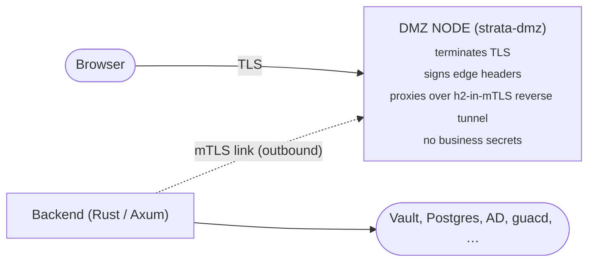

# Threat Model — Strata Client

**Methodology:** STRIDE per component. **Scope:** v1 core (remote access, local + OIDC auth, RBAC, Vault credentials, AD sync, recordings, audit). VDI and Web-Kiosk are explicitly out-of-scope for v1 hardening and gated as `experimental`.

**Status:** Living document. Last reviewed: see `git log -- docs/threat-model.md`.

> **STRIDE legend:** S — Spoofing · T — Tampering · R — Repudiation · I — Information disclosure · D — Denial of service · E — Elevation of privilege

---

## 1. System Decomposition

### 1.1 Trust boundaries

```mermaid
flowchart LR
    Browser([Browser])
    Browser -->|TLS| Nginx
    Nginx["Nginx (frontend)"]
    Nginx -->|HTTP| Backend
    Backend["Backend (Rust / Axum)"]
    Backend --> Postgres([PostgreSQL])
    Backend --> Vault([HashiCorp Vault])
    Backend --> Guacd([guacd pool])
    Guacd --> Targets([Target servers (RDP/VNC/SSH)])
    AD([Active Directory])
    AD -->|LDAP / LDAPS| Backend
```

### 1.2 Trust zones

| Zone            | Components                         | Trusted by          |
| --------------- | ---------------------------------- | ------------------- |
| **Untrusted**   | Browser, end-user network          | Nobody              |
| **Edge**        | Nginx (terminates TLS, serves SPA) | Backend             |
| **Application** | Backend, internal Docker network   | Vault, DB           |
| **Data**        | PostgreSQL, Vault                  | Backend only        |
| **Target**      | RDP/VNC/SSH targets, AD            | Backend (via guacd) |

### 1.3 Critical assets

1. **Privileged credentials** in Vault (target server passwords, AD bind, Vault root token).
2. **Session recordings** (contain on-screen secrets).
3. **JWT signing key** (loss → arbitrary user impersonation).
4. **Database** (audit logs, password hashes, RBAC).
5. **Active sessions** in `guacd` (live RDP/VNC/SSH streams).

---

## 2. Component-by-component STRIDE

### 2.1 Browser ↔ Nginx (TLS edge)

| Threat                     | Vector                        | Mitigation                                                                                            | Residual                                    |
| -------------------------- | ----------------------------- | ----------------------------------------------------------------------------------------------------- | ------------------------------------------- |
| **S** Server impersonation | Cert MITM                     | TLS 1.2+, HSTS, customer-provided cert in `certs/`                                                    | Trust on first use; depends on operator PKI |
| **T** Response tampering   | Stripped TLS                  | HSTS preload not advertised; document that operators must front with their own LB if exposed publicly | Operator responsibility                     |
| **I** Token leakage in URL | OAuth code/state in `Referer` | OIDC state + PKCE; tokens never placed in URL                                                         | OK                                          |
| **D** Volumetric DoS       | SYN flood, slowloris          | Out of scope for app — operator deploys behind WAF/LB                                                 | Documented                                  |

### 2.2 Browser SPA (frontend)

| Threat                         | Vector                                                     | Mitigation                                                                                                                                                                                                                                                                                                    | Residual                                            |
| ------------------------------ | ---------------------------------------------------------- | ------------------------------------------------------------------------------------------------------------------------------------------------------------------------------------------------------------------------------------------------------------------------------------------------------------- | --------------------------------------------------- |
| **S** CSRF                     | Cross-site form post                                       | Access tokens stored in `httpOnly; Secure; SameSite=Strict; Path=/api` cookies; double-submit `csrf_token` cookie + `X-CSRF-Token` header validated in constant time on every cookie-authenticated mutating request; GET/HEAD/OPTIONS, WS upgrades, and Bearer-authed requests are exempt. **W4-3 complete.** | OK — covered by `e2e/tests/rbac.spec.ts` CSRF suite |
| **T** Stored XSS               | User-supplied HTML in connection names, tags, descriptions | All UI uses React's escaping; no `dangerouslySetInnerHTML` outside vendored Guacamole client; CSP policy in `frontend/common.fragment`                                                                                                                                                                        | Audit CSP regularly                                 |
| **T** DOM XSS                  | `eval`, dynamic URLs                                       | ESLint `security/*` rules enforced; no `eval`, no `new Function`                                                                                                                                                                                                                                              | OK                                                  |
| **I** Clickjacking             | Framing the SPA                                            | NJS-enforced `Content-Security-Policy: frame-ancestors 'none'` at the gateway                                                                                                                                                                                                                                 | OK                                                  |
| **R** Action origin denial     | "I didn't click that"                                      | Every state-changing API call audit-logged server-side with actor + IP                                                                                                                                                                                                                                        | OK                                                  |
| **I** Token theft via XSS      | localStorage access                                        | Access + refresh tokens both `httpOnly` cookies; never readable from JS. **W4-3 complete.**                                                                                                                                                                                                                   | OK                                                  |
| **D** Resource exhaustion      | Large response renders                                     | Pagination on all list endpoints; virtualization for session lists                                                                                                                                                                                                                                            | Audit per page                                      |
| **E** Client-side route bypass | Toggle React route guards                                  | Every protected route asserts permission **server-side**; UI guards are UX only                                                                                                                                                                                                                               | Covered by W4-4 RBAC test pack                      |

### 2.3 Backend API (Axum)

| Threat                          | Vector                                               | Mitigation                                                                                                                                                                                                                                                             | Residual               |
| ------------------------------- | ---------------------------------------------------- | ---------------------------------------------------------------------------------------------------------------------------------------------------------------------------------------------------------------------------------------------------------------------- | ---------------------- |
| **S** JWT forgery               | Algorithm confusion, weak secret                     | RS256 for OIDC (verifies against IdP JWKS); HS256 for local with mandatory persistent secret ≥256 bits, refused to start if missing (v1.8.3)                                                                                                                           | OK                     |
| **S** Token replay after revoke | Stolen token used post-logout                        | Revocation list (`revoked_tokens` table) checked on every request                                                                                                                                                                                                      | OK                     |
| **T** SQL injection             | Crafted query params                                 | sqlx compile-time checked queries everywhere                                                                                                                                                                                                                           | OK                     |
| **T** Mass-assignment           | Extra JSON fields update protected columns           | Each handler explicitly destructures input DTO; no `serde(flatten)` from request → DB row                                                                                                                                                                              | OK                     |
| **R** No audit trail            | Action without log                                   | `audit_logs` write inside the handler tx for every mutating route; FK `ON DELETE SET NULL` to preserve trail                                                                                                                                                           | OK                     |
| **I** PII in logs               | User emails / passwords leaking                      | `tracing` field redaction; secret types use `Secret<T>` with `serde::Serialize` denied                                                                                                                                                                                 | Spot-check on every PR |
| **I** Timing oracle on login    | Username enumeration                                 | Argon2 verify always runs (against a dummy hash if user missing); per-IP and per-username rate-limit                                                                                                                                                                   | OK                     |
| **D** Auth brute force          | Credential stuffing                                  | Per-IP + per-user rate limit; account lockout after N failures                                                                                                                                                                                                         | Tune thresholds        |
| **D** Slow handler              | Long-running DB query                                | `tower_http::timeout`; sqlx statement timeout                                                                                                                                                                                                                          | OK                     |
| **E** RBAC bypass               | Direct API hit on hidden route                       | Automated negative-test pack `e2e/tests/rbac.spec.ts` exercises every protected route with (a) no auth, (b) authenticated-but-unprivileged Bearer, and (c) cookie auth without/with bad CSRF; admin routes must return 403 to a no-permission user. **W4-4 complete.** | OK                     |
| **E** IDOR                      | `/api/connections/:id` for another user's connection | Every row-scoped query joins on `user_permissions`/`role_permissions`; covered by `rbac.spec.ts` wrong-role probes. **W4-4 complete.**                                                                                                                                 | OK                     |

### 2.4 Tunnel proxy (WS ↔ guacd)

| Threat                             | Vector                                  | Mitigation                                                                                                   | Residual                          |
| ---------------------------------- | --------------------------------------- | ------------------------------------------------------------------------------------------------------------ | --------------------------------- |
| **S** Tunnel hijack                | Stealing a tunnel ticket                | Tickets are single-use, scoped to (user, connection, expiry < 60s), validated on `/tunnel` upgrade           | OK                                |
| **T** Mid-stream injection         | MITM on internal hop                    | Internal Docker network only; backend ↔ guacd is non-routed                                                  | Acceptable for default deployment |
| **R** Session attribution          | "Who opened this RDP session?"          | Tunnel ticket binds to user; `audit_logs.session_open` row written before WS upgrade                         | OK                                |
| **I** Session recording theft      | Direct file access                      | Recordings stored on disk with per-session ownership token; download via capability-token URL with short TTL | OK                                |
| **I** Credential exposure to guacd | Plaintext password sent on `connect`    | Internal network only; never logged; in-memory only                                                          | Acceptable                        |
| **D** Tunnel exhaustion            | Open many tunnels                       | Per-user concurrent session cap (`max_concurrent_sessions`)                                                  | OK                                |
| **E** Connection swap              | Open ticket for connection A, talk to B | guacd handshake uses the params encoded in the ticket; mismatch closes the WS                                | OK                                |

### 2.5 Vault integration

| Threat                                  | Vector                               | Mitigation                                                                                                                                                 | Residual                                                                     |
| --------------------------------------- | ------------------------------------ | ---------------------------------------------------------------------------------------------------------------------------------------------------------- | ---------------------------------------------------------------------------- |
| **S** Vault impersonation               | DNS spoof of Vault host              | TLS + pinned CA bundle when configured                                                                                                                     | Document for operators                                                       |
| **T** Secret tampering                  | Replace secret in transit            | TLS only                                                                                                                                                   | OK                                                                           |
| **R** Secret-access attribution         | "Who read this password?"            | Backend uses one Vault token per process; the `audit_logs.secret_read` row in our DB carries the actor; Vault's own audit log carries the backend identity | Two-log correlation required                                                 |
| **I** Embedded Vault root token leakage | Auto-init writes root token to disk  | File mode `0600`, owned by backend user; **production deployments MUST use external Vault** — checklist in `deployment.md`                                 | **Risk:** boot mode must refuse external traffic if embedded Vault is in use |
| **I** Unseal-key disclosure             | Auto-unseal key on disk              | Same protections; same recommendation to externalize                                                                                                       | Same                                                                         |
| **D** Vault sealed                      | Backend can't read secrets           | Fail closed: routes that need secrets return 503 with operator-actionable message                                                                          | OK                                                                           |
| **E** Token over-privilege              | One backend token can read all paths | Token policy scoped to `secret/data/strata/*` only; rotate via Vault on operator-set schedule                                                              | Document rotation playbook                                                   |

### 2.6 Active Directory sync

| Threat                                      | Vector                                          | Mitigation                                                                                         | Residual                                   |
| ------------------------------------------- | ----------------------------------------------- | -------------------------------------------------------------------------------------------------- | ------------------------------------------ |
| **S** Rogue AD response                     | DNS poisoning to fake DC                        | LDAPS + CA pinning when `ldap_ca_cert` configured                                                  | Recommend LDAPS in deployment guide        |
| **T** Group-membership tampering            | AD compromise → arbitrary RBAC                  | RBAC mapping is operator-defined per-group; AD membership only grants what the operator configured | Acceptable — AD is authoritative by design |
| **I** Bind credential leak                  | Storage of AD bind password                     | Stored in Vault, never in DB                                                                       | OK                                         |
| **D** Sync runaway                          | AD with 500k users                              | Pagination + worker timeout; sync runs in a background worker, never blocks HTTP                   | OK                                         |
| **E** Privilege escalation via group rename | Renaming an AD group to match a privileged role | Mapping uses AD `objectGUID`, not name                                                             | OK                                         |

### 2.7 PostgreSQL

| Threat                                | Vector                         | Mitigation                                                                          | Residual   |
| ------------------------------------- | ------------------------------ | ----------------------------------------------------------------------------------- | ---------- |
| **T** At-rest tampering               | Direct DB write bypassing app  | Out of scope — operator owns DB host security                                       | Documented |
| **I** Backup theft                    | DB dump leaking hashes / audit | Operator responsibility; passwords are Argon2id hashed; secrets are in Vault not DB | OK         |
| **D** Connection exhaustion           | sqlx pool exhausted            | Pool size + acquire timeout; circuit breaker on failure                             | OK         |
| **E** SQL injection → arbitrary write | See 2.3 — sqlx checked queries | OK                                                                                  |

### 2.8 guacd (and the vendored Guacamole patches)

| Threat                                               | Vector                                 | Mitigation                                                                                    | Residual                                     |
| ---------------------------------------------------- | -------------------------------------- | --------------------------------------------------------------------------------------------- | -------------------------------------------- |
| **T** Patched guacd diverges from upstream CVE fixes | Custom H.264 patches missed in upgrade | `guacd/patches/` is small and reviewed on every guacamole-server bump; CI pin to image digest | Maintenance burden — acknowledged            |
| **I** RDP credential logging                         | Verbose guacd logs                     | Default log level excludes secrets; audit on bump                                             | Spot-check                                   |
| **D** Buggy patch crashes guacd                      | OOM, segfault                          | Pool replaces failed instance; per-pool circuit breaker                                       | OK                                           |
| **E** Container escape from guacd                    | Kernel exploit                         | Container runs with dropped caps + read-only root; no privileged mode; non-root user          | OK for default; document any custom override |

### 2.9 VDI driver (experimental)

> **VDI is gated behind `feature = vdi` and labelled experimental in the UI. The threats below are why.**

| Threat                             | Vector                                                     | Mitigation                                                                                                             | Residual                   |
| ---------------------------------- | ---------------------------------------------------------- | ---------------------------------------------------------------------------------------------------------------------- | -------------------------- |
| **E** Container escape → host root | Mounting `/var/run/docker.sock` is host-root by definition | **Cannot be fully mitigated** while we use the docker socket. Long-term: replace with Sysbox / Kata / podman rootless. | Open — tracked under W5-\* |
| **I** Cross-tenant container view  | One user lists/inspects another's container                | All docker calls are namespaced by `strata.user_id` label; admin endpoints required to enumerate cross-user            | Acceptable                 |
| **D** Resource starvation          | One user spawns 100 VDIs                                   | Per-user concurrent VDI cap; operator-set max-containers cap                                                           | OK                         |

### 2.10 Web-kiosk (experimental)

| Threat                                   | Vector                                        | Mitigation                                                                               | Residual                                |
| ---------------------------------------- | --------------------------------------------- | ---------------------------------------------------------------------------------------- | --------------------------------------- |
| **T** Egress to arbitrary internet       | Kiosk renders attacker-controlled site        | Per-connection allow-list of hostnames; Chromium `--host-rules`; backend egress firewall | Document operator firewall expectations |
| **I** Cookie/state leak between sessions | Kiosk container reused                        | New container per session; volumes are `tmpfs`                                           | OK                                      |
| **E** Kiosk → backend pivot              | Compromised page reaches backend internal API | Kiosk runs in its own Docker network, no route to backend network                        | OK                                      |

### 2.11 Quick Share file mover (inbound + outbound, v1.12.0 AV update)

The Quick Share pipeline ferries operator-supplied files **to** a
remote session (`POST /api/user/files/upload`) and shepherds files
coming **back** from a remote session through an approval queue
(`POST /api/user/outbound-shares/submit` plus the token-auth shell
path `POST /api/outbound-shares/ingest/{token}`). Both directions
share the same `Scanner` trait gate in `services::av` as of v1.12.0.

| Threat                                                        | Vector                                                                                                       | Mitigation                                                                                                                                                                                                                                                                                                                                                                                                                                                                                                                                                                                                                                                                                                                                                                                                                                              | Residual                                                                              |
| ------------------------------------------------------------- | ------------------------------------------------------------------------------------------------------------ | ------------------------------------------------------------------------------------------------------------------------------------------------------------------------------------------------------------------------------------------------------------------------------------------------------------------------------------------------------------------------------------------------------------------------------------------------------------------------------------------------------------------------------------------------------------------------------------------------------------------------------------------------------------------------------------------------------------------------------------------------------------------------------------------------------------------------------------------------------- | -------------------------------------------------------------------------------------- |
| **S** Operator impersonation on outbound submit               | Stolen session token used to submit a file as a different user                                               | Submit path requires the standard cookie + CSRF or Bearer; the row stores `user_id` from the validated session, not from any client field                                                                                                                                                                                                                                                                                                                                                                                                                                                                                                                                                                                                                                                                                                              | OK                                                                                    |
| **S** Shell-side ingest token forgery                         | Attacker guesses an HTTPS upload-command token to submit on behalf of another user                            | Tokens are 32-byte URL-safe base64 (~192 bits of entropy), single-use (`SET used_at = now() WHERE token = $1 AND used_at IS NULL AND expires_at > now()`), 10-minute TTL, rate-limited 10 mints/min/user; consume path re-checks the minter's `can_use_quick_share_outbound` permission                                                                                                                                                                                                                                                                                                                                                                                                                                                                                                                                                                | OK                                                                                    |
| **T** Malicious file landing in session file store (inbound)  | Operator drags an exe carrying malware into the Quick Share panel                                            | **v1.12.0+** every multipart upload streams through `Scanner::scan` between MIME sniffing and `file_store.store_from_path`. With `STRATA_AV_BACKEND=clamav` (or `command`), an infected file is rejected before reaching the file store; the temp file is `unlink`'d and a `file.av_blocked` audit event records signature + metadata. Default `off` leaves prior behaviour intact for operators who don't opt in.                                                                                                                                                                                                                                                                                                                                                                                                                                       | Default `off` means scan is opt-in; AV deployments documented in `av-scanning.md`     |
| **T** Malicious file in outbound submission                   | Compromised remote session pushes a payload back to the operator's browser                                   | Same scanner trait runs against the staged plaintext temp file **before** the Vault-Transit seal. Infected verdicts are rejected; no ciphertext is written and no DB row is created. The four `av_*` columns on the resulting (or, on block, absent) row carry the verdict for audit                                                                                                                                                                                                                                                                                                                                                                                                                                                                                                                                                                    | Same — opt-in. DLP heuristic still runs orthogonally as a second control                |
| **T** AV scanner bypass via fake verdict in request body      | Attacker tries to claim `av_scan_status=clean` from the client side                                          | The four `av_*` columns are populated **server-side** from the `Verdict` returned by the trait call; no request-body field is ever read into them. The `SubmitInput` struct in `services::outbound_shares` takes `av_verdict: &Verdict, av_backend: &str` from the route layer, not from `serde::Deserialize`                                                                                                                                                                                                                                                                                                                                                                                                                                                                                                                                            | OK                                                                                    |
| **T** Shell injection through filename to `command` scanner   | Crafted filename containing shell metacharacters reaches `STRATA_AV_CMD`                                     | Command line is whitespace-split into an argv vector and dispatched via `tokio::process::Command` (no `sh -c`, no `bash -c`). The file path lands at `{path}` substitution or as the final argv element — either way as a single argv entry. No shell parsing happens at any layer                                                                                                                                                                                                                                                                                                                                                                                                                                                                                                                                                                     | OK                                                                                    |
| **R** Audit trail can't prove the file was scanned            | Compliance auditor asks "was this file ever scanned?"                                                        | Every outbound row persists `av_scanner_backend` + `av_scan_status` + `av_signature` + `av_scanned_at`. Every inbound block writes `file.av_blocked`. Skipped (oversize) uploads are also tagged so the audit reader can see *why* a row has no verdict (vs. a v1.11.x row where no scanner ran at all — those carry `NULL`)                                                                                                                                                                                                                                                                                                                                                                                                                                                                                                                            | OK                                                                                    |
| **I** Signature names in audit logs leak threat-intel         | `signature=Win.Test.EICAR_HDB-1` reveals which engine is in use                                              | This is intentional — auditors need engine attribution. ClamAV signature names are public; commercial engines return their own canonical names. No customer data is in the signature string                                                                                                                                                                                                                                                                                                                                                                                                                                                                                                                                                                                                                                                            | Acceptable                                                                            |
| **I** Plaintext file readable across the clamav-backend boundary | Sidecar reads the staging file from a shared mount                                                          | The ClamAV backend uses the `INSTREAM` wire protocol — the file is streamed over `clamav:3310` TCP in 64 KB chunks, never via a shared volume. No filesystem path is exchanged between the two containers                                                                                                                                                                                                                                                                                                                                                                                                                                                                                                                                                                                                                                              | OK                                                                                    |
| **D** Scan timeout pins a tokio task                          | Crafted file (e.g. zip bomb) causes `clamd` to spin                                                          | Each scan is bounded by `STRATA_AV_TIMEOUT_MS` (default 30 000 ms) via `tokio::time::timeout`. Timeout yields `Verdict::Error { message }`; fail-mode rules then decide block-vs-pass. Files over `STRATA_AV_MAX_SCAN_SIZE` (default 100 MiB) are tagged `Skipped { reason: "oversize" }` rather than attempted                                                                                                                                                                                                                                                                                                                                                                                                                                                                                                                                          | Oversize files bypass the scanner — operator must tune the limit for their workload  |
| **D** Scanner outage causes mass-block (fail-closed by design) | clamd crashes mid-shift                                                                                      | This is intended behaviour. `STRATA_AV_FAIL_MODE=block` (default) treats scanner errors as rejections so the audit trail never carries an unscanned upload. Operators who prefer degraded-open semantics flip to `allow`; **infected** verdicts are still rejected unconditionally in either mode                                                                                                                                                                                                                                                                                                                                                                                                                                                                                                                                                       | Document fail-mode tradeoff in the operator runbook                                   |
| **E** AV process escapes to host                              | Vulnerability in `clamd`                                                                                     | ClamAV runs in its own container, dropped caps, no-new-privileges, internal-only network. The backend never `exec`s clamav; it speaks TCP only. The `command` backend uses `tokio::process::Command` which inherits the backend's user (non-root) — the scanner cannot escalate above the backend's privilege level                                                                                                                                                                                                                                                                                                                                                                                                                                                                                                                                     | OK                                                                                    |

---

## 3. Cross-cutting controls

### 3.1 Secrets management

- JWT secret persisted with `0600`, refused to start if missing in production mode.
- Vault tokens never logged.
- ESLint `security/*` rules + gitleaks in CI to catch accidental commits.

### 3.2 Supply chain

- `cargo audit --deny unsound --deny unmaintained` in CI.
- `npm audit --audit-level=high` in CI.
- `gitleaks` on every PR.
- Container base images pinned to digest.
- **Planned (W5-\*):** SBOM (CycloneDX), cosign-signed images.

### 3.3 Logging & audit

- All mutating routes write to `audit_logs` inside the same transaction as the change.
- `ON DELETE SET NULL` on user FK preserves attribution after user deletion.
- Operator can ship logs to SIEM via stdout / syslog / journald.

### 3.4 Production-mode boot guard _(planned, not yet implemented — W5-_)\*

- Refuses to boot when `STRATA_PROFILE=production` AND any of:
  - embedded Vault active,
  - default JWT secret,
  - CORS allow-list `*`,
  - debug logging,
  - registration enabled without admin approval,
  - self-signed cert without explicit `STRATA_ALLOW_SELF_SIGNED=1`.

---

## 4. Open issues / tracked work

| ID   | Item                                                        | Linked threat               | Status  |
| ---- | ----------------------------------------------------------- | --------------------------- | ------- |
| W4-3 | Move access token to `httpOnly` cookie + CSRF double-submit | 2.2 I (token theft via XSS) | ✅ Done |
| W4-4 | RBAC negative-test pack                                     | 2.3 E (RBAC bypass / IDOR)  | ✅ Done |
| W5-1 | Production-mode boot guard                                  | 3.4                         | Open    |
| W5-2 | SBOM + cosign signing                                       | 3.2                         | Open    |
| W5-3 | VDI: replace `docker.sock` with rootless runtime            | 2.9 E                       | Open    |
| W5-4 | Operator playbook: Vault token rotation                     | 2.5 E                       | Open    |
| W5-5 | External-Vault-only enforcement in production mode          | 2.5 I                       | Open    |

---

## 5. Out of scope for v1

- Hardware-backed key storage (HSM, TPM).
- Multi-tenant isolation beyond per-row RBAC.
- Continuous behavioural anomaly detection.
- Customer-facing bug bounty (disclosure policy still required — W5-\*).

---

## 5b. Multiplayer share (co-pilot mode, v1.9.6+)

> Applies only when a share is created with `multiplayer: true` and the
> global `multiplayer_share_enabled` system setting is not `"false"`.
> Standard single-viewer shares inherit §1–§5 unchanged.

### Trust boundaries added

A multiplayer share elevates the share-token-bearing principal from a
single passive viewer to **up to six active participants**, one of whom
holds an **input token** that lets it inject keyboard / mouse events into
the owner's real session. Every participant is therefore a STRIDE-relevant
principal in its own right.

### STRIDE deltas

| ID  | STRIDE | Threat                                                                          | Mitigation                                                                                                                                                                                                                        |
| --- | ------ | ------------------------------------------------------------------------------- | --------------------------------------------------------------------------------------------------------------------------------------------------------------------------------------------------------------------------------- |
| MP1 | **S**  | Peer A re-uses peer B's `pid` in cursor / chat / SDP fields to impersonate them | Server overwrites every identity-bearing field on inbound envelopes before fanout (`co_pilot::Room::handle_envelope`); the client-supplied pid is discarded.                                                                      |
| MP2 | **T**  | Peer crafts oversized envelope to corrupt fanout state / exhaust memory         | `CoPilotMsg::validate()` runs before any state mutation: chat ≤ 500 B, SDP ≤ 8192 B, ICE ≤ 1024 B, revoke reason ≤ 120 B, display name ≤ 40 B. Oversize closes WS with 1009.                                                      |
| MP3 | **R**  | Peer denies sending a hostile keystroke after the fact                          | `share_participant_audit` + `audit_log.share.multiplayer.*` capture pid, client_ip, user_agent, joined/left timestamps. Input-token transitions are auditable from the broadcast log of `input_grant` / `input_revoke` envelopes. |
| MP4 | **I**  | Peer reads chat or screen of a share they were never invited to                 | Same control as single-viewer share: possession of the share token is required to open either WS. Multiplayer does **not** widen who can reach the share endpoint, only how many can join the same one.                           |
| MP5 | **D**  | Peer floods cursor / chat to saturate the broadcast channel                     | Fanout channel is `tokio::sync::broadcast` sized 1024; slow receivers are dropped without blocking the sender. Client throttles cursor to ~30 Hz; server does not currently rate-limit chat per-peer (tracked as W5-MP1).         |
| MP6 | **E**  | Peer keeps the input token forever to lock the owner out                        | Owner can `input_revoke` at any time with no delay; idle ≥ 2 s automatically transfers the token to the next claimant; closing the WS releases the token. Owner force-grant always wins.                                          |
| MP7 | **E**  | Attacker joins a 7th seat to bypass the capacity contract                       | `MAX_PARTICIPANTS = 6` and the per-share `max_participants` (clamped 1..=6) are enforced server-side; a 7th joiner receives `join_error: "room_full"` and the WS is closed before any roster broadcast.                           |
| MP8 | **E**  | Attacker enables multiplayer on a share they shouldn't                          | Three independent gates: `body.multiplayer == true`, `mode == "control"`, and `system_settings.multiplayer_share_enabled != "false"`. Any failure silently downgrades to single-viewer control.                                   |

### Tracked follow-ups

| ID     | Item                                                                           | Linked threat                             | Status |
| ------ | ------------------------------------------------------------------------------ | ----------------------------------------- | ------ |
| W5-MP1 | Per-participant chat / cursor rate limit                                       | MP5                                       | Open   |
| W5-MP2 | Owner-side participant view (peer cursors visible in owner's `SessionManager`) | (observability, not a security gap)       | Open   |
| W5-MP3 | WebRTC audio mesh client (server-side relay already validated)                 | MP2 (extended to media-control envelopes) | Open   |

---

## 6. DMZ deployment mode (split-topology)

> Applies only when `strata-dmz` is deployed in front of the backend
> per [ADR-0009](adr/ADR-0009-dmz-deployment-mode.md). Single-binary
> deployments inherit §1–§5 unchanged.

### 6.1 Updated decomposition



### 6.2 New trust zones

| Zone            | Components         | Trusted by                                |
| --------------- | ------------------ | ----------------------------------------- |
| **Public-edge** | strata-dmz         | Backend (only via the signed edge bundle) |
| **Link**        | The mTLS h2 tunnel | Both peers (mutual auth)                  |

The DMZ node is **less trusted than the existing nginx tier** in §1
because it is now a Rust binary in our own build path. Specifically:

- It holds three secrets that live nowhere else (link PSK, edge HMAC
  key, operator token) but **none** of the §1.3 critical assets
  (Vault root, JWT signing key, DB credential, AD bind, Kerberos
  keytab, OIDC client secret, recording-storage credential).
- Compromise of the DMZ node forfeits the public surface but does
  **not** yield direct access to the data zone.

### 6.3 STRIDE — strata-dmz

|       | Threat                                                                                                | Mitigation                                                                                                                                                                                                                                                                                                                            |
| ----- | ----------------------------------------------------------------------------------------------------- | ------------------------------------------------------------------------------------------------------------------------------------------------------------------------------------------------------------------------------------------------------------------------------------------------------------------------------------- |
| **S** | Public client forges `x-strata-edge-*` headers to spoof a different IP / UA / link-id to the backend. | Signer strips ALL incoming `x-strata-edge-*` before signing (proxy.rs test `forged_edge_headers_from_public_are_overwritten`). MAC bound to the canonical 8-field bundle.                                                                                                                                                             |
| **S** | Attacker presents stolen client cert + PSK to dial a fake link.                                       | Two-factor: mTLS client cert AND length-prefixed JSON challenge-response under a PSK. PSK rotation supported via `current` / `previous` mapping.                                                                                                                                                                                      |
| **S** | Attacker spoofs operator API by guessing the bearer token.                                            | `subtle::ConstantTimeEq`, length-checked. Token min 32 bytes. Token shares no material with link PSK or edge HMAC key.                                                                                                                                                                                                                |
| **T** | Public client tampers with `X-Forwarded-For` to forge upstream IP attribution.                        | XFF honoured ONLY when peer IP is in `STRATA_DMZ_TRUST_FORWARDED_FROM`. Untrusted peer → falls back to socket peer or `0.0.0.0` (proxy.rs test `xff_from_untrusted_peer_is_ignored`).                                                                                                                                                 |
| **T** | Replay of a captured signed bundle.                                                                   | Two layers: (a) proxy boundary mints a fresh bundle per request (test `each_request_gets_a_fresh_signed_bundle`), (b) internal verifier rejects timestamps outside ±60 s (`MAX_TIMESTAMP_SKEW_MS`).                                                                                                                                   |
| **R** | Backend can't tell DMZ-injected errors from upstream errors when triaging.                            | Every proxy-injected response carries `x-strata-link: dmz-proxy`.                                                                                                                                                                                                                                                                     |
| **R** | Operator action on DMZ leaves no internal audit trail.                                                | DMZ logs every operator-API call; operator-driven `disconnect` immediately reflects in the internal admin UI's link state machine, which writes `audit_logs` rows on transitions.                                                                                                                                                     |
| **I** | Attacker reads memory of the DMZ binary to lift the link PSK / edge HMAC / operator token.            | All three live in `Zeroizing<Vec<u8>>`. Env scrubbed post-parse. `#![deny(unsafe_code)]` on the crate. Distroless image — no shell to spawn, no `/proc/<pid>/mem` reader to attach.                                                                                                                                                   |
| **I** | DMZ logs leak request bodies or tokens.                                                               | DMZ logs at `info` level by default; structured logger redacts `authorization` header values; bodies never logged.                                                                                                                                                                                                                    |
| **I** | Side-channel timing on the operator-token compare.                                                    | Constant-time compare with subtle. Length checked first, but length acts as an oracle only on the bound `>= 32` byte rule, which is public.                                                                                                                                                                                           |
| **D** | Public client floods the DMZ with requests.                                                           | 4-layer tower stack: per-IP rate limit → global concurrency cap → request timeout → body limit. Drops bad actors at L1 with `429`.                                                                                                                                                                                                    |
| **D** | Public client opens many slow connections.                                                            | `tower_http::timeout::TimeoutLayer` on read; rustls handshake timeout; `MAX_PROXY_BODY_BYTES = 8 MiB` on both directions.                                                                                                                                                                                                             |
| **D** | Public client requests gigantic responses to amplify upstream cost.                                   | Symmetric body cap on response (8 MiB); the proxy short-circuits with `502` on cap hit and emits a metrics counter the alerting tier can page on.                                                                                                                                                                                     |
| **D** | Compromised DMZ floods backend with bogus requests.                                                   | Internal-side admin API can `POST /api/admin/dmz-links/reconnect` to drop every link; if a single DMZ peer is hostile its mTLS cert can be removed from the trust list and the link refused.                                                                                                                                          |
| **E** | DMZ binary RCE → pivot to backend.                                                                    | DMZ container is read-only rootfs, distroless (no shell), uid 65532, all caps dropped, no-new-privileges, dmz-link network is the ONLY route to the backend port — and it requires mTLS + PSK + correct cluster_id. RCE on the DMZ host yields the public surface and the three DMZ-local secrets, but not anything in the data zone. |
| **E** | DMZ → internal "confused deputy": DMZ marks an attacker request as having a privileged client-IP.     | Internal-side `require_auth` is unchanged; the edge bundle can claim any client-IP, but it cannot fabricate a session cookie, JWT, or OIDC claim. Worst case the audit log records a wrong source IP, which §6.5 calls out as a known residual.                                                                                       |
| **E** | Operator-token holder pivots to backend.                                                              | Operator API only exposes link list / status / disconnect. It cannot mutate connection records, users, or roles.                                                                                                                                                                                                                      |

### 6.4 STRIDE — link tunnel (`strata-link/1.0`)

|       | Threat                                                                                     | Mitigation                                                                                                                                                                                              |
| ----- | ------------------------------------------------------------------------------------------ | ------------------------------------------------------------------------------------------------------------------------------------------------------------------------------------------------------- |
| **S** | MITM presents a forged DMZ server cert to the internal node.                               | mTLS with operator-pinned CA; `STRATA_DMZ_LINK_CA` is the only trusted issuer. Internal node refuses `WebPKI` defaults.                                                                                 |
| **S** | MITM presents a forged internal client cert to the DMZ.                                    | Same model in reverse — DMZ pins a client-CA via `STRATA_DMZ_LINK_CA_BUNDLE` and refuses anything else.                                                                                                 |
| **T** | Frame injection in the JSON handshake.                                                     | Length-prefixed framing (`MAX_FRAME_PAYLOAD = 64 KiB`); fuzz target `frame_decoder` confirms oversized lengths are rejected without allocation. JSON parser fuzz targets cover all four message shapes. |
| **T** | Header smuggling via h2 inside the tunnel.                                                 | h2 0.4 with hop-by-hop strip per RFC 7230 §6.1 on every forward; pseudo-headers regenerated by the proxy, not copied through.                                                                           |
| **R** | Either side denies sending a frame.                                                        | DMZ logs every accepted handshake with cluster_id + node_id + software_version; internal logs every successful dial.                                                                                    |
| **I** | Passive observer on the path reads request bodies.                                         | TLS 1.3 inside mTLS; PFS via X25519 + AEAD.                                                                                                                                                             |
| **I** | DMZ binary leaks the link PSK to the public surface (e.g. via an error page).              | PSK only used during handshake, never logged at any level; `Zeroizing` ensures heap copies are wiped on drop.                                                                                           |
| **D** | Internal node never reconnects after a DMZ flap.                                           | Backoff supervisor with bounded jitter (max 30 s) + admin-UI **Force reconnect** that resets the state machine. Chaos test `link-flap.sh` asserts <45 s recovery.                                       |
| **D** | A single hostile DMZ holds the link open forever, starving the internal connection budget. | Internal-side max-link-per-cluster cap; admin API drops sessions on demand.                                                                                                                             |
| **E** | Compromised internal binary uses the link to attack the DMZ in reverse.                    | The link is request/response only over h2 streams initiated by the DMZ; the internal side cannot push unsolicited streams.                                                                              |

### 6.5 Residual risks accepted

- **Edge bundle records the DMZ's view of client IP / UA, not a
  cryptographic proof from the browser.** A compromised DMZ host can
  attribute requests to arbitrary IPs in the audit log during the
  compromise window. Mitigation: the audit pipeline also records the
  TCP peer IP captured by the DMZ before signing, so investigators
  can cross-check after the fact.
- **The link PSK and edge HMAC key are symmetric.** Either secret in
  attacker hands lets them mint valid handshakes (PSK) or forge edge
  bundles (HMAC) until the secret is rotated. Mitigation: §5 of the
  DMZ runbook (multi-key staging with `current` / `previous` for the
  PSK, additive trust list for the HMAC) makes rotation a zero-downtime
  operation.
- **Public TLS termination on the DMZ means the DMZ sees plaintext.**
  Unavoidable for this topology; the alternative (terminate TLS on the
  backend, tunnel TCP through the DMZ) defeats the body-cap, rate-limit,
  and edge-signing controls.

### 6.6 Tracked work

| ID   | Item                                                   | Linked threat                | Status                                                                                                                                                                                                                                                                                                                                                                                                                                                                                                                                                                                                                                                                                                                                                                                          |
| ---- | ------------------------------------------------------ | ---------------------------- | ----------------------------------------------------------------------------------------------------------------------------------------------------------------------------------------------------------------------------------------------------------------------------------------------------------------------------------------------------------------------------------------------------------------------------------------------------------------------------------------------------------------------------------------------------------------------------------------------------------------------------------------------------------------------------------------------------------------------------------------------------------------------------------------------- |
| W6-1 | mTLS cert hot-reload without container restart         | 6.6 (cert rotation friction) | Resolved (Phase 6b, backend side) — `services::dmz_link::TlsLinkConnector` keeps its rustls `ClientConfig` behind an `RwLock<Arc<...>>` and exposes `reload()` plus a 60-second mtime poller (`spawn_mtime_watcher`) so cert-manager's PEM-file rewrite is picked up without a backend restart. New TLS handshakes use the rotated material; in-flight sessions are unaffected. **Residual:** DMZ-side hot-reload (link-server `TlsAcceptor` and public-TLS `ServerConfig` in `crates/strata-dmz`) is currently still rotated by pod redeploy; a stakater/Reloader annotation or an analogous mtime watcher is the planned follow-on.                                                                                                                                                           |
| W6-2 | Per-public-IP body-cap tuning via env                  | 6.3 D (body-cap tuning)      | Resolved (Phase 6c) — `STRATA_DMZ_PUBLIC_BODY_LIMITS_BY_IP` accepts a comma-separated `cidr=bytes` list (longest-prefix wins, K/M/G suffixes accepted, IPv4 and IPv6). The new `body_caps::body_cap_middleware` (`crates/strata-dmz/src/body_caps.rs`) replaces the static `RequestBodyLimitLayer`: it resolves the effective cap from the public-listener `ConnectInfo<SocketAddr>` peer, fast-fails on `Content-Length`, and falls back to `STRATA_DMZ_PUBLIC_BODY_LIMIT_BYTES` when no rule matches. Operators can now grant trusted partner CIDRs a larger headroom or shrink the cap for known-noisy networks without a code change. **Residual:** chunked requests that omit `Content-Length` are not stream-capped at the per-IP layer; the global per-route handler limits still apply. |
| W6-3 | Ed25519 / asymmetric link auth (replace shared PSK)    | 6.5 (symmetric PSK)          | Backlog — rationale recorded in [ADR-0010 §"W6-3 (Ed25519 asymmetric link auth) — Backlog"](adr/ADR-0010-dmz-phase6-hardening.md). Symmetric PSK rotation via `STRATA_DMZ_LINK_PSKS` covers operational rotation; the asymmetric variant becomes worthwhile only if a deployment requires DMZ-host-less-trusted-than-internal semantics, which the current threat model does not assert.                                                                                                                                                                                                                                                                                                                                                                                                        |
| W6-4 | Audit log: cross-check TCP-peer IP vs signed client_ip | 6.5 (DMZ-attributed IP)      | Resolved (Phase 6a) — every audit row written within a request scope is enriched with `details._edge` containing the verified `client_ip`, `tls_version`, `tls_cipher`, `tls_ja3`, `user_agent`, `request_id`, and `link_id`. Operators correlate the recorded `link_id` against their known-DMZ-nodes allowlist offline; a forged-DMZ scenario shows up as a `link_id` not present in the allowlist.                                                                                                                                                                                                                                                                                                                                                                                           |
