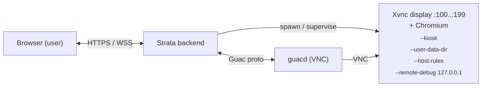

# Web Browser Sessions

> **Status:** **Shipped** in v0.30.0 (runtime delivery). Foundation
> landed in v0.29.0; live `WebRuntimeRegistry` (Xvnc + Chromium spawn,
> Login Data autofill, CDP login-script runner, viewport-matched
> framebuffer) shipped in v0.30.0.

Strata Client can launch ephemeral, kiosk-mode Chromium instances inside
an isolated `Xvnc` display and tunnel them to the user as a standard
guacd VNC session. From the user's point of view it is a tab in the
browser; from the operator's point of view it is an audit-logged,
recording-eligible session over which they retain full network and
content controls.

Web Sessions are part of the default backend image — no overlay file
or compose profile is required.

---

## Contents

1. [When to use Web Sessions](#when-to-use-web-sessions)
2. [Architecture](#architecture)
3. [Configuring a Web Session](#configuring-a-web-session)
4. [Egress allow-list](#egress-allow-list-system-wide)
5. [Login scripts](#login-scripts)
6. [Deployment](#deployment)
7. [Audit events](#audit-events)
8. [Operator pitfalls](#operator-pitfalls)
9. [Troubleshooting](#troubleshooting)

---

## When to use Web Sessions

- Browser-only SaaS apps that you do not want users to load on their
  own corporate laptops (data-loss prevention, copy-paste isolation).
- Vendor portals that demand IP-pinned access from a known egress.
- Auditable onboarding flows where every click and keystroke must be
  recorded.
- Bridging legacy Java applets / SAML sign-ins for downstream
  applications that require a "real" browser context.

For interactive browser work where a user must paste arbitrary URLs,
prefer giving them a full VDI desktop instead — see
[`vdi.md`](vdi.md).

---

## Architecture



Key properties:

- **Display allocator** — `WebDisplayAllocator` reserves a free
  X-display in the `:100..:199` range per concurrent web session, capped
  to 100 simultaneous sessions per backend replica. See
  [`backend/src/services/web_session.rs`](../backend/src/services/web_session.rs).
- **CDP port allocator** — `CdpPortAllocator` reserves a free debug
  port in `9222..9421`, paired 1:1 with the X-display.
- **Viewport-matched framebuffer (v0.30.0).** The kiosk's Xvnc
  geometry is threaded from the operator's actual browser window
  dimensions (`window_width` / `window_height` on `WebSpawnSpec` and
  `ChromiumLaunchSpec`), so the Chromium tab fills the operator's
  viewport edge-to-edge with no letterboxing.
- **Ephemeral profile** — each Chromium launches with a fresh
  `--user-data-dir=/tmp/strata-chromium-{uuid}` and the directory is
  deleted at session end. No bookmarks, history, or cookies survive.
- **Login Data autofill** — operator-supplied credentials are written
  into Chromium's per-profile `Login Data` SQLite file, encrypted with
  Chromium's per-profile AES-128-CBC key (PBKDF2-SHA1, `v10` prefix).
  See [`backend/src/services/web_autofill.rs`](../backend/src/services/web_autofill.rs).
- **Kiosk mode** — `--kiosk`, `--no-first-run`, no address bar.
  Fullscreen the kiosk; users cannot navigate away from the
  operator-supplied target.
- **Sandbox + infobar suppression (v1.3.0)** — the kiosk runs as root
  inside the backend container, so the spawner has always had to pass
  `--no-sandbox`. As of v1.3.0 the argv builder also adds `--test-type`
  whenever it adds `--no-sandbox`. `--test-type` does **not** disable
  the sandbox; it suppresses the yellow *"You are using an unsupported
  command-line flag: --no-sandbox. Stability and security will
  suffer."* infobar (which otherwise occupies ~28 px across the top of
  every kiosk tab) and a handful of other end-user prompts that have
  no meaning inside a single-tab kiosk: default-browser prompt,
  session-restore prompt, certificate-error interstitial test mode.
  Rendering, network stack, mojo IPC, JIT, and origin isolation are
  unchanged. Two unit tests in
  [`backend/src/services/web_session.rs`](../backend/src/services/web_session.rs)
  pin the pairing: `--test-type` only appears when `--no-sandbox`
  does, and never on its own.
- **Domain allow-list** — Chromium `--host-rules="MAP * ~NOTFOUND, MAP
  <allowed> <allowed>"` drops every host the operator did not approve.
- **Egress allow-list** — the backend resolves the requested host and
  refuses to connect unless **every** resolved IP falls inside the
  CIDR allow-list configured under
  `system_settings.web_allowed_networks`. This defeats DNS rebinding
  via mixed A records.
- **CDP localhost-only** — the remote debugging socket binds to
  `127.0.0.1` so the login-script runner can drive the session without
  ever exposing CDP to the network.
- **Login script runner** — a CDP transport
  ([`backend/src/services/web_cdp.rs`](../backend/src/services/web_cdp.rs))
  drives the configured login script
  ([`backend/src/services/web_login_script.rs`](../backend/src/services/web_login_script.rs))
  before guacd attaches, so SSO redirect chains complete invisibly.
- **Spawn pipeline registry** —
  [`backend/src/services/web_runtime.rs`](../backend/src/services/web_runtime.rs)
  reuses live process pairs across reconnects against the same
  `(connection_id, user_id)` so a tab refresh doesn't pay the spawn
  cost twice.

---

## Configuring a Web Session

Web Sessions live next to RDP/SSH/VNC under
**Admin → Access → Connections → Add Connection** with `Web Browser`
selected as the protocol. The fields land in `connections.extra` (JSONB):

| Field             | `extra` key       | Notes                                                                                       |
| ----------------- | ----------------- | ------------------------------------------------------------------------------------------- |
| Initial URL       | `url`             | Required. Must include the scheme (`https://...`).                                          |
| Allowed Domains   | `allowed_domains` | JSON-encoded `string[]`. Empty ⇒ no extra Chromium-level restriction (server CIDR still applies). |
| Login Script      | `login_script`    | Free-text identifier of a registered server-side script. Blank ⇒ no automation.             |
| Trusted CA        | `trusted_ca_id`   | Optional UUID into `trusted_ca_bundles`. Selected via dropdown (v1.2.0). Empty ⇒ OS default trust store. |

The connection's hostname / port fields are unused on the wire — the
backend allocates a localhost VNC display and tunnels guacd to that.

### Egress allow-list (system-wide)

`system_settings.web_allowed_networks` is a newline- or comma-separated
list of CIDR ranges. The allow-list is **fail-closed**: an empty list
denies every outbound connection. Operators must explicitly opt in to
`0.0.0.0/0` for unrestricted public-internet access.

Example:

```text
10.0.0.0/8
172.16.0.0/12
192.168.0.0/16
# OAuth IdP
13.107.6.152/31
```

### Trusted CA bundles (v1.2.0)

Internal-PKI roots can be uploaded once and re-used across kiosks
instead of pasted into every connection. Workflow:

1. **Admin → Trusted CAs → Upload** — paste or upload a PEM file
   (`.pem` / `.crt` / `.cer`), give it a friendly name and an
   optional description. The form previews the parsed subject,
   `not_after`, and SHA-256 fingerprint after a successful upload.
2. In the connection editor's Web section, pick the bundle from the
   **Trusted Certificate Authority** dropdown. The selection persists
   as `extra.trusted_ca_id` (UUID).
3. At spawn time the backend resolves the UUID to the PEM, creates an
   ephemeral NSS database under
   `<user-data-dir>/.pki/nssdb` with `certutil -N --empty-password`,
   then imports the PEM with
   `certutil -A -d sql:<dir> -n <label> -t "C,," -i <pem>`. Chromium
   reads from that NSS DB and trusts the supplied roots — no
   `--ignore-certificate-errors` flag is used.

   **Important (v1.3.0):** Chromium on Linux resolves the NSS trust-
   store path relative to `$HOME` (always `$HOME/.pki/nssdb`), **not**
   relative to `--user-data-dir`. The kiosk spawner therefore explicitly
   sets `HOME=<user_data_dir>` on the Chromium child `Command` so NSS
   resolves to the same directory the backend just populated. Without
   this override (the v1.2.0 behaviour), Chromium would consult the
   strata user's actual home directory's NSS DB — which never had the
   imported cert — and every internally-signed site would trip
   `NET::ERR_CERT_AUTHORITY_INVALID` despite a successful `certutil -A`.
4. The NSS DB lives inside the per-session profile directory, so it
   is destroyed with the kiosk on session end (see "Lifecycle" below).

Limits and contracts:

- The `name` column is unique on `LOWER(name)`.
- A bundle that is referenced by at least one `web` connection
  cannot be deleted; the API returns
  *"Cannot delete: this CA is still attached to N web connection(s)"*.
- The PEM is **public material** and is not Vault-sealed.
- Non-admin users with **Create Connections** can pick from the
  curated list via `GET /api/user/trusted-cas`, which returns only
  `{ id, name, subject }`.
- Requires `libnss3-tools` in the backend image (default since
  v1.2.0).

---

## Deployment

Web sessions are part of the default backend image — no overlay file
or compose profile is required:

```bash
docker compose up -d --build
```

The backend image is built from [`backend/Dockerfile`](../backend/Dockerfile)
(Debian trixie-slim) and ships `Xvnc`, `chromium`, and `chromium-sandbox`.
Web is enabled at runtime via `STRATA_WEB_ENABLED=true` (default in
`docker-compose.yml`). Operators who want to disable the feature on a
specific deployment can flip it to `false` in `.env`.

Relevant environment variables (see [`.env.example`](../.env.example)):

| Variable | Default | Purpose |
|---|---|---|
| `STRATA_WEB_ENABLED` | `true` | Master switch for the `web` protocol on this backend. |
| `STRATA_WEB_XVNC_PATH` | `/usr/bin/Xvnc` | Path to the `Xvnc` binary inside the backend container. |
| `STRATA_WEB_CHROMIUM_PATH` | `/usr/bin/chromium` | Path to the `chromium` binary inside the backend container. |
| `WEB_LOGIN_SCRIPTS_DIR` | `./web-login-scripts` | Host directory mounted read-only at `/etc/strata/web-login-scripts` for operator-supplied login automation scripts. |

## Audit events

The following actions are written through `services/audit::log` with
the existing hash-chained pipeline:

| `action_type`        | Emitted when                                       |
| -------------------- | -------------------------------------------------- |
| `web.session.start`  | Chromium kiosk has been spawned and is reachable.  |
| `web.session.end`    | Session closed for any reason; reason in details.  |
| `web.autofill.write` | Login Data SQLite was provisioned for the session. |

`details` always includes `connection_id`, `display`, and (for
`web.session.start`) the resolved IP / port the Chromium ultimately
contacted, so operators can correlate against the egress allow-list.

`web.session.end` includes a `reason` string. Common values:

- `"tunnel_disconnect"` (v1.3.0+) — written by
  [`backend/src/routes/tunnel.rs`](../backend/src/routes/tunnel.rs)
  when the WebSocket proxy loop returns. This is the path taken when
  the user closes the browser tab, kills the network, or when the
  proxy hits a fatal IO error. The eviction call drops the registry's
  `Arc<WebSessionHandle>` and triggers `kill_on_drop(true)` SIGKILL of
  the Chromium and Xvnc children, releasing the X-display slot
  (`100..=199`), the CDP port (`9222..=9321`), and the per-session
  profile tempdir (with its NSS DB). Reopening the same connection
  after this event spawns a fresh kiosk rather than reusing a stale
  handle.
- Other values are emitted by the spawner / health-check paths
  (`"chromium_exit"`, `"xvnc_exit"`, `"idle_timeout"`, etc.).

## Lifecycle (kiosk teardown)

The kiosk is held alive by an `Arc<WebSessionHandle>` stored in
`WebRuntimeRegistry`'s in-memory map. Three things drop that Arc and
let the handle's `Drop` impl run (which SIGKILLs both children,
releases the display + CDP slot, and removes the profile tempdir):

1. **Tunnel disconnect (v1.3.0+).** The route handler calls
   `web_runtime.evict(connection_id, user_id)` after `tunnel::proxy`
   returns. This is the dominant path; closing the browser tab is the
   normal user-visible trigger. Writes
   `web.session.end / reason: "tunnel_disconnect"`.
2. **Idle reaper.** The background reaper task evicts handles whose
   last activity is older than the idle threshold.
3. **Process death.** If Chromium or Xvnc exits unexpectedly, the
   spawner's wait task evicts the handle.

Before v1.3.0, only paths 2 and 3 ran in production — path 1 existed
in the registry's API but was never wired up — so closing a browser
tab without first hitting *Disconnect* on the Session Bar leaked the
kiosk until the idle reaper caught up, and the next reopen of the
same connection returned the stale (closed-tab) handle.

## Operator pitfalls

- **Empty allow-list = nothing works.** This is by design. Configure
  `web_allowed_networks` before adding the first web connection.
- **Chromium needs CPU and RAM.** Each kiosk holds an `Xvnc` display
  plus a Chromium tab — budget ~300 MB RAM per concurrent session.
- **No persistence.** Web Sessions intentionally never survive a
  session end. Use a VDI desktop with a persistent home if a user
  needs bookmarks.
- **Login scripts are server-side.** They run inside the Strata
  backend's network namespace. Treat them like CI secrets — anyone
  with `can_manage_system` can register one.

---

## Login scripts

A login script is a server-side automation that drives the kiosk
before guacd attaches. It is invoked via the localhost-only CDP
socket. The runner ships with a typed step set
([`backend/src/services/web_login_script.rs`](../backend/src/services/web_login_script.rs))
and a context-substitution mini-language for inlining the per-session
username / password / URL.

Scripts live under the operator-mounted `WEB_LOGIN_SCRIPTS_DIR`
(`/etc/strata/web-login-scripts` inside the container). The connection
row's `extra.login_script` is a free-text identifier that resolves to
a script file in that directory.

A `web.autofill.write` audit event is emitted before the script runs,
recording which credential identifier was written into Login Data. The
script itself is sandboxed to the kiosk Chromium — it cannot reach
any other process on the backend.

---

## Troubleshooting

### "web session capacity exhausted"

Either the X-display range (`:100..:199`) or the CDP port range
(`9222..9421`) is exhausted. Each is a soft cap of 100 sessions per
backend replica. Scale horizontally by running additional backend
replicas behind a sticky-session-aware load balancer, or shorten the
idle-timeout on web connections so abandoned tabs are reclaimed
faster.

### "xvnc spawn failed"

`Xvnc` could not be exec'd. Verify the binary is present in the
backend image (`docker exec strata-client-backend-1 which Xvnc`) and
that `STRATA_WEB_XVNC_PATH` matches its location. The default backend
image ships `Xvnc` at `/usr/bin/Xvnc`.

### "chromium spawn failed" or "chromium immediate exit"

Chromium is dying within 500 ms of spawn. Most common causes: missing
shared libraries (the image must include `chromium-sandbox` for the
SUID sandbox), or a SELinux/AppArmor policy denying the kiosk profile
write. The default image ships `chromium-sandbox`; see
[`backend/Dockerfile`](../backend/Dockerfile).

### "login script failed"

The CDP runner returned an error. Inspect `audit_logs` for the
`web.session.end` event with the failure reason, and check the
login-script file for a syntax error.

### "web profile prep failed"

Either the ephemeral profile dir could not be created (disk full /
permission denied on `/tmp`) or the Login Data autofill writer
couldn't construct the encrypted credential blob. The most common
cause is a backend image mismatch — autofill expects Chromium's
per-profile encryption layout, which changed in upstream Chromium
v120+; the default backend image pins a known-compatible version.

### "trusted CA import failed" (v1.2.0)

The per-session `certutil` invocation returned non-zero. Verify
`libnss3-tools` is present in the backend image
(`docker exec strata-client-backend-1 which certutil`); if absent,
rebuild with `docker compose up -d --build`. If `certutil` is
present, inspect the audit log for the `web.session.end` event —
the failure reason includes the trailing characters of `certutil`'s
stderr. The most common cause is a malformed PEM, but the upload
endpoint validates with `rustls-pki-types` + `x509-parser` so this
should not occur post-upload; if it does, re-upload the bundle
forcing a fresh round-trip through the validator.

---

## Related documentation

- [VDI Desktop Containers](vdi.md) — full-desktop counterpart.
- [Architecture](architecture.md) — Extended protocols section diagrams the spawn pipeline.
- [Security](security.md) — Web Sessions and VDI extended threat model.
- [API reference](api-reference.md) — audit-event schemas.
